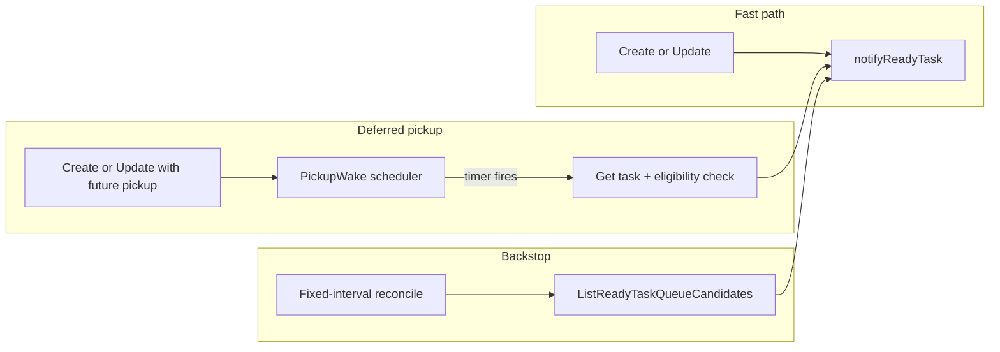

# Pickup scheduling responsiveness (staged commits)

## Goals

- **No env knob** for reconcile responsiveness: remove [`T2A_USER_TASK_AGENT_RECONCILE_INTERVAL`](internal/taskapiconfig/env.go) and all references (docs, [`.env.example`](.env.example), tests).
- **Better latency** when `status=ready` but `pickup_not_before` is in the future: wake the in-memory queue **at or immediately after** the scheduled instant, instead of waiting for the next reconcile tick.
- **Keep the existing reconcile loop** as a **durable backstop** (crash recovery, missed notifies, queue drops) — same SQL predicate as today in [`pkgs/tasks/store/internal/ready/ready.go`](pkgs/tasks/store/internal/ready/ready.go).

## Architecture (after change)

**Eligibility** remains one rule, shared everywhere: mirror [`shouldNotifyReadyNow`](pkgs/tasks/store/facade_tasks.go) / SQL `pickup_not_before <= now()`. Export it as **`ShouldNotifyReadyNow`** (or keep a thin exported wrapper) so the wake path does not duplicate logic.

**Implementation choice (simple + professional):** a **`PickupWake`** (name TBD) type in [`pkgs/agents`](pkgs/agents) using **`container/heap`** keyed by `(pickup_not_before, task_id)` with a **single `time.Timer`** for the earliest deadline. Upsert on schedule, remove on cancel. On fire: **`Get` task** → if still `ready` and `ShouldNotifyReadyNow` → **`MemoryQueue.NotifyReadyTask`** (same as today); then pop/reschedule next. This avoids one OS timer per task at scale.

**Startup:** after the store and queue exist, **`Hydrate(ctx)`** runs a bounded query for rows with `status=ready` AND `pickup_not_before > now()` (new helper next to [`ListQueueCandidates`](pkgs/tasks/store/internal/ready/ready.go), no need for `task_events` join — ordering by `pickup_not_before` only). Push each into the heap.

**Lifecycle:** construct the scheduler in [`startReadyTaskAgents`](cmd/taskapi/run_agentworker.go), register it on the store (see below), call **`Hydrate`** before or after `RunReconcileLoop` starts (either order is OK; `Notify` dedupes). Extend the existing **`stopAgents` cancel** in [`buildTaskAPIApp`](cmd/taskapi/run_helpers.go) so it **stops the wake scheduler** (stop timer, drain or drop pending — document choice) **and** cancels reconcile — same shutdown order comment as today (after worker drain).

**Store wiring:** add an optional hook, e.g. **`(*Store).SetPickupWake(PickupWake)`** with a small interface **defined in `pkgs/tasks/store`** (implementation lives in `pkgs/agents`). **Do not** add a neutral package for v1 unless an import cycle forces it — see [Decisions (v1)](#decisions-v1) and [`docs/future-considerations/`](docs/future-considerations/).

- `Schedule(ctx, taskID, notBefore time.Time)` — for future pickups (idempotent upsert).
- `Cancel(taskID string)` — when pickup cleared, task no longer ready, or task deleted.
- `Stop()` — shutdown (if you prefer not to put `Stop` on the interface, return a `stopWake context.CancelFunc` from constructor instead).

Call **`Schedule`** from [`Create`](pkgs/tasks/store/facade_tasks.go) / [`Update`](pkgs/tasks/store/facade_tasks.go) when the row is `ready` and `pickup_not_before` is strictly in the future. Call **`Cancel`** when a future schedule is cleared, status leaves `ready`, or on [`Delete`](pkgs/tasks/store/facade_tasks.go) / [`facade_devmirror`](pkgs/tasks/store/facade_devmirror.go) as needed.

**Fixed reconcile interval:** define **`const ReconcileTickInterval time.Duration`** in [`pkgs/agents/reconcile.go`](pkgs/agents/reconcile.go) (or adjacent file) — **single source of truth**. Recommendation: **2 minutes** as a tighter safety net once timer wake exists (still cheap: paginated SQL, same as today). [`run_agentworker.go`](cmd/taskapi/run_agentworker.go) passes this constant into `RunReconcileLoop` instead of [`taskapiconfig.UserTaskAgentReconcileInterval()`](internal/taskapiconfig/env.go). Remove **`DefaultUserTaskAgentReconcileInterval`** and the **`0` = startup-only** behavior from product code (tests that need startup-only can pass **`0`** directly to `RunReconcileLoop` as they already do in [`pkgs/tasks/agentreconcile`](pkgs/tasks/agentreconcile)).

## Testing

- **Unit tests** in `pkgs/agents`: heap ordering, reschedule, cancel, coalescing same `task_id`, timer firing with **injected clock** (`time.AfterFunc` is awkward to test — prefer **`FakeClock`** pattern or a **`WakeDriver`** abstraction taking `func(d time.Duration) <-chan time.Time` / `Clock` interface).
- **Store tests**: deferred create does **not** notify immediately (existing); **does** call `Schedule` on a **fake** hook (optional) or assert via integration with a test double.
- **Integration:** extend an existing agentreconcile or store test so a task with `pickup_not_before = now+Δ` becomes eligible **without** waiting for reconcile tick (mock clock or very small `Δ` with `ReconcileLoop` disabled or long interval in test-only wiring).

## Documentation

Update [**docs/SCHEDULING.md**](docs/SCHEDULING.md), [**docs/AGENT-QUEUE.md**](docs/AGENT-QUEUE.md), [**docs/RUNTIME-ENV.md**](docs/RUNTIME-ENV.md), [**docs/AGENT-WORKER.md**](docs/AGENT-WORKER.md) — remove env-based reconcile interval; describe **three** paths: immediate notify, **pickup wake**, periodic reconcile; state worst-case latency (timer resolution + small processing slack, with reconcile as backstop).

Add **[`docs/future-considerations/`](docs/future-considerations/)** (new folder in repo root under `docs/`):

- **`README.md`** — index linking to topic notes; one sentence that these are non-binding design notes for future scaling/refactors.
- **`scheduling-and-agents.md`** (or similar single file) — expanded write-ups of: multi-replica / horizontal `taskapi`, clock skew vs DB `now()`, and when a **neutral package** for scheduling interfaces might be justified. This is the durable home for the former “risk notes” detail; keep runtime docs (SCHEDULING, AGENT-QUEUE) short and point here for depth.

---

## Stages, commits, and push gates

Per your workflow: **finish and push each stage before starting the next.**

### Stage 1 — Remove configurability (push before Stage 2)

**Commit 1 — `chore(taskapi): remove configurable reconcile interval`**

- Remove `EnvUserTaskAgentReconcileInterval`, `UserTaskAgentReconcileInterval()`, exported default const, and [`TestUserTaskAgentReconcileInterval`](internal/taskapiconfig/env_test.go) from [`internal/taskapiconfig/env.go`](internal/taskapiconfig/env.go).
- Wire [`startReadyTaskAgents`](cmd/taskapi/run_agentworker.go) to [`agents.ReconcileTickInterval`](pkgs/agents/reconcile.go) (new const). Adjust startup log line (drop `"periodic"` branching tied to env `0`).
- Update [`.env.example`](.env.example), [docs/RUNTIME-ENV.md](docs/RUNTIME-ENV.md), [docs/AGENT-QUEUE.md](docs/AGENT-QUEUE.md), [docs/AGENT-WORKER.md](docs/AGENT-WORKER.md), [docs/SCHEDULING.md](docs/SCHEDULING.md), [pkgs/agents/doc.go](pkgs/agents/doc.go) — remove the variable row and any "`0` = startup-only" operator-facing text (keep **test-only** `0` in code if tests need it).
- `go test ./internal/taskapiconfig/... ./cmd/taskapi/... ./pkgs/agents/...` (and any package that broke).

**Then push** (Stage 1 complete).

### Stage 2 — Pickup wake + wiring (push before Stage 3)

**Commit 2 — `feat(agents): add pickup wake scheduler`**

- New file(s) under [`pkgs/agents`](pkgs/agents): heap + timer + `Stop`, using `*store.Store` + `*MemoryQueue` + exported **`ShouldNotifyReadyNow`** from store.
- Unit tests for scheduler behavior.

**Commit 3 — `feat(store): wire pickup wake on CRUD and hydrate`**

- Export **`ShouldNotifyReadyNow`**, add deferred list query in [`internal/ready`](pkgs/tasks/store/internal/ready) + facade method on [`Store`](pkgs/tasks/store).
- `SetPickupWake`, calls from [`facade_tasks.go`](pkgs/tasks/store/facade_tasks.go), [`facade_devmirror.go`](pkgs/tasks/store/facade_devmirror.go), delete path.
- [`startReadyTaskAgents`](cmd/taskapi/run_agentworker.go): construct scheduler, `SetPickupWake`, `Hydrate`, combine stop with reconcile cancel.

**Commit 4 — `test: cover deferred pickup without reconcile tick`** (optional fourth commit if you want review separation)

- Integration or store-level test proving wake path.

**Then push** (Stage 2 complete).

### Stage 3 — Documentation polish (optional separate stage)

**Commit 5 — `docs: document pickup wake, backstop, and future considerations`**

- Final doc consistency pass for SCHEDULING / AGENT-QUEUE / RUNTIME-ENV / AGENT-WORKER if anything remained after Stage 2.
- **Add [`docs/future-considerations/`](docs/future-considerations/)** per [Documentation](#documentation) above.

**Then push.**

---

## Decisions (v1)

These are the **least complicated** choices for the first shipping version; anything deferred is expanded under **`docs/future-considerations/`**.

| Topic | v1 decision |
| ----- | ----------- |
| **Clock skew** (app timer vs DB `now()`) | Rely on **NTP** on app and database hosts (standard ops). On wake, use **`ShouldNotifyReadyNow` with `time.Now().UTC()`** after `Get`, same as today’s semantics. **Do not** add a per-wake `SELECT now()` or shared “DB clock” abstraction unless production shows a problem — the **fixed reconcile tick** already bounds worst-case delay if clocks drift slightly. |
| **Neutral package** | **Do not create** `pkgs/taskschedule` (or similar) for v1. Define the **`PickupWake` interface in `pkgs/tasks/store`**; **`pkgs/agents`** implements it and is wired from **`cmd/taskapi`**. If a future change introduces an **import cycle** or multiple implementations need sharing, extract interfaces to a small neutral package **then** — document that migration in `docs/future-considerations/`. |
| **Multi-replica** | No code change in v1. **Document** deployment assumption: **one long-lived `taskapi` process per database** (or equivalent: only one instance may run the in-process agent queue + wake). Horizontal scale options stay in **`docs/future-considerations/`** only. |

---

## Risk notes (explicit)

Superseded for depth by **`docs/future-considerations/`**; kept here as a one-line reminder:

- **Multi-replica / multi-leader** — in-memory wake + queue are **process-local**; extra instances need coordination (locks, broker, single scheduler) — see future-considerations doc.
- **Clock skew** — mitigated by NTP + reconcile backstop; optional DB-aligned “now” is a future enhancement.
- **Import cycles** — v1 avoids by **interface-on-store**; neutral package only if forced.
