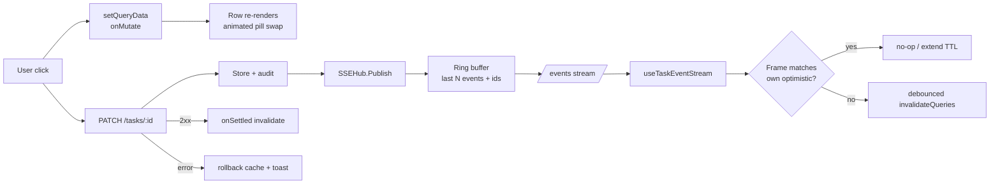

## Goals & non-goals

**Goals**
- Click-to-visible-change feels instant (target: p95 ≤ 100 ms perceived) for status, priority, title, checklist, delete, requeue.
- No silently-dropped SSE frames under bursts; cross-tab and agent updates always reconcile within 2 s.
- All state transitions (pill colors, row appear/disappear, KPI numbers) animate within the design system's motion tokens.
- Production posture: named SLOs, RUM, alerts; nothing magical, everything measurable.

**Non-goals (this plan)**
- Per-field SSE delta payloads. Wire stays `{type, id, cycle_id?}`; we make it lossless instead. Revisit only if RUM shows refetch cost is the bottleneck.
- Any backend store/schema changes beyond an in-memory replay buffer.
- New design language; we use existing tokens in [web/src/app/styles/app-design-tokens.css](web/src/app/styles/app-design-tokens.css).

---

## Architecture



Key change: SSE stops being best-effort. The hub keeps a ring of recent events with monotonically increasing ids; the `/events` handler honors `Last-Event-ID` on reconnect and replays. Heartbeats on a timer keep proxies from idle-killing the connection.

---

## Phase 1 — Optimistic mutations with rollback (frontend)

Touches the four real mutation hooks plus a small toast surface.

### 1a. Toast/notification primitive
- Add `web/src/shared/toast/` with `ToastProvider` mounted in [web/src/app/main.tsx](web/src/app/main.tsx) and a `useToast()` hook. Keep it tiny: stack, max 3, auto-dismiss 4 s, role="status", reduced-motion respected. Animation uses the existing `--duration-toast` and `toastSlideIn` keyframe pattern from `.cursor/rules/UI_AUTOMATION/animation-transitions.mdc` §9.
- Reason for new component: the explore agent confirmed there is no toast layer today; existing inline `MutationErrorBanner` is form-scoped and won't surface a list-row rollback.

### 1b. Optimistic patch in [web/src/tasks/hooks/useTaskPatchFlow.ts](web/src/tasks/hooks/useTaskPatchFlow.ts)
- Add `onMutate`: `cancelQueries` for `taskQueryKeys.detail(id)` and `taskQueryKeys.listRoot()`; snapshot both via `getQueryData`; `setQueryData` on the detail entry merging the patch fields; for the list, walk to find the row (tree may be nested — see TaskTree.children) and patch in place.
- Return snapshot from `onMutate` as context.
- `onError`: restore both snapshots, `useToast().error("Couldn't save — reverted.")`.
- `onSettled`: keep the existing `invalidateQueries({ queryKey: taskQueryKeys.all })` and `["task-stats"]` so server truth re-converges.
- Concurrency guard: store an `optimisticVersion` Map keyed by task id in module scope; bump per onMutate; SSE handler (Phase 2) checks it to suppress its own echo.

### 1c. Optimistic delete in [web/src/tasks/hooks/useTaskDeleteFlow.ts](web/src/tasks/hooks/useTaskDeleteFlow.ts)
- `onMutate`: snapshot list and detail; remove the row from list cache; mark `detail` as `deleted: true` sentinel so any open detail view shows a "deleted" empty state immediately.
- `onError`: restore + toast.
- This is the highest-impact one for perceived speed; deletions today wait the full round trip.

### 1d. Optimistic checklist add/edit/delete in [web/src/tasks/hooks/useTaskDetailChecklist.ts](web/src/tasks/hooks/useTaskDetailChecklist.ts)
- Add: append synthetic item with temp id; on success swap temp id for real id; on error remove + toast.
- Edit/delete: same snapshot/rollback pattern. Note: `deleteChecklistMutation` today only invalidates `checklist`, not `detail`; fix the missed `detail` invalidation in `onSettled` while we're in there.

### 1e. Requeue in [web/src/tasks/pages/TaskDetailPage.tsx](web/src/tasks/pages/TaskDetailPage.tsx)
- `requeueMutation` is `patchTask(taskId, { status: "ready" })`; identical pattern to 1b but easier — only the detail cache.

### 1f. Subtask create in [web/src/tasks/hooks/useTaskDetailSubtasks.ts](web/src/tasks/hooks/useTaskDetailSubtasks.ts)
- Optimistic insert of synthetic child into `parent.children`; on success swap id; rollback removes the synthetic child.

### Tests
- Mirror existing test conventions: per-hook unit tests + an integration test in `useTasksApp.test.tsx` style covering "click → instant render → server error → rollback → toast".
- New tests for the toast provider (focus management, reduced-motion).

---

## Phase 2 — Lossless resumable SSE (backend)

The biggest production risk today: [pkgs/tasks/handler/sse.go](pkgs/tasks/handler/sse.go) drops frames on full 32-line buffers, has no heartbeat, and no resume. Under any scenario where a client momentarily stalls (CPU spike, GC, network hiccup), it permanently misses events. Optimistic UI hides this on the click path, but cross-tab and agent-driven updates would silently desync.

### 2a. Event id + ring buffer
- Add `eventID uint64` (atomic) and `ring []bufferedEvent` (size 1024, configurable) to `SSEHub` in [pkgs/tasks/handler/sse.go](pkgs/tasks/handler/sse.go).
- `Publish` increments the id, marshals once, appends to ring (under existing mu), then non-blocking sends as today.
- `bufferedEvent { id uint64; line string; at time.Time }`; ring is a simple slice with head/tail (or `container/ring`).

### 2b. SSE wire emits id and supports resume
- Each `data:` line is preceded by `id: N\n`. Client `EventSource` then automatically sends `Last-Event-ID` on reconnect.
- `streamEvents` reads `Last-Event-ID` header; if present and within ring window, replays missed events immediately on subscribe before entering the live loop.
- If outside window: emit a `data: {"type":"resync"}\n` frame so the client knows to do a full `invalidateQueries({queryKey: taskQueryKeys.all})`.

### 2c. Heartbeats
- Per-subscriber goroutine ticks every 15 s and writes `: heartbeat\n\n`. Keeps load balancers / corporate proxies from killing idle streams. No frame; no client work.
- Added to the existing `for { select }` loop in `streamEvents` via a `time.NewTicker(15 * time.Second)` case.

### 2d. Backpressure that doesn't lose data
- Increase per-subscriber buffer to 256 (still bounded).
- On overflow: instead of dropping, **disconnect the slow subscriber** with a single `data: {"type":"resync"}` frame. Client reconnects, replays from `Last-Event-ID`, falls through to resync if it's beyond the ring. This keeps memory bounded *and* delivery semantically lossless.
- Keep `RecordSSEDroppedFrames` counter; add `sse_resync_emitted_total` and `sse_subscriber_lag_seconds` (now − oldest pending frame timestamp).

### 2e. Server-side coalescing of duplicate `task_updated`
- Inside `Publish`, if the same `{type, id}` was emitted in the last 50 ms, drop the duplicate and increment `sse_coalesced_total`. Cycle frames are NOT coalesced (distinguishable by `cycle_id`).
- Mitigates the duplicate `settings_changed` issue in [pkgs/tasks/handler/handler_settings.go:161](pkgs/tasks/handler/handler_settings.go) + [cmd/taskapi/run_agentworker.go:420-425](cmd/taskapi/run_agentworker.go).

### Tests
- Race tests on `Publish` (existing patterns in [pkgs/tasks/handler/](pkgs/tasks/handler/)).
- Integration test: drop a slow subscriber, reconnect with `Last-Event-ID`, assert replay completeness.
- Heartbeat test using a fake clock.

---

## Phase 3 — Animation polish on state transitions (frontend)

All transitions use existing tokens; no new keyframes except where noted.

### 3a. Pill color/border transition
In [web/src/app/styles/app-task-list-and-mentions.css](web/src/app/styles/app-task-list-and-mentions.css) `.cell-pill` base rule (~line 188), add:

```css
transition:
  background-color var(--duration-moderate) var(--ease-default),
  color var(--duration-moderate) var(--ease-default),
  border-color var(--duration-moderate) var(--ease-default);
```

Reduced-motion already overrides this globally in [web/src/app/styles/app-base.css](web/src/app/styles/app-base.css) (lines 195–200).

### 3b. New-row enter animation, no flashing on refetch
- In the list table component, maintain a `seenIdsRef = useRef(new Set<string>())`. On render, if a row's id is not in the set, apply `animation: ui-phase-fade-in var(--duration-ui-phase) var(--ease-ui) both;` then add it. Existing frames re-render without animation.
- Cap stagger at 10 rows per the rule's guidance.
- Critical: do NOT wrap the entire `<tbody>` in `<FadeIn>` — `useTaskEventStream`'s 900 ms debounce would re-mount it ~1×/s during agent activity.

### 3c. Row exit animation
- Wrap each row in `<RowExitGate>` that renders for an extra 200 ms with the `fadeSlideOut` animation when its id leaves the data set. Implementation pattern from `.cursor/rules/UI_AUTOMATION/animation-transitions.mdc` §6.
- For optimistic deletes, this means: click → row fades out instantly (cache update) → server confirms → already gone. Errors restore via Phase 1 rollback.

### 3d. KPI number tween
- Small `useAnimatedNumber(target, durationMs, easing)` hook in `web/src/observability/`. RAF-driven, snaps if `prefers-reduced-motion`.
- Apply to [web/src/observability/KpiCard.tsx](web/src/observability/KpiCard.tsx) and to the home-page Total/Ready/Critical cards if they exist as a separate component.

### 3e. Donut/StackedBar segment transitions
- In [web/src/observability/Donut.tsx](web/src/observability/Donut.tsx) and [web/src/observability/StackedBar.tsx](web/src/observability/StackedBar.tsx), add `transition: stroke-dasharray var(--duration-moderate) var(--ease-out)` (donut) / `transition: width …` on segments. Drives smoothing for free on every refetch.

---

## Phase 4 — SLOs, RUM, alerting

### 4a. Named SLOs (documented in `docs/SLOs.md`)
- `slo_click_to_confirmed_p95_ms ≤ 100` — frontend RUM; "confirmed" = optimistic render OR server 2xx, whichever first.
- `slo_sse_resync_rate ≤ 0.5%` — server: `sse_resync_emitted_total / sse_publish_total`.
- `slo_sse_subscriber_lag_p99_seconds ≤ 2` — server: `sse_subscriber_lag_seconds` p99.
- `slo_optimistic_rollback_rate ≤ 1%` — RUM: rollback events / total mutations. High rate ⇒ server validation drift.
- `slo_mutation_error_rate ≤ 0.5%` — RUM: 4xx+5xx / total.
- 30-day rolling window; error budget = `1 - SLO`.

### 4b. RUM beacon
- New `/v1/rum` POST endpoint (handler-side, rate-limited per IP) accepting JSON arrays of typed events: `mutation_started`, `mutation_optimistic_applied`, `mutation_settled`, `mutation_rolled_back`, `sse_reconnected`, `sse_resync_received`, `web_vitals` (LCP/INP/CLS via the `web-vitals` lib).
- Frontend: `web/src/observability/rum.ts` flushes on `visibilitychange === 'hidden'` via `navigator.sendBeacon` (resilient to tab close), batches every 10 s otherwise.
- Server pipes events into existing Prometheus histograms tagged with event type.

### 4c. Dashboards
- Single Grafana JSON checked into `ops/dashboards/realtime-smoothness.json`:
  - Top row: SLO compliance gauges + error-budget burn.
  - Middle: SSE — subscribers, publishes/sec, resyncs/sec, lag p50/p99, drop counter.
  - Bottom: RUM — click-to-confirmed p50/p95, rollback rate, web vitals.

### 4d. Alerts (Prometheus AlertManager rules in `ops/alerts/`)
- Page on: 1 h burn rate of error budget > 14.4× (fast burn). Ticket on: 6 h > 6× (slow burn).
- Standard multi-window multi-burn-rate alerts per Google SRE workbook.

---

## Phase 5 — Load + chaos validation

Done before declaring "production ready." All scripts in `ops/loadtest/`.

- **k6 scenario A**: 500 concurrent SSE subscribers + 50 PATCHes/sec for 30 min. Pass criteria: `sse_resync_rate < 0.5%`, no goroutine leak (compare `runtime.NumGoroutine()` start vs end).
- **k6 scenario B**: 10 clients each opening 5 tabs (cross-tab reconciliation). Pass: optimistic states settle to server truth in all tabs ≤ 2 s after a mutation.
- **Chaos C**: kill 10% of subscribers mid-publish (simulate slow consumer). Pass: ring + `Last-Event-ID` brings them all back losslessly within 5 s of reconnect.
- **Chaos D**: 30 s network blackhole on the SSE port. Pass: `EventSource` reconnects, replays via `Last-Event-ID`, no UI desync.
- **Browser test**: Playwright / browser-use scenario hitting status flips with throttled CPU 4× and slow 3G. Pass: optimistic render under 100 ms; eventual server settle under 2 s.

---

## Rollout & feature flags

- Wrap each phase behind a runtime flag in `app_settings` (extend the singleton row in [pkgs/tasks/domain/app_settings.go](pkgs/tasks/domain/app_settings.go)):
  - `OptimisticMutationsEnabled` (Phase 1)
  - `SSEReplayEnabled` (Phase 2)
- Default both `false` on first ship; flip to `true` after one full SLO window of green metrics in staging.
- Frontend reads them via the existing `settingsQueryKeys.app()` query and chooses the optimistic vs pessimistic code path at the hook level (single `if (flag)` branch in each mutation hook).
- Backend SSE-side feature is server-controlled; client `EventSource` resume support is harmless even when server doesn't ring-buffer (resume header is just ignored).

---

## Risk register

- **Optimistic + SSE echo causing flicker**: addressed by `optimisticVersion` Map (1b); SSE invalidation on a task whose mutation is still in-flight no-ops.
- **Ring buffer memory under burst**: 1024 × ~120 byte JSON = ~120 KB. Negligible.
- **Last-Event-ID lying about a fresh client**: handled — out-of-window emits a `resync` frame.
- **Toast-overload on systemic failure**: ToastProvider dedupes by `(kind, message)` within 5 s; all-or-nothing fail also surfaces a single `ErrorBanner` at app shell.
- **Reduced-motion regressions**: every animation goes through the global override in `app-base.css`; no inline `style={{animation:…}}` without that fallback.

---

## Order of execution (recommended)

1. Phase 2a-2c (lossless SSE) — biggest production reliability win, foundation for everything else.
2. Phase 4a-4b (SLO definitions + RUM beacon) — must exist before flipping any flag, so we can measure "did it actually help."
3. Phase 1 (optimistic mutations) — biggest UX win.
4. Phase 3 (animation polish) — cosmetic on top of correct behavior.
5. Phase 4c-4d (dashboards + alerts).
6. Phase 5 (load + chaos validation) before flag flip.

Each phase is independently shippable behind its flag; partial rollout never breaks the existing pessimistic path.