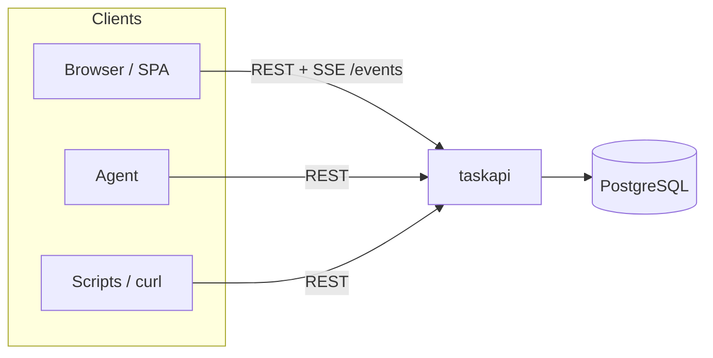

# T2A

Go module **`github.com/AlexsanderHamir/T2A`**: Postgres-backed tasks, an audit event log, a REST API, and small CLIs to check the database and run the server.



## Prerequisites

- **Go** 1.25+
- **PostgreSQL** and a repo-root **`.env`** (gitignored) with **`DATABASE_URL`** set to a Postgres URI.

## Build and test

```bash
go build ./...
go test ./...
```

## Run

```bash
go run ./cmd/dbcheck
go run ./cmd/taskapi
```

Use **`-h`** on each command for flags (`-env`, `-migrate`, and `-port` for `taskapi`).

With **`taskapi`** running:

- **JSON API:** **`http://127.0.0.1:8080/tasks`** (and `/tasks/{id}` for get/patch/delete).
- **SSE (live updates):** **`GET http://127.0.0.1:8080/events`** — `text/event-stream` with `data:` JSON lines `{"type":"task_created|task_updated|task_deleted","id":"<uuid>"}` after successful writes. Use **`EventSource`** in the browser (or equivalent) and refetch tasks when an event arrives.

**Windows PowerShell:** backslash-escaped JSON (`-d "{\"title\":\"live\"}"`) is often wrong for `curl`. Use single-quoted JSON and **`curl.exe`** so you hit real curl, not `Invoke-WebRequest`:

```powershell
curl.exe -s -X POST http://127.0.0.1:8080/tasks -H "Content-Type: application/json" -d '{"title":"live"}'
curl.exe -N http://127.0.0.1:8080/events
```

## Design

For architecture, flows, SSE behavior, coverage, and limitations, see **`docs/DESIGN.md`**.

## Documentation by package

Behavior and contracts live next to the code as Go package docs (not duplicated here).

| Path | What it covers |
|------|----------------|
| [`pkgs/tasks`](pkgs/tasks/doc.go) | Overview of the task subsystem (subpackages below) |
| [`pkgs/tasks/domain`](pkgs/tasks/domain/doc.go) | Models, enums, errors, SQL enum scanning |
| [`pkgs/tasks/postgres`](pkgs/tasks/postgres/doc.go) | GORM Postgres open + schema migrate |
| [`pkgs/tasks/store`](pkgs/tasks/store/doc.go) | CRUD and task_events audit log |
| [`pkgs/tasks/handler`](pkgs/tasks/handler/doc.go) | REST JSON routes and request rules |
| [`internal/envload`](internal/envload/doc.go) | Loading `.env` and requiring `DATABASE_URL` |
| [`cmd/taskapi`](cmd/taskapi/doc.go) | HTTP server wiring, flags, shutdown |
| [`cmd/dbcheck`](cmd/dbcheck/doc.go) | Connectivity check, migrate flag |

Read locally with:

```bash
go doc -all ./pkgs/tasks/...
go doc -all ./internal/envload
go doc -all ./cmd/taskapi
go doc -all ./cmd/dbcheck
```
