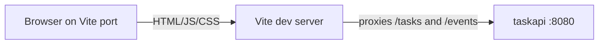

# T2A

**T2A** is for **delegating lots of tasks to agents** and keeping humans and automation on the same page. Tasks live in **one shared place**, you **create and update them through a web API**, every important change is **recorded** (who did what), and **UIs or runners can listen for updates** instead of polling constantly.

This repo is the Go implementation (**`github.com/AlexsanderHamir/T2A`**). For a fuller picture of how it works and where the rough edges are, see **`docs/DESIGN.md`**.

## Prerequisites

- **Go** 1.25+
- A **Postgres** database and a **`.env`** file at the repo root (gitignored) with **`DATABASE_URL`** pointing at it.

## Build and test

```bash
go build ./...
go test ./...
```

## Run

```bash
go run ./cmd/dbcheck    # checks the database; add -migrate to update tables
go run ./cmd/taskapi    # starts the web server; add -h for -port, -env, -migrate
```

### API + web UI together

From the **repo root** (same **`.env`** / **`DATABASE_URL`** as above). The script runs **`go mod download`** and **`npm install`** in **`web/`** before starting servers:

**PowerShell (Windows):**

```powershell
.\scripts\dev.ps1
```

**Git Bash, macOS, or Linux:**

```bash
chmod +x ./scripts/dev.sh   # once, if needed
./scripts/dev.sh
```

This starts **`taskapi`** (default **`http://127.0.0.1:8080`**) and then **`npm run dev`** in **`web/`**. **Ctrl+C** stops Vite; the script stops the API process when Vite exits.

If **8080** is taken, run **`taskapi`** with another **`-port`** and set **`VITE_TASKAPI_ORIGIN`** when starting Vite (see *Web UI* below).

With **`taskapi`** running (by default **`http://127.0.0.1:8080`**):

- Work with tasks at **`/tasks`** and **`/tasks/{id}`** — methods, query options, and error behavior are described in **`docs/DESIGN.md`**.
- Open **`/events`** in a client that supports **live streams** to hear when tasks change (same doc explains the format).

**Windows PowerShell:** use **`curl.exe`** and single-quoted JSON so Windows does not treat `curl` as a different command:

```powershell
curl.exe -s -X POST http://127.0.0.1:8080/tasks -H "Content-Type: application/json" -d '{"title":"live"}'
curl.exe -N http://127.0.0.1:8080/events
```

## Web UI (optional)

A **Vite + React + TypeScript** SPA in **`web/`** implements task **create, list, edit, and delete** against the same **`/tasks`** API as scripts and agents. It opens **`GET /events`** (SSE) so the table **refreshes when tasks change** elsewhere, without reloading the page. **Delete** uses an **in-app confirmation** (not the browser’s `window.confirm`) so focus and typing keep working in embedded or Chromium-based hosts.

### Dev flow (browser → Vite → `taskapi`)



### Prerequisites

- **Node.js** (current LTS is fine) and **npm**, for **`web/`** only.

### Run locally

1. Start **`taskapi`** on **`127.0.0.1:8080`** (default).
2. In another terminal:

```bash
cd web
npm install
npm test
npm run dev
```

Open the URL Vite prints (usually **`http://localhost:5173`**). In dev, **`/tasks`** and **`/events`** are **proxied** to the API (see **`web/vite.config.ts`**), so the Go server does not need **CORS** for local UI work.

**Proxy target:** set **`VITE_TASKAPI_ORIGIN`** when starting Vite if `taskapi` is not at `http://127.0.0.1:8080` (for example `http://127.0.0.1:9090`).

### Scripts (run inside **`web/`**)

| Command | Purpose |
|--------|---------|
| **`npm run dev`** | Vite dev server with proxy. |
| **`npm test`** | **Vitest** + Testing Library (no real network; **`fetch`** / **`EventSource`** mocked). |
| **`npm run test:watch`** | Vitest watch mode. |
| **`npm run build`** | Typecheck and emit production assets to **`web/dist/`**. |
| **`npm run preview`** | Local preview of the **`dist`** build (still expects API reachability; configure proxy or same-origin yourself). |

### Source layout (`web/src/`)

| Path | Role |
|------|------|
| **`App.tsx`** | Root layout; wires **`useTasksApp`** to presentational components. |
| **`hooks/useTasksApp.ts`** | Task list state, **`EventSource`** subscription, **`refresh`**, and create / update / delete handlers. |
| **`api.ts`** | Typed **`fetch`** wrappers for **`/tasks`** (and errors). |
| **`types.ts`** | JSON-aligned TypeScript types. |
| **`components/`** | **`TaskCreateForm`**, **`TaskListSection`**, **`TaskEditForm`**, **`DeleteConfirmDialog`**, shared **`StatusSelect`** / **`PrioritySelect`**, **`ErrorBanner`**, **`StreamStatusHint`**. |
| **`test/`** | Vitest **`setup`** (RTL **`cleanup`**), **`EventSource`** stub, **`requestUrl`** helper for mocks. |

### Production / deployment

**`npm run build`** produces static files under **`web/dist/`**. The Go **`taskapi`** binary does **not** serve this folder. In production, either:

- Serve **`dist`** from the **same origin** as the API (single host, path routing), or  
- Put a **reverse proxy** in front that forwards **`/tasks`** and **`/events`** to **`taskapi`** and serves the SPA for other paths.

The API ships **without CORS** for arbitrary third-party origins; see **`docs/DESIGN.md`** (limitations). Adding CORS or embedding static files in Go would be a separate change.

## For developers

**Go:** route and type details live next to the code. From the repo root:

```bash
go doc -all ./pkgs/tasks/...
go doc -all ./internal/envload ./cmd/taskapi ./cmd/dbcheck
```

**Web:** TypeScript sources and tests are under **`web/src/`**; run **`npm test`** from **`web/`** (see *Web UI* above).
