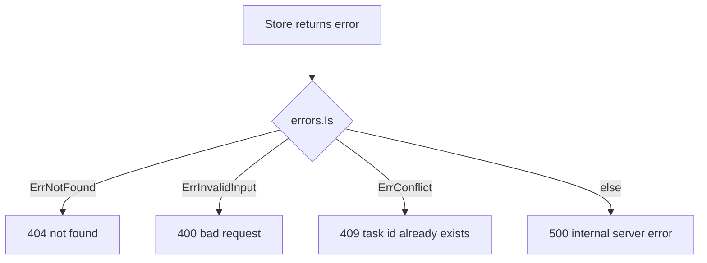
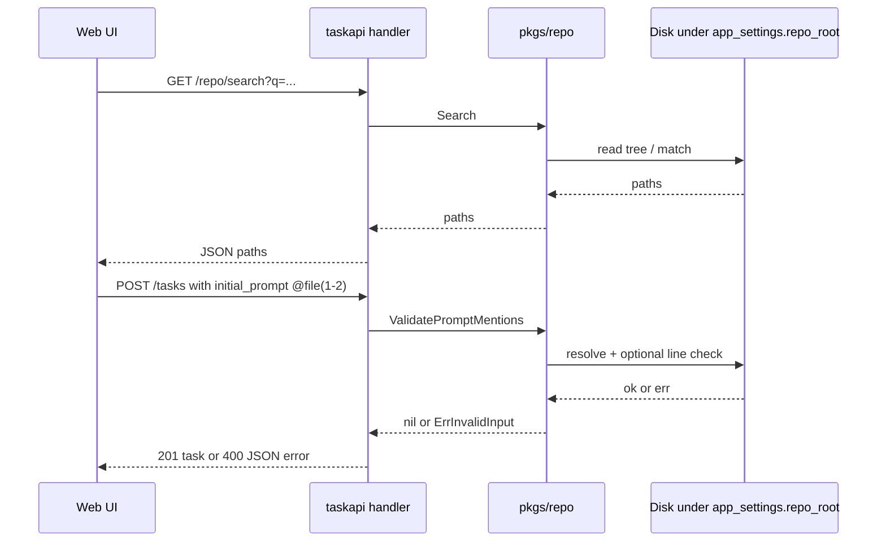

# taskapi — HTTP API (REST)

Authoritative routes, query/body limits, status codes, and JSON error shapes for `taskapi`. **Go layout:** routes and per-feature files in [`pkgs/tasks/handler/README.md`](../pkgs/tasks/handler/README.md); **`taskapi`** middleware assembly in [`internal/taskapi`](../internal/taskapi). **SSE** (`GET /events`): [API-SSE.md](./API-SSE.md). **Environment variables** and startup: [RUNTIME-ENV.md](./RUNTIME-ENV.md). **Persistence:** [PERSISTENCE.md](./PERSISTENCE.md). Architecture hub: [DESIGN.md](./DESIGN.md).

The mux is mounted at `/` (no `/api` prefix). Registered families: tasks, SSE, health endpoints (plain JSON), **`GET /metrics`** (Prometheus text), and optionally repo (see below).

## Health

| Endpoint | Purpose | Response |
| -------- | ------- | -------- |
| `GET /health` | Backward-compatible liveness | `200` JSON includes `"status":"ok"` and **`version`** (from `runtime/debug.ReadBuildInfo`: release module version, short **`vcs.revision`**, **`devel`**, or **`unknown`**) — does not hit the database. |
| `GET /health/live` | Explicit liveness | Same JSON shape as `GET /health`. |
| `GET /health/ready` | Readiness | `200` with `checks`, **`version`** (same rules as liveness), and `"status":"ok"` after pool **`Ping`** plus **`SELECT 1`** (**`store.DefaultReadyTimeout`** / 2s deadline), and when **`app_settings.repo_root`** is configured `checks.workspace_repo: ok` if that directory still exists. `503` `degraded` if any run check fails (`database` and/or `workspace_repo` set to `fail`; when the DB fails first, `workspace_repo` may be omitted). On **`database`** failure, **`readiness check failed`** at **Warn** includes **`timeout_sec`** **`2`** and **`deadline_exceeded`** when the error chain is **`context.DeadlineExceeded`**. |

## Rate limiting

All non-exempt routes on the API stack are subject to **`T2A_RATE_LIMIT_PER_MIN`** (see [RUNTIME-ENV.md](./RUNTIME-ENV.md)). Limits are enforced in-process with `golang.org/x/time/rate`; they are **not** shared across multiple `taskapi` replicas—use a reverse proxy or API gateway for a global budget.

When a request is rejected with **429**, structured logs emit **`rate limit exceeded`** at **Warn** (`operation` **`http.rate_limit`**) with **`client_ip`**, **`method`**, **`path`**, and the same **`request_id`** as other middleware (after access middleware assigns or echoes **`X-Request-ID`**), so operators can tie limit events to access lines.

## Max request body (`T2A_MAX_REQUEST_BODY_BYTES`)

Cap on incoming body size for all routes on the API stack (including JSON bodies on mutating methods). Default is **1 MiB** (`1048576`) when the env var is unset or invalid; set **`T2A_MAX_REQUEST_BODY_BYTES=0`** to disable. Wired as **`WithMaxRequestBody`** before **`WithIdempotency`** so oversized bodies fail before idempotency reads the body. When **`Content-Length`** alone proves the body is over the cap, structured **Warn** logs (`operation` **`handler.max_body`**, msg **`request body over limit`**) include **`limit`**, **`content_length`**, and **`request_id`** (after access middleware).

## Idempotency (`Idempotency-Key`)

`POST`, `PATCH`, and `DELETE` may include header **`Idempotency-Key`** (non-empty after trim; maximum **128** bytes, else `400` JSON `{"error":"idempotency key too long"}`). When **`T2A_IDEMPOTENCY_TTL`** is non-zero (default **24h**), the server caches successful responses (**200**, **201**, **204** only) keyed by **HTTP method**, **URL path**, the trimmed key, and **SHA-256 of the body** for `POST`/`PATCH` (DELETE has no body fingerprint). A repeat request with the same tuple replays the cached status, JSON headers (`Content-Type`, `X-Content-Type-Options`), and body without re-running the handler. Concurrent duplicates share one handler execution (`golang.org/x/sync/singleflight`). **`4xx`/`5xx` responses are not cached** (safe retries). To bound memory, the in-process cache evicts oldest entries when either **`T2A_IDEMPOTENCY_MAX_ENTRIES`** (default `2048`) or **`T2A_IDEMPOTENCY_MAX_BYTES`** (default `8388608`) is exceeded; set either to `0` to disable that specific bound. Eviction emits **`idempotency cache evicted entries`** at **Warn** (`operation` **`handler.idempotency`**) with **`request_id`** for the mutating request whose successful response write triggered pruning (when access middleware ran). For keyed `POST`/`PATCH`, unknown or negative `Content-Length` returns **`400`** (`idempotency requires known content length`), and body length above **1 MiB** returns **`413`** (`request body too large for idempotency`). Empty `Idempotency-Key` leaves behavior unchanged. **Warn** logs on those precondition failures (overlong key, body read error) include **`request_id`** when the request passed access middleware.

## Prometheus (`GET /metrics`)

`GET /metrics` serves the default registry in Prometheus text format (Go client). It is **not** behind the access-log or HTTP-metrics middleware, so scrapes do not emit `http.access` lines or `taskapi_http_*` series for themselves. Responses use the same baseline hardening headers as other browser-facing routes (`handler.WrapPrometheusHandler`).

At process start, **`taskapi`** registers the standard Prometheus **Go** and **Process** collectors on that registry (`go_*` for goroutines, GC, and memory stats; `process_*` for CPU seconds, open FDs, resident memory, start time; upstream names from `collectors.NewGoCollector`, `collectors.NewProcessCollector`), plus **`taskapi_build_info`** (gauge **1**, labels **`version`**, **`revision`**, **`go_version`**) so dashboards can match scrapes to **`GET /health`** JSON **`version`** and short **`vcs.revision`** (`internal/version.PrometheusBuildInfoLabels`).

| Metric | Type | Labels | Notes |
| ------ | ---- | ------ | ----- |
| `taskapi_build_info` | Gauge | `version`, `revision`, `go_version` | Constant **1**; **`version`** matches health JSON; **`revision`** is short `vcs.revision` when embedded, else **`unknown`**. |

After a successful DB open, **`taskapi`** registers a custom collector that reads **[`sql.DB.Stats`](https://pkg.go.dev/database/sql#DBStats)** on each scrape (no separate polling goroutine). Names use the `taskapi_db_pool_*` prefix:

| Metric | Type | Labels | Notes |
| ------ | ---- | ------ | ----- |
| `taskapi_db_pool_max_open_connections` | Gauge | — | Pool cap from `SetMaxOpenConns`. |
| `taskapi_db_pool_open_connections` | Gauge | — | Open connections (in use + idle). |
| `taskapi_db_pool_in_use_connections` | Gauge | — | Connections currently running a query. |
| `taskapi_db_pool_idle_connections` | Gauge | — | Idle connections in the pool. |
| `taskapi_db_pool_wait_count_total` | Counter | — | Cumulative waits for a connection from the pool. |
| `taskapi_db_pool_wait_duration_seconds_total` | Counter | — | Cumulative seconds blocked waiting for a connection. |
| `taskapi_db_pool_connections_closed_max_idle_total` | Counter | — | Cumulative closes due to `SetMaxIdleConns`. |
| `taskapi_db_pool_connections_closed_max_idle_time_total` | Counter | — | Cumulative closes due to `SetConnMaxIdleTime`. |
| `taskapi_db_pool_connections_closed_max_lifetime_total` | Counter | — | Cumulative closes due to `SetConnMaxLifetime`. |

HTTP traffic that **does** pass through the API stack records:

| Metric | Type | Labels | Notes |
| ------ | ---- | ------ | ----- |
| `taskapi_http_in_flight` | Gauge | — | In-flight requests (health probe paths excluded). |
| `taskapi_http_requests_total` | Counter | `method`, `route`, `code` | `route` is the matched mux pattern (e.g. `GET /tasks/{id}`) when set; otherwise **`other`** (limits cardinality on 404s). |
| `taskapi_http_request_duration_seconds` | Histogram | `method`, `route` | **SLO-tuned** upper bounds (seconds): `0.01`, `0.025`, `0.05`, `0.1`, `0.15`, `0.25`, `0.35`, `0.5`, `0.75`, `1`, `1.5`, `2.5`, `5`, `10` (+Inf); denser below 1s for p50/p95 work. Health probe paths excluded. |
| `taskapi_http_rate_limited_total` | Counter | — | Incremented when a request is rejected with **429** (per-IP limit). |
| `taskapi_http_idempotent_replay_total` | Counter | — | Incremented when a response is served from the idempotency cache (not on singleflight coalescing alone). |
| `taskapi_http_idempotency_cache_evictions_total` | Counter | — | Cache entries evicted to satisfy **`T2A_IDEMPOTENCY_MAX_ENTRIES`** / **`T2A_IDEMPOTENCY_MAX_BYTES`** (oldest-first). |
| `taskapi_domain_tasks_created_total` | Counter | — | Successful **`POST /tasks`** after persistence (**201**). |
| `taskapi_domain_tasks_updated_total` | Counter | — | Successful **`PATCH /tasks/{id}`** (**200**). |
| `taskapi_domain_tasks_deleted_total` | Counter | — | Successful **`DELETE /tasks/{id}`** (**204**). |
| `taskapi_store_operation_duration_seconds` | Histogram | `op` | Wall time for each **`pkgs/tasks/store`** entrypoint (`op` is a fixed name such as `create_task`, `list_flat`, `ready` — not raw SQL). Histogram upper bounds (seconds): `0.0005`, `0.001`, `0.0025`, `0.005`, `0.01`, `0.025`, `0.05`, `0.1`, `0.25`, `0.5`, `1`, `2.5`, `5`, `10` (+Inf) — see `storeOpDurationBuckets` in [`pkgs/tasks/store/store_metrics.go`](../pkgs/tasks/store/store_metrics.go). |
| `taskapi_agent_queue_depth` | Gauge | — | Ready-task snapshots buffered in the in-process agent queue. |
| `taskapi_agent_queue_capacity` | Gauge | — | Max buffer size from **`T2A_USER_TASK_AGENT_QUEUE_CAP`** (see [RUNTIME-ENV.md](./RUNTIME-ENV.md)). |
| `taskapi_sse_subscribers` | Gauge | — | Connected **`GET /events`** clients for this process (in-memory hub; not shared across replicas). |
| `taskapi_sse_dropped_frames_total` | Counter | — | Total SSE fanout frames dropped because a subscriber's bounded channel was full at publish time (slow-consumer indicator). The hub drops silently rather than blocking the publisher; correlate with `taskapi_sse_subscribers` to spot per-fanout drop rates. A non-zero rate means a client is stuck reading the stream and is missing UI updates — investigate proxy/keepalive timeouts and SPA tab focus first. |

There is **no authentication** on `/metrics`; restrict at the network or reverse proxy in production.

## System health (`GET /system/health`)

`GET /system/health` is the **operator-facing** snapshot consumed by the SPA `/observability` page. It is **distinct from** the orchestrator probes under `/health/*`: those stay tiny (one ping + version) so kubelet can poll them every few seconds; **`/system/health`** aggregates a richer view — build info, uptime, HTTP / SSE / DB-pool / agent counters — by reading the in-process Prometheus default registry. No parallel counters, so every number matches what `GET /metrics` exposes.

The endpoint follows the same authentication and rate-limit posture as **`GET /tasks/stats`**: it is **not** auth-exempt (the kubelet probes are; this one isn't because request volumes leak operational signal). The handler is a pure read; it does **not** publish on the SSE hub (pinned by `TestHTTP_systemHealth_doesNotPublishSSE` and the read-only-no-publish surface table in `sse_trigger_surface_test.go`).

Response is always **`200`** with the envelope below. Every nested map is **non-nil and seeded** with the documented enum keys (zero-valued on a freshly-booted process) so the SPA can render against a stable shape without branching on missing fields.

| Top-level key | Type | Notes |
| ------------- | ---- | ----- |
| `build` | object | `{version, revision, go_version}` — same triple as **`taskapi_build_info`** labels (sourced from `internal/version.PrometheusBuildInfoLabels`); always populated even before the gauge is registered. |
| `uptime_seconds` | number | Wall-clock seconds since `process_start_time_seconds` (the standard Process collector gauge). **`0`** when the gauge is not yet registered. |
| `now` | string (RFC 3339, UTC) | Server wall clock at the moment the snapshot was assembled — pair with `uptime_seconds` to compute the start time client-side. |
| `http` | object | `{in_flight, requests_total, requests_by_class, duration_seconds}`. `in_flight` mirrors `taskapi_http_in_flight`. `requests_total` and `requests_by_class` are aggregated across `(method, route, code)` from `taskapi_http_requests_total`; `requests_by_class` always has **`2xx`/`3xx`/`4xx`/`5xx`/`other`** keys. `duration_seconds` is `{p50, p95, count}` interpolated from the merged `taskapi_http_request_duration_seconds` histogram (Prometheus-style linear interpolation; `count == 0` → `p50/p95 = 0`). |
| `sse` | object | `{subscribers, dropped_frames_total}` — direct mirrors of `taskapi_sse_subscribers` and `taskapi_sse_dropped_frames_total`. |
| `db_pool` | object | `{max_open_connections, open_connections, in_use_connections, idle_connections, wait_count_total, wait_duration_seconds_total}` — the operator-relevant subset of the `taskapi_db_pool_*` family (the additional close-reason counters stay only on `/metrics`). |
| `agent` | object | `{queue_depth, queue_capacity, runs_total, runs_by_terminal_status, paused}`. The first two mirror `taskapi_agent_queue_depth` / `_capacity`; `runs_total` and `runs_by_terminal_status` aggregate `t2a_agent_runs_total` across `(runner, terminal_status)`. `runs_by_terminal_status` always has **`succeeded`/`failed`/`aborted`** keys; an unknown status (worker bug) lands under **`other`**. **`paused`** mirrors `app_settings.agent_paused` directly (read from the DB on each request, **not** from Prometheus) so the SPA header chip flips to amber the very next poll after `PATCH /settings {"agent_paused":true}`. A transient store error leaves `paused=false` (zero value) with a Warn log; the rest of the envelope is unaffected. |

The handler logs a single **`trace`** line per request (`operation` **`handler.systemHealth`**) and is wired into the standard middleware stack, so every hit also produces an `http.access` line and `taskapi_http_*` observations. **Failures of the underlying Prometheus gather are non-fatal**: the response is still **`200`** with a zero-valued envelope and a **Warn** log (`operation` **`systemhealth.Read`**, msg **`systemhealth gather failed`**) so the operator UI degrades gracefully.

Pinned by `pkgs/tasks/handler/handler_http_system_health_contract_test.go` (envelope keys, populated wiring, method-not-allowed, no-SSE-publish).

## Task resource (`/tasks`)

| Capability     | Method / path            | Notes                                                                                                                                                                                                                                                                                                                                                                                                                                                   |
| -------------- | ------------------------ | ------------------------------------------------------------------------------------------------------------------------------------------------------------------------------------------------------------------------------------------------------------------------------------------------------------------------------------------------------------------------------------------------------------------------------------------------------- |
| Create task    | `POST /tasks`            | Title required after trim; optional `id` (else server UUID); optional `draft_id` (client draft identity used to attach prior `POST /tasks/evaluate` snapshots to the created task and delete the matching `task-drafts` row); default `status` `ready` (one of `ready` / `running` / `blocked` / `review` / `done` / `failed`); **`priority` required** (one of `low` / `medium` / `high` / `critical`); optional `task_type` (`general` / `bug_fix` / `feature` / `refactor` / `docs`, default `general`). Optional `parent_id`: omitted, JSON `null`, or empty/whitespace string all silently produce a **root task** (this is asymmetric with `PATCH /tasks/{id}`, which **rejects** an empty-or-whitespace string `""` with `parent_id must not be empty` — see that section below); a non-empty value must point to an existing task or 400 `parent not found`. Optional `checklist_inherit` (bool) — when true, `parent_id` is required (else 400 `checklist_inherit requires parent_id`). Setting `status: "done"` at create is **allowed** only when the brand-new task has no descendants or checklist items (which is always true for a fresh row), so the `done` preconditions documented for `PATCH /tasks/{id}` apply but never fail at create. **201 Created** returns the full task **tree** (`store.TaskNode` JSON: `domain.Task` fields plus an **optional** `children` array). `children` is **`omitempty`** — for a brand-new leaf row the key is **omitted entirely** (not `"children":[]`); it appears only when the row has at least one descendant. Web clients should treat a missing `children` key as an empty subtree. **409** with body `{"error":"task id already exists"}` if `id` is supplied and already exists. Publishes `task_created` for the new id on SSE; if `parent_id` is non-nil, also publishes `task_updated` for the parent — see [API-SSE.md](./API-SSE.md). When `app_settings.repo_root` is configured, `initial_prompt` is checked for `@` mentions and unresolved paths/ranges fail with **400**.                                                                                                                                                                                                                                                |
| Evaluate draft | `POST /tasks/evaluate`   | Scores a draft task payload before creation and persists every evaluation snapshot. **All request fields are optional** (the handler runs no required-field validation; even `{}` returns a full envelope) and mirror the creation fields: `id` (treated as the **draft id** — the same value passed as `draft_id` to a subsequent `POST /tasks` attaches every prior snapshot to the created task), `title`, `initial_prompt`, `status`, `priority`, `task_type`, `parent_id`, `checklist_inherit`, plus optional `checklist_items` (`[{ "text": "..." }]`). Returns **201 Created** with `{ "evaluation_id", "created_at", "overall_score" 0–100, "overall_summary", "sections": [...], "cohesion_score" 0–100, "cohesion_summary", "cohesion_suggestions": [...] }`. `sections[]` always has the four entries `title`, `initial_prompt`, `priority`, `structure` in that order, each shaped `{ "key", "label", "score" 0–100, "summary", "suggestions": [...] }`. Suggestions are intentionally randomized per request (RNG seeded by wall clock). **400** on JSON unknown fields, malformed JSON, invalid `task_type`, or `@`-mention validation failures when `app_settings.repo_root` is configured. Never publishes on SSE (see [API-SSE.md](./API-SSE.md)). |
| Save task draft | `POST /task-drafts` | **Upserts** a named draft for task creation (the route is intentionally idempotent on `id`: a second POST with the same `id` replaces `name` and `payload` and refreshes `updated_at`, while `created_at` from the first save is **preserved**). Body: `{ "id"?, "name", "payload" }`. `id` is optional — when omitted, empty, or whitespace, the server assigns a UUID. `name` is **required and trimmed** (whitespace-only → **400** `draft name required`). `payload` is opaque JSON for the create-form state (title/prompt/priority/task type/parent/checklist/subtask drafts and optional latest evaluation summary); a missing or `null` payload is silently coerced to `{}` so a follow-up `GET` always returns a JSON object. Unknown body fields are rejected with **400** `json: unknown field "<name>"` (the underlying `encoding/json` strict-decode wording); trailing data after the JSON value returns **400** `request body must contain a single JSON value`. **201 Created** returns `{ "id", "name", "created_at", "updated_at" }` exactly — there is **no** `payload` echo (refresh via `GET` if you need the body back). Never publishes on SSE (see [API-SSE.md](./API-SSE.md)). |
| List task drafts | `GET /task-drafts` | **200** JSON envelope `{ "drafts": [ { "id", "name", "created_at", "updated_at" }, ... ] }`. `drafts` is **always a JSON array** (`[]` when none, never `null` or omitted) and is ordered `updated_at DESC` (most-recently-saved first). Each summary row is the same shape as the `POST` response — `payload` is **not** included on the list view. Query `limit` supports `0..100` (non-positive coerced to **50**, max 100); **400** `limit must be integer 0..100` for non-numeric / negative / `>100` values; **400** `limit value too long` when the raw `limit` query value exceeds **32** bytes (abuse guard, mirrors `GET /tasks`). Never publishes on SSE. |
| Get task draft | `GET /task-drafts/{id}` | **200** JSON envelope `{ "id", "name", "payload", "created_at", "updated_at" }` — `payload` is **always present** (defaulted to `{}` by the `POST` upsert path when the caller supplied none). Whitespace-only `{id}` returns **400** `id`; `{id}` exceeding **128** bytes after trim returns **400** `id too long` (path-segment guard, same as `DELETE /tasks/{id}`). Unknown id returns **404** `not found`. Missing path segment (`GET /task-drafts/`) is a **mux 404** with no JSON body. Never publishes on SSE. |
| Delete task draft | `DELETE /task-drafts/{id}` | **204** with an **empty body** on success. Idempotent re-DELETE of an already-removed id returns **404** `not found` (the store maps `RowsAffected == 0` to `domain.ErrNotFound`). Whitespace-only `{id}` returns **400** `id`; `{id}` exceeding **128** bytes after trim returns **400** `id too long`. Missing path segment (`DELETE /task-drafts/`) is a **mux 404** with no JSON body. Also performed automatically inside the successful `POST /tasks` transaction when `draft_id` is supplied (the cascade is best-effort — the create still succeeds even if the draft row never existed). Never publishes on SSE. |
| List tasks     | `GET /tasks`             | Query `limit` (0–200, default 50). **Offset paging:** `offset` (≥ 0). **Keyset paging (preferred at scale):** `after_id` (UUID) — roots with `id > after_id`; **mutually exclusive** with `offset` (presence of an `offset` query key is rejected when `after_id` is set). Roots ordered by `id ASC`. **200** JSON envelope always carries the same four top-level keys `{ "tasks", "limit", "offset", "has_more" }` (`has_more` is **always present**, `false` on the final page; server fetches `limit+1` roots to detect it). `tasks` is **always a JSON array** (`[]` when empty, never `null` or omitted). `limit` is echoed **after coercion** (`?limit=0` → `"limit":50`); `offset` is echoed verbatim **except** when `after_id` is set, in which case the response forces `"offset":0`. Each element is a `store.TaskNode` (`domain.Task` fields plus an **optional** `children` array; `children` is `omitempty` and **omitted** when the root has no descendants — never serialized as `"children":null` or `"children":[]`). When present, `children[]` carries the full descendant subtree recursively. Non-positive `limit` is coerced to 50. **400** if `limit` or `offset` exceeds 32 bytes, or `after_id` exceeds 128 bytes (abuse guard).                                                                                                                                                                                                                          |
| Task stats     | `GET /tasks/stats`       | Returns global counters across **all** tasks plus execution-cycle aggregates that back the Observability page (not paged list data). **200** JSON envelope always carries the same eleven top-level keys `{ "total", "ready", "critical", "scheduled", "by_status", "by_priority", "by_scope", "cycles", "phases", "runner", "recent_failures" }` even on an empty database. **`scheduled`** is the count of `status='ready'` tasks intentionally deferred via `pickup_not_before > now` — i.e. the same predicate `ready.ListQueueCandidates` uses to *exclude* a row from the SQL queue, surfaced as a counter so the Observability page can distinguish "0 ready, 12 scheduled" (intentionally deferred — agent worker is correctly idle) from "0 ready, 0 scheduled" (truly idle, nothing to do); always present (`0` on a fresh database) — see `docs/SCHEDULING.md` "the two queues" section. **Task counters** — `by_status` and `by_priority` are JSON objects keyed by `domain.Status` / `domain.Priority` enum values (`ready` / `running` / `blocked` / `review` / `done` / `failed`; `low` / `medium` / `high` / `critical`); they are `{}` (never `null`) when the database is empty and only include keys for which at least one row exists. `by_scope` is **always** the two-key object `{ "parent": number, "subtask": number }` — `parent` counts tasks **with no `parent_id`** (roots), `subtask` counts tasks **with a `parent_id`**; both keys are present (zero-valued on empty database). `ready` / `critical` are convenience fields equal to `by_status["ready"]` / `by_priority["critical"]`. Arithmetic invariant: `total == parent + subtask == sum(by_status) == sum(by_priority)`. **Cycle counters** — `cycles` is **always** the two-key object `{ "by_status", "by_triggered_by" }`; both inner objects are `{}` (never `null`) on an empty database and otherwise carry only enum keys with nonzero count. `cycles.by_status` is keyed by `domain.CycleStatus` (`running` / `succeeded` / `failed` / `aborted`); `cycles.by_triggered_by` is keyed by `domain.Actor` (`user` / `agent`). **Phase heatmap** — `phases` is **always** the one-key object `{ "by_phase_status" }`. `by_phase_status` is **always** the four-key object `{ "diagnose": {…}, "execute": {…}, "verify": {…}, "persist": {…} }` (every `domain.Phase` enum value present even on an empty database); each inner object is `{}` (never `null`) when that phase has never been recorded and otherwise carries only `domain.PhaseStatus` keys (`running` / `succeeded` / `failed` / `skipped`) with nonzero count. The four-key shape is mandatory so the Observability heatmap can render every cell without guessing. **Runner / model breakdown** — `runner` is **always** the three-key object `{ "by_runner", "by_model", "by_runner_model" }`; every inner value is a JSON object (`{}` on an empty database) whose keys are verbatim from cycle metadata. `by_runner` is keyed by `runner.Runner.Name()` (e.g. `"cursor"`); the empty-string key `""` buckets pre-feature cycles whose `meta_json` predates the runner key. `by_model` is keyed by `cycle_meta.cursor_model_effective` (the model the runner actually executed against — see [EXECUTION-CYCLES.md](./EXECUTION-CYCLES.md)); the empty-string key `""` means "no model configured". `by_runner_model` is keyed by `<runner>|<model>` joined by a literal `|`; the empty model segment is preserved (e.g. `"cursor|"`). Each bucket is the same four-key object `{ "by_status", "succeeded", "duration_p50_succeeded_seconds", "duration_p95_succeeded_seconds" }` where `by_status` mirrors `cycles.by_status` (`{}` when empty, otherwise only enum keys with nonzero count); `succeeded` is a convenience field equal to `by_status["succeeded"]`; the two percentile fields are the **succeeded-only** wall-clock P50 / P95 in seconds and return `0` when the bucket has no succeeded cycles yet — the SPA panel renders `0` as "—" so operators never misread an empty bucket as "instant". Runner breakdowns are not cardinality-capped on the wire; watch `t2a_agent_runs_by_model_total` cardinality if you add a new runner or model family. **Recent failures** — `recent_failures` is **always a JSON array** (`[]` when none, never `null` or omitted), capped at the most recent 25 cycles whose terminal mirror event is `cycle_failed`, ordered by event timestamp descending (newest first). Each row carries seven mandatory keys `{ "task_id", "event_seq", "at", "cycle_id", "attempt_seq", "status", "reason" }` — `task_id` + `event_seq` deep-link to `GET /tasks/{task_id}/events/{event_seq}`; `status` is the original terminal `domain.CycleStatus` (`failed` or `aborted`, recovered from the event payload since the mirror folds aborts into `cycle_failed`); `reason` is the short human-readable note recorded at terminate time (`""` when none was supplied). |
| Get one task   | `GET /tasks/{id}`        | **200** returns the full task **tree** (`store.TaskNode` JSON: `domain.Task` fields plus an **optional** `children` array). The two omitempty rules make the envelope **shape-stable but field-variable**: (1) **`parent_id`** is **`omitempty`** — present (string UUID) on subtask rows, **omitted entirely** on root rows (it is **never** serialized as `"parent_id":null`). (2) **`children`** is **`omitempty`** — present as a non-empty JSON array when the row has at least one descendant (recursively carrying the full subtree, each element a `store.TaskNode`), **omitted entirely** on a leaf row (never `"children":[]` and never `"children":null`). The remaining seven fields `{id, title, initial_prompt, status, priority, task_type, checklist_inherit}` are **always present**. Whitespace-only `{id}` returns **400** `id`; `{id}` exceeding **128** bytes after trim returns **400** `id too long` (path-segment guard, before any store access — same wording as `DELETE /tasks/{id}` and `GET|DELETE /task-drafts/{id}`). Missing `{id}` segment (`GET /tasks/`, with the trailing slash) is a **404** from the standard library mux with the literal text body `404 page not found\n` and no JSON `error` envelope; the trailing slash does **not** fall through to `GET /tasks` (the list route). This is the same mux-404 vs handler-400 distinction documented for `DELETE /tasks/{id}` above — clients that branch on response shape should not assume a JSON body on every 404. Unknown task id returns **404** `not found`. Read-only — never publishes on SSE (see [API-SSE.md](./API-SSE.md): "Read-only `GET` routes never publish"). |
| Checklist      | `GET /tasks/{id}/checklist` | **200** JSON `{ "items": [ { "id", "sort_order", "text", "done" } ] }`. `items` is always a JSON array (`[]` when none, never `null` or omitted) and is ordered by `sort_order ASC, id ASC` — a stable order clients can render directly. Definitions are owned by the task itself or by the **nearest ancestor that does not inherit** (chain walked via `checklist_inherit`); `done` is **per-subject** — it reflects completions recorded against **this** task id, so an inheriting child has independent done state from its parent for the same definition row. **404** when the task does not exist.                                                                                                                                                                                                                |
| Add checklist item | `POST /tasks/{id}/checklist/items` | Body `{"text":"..."}`; `text` is required and trimmed (whitespace-only → 400 `checklist text required`). Rejected with 400 `cannot add checklist items while checklist_inherit is true` when the subject task inherits. `X-Actor` (`user` default, or `agent`) is recorded on the audit event. **201** returns the bare definition row JSON `{ "id", "task_id", "sort_order", "text" }` — note this is **not** the same shape as items in `GET /tasks/{id}/checklist` (no `done`, includes `task_id`); refresh via `GET` if you need the completion-aware view. **404** when the task id does not exist. Publishes exactly `task_updated` for `{id}` on SSE on success — see [API-SSE.md](./API-SSE.md); 400 (text required, inheriting child) and 404 (unknown task) paths never publish.                                                                                                          |
| Checklist item patch | `PATCH /tasks/{id}/checklist/items/{itemId}` | Body must contain **exactly one** of: `{"text":"..."}` (non-empty after trim) or `{"done": true|false}`. **`text`** — updates the definition row; allowed for `user` or `agent`; rejected when `checklist_inherit` is true on the task (same as add/delete). **`done`** — **requires `X-Actor: agent`**; human default `user` receives `400`. Item must belong to the definition source for that task. **Idempotent on the audit log**: both branches short-circuit when the request is a no-op — re-`PATCH text` to the same string, and re-`PATCH done` to the already-current state (same item already complete with `done:true`, or already not-complete with `done:false`), both succeed with `200` and the full `{ "items": [...] }` view but **do not append** a new `checklist_item_updated` / `checklist_item_toggled` row to `GET /tasks/{id}/events`, do not bump the audit `seq`, and (for `done:true` no-ops) do not re-stamp the completion `at` timestamp. `200` returns full `{ "items": [...] }`. `X-Actor` stored on audit for both. **404** when the task or item id does not exist. Publishes exactly `task_updated` for `{id}` on SSE on success (including the no-op success path; SSE is at the HTTP layer, not the audit layer) — see [API-SSE.md](./API-SSE.md); 400 (no fields, done by user actor, inheriting child) and 404 paths never publish.                                                                                                                                                                       |
| Remove checklist item | `DELETE /tasks/{id}/checklist/items/{itemId}` | Rejected with 400 `cannot delete inherited checklist definitions from this task` when the subject task inherits. **204** with empty body on success; the deleted item disappears from a follow-up `GET /tasks/{id}/checklist`. **404** when the task or item id does not exist. Publishes exactly `task_updated` for `{id}` on SSE on success — see [API-SSE.md](./API-SSE.md); 400 (inheriting child) and 404 paths never publish.                                                                                                                                                                                                                                                                                                                  |
| Task audit log | `GET /tasks/{id}/events` | Without paging params: all events in **ascending** `seq` (oldest first). With `limit` and/or `before_seq` / `after_seq`: **keyset-paged** slice in **descending** `seq` (newest first): first page uses `limit` only; **older** rows use `before_seq=<seq>` (strictly older than that `seq`); **newer** rows use `after_seq=<seq>` (strictly newer). Cursor-paged responses additionally include `limit`, `total`, and (when at least one row is returned) `range_start` / `range_end` (1-based ranks in newest-first order). `has_more_newer` and `has_more_older` are present in **both** shapes (always `false` on the full-list shape). `approval_pending` is always present. `offset` is not supported. Each row always carries `seq`, `at`, `type`, `by`, and `data` (defaulted to `{}` when the underlying event has no payload); `user_response`, `user_response_at`, and `response_thread` (conversation) are included only when set. `limit` 0–200 (non-positive coerced to 50). **400** if `limit`, `before_seq`, or `after_seq` exceeds 32 bytes (abuse guard). 404 if the task does not exist.                                                                                                                                                                                                                                                                                        |
| One audit event | `GET /tasks/{id}/events/{seq}` | Same fields as a single row in the list — six **mandatory** keys (`task_id`, `seq`, `at`, `type`, `by`, `data` — defaulted to `{}` when the underlying event has no payload, never the bare `null` token) plus three **optional** keys (`user_response`, `user_response_at`, `response_thread`) that appear only when `PATCH /tasks/{id}/events/{seq}` has populated them. **404** `not found` when `(id, seq)` does not match any row (well-formed UUID + non-existent task and existing-task + missing-seq both collapse to the same 404, same as the PATCH route). **400** `seq too long` when `{seq}` exceeds 32 bytes; **400** `seq must be a positive integer` when `{seq}` is empty after trim, `0`, negative, non-numeric, or otherwise not an integer ≥ 1. **Read-only**: never publishes on SSE — see [API-SSE.md](./API-SSE.md); 400 / 404 paths also never publish. |
| Event user input | `PATCH /tasks/{id}/events/{seq}` | Body `{"user_response":"<text>"}` (non-empty after trim, ≤ **10 000 bytes** after trim). Appends one message to `response_thread` for event types that accept responses (`approval_requested`, `task_failed` — see `domain.EventTypeAcceptsUserResponse`). `user_response` / `user_response_at` track the latest **user** message in the thread. Header `X-Actor` is `user` (default) or `agent` for attribution on the new message. **200** returns the same JSON shape as `GET /tasks/{id}/events/{seq}` (`task_id`, `seq`, `at`, `type`, `by`, `data` defaulted to `{}` when empty; optional `user_response`, `user_response_at`, `response_thread` — all populated after a successful PATCH). Path-segment guards run before the body decode: whitespace-only `{id}` returns **400** `id`; `{id}` over **128** bytes returns **400** `id too long`; `{seq}` over **32** bytes returns **400** `seq too long`; `{seq}` not a positive integer returns **400** `seq must be a positive integer`. Body validation 400s after decode: `message cannot be empty` (omitted, empty, or whitespace-only `user_response` — including the empty body `{}`), `message too long (max 10000 bytes)`, `this event type does not accept thread messages` (event `type` is anything other than `approval_requested` / `task_failed`), `thread is full (max 200 messages)` (cap from `maxResponseThreadEntries`), `json: unknown field "<name>"` (the only allowed key is `user_response`), `request body must contain a single JSON value` (trailing data after the top-level object). **404** `not found` when `(id, seq)` does not match any row (well-formed UUID + non-existent task and existing-task + missing-seq both collapse to the same 404). On success always publishes exactly `task_updated` for `{id}` on SSE — see [API-SSE.md](./API-SSE.md); 400 / 404 paths never publish. |
| Partial update | `PATCH /tasks/{id}`      | At least one of: `title`, `initial_prompt`, `status`, `priority`, `task_type`, `checklist_inherit`, `parent_id` — body with **none** of these fields (e.g. `{}`) returns **400** `no fields to update`. JSON `null` for `parent_id` clears the parent (orphan); a non-empty string re-parents (existing task only, no cycles, not self). `checklist_inherit` true requires a parent. Setting status to `done` is rejected until every descendant is `done` and every checklist item for this task (including inherited definitions) has `done: true` for this task. **200** returns the full task tree. **404** when the task id does not exist (after the 400 path-segment guard above). Publishes `task_updated` for `{id}` on SSE — see [API-SSE.md](./API-SSE.md). When `app_settings.repo_root` is configured, `initial_prompt` is checked for `@` mentions and unresolved paths/ranges fail with **400**. |
| Delete task    | `DELETE /tasks/{id}`     | **204** with an **empty body** (no JSON envelope) on success. Whitespace-only `{id}` returns **400** `id`; `{id}` exceeding 128 bytes after trim returns **400** `id too long` (path-segment guard, before any store access). Missing `{id}` segment (e.g. `DELETE /tasks/`) is a **404** from the standard library mux because the route does not match — no JSON `error` body is produced. Unknown task id returns **404** `not found`. **Cascades to descendants**: a single `DELETE` on a task with subtasks removes the entire subtree (the requested root plus every descendant via `parent_id`) in one transaction. SSE fan-out is one `task_deleted` event per removed row (BFS-ordered: root first, then children, then grandchildren); if the requested root had a surviving parent, a single `task_updated` for that parent is also published — see [API-SSE.md](./API-SSE.md). The `t2a_taskapi_domain_tasks_deleted_total` counter increments by **N** (one per row actually removed), not by 1 per request. |

### Documented `400` JSON `error` strings

**`GET /tasks`:**

- `limit must be integer 0..200` — `limit` is present but not a decimal integer in **0–200** (includes values **> 200** and non-numeric values such as `nope`).
- `offset must be non-negative integer` — `offset` is present but negative or not a valid integer.
- `offset cannot be used with after_id` — `after_id` is set and the query string also includes an `offset` key (even `offset=0`).
- `after_id must be a UUID` — `after_id` is non-empty but not a valid UUID string.
- `limit value too long` — raw `limit` query value exceeds **32** bytes.
- `offset value too long` — raw `offset` query value exceeds **32** bytes.
- `after_id too long` — raw `after_id` value exceeds **128** bytes.

**`GET /tasks/{id}/events`** (query validation when any of `limit`, `before_seq`, or `after_seq` is present; task must exist or the handler returns **404** first):

- `offset is not supported for task events; use before_seq or after_seq` — the query string includes a non-empty `offset` value.
- `before_seq and after_seq cannot both be set` — both cursors are non-empty after trim.
- `before_seq or after_seq too long` — trimmed `before_seq` or trimmed `after_seq` value exceeds **32** bytes.
- `limit too long` — raw `limit` query value exceeds **32** bytes (abuse guard; not the same wording as `GET /tasks`).
- `limit must be integer 0..200` — `limit` is present but not a decimal integer in **0–200** (includes values **> 200** and non-numeric values such as `nope`).
- `before_seq must be a positive integer` — `before_seq` is non-empty after trim but not a valid integer **≥ 1**.
- `after_seq must be a positive integer` — same for `after_seq`.

**`GET /tasks/{id}/events/{seq}`** and **`PATCH /tasks/{id}/events/{seq}`** (`{seq}` path segment):

- `seq too long` — trimmed `{seq}` exceeds **32** bytes.
- `seq must be a positive integer` — empty after trim, `0`, negative, non-numeric, or otherwise not a valid integer **≥ 1**.

**`PATCH /tasks/{id}/events/{seq}`** (body validation, after the `{id}` / `{seq}` path-segment guards above and the JSON unknown-fields decode step; all the message-shape phrases below are mapped from `domain.ErrInvalidInput` → **400** with the bare phrase):

- `json: unknown field "<name>"` — body contains a key that is not on `taskEventUserResponseJSON` (the only allowed key is `user_response`); produced by `encoding/json`'s `DisallowUnknownFields` decoder, the underlying message format is wire-stable.
- `request body must contain a single JSON value` — trailing data after the top-level JSON object (e.g. `{}{}`) or stream syntax errors after a successful first decode.
- `message cannot be empty` — `user_response` is omitted, empty, or whitespace-only after store-side trim. The empty body `{}` decodes to `user_response = ""` and triggers this same message (the field is a non-pointer string, so omission and `""` are indistinguishable).
- `message too long (max 10000 bytes)` — `user_response` exceeds **10 000** bytes after store-side trim. Note the wire phrase uses no thousands separator; `maxTaskEventMessageBytes` in `pkgs/tasks/store/store_event_user_response.go`.
- `this event type does not accept thread messages` — the row at `{seq}` exists but its `type` is anything other than `approval_requested` or `task_failed` (see `domain.EventTypeAcceptsUserResponse`). Note this message is store-generated and does **not** match the older doc text "does not accept input".
- `thread is full (max 200 messages)` — the existing `response_thread` for that row already has **200** entries (`maxResponseThreadEntries`); further appends are rejected.
- **404** (not 400) `not found` — `(id, seq)` does not match any row. Both "well-formed UUID for a non-existent task" and "existing task with a missing seq" collapse to the same 404 because the store loads `(task_id, seq)` in a single `WHERE` clause.

**`POST /tasks`** (after the JSON unknown-fields decode step; all are mapped from `domain.ErrInvalidInput` → **400** with the bare phrase below, except where noted):

- `title required` — `title` is omitted, empty, or whitespace-only after trim.
- `priority required` — `priority` is omitted or empty (the field is mandatory; there is no default).
- `priority` — `priority` is sent with a value outside the documented enum (the message is the bare field name).
- `status` — `status` is sent with a value outside the documented enum (the message is the bare field name; omitting `status` is fine and falls back to `ready`).
- `task_type` — `task_type` is sent with a value outside the documented enum (the message is the bare field name; omitting `task_type` is fine and falls back to `general`).
- `checklist_inherit requires parent_id` — body sets `checklist_inherit: true` while `parent_id` is omitted, `null`, or empty/whitespace (mirrors the same `PATCH` precondition).
- `parent not found` — `parent_id` is a non-empty string that does not match any existing task row (cycle/self-parent are not possible at create time because `{id}` does not exist yet).
- `pickup_not_before must be RFC3339 (e.g. 2026-04-19T15:30:00Z): <parser detail>` — optional `pickup_not_before` is a non-empty string that does not parse as RFC3339. See [SCHEDULING.md](./SCHEDULING.md).
- `pickup_not_before must be on or after 2000-01-01T00:00:00Z` — `pickup_not_before` parses but predates the documented sentinel boundary; this guards against the Go zero-value `0001-01-01T00:00:00Z` sneaking in as "no schedule".
- `pickup_not_before must not be empty on create (omit the field for no schedule)` — `pickup_not_before` is the explicit empty string `""` on `POST` (the empty-string "clear" path is **PATCH-only**; on create, omit the field).
- **409** (not 400) `task id already exists` — caller-supplied `id` collides with an existing task row.

Note: empty-or-whitespace `parent_id` is silently treated as **no parent** at create time (the handler trims and clears it before insertion). This differs from `PATCH /tasks/{id}` which rejects the same input with `parent_id must not be empty` — clients re-using a single payload shape across create/patch must send JSON `null` (or omit the key) when they mean "no parent".

Note: when both an explicit `pickup_not_before` and a non-zero `app_settings.agent_pickup_delay_seconds` are in effect, the **explicit** value wins. The global delay only applies when the request omits `pickup_not_before` AND the task is being created with `status: ready` (the default). See [SCHEDULING.md](./SCHEDULING.md) for the full operator workflow and the "two queues" invariant the worker relies on.

**`PATCH /tasks/{id}`** (after the path-segment length guard and JSON unmarshal step; all are mapped from `domain.ErrInvalidInput` → **400** with the bare phrase):

- `no fields to update` — request body parses but every patch field is omitted/null (e.g. `{}` or `{"status":null}`).
- `title` — `title` is sent but empty/whitespace after trim (the message is the bare field name).
- `parent_id must not be empty` — `parent_id` is the empty-or-whitespace string `""` (handler-level; JSON `null` is the documented "clear parent" path and is **not** rejected).
- `parent not found` — `parent_id` is a non-empty string that does not match any existing task row.
- `task cannot be its own parent` — `parent_id` equals `{id}` after trim.
- `parent would create a cycle` — the proposed `parent_id` is a descendant of `{id}` (re-parenting would form a cycle in the parent chain).
- `checklist_inherit requires parent_id` — body sets `checklist_inherit: true` (or leaves it true) on a task with no parent after the patch is applied.
- `priority`, `status`, `task_type` — the corresponding field is sent with a value outside the documented enum (the message is the bare field name).
- `all subtasks must be done before marking this task done` — `status` is being set to `done` while at least one descendant is not `done` (recursive walk via `parent_id`).
- `all checklist items must be done before marking this task done` — `status` is being set to `done` while at least one checklist definition (own or inherited) has no completion row for `{id}`.
- `pickup_not_before must be RFC3339 (e.g. 2026-04-19T15:30:00Z): <parser detail>` — `pickup_not_before` is a non-empty string that does not parse as RFC3339. See [SCHEDULING.md](./SCHEDULING.md).
- `pickup_not_before must be on or after 2000-01-01T00:00:00Z` — same sentinel guard as `POST /tasks`.
- `pickup_not_before must be null or an RFC3339 string` — `pickup_not_before` is sent with a non-string, non-null JSON type (e.g. a number).

Note: on `PATCH /tasks/{id}`, `pickup_not_before` accepts **three** wire shapes — omit the field to leave the column unchanged; send JSON `null` (or the explicit empty string `""`) to clear the schedule; send a non-empty RFC3339 UTC string to set it. Clearing AND setting in the same request is naturally impossible because only one value can be sent. A schedule-only PATCH (the new field is the only one in the body) is **valid** and does not trigger `no fields to update`. See [SCHEDULING.md](./SCHEDULING.md).

**`DELETE /tasks/{id}`** (path-segment guard runs before any store access; mapped from `domain.ErrInvalidInput` → **400** with the bare phrase):

- `id` — `{id}` is empty after trim (whitespace-only path segment such as `DELETE /tasks/%20%20`). A truly missing path segment (`DELETE /tasks/`) does **not** reach this handler at all and is a **404** from the standard library mux with no JSON body.
- `id too long` — `{id}` exceeds **128** bytes after trim.

Note: the prior `delete subtasks first` 400 rejection no longer exists — `DELETE /tasks/{id}` now cascades to every descendant in one transaction (see the row above and the SSE / metrics fan-out it pins). Callers that previously walked the tree and deleted leaves first can issue a single `DELETE` on the root.

**`/task-drafts/*`** (`POST /task-drafts`, `GET /task-drafts`, `GET|DELETE /task-drafts/{id}`):

- `draft name required` (POST) — `name` is omitted, empty, or whitespace-only after trim. The store generates this phrase and the handler surfaces it via the `domain.ErrInvalidInput` mapping.
- `json: unknown field "<name>"` (POST) — body contains a key that is not on `taskDraftSaveJSON` (`id`, `name`, `payload`); produced by `encoding/json`'s `DisallowUnknownFields` decoder, the underlying message format is wire-stable.
- `request body must contain a single JSON value` (POST) — trailing data after the top-level JSON object (e.g. `{}{}`) or stream syntax errors after a successful first decode.
- `limit must be integer 0..100` (GET list) — `limit` is present but not a decimal integer in **0–100** (note the cap differs from `GET /tasks`'s `0..200` and `GET /tasks/{id}/events`'s `0..200`).
- `limit value too long` (GET list) — raw `limit` query value exceeds **32** bytes (abuse guard, same wording as `GET /tasks`).
- `id`, `id too long` (GET-detail / DELETE) — same path-segment guard as `DELETE /tasks/{id}` above (whitespace-only segment / over **128** bytes after trim).
- **404** (not 400) `not found` — `{id}` does not match any draft row. Returned by `GET /task-drafts/{id}` (store `First` → `gorm.ErrRecordNotFound`) and `DELETE /task-drafts/{id}` (store `Delete` with `RowsAffected == 0`).

**`GET /tasks/{id}`** (path-segment guard runs in the handler before any store access; mapped from `domain.ErrInvalidInput` → **400** with the bare phrase):

- `id` — `{id}` is empty after trim (whitespace-only path segment such as `GET /tasks/%20%20`). A truly missing path segment (`GET /tasks/`, with trailing slash) does **not** reach this handler at all and is a **mux 404** with the literal text body `404 page not found\n` (no JSON envelope) — the trailing slash does **not** fall through to `GET /tasks` (the list route).
- `id too long` — `{id}` exceeds **128** bytes after trim.
- **404** (not 400) `not found` — `{id}` is well-formed but does not match any task row. Returned by the store (`gorm.ErrRecordNotFound` mapped via `domain.ErrNotFound`).

**Checklist `POST` / `PATCH` / `DELETE`:**

- `send exactly one of text or done` (PATCH) — body included both `text` and `done`, or neither field was provided for the one-of choice.
- `text required` (PATCH) — `text` was sent but is empty after trim.
- `checklist text required` (POST) — body's `text` is missing or empty after trim (note the wording differs from the PATCH form because the message is generated by the store, not the handler).
- `only the agent may mark checklist items done or undone` (PATCH) — body set `done` while `X-Actor` is not `agent` (including default user).
- `cannot add checklist items while checklist_inherit is true` (POST) — POST against a task whose `checklist_inherit` is true; definitions live on the nearest non-inheriting ancestor.
- `cannot update inherited checklist definitions from this task` (PATCH `text`) — `text` update while `checklist_inherit` is true on the subject task.
- `cannot delete inherited checklist definitions from this task` (DELETE) — DELETE while `checklist_inherit` is true on the subject task.

**Path segment length:** The same **128-byte** cap (after trim) applies to `{id}` and `{itemId}` on other task routes (`PATCH /tasks/{id}`, checklist, `GET|PATCH /tasks/{id}/events…`, `GET|DELETE /task-drafts/{id}`, etc.); overlong segments return **400** before store access.

**Event thread append:** `PATCH` appends run in one SQL transaction. On **PostgreSQL**, the store takes a row lock on the matching `task_events` row while merging the thread so concurrent appends cannot drop messages (read-modify-write races). Default **SQLite** tests use a single pooled connection for the in-memory DB.

Headers: `X-Actor` is `user` (default) or `agent`, stored on audit events for attribution. It is not an authentication mechanism. Optional `X-Request-ID` (trimmed, max 128 chars): if the client sends it, the same value is echoed on the response and used as `request_id` in logs; otherwise the server assigns a UUID.

Authentication: if `T2A_API_TOKEN` is configured, non-exempt routes require `Authorization: Bearer <token>` and return `401` JSON `{"error":"unauthorized"}` when missing/invalid. Health and metrics endpoints remain unauthenticated for probes/scrapers. Denied attempts log **`api auth denied`** at **Warn** (`operation` **`http.api_auth`**) with **`method`**, **`path`**, and **`request_id`** when the request passed access middleware.

Baseline **response** hardening (JSON via `setJSONHeaders`, `GET /events` after the stream is accepted, **429** rate-limit bodies, and **`GET /metrics`** via `handler.WrapPrometheusHandler`): `Cache-Control: no-store`, `X-Frame-Options: DENY`, `Referrer-Policy: no-referrer`, `Content-Security-Policy: default-src 'none'; frame-ancestors 'none'`, `X-Content-Type-Options: nosniff`, and `Permissions-Policy: camera=(), microphone=(), geolocation=(), payment=()`. A reverse proxy or gateway may add or override security headers for production.

JSON: request bodies reject unknown fields and reject trailing data after the top-level value. Successful task list/get/create/patch bodies are task **trees**: each node uses `domain.Task` fields (`id`, `title`, `initial_prompt`, `status`, `priority`, `parent_id`, `checklist_inherit`) plus optional `children` (same shape, nested arbitrarily deep). `POST /tasks/evaluate` returns a persisted draft-evaluation envelope (`evaluation_id`, score fields, and suggestion arrays), not a task tree.

New audit `type` values include checklist (`checklist_item_added`, `checklist_item_toggled`, `checklist_item_updated`, `checklist_item_removed`), `checklist_inherit_changed`, and the rest of `domain.EventType` (e.g. `subtask_added` on the **parent** when a child task is created with `parent_id` or re-parented onto it via `PATCH /tasks/{id}` `parent_id`, and `subtask_removed` on the **parent** when that child is deleted or orphaned via `PATCH /tasks/{id}` `parent_id:null`; for re-parents from one parent to another both events fire — `subtask_removed` on the old parent and `subtask_added` on the new parent in the same transaction. Both payloads are `{child_task_id, title}`).

Task error responses use JSON `{"error":"..."}` for mapped store errors. When the request ran through access middleware (normal `taskapi` stack), the body may also include **`request_id`** (same value as response header **`X-Request-ID`** and `request_id` in structured logs) so clients can correlate failures with server-side traces.



## Task execution cycles (`/tasks/{id}/cycles`)

Cycles promote the **diagnose → execute → verify → persist** loop into a typed primitive (`task_cycles`, `task_cycle_phases`) while preserving `task_events` as the audit witness — full design in [EXECUTION-CYCLES.md](./EXECUTION-CYCLES.md). Every cycle/phase mutation also fans a `task_cycle_changed` SSE event with `id` (task) and `cycle_id` (cycle) so SPA caches can invalidate just the affected cycle subtree — see [API-SSE.md](./API-SSE.md). Idempotency, rate limiting, body-cap, and `X-Actor` semantics are inherited from the rest of `taskapi` (sections above); the handler ignores any `triggered_by` field in the request body and always derives the actor from `X-Actor` (default `user`).

| Capability | Method / path | Notes |
| ---------- | ------------- | ----- |
| Start cycle | `POST /tasks/{id}/cycles` | Body `{ "parent_cycle_id"?, "meta"? }`. `parent_cycle_id` is optional same-task lineage (`null`/omitted/missing produces a top-level cycle); a non-empty value must reference an existing cycle whose `task_id` matches `{id}` (cross-task lineage is rejected with `400 parent_cycle_id does not belong to this task`). `meta` is opaque JSON object (`{}` default). The store assigns `attempt_seq = max + 1` per task, sets `status` `running`, `triggered_by` from `X-Actor`, and inserts a mirror `cycle_started` row in `task_events` in the same SQL transaction (rolls back the cycle on mirror failure). At-most-one running cycle per task: a second `POST` while one is still `running` returns **400** `task already has a running cycle` (recovery: `Idempotency-Key` to replay the original 201, or `PATCH …/cycles/{cycleId}` to terminate the running one first). **201 Created** returns `taskCycleResponse` (see below). Publishes `task_cycle_changed` on SSE for the new cycle. |
| List cycles | `GET /tasks/{id}/cycles` | `?limit=` (1–200, default 50; non-positive coerced to 50). Optional `?before_attempt_seq=N` (positive int64, ≤32 bytes) keyset cursor restricts the page to cycles whose `attempt_seq < N` (next page of older cycles past a cursor the caller already saw); strict `<` keeps the cursor row from being repeated across pages. Cycles ordered `attempt_seq DESC` (newest attempt first). **200** envelope `{ "task_id", "cycles": [ taskCycleResponse, ... ], "limit", "has_more", "next_before_attempt_seq"? }`. `cycles` is **always a JSON array** (`[]` when none, never `null` or omitted). `has_more` is detected by fetching `limit+1` rows from the store and dropping the surplus. `next_before_attempt_seq` carries the `attempt_seq` of the last (lowest) row this response holds when `has_more=true` so clients can pass it back as the next `?before_attempt_seq=`; it is **omitted** (not `null`) when `has_more=false` so absence is the end-of-stream signal. 404 if the task does not exist. |
| Get cycle | `GET /tasks/{id}/cycles/{cycleId}` | Returns the cycle row plus `phases[]` ordered `phase_seq ASC`. **200** envelope `{ "id", "task_id", "attempt_seq", "status", "started_at", "ended_at"?, "triggered_by", "parent_cycle_id"?, "meta", "cycle_meta", "phases": [ taskCyclePhaseResponse, ... ] }`. `cycle_meta` is the typed projection of `meta` — same shape as on `taskCycleResponse`; see the `cycle_meta` note below. `phases` is always a JSON array (`[]` when none). **404** when the cycle does not exist **or** when `cycleId` belongs to a different task than `{id}` (cross-task ID smuggling is silently masked as 404 to avoid leaking cycle existence). |
| Terminate cycle | `PATCH /tasks/{id}/cycles/{cycleId}` | Body `{ "status", "reason"? }`. `status` must be a terminal cycle status (`succeeded`, `failed`, `aborted`); `running` and unknown enums are rejected with **400** `status must be a terminal cycle status`. Rejected with **400** `cycle already terminal` if the cycle is already in a terminal status. Mirror row in `task_events` is `cycle_completed` for `succeeded` and `cycle_failed` for `failed`/`aborted` (the original status is preserved in the mirror payload's `status` field). **200** returns `taskCycleResponse`. Publishes `task_cycle_changed`. Same cross-task 404 guard as the GET above. |
| Start phase | `POST /tasks/{id}/cycles/{cycleId}/phases` | Body `{ "phase" }`. `phase` must be one of `diagnose`, `execute`, `verify`, `persist`. Transitions follow `domain.ValidPhaseTransition` (the previous phase is the highest-`phase_seq` row already on this cycle): the first phase must be `diagnose`; from there the legal forward edges are `diagnose → execute → verify → persist`, plus the corrective edge `verify → execute` for retries. Invalid transitions are rejected with **400** `phase transition "<prev>" -> "<next>" not allowed`. The cycle must be in status `running` (terminal cycles reject phase writes with **400** `cycle is terminal`); at most one running phase per cycle. The store assigns `phase_seq = max + 1` per cycle and inserts a mirror `phase_started` row in `task_events`, then writes the assigned `task_events.seq` back into the new phase row's `event_seq` column in the same SQL transaction. **201 Created** returns `taskCyclePhaseResponse` with `event_seq` populated. Publishes `task_cycle_changed`. Same cross-task 404 guard. |
| Complete / fail / skip phase | `PATCH /tasks/{id}/cycles/{cycleId}/phases/{phaseSeq}` | Body `{ "status", "summary"?, "details"? }`. `status` must be a terminal phase status (`succeeded`, `failed`, `skipped`); `running` and unknown enums are rejected with **400** `status must be a terminal phase status`. `summary` is optional (omit to leave the column unchanged); `details` is opaque JSON object (defaults to `{}`). Rejected with **400** `phase already terminal` for re-termination. Mirror row in `task_events` is `phase_completed` / `phase_failed` / `phase_skipped` matching the request status; `event_seq` is overwritten on the phase row to point at the terminal mirror seq (replacing the `phase_started` pointer set at creation). **200** returns `taskCyclePhaseResponse`. Publishes `task_cycle_changed`. **Note:** completing a phase does **not** terminate the parent cycle — call `PATCH /tasks/{id}/cycles/{cycleId}` explicitly when the attempt is over. |

`taskCycleResponse` shape:

```json
{
  "id": "<cycle-uuid>",
  "task_id": "<task-uuid>",
  "attempt_seq": 1,
  "status": "running",
  "started_at": "2026-01-01T00:00:00Z",
  "ended_at": null,
  "triggered_by": "agent",
  "parent_cycle_id": "<cycle-uuid>",
  "meta": {},
  "cycle_meta": {
    "runner": "cursor",
    "runner_version": "2.x.y",
    "cursor_model": "",
    "cursor_model_effective": "opus-4",
    "prompt_hash": "sha256:abc123…"
  }
}
```

`ended_at` and `parent_cycle_id` are `omitempty`: omitted entirely on a fresh running cycle / top-level cycle. `meta` is always present (defaulted to `{}`). **`cycle_meta`** is a **typed projection** of the raw `meta` JSON — the same five keys `buildCycleMeta` writes on every cycle (see [EXECUTION-CYCLES.md § Cycle metadata](./EXECUTION-CYCLES.md#cycle-metadata-meta_json--cycle_meta) for per-key semantics). `cycle_meta` is always present; missing or pre-feature keys render as the empty string rather than being omitted so consumers can bind directly to the field without defensive `?.` chains. Clients should prefer `cycle_meta` over re-parsing `meta`; `meta` is retained byte-for-byte for forensics and future additive keys.

`taskCyclePhaseResponse` shape:

```json
{
  "id": "<phase-uuid>",
  "cycle_id": "<cycle-uuid>",
  "phase": "diagnose",
  "phase_seq": 1,
  "status": "running",
  "started_at": "2026-01-01T00:00:00Z",
  "ended_at": null,
  "summary": "short note",
  "details": {},
  "event_seq": 7
}
```

`ended_at`, `summary`, and `event_seq` are `omitempty`. `details` is always present (defaulted to `{}`).

### Documented `400` JSON `error` strings

**`POST /tasks/{id}/cycles`** (after JSON unknown-fields decode; mapped from `domain.ErrInvalidInput` → **400** with the bare phrase):

- `json: unknown field "<name>"` — body contains a key that is not on `cycleStartJSON` (`parent_cycle_id`, `meta`).
- `request body must contain a single JSON value` — trailing data after the top-level JSON object (e.g. `{}{}`).
- `parent_cycle_id` — `parent_cycle_id` was sent as the empty/whitespace string `""` (use `null` or omit the key for "no parent").
- `parent_cycle_id does not belong to this task` — non-empty `parent_cycle_id` references a cycle whose `task_id` does not match `{id}`.
- `task already has a running cycle` — concurrent attempt while a `running` cycle exists for `{id}`.
- **404** (not 400) `not found` — `{id}` does not exist.

**`GET /tasks/{id}/cycles`** (limit + cursor validation; task must exist or **404** first):

- `limit must be integer 0..200` — `limit` is present but not a decimal integer in **0–200** (includes values **> 200** and non-numeric values).
- `limit too long` — raw `limit` query value exceeds **32** bytes (abuse guard).
- `before_attempt_seq must be a positive integer` — `before_attempt_seq` is present but not a strictly positive int64 (rejects `0`, negatives, and non-numeric values).
- `before_attempt_seq too long` — raw `before_attempt_seq` query value exceeds **32** bytes (abuse guard, same cap as `limit`).

**`PATCH /tasks/{id}/cycles/{cycleId}`** (cycle-terminate body; cross-task `cycleId` returns **404** before validation):

- `json: unknown field "<name>"` — body contains a key that is not on `cycleTerminateJSON` (`status`, `reason`).
- `status must be a terminal cycle status` — `status` is omitted, `running`, or any value other than `succeeded` / `failed` / `aborted`.
- `cycle already terminal` — `cycleId` already has a terminal status (re-termination attempt).

**`POST /tasks/{id}/cycles/{cycleId}/phases`** (phase-start body; cross-task `cycleId` returns **404** before validation):

- `json: unknown field "<name>"` — body contains a key other than `phase`.
- `phase` — `phase` is omitted or sent with a value outside `diagnose` / `execute` / `verify` / `persist` (the message is the bare field name).
- `phase transition "<prev>" -> "<next>" not allowed` — the requested next phase violates `domain.ValidPhaseTransition` (e.g. starting on `persist`, or jumping `diagnose → verify`).
- `cycle is terminal` — `cycleId` is in a terminal status; phase writes are read-only after terminate.
- `cycle already has a running phase` — concurrent attempt while another phase on the same cycle is `running`.

**`PATCH /tasks/{id}/cycles/{cycleId}/phases/{phaseSeq}`** (`{phaseSeq}` path segment + body):

- `phase_seq must be a positive integer` — `{phaseSeq}` is empty after trim, `0`, negative, or non-numeric.
- `phase_seq too long` — `{phaseSeq}` exceeds **32** bytes (abuse guard).
- `json: unknown field "<name>"` — body contains a key other than `status` / `summary` / `details`.
- `status must be a terminal phase status` — `status` is omitted, `running`, or any value other than `succeeded` / `failed` / `skipped`.
- `phase already terminal` — `(cycleId, phaseSeq)` is already in a terminal status.

**Path segment length:** the **128-byte** cap (after trim) applied to `{id}` on other task routes also covers `{cycleId}` here; overlong segments return **400** before store access. `{phaseSeq}` is capped at **32** bytes (decimal integer).

Structured logs: when a request finishes, `taskapi` logs `http request complete` with `operation` `http.access`, `method`, `path`, matched `route`, `query` (raw query string, truncated), `x_actor`, `status`, `duration_ms`, and `bytes_written` (`GET /health`, `GET /health/live`, and `GET /health/ready` skip that line to avoid probe noise; they still get **`X-Request-ID`** and **`request_id` on `r.Context()`** like other routes). Every JSON line includes monotonic **`log_seq`** and **`log_seq_scope`**: **`request`** when the record used the per-request counter from access middleware, **`process`** otherwise (startup, `/health` path handling—probe requests do not attach the per-request counter, so their logs stay **`process`**-scoped, background work). Correlation lines include **`obs_category`** (`http_access`, `http_io`, `helper_io`) for filtering JSONL. At **`slog.LevelDebug`**, handlers also emit **`http.io`** lines with `phase` `in` or `out`, the same handler `operation` string as errors/access correlation, **`call_path`** (nested handler/helper chain, e.g. `tasks.create > decodeJSON > actorFromRequest`), and structured **inputs** (path ids, parsed query/limit, body field lengths and short previews for titles/prompts/text—never secrets). Nested helpers log **`helper.io`** with `phase` `helper_in` / `helper_out`, the same `call_path`, and a **`function`** field (e.g. `decodeJSON`, `writeStoreError`, `storeErrHTTPResponse`). Use **`RunObserved`** in `pkgs/tasks/handler` when a helper should log explicit input/output key/value pairs through the same `helper.io` pattern. **`phase` `out`** success responses include `response_json_bytes` and `response_body` (UTF-8–truncated JSON preview, capped ~16 KiB); `204 No Content` routes log `response_empty` instead. Handler errors use `operation` plus `http_status`; client errors (4xx) are Warn, server errors (5xx) are Error. Those lines and GORM SQL traces share `request_id` when the store used `r.Context()`. Background work (for example the optional SSE dev ticker) has no request id. Process-wide `slog` records go to the per-run JSON-lines file (not stderr, except the startup path line). GORM uses `gorm.io/gorm/logger.NewSlogLogger` with the same logger. SSE publish fanout is logged at Debug (`operation` `tasks.sse.publish`, `subscribers`, `event_type`, `task_id`) when there is at least one subscriber. Checklists, repeatable coverage measurement, and guidance on metrics/tracing: [OBSERVABILITY.md](./OBSERVABILITY.md).

## App settings

UI-driven configuration for the agent worker and the workspace repo. Singleton row (`id=1`) seeded with `domain.DefaultAppSettings` on first read; full reference: [SETTINGS.md](./SETTINGS.md).

### `GET /settings`

- **200 JSON** — full `AppSettings` shape: `{ "worker_enabled": bool, "agent_paused": bool, "runner": "cursor", "repo_root": string, "cursor_bin": string, "cursor_model": string, "max_run_duration_seconds": int, "agent_pickup_delay_seconds": int, "updated_at": "RFC3339" }`. Always available; does not require the agent worker supervisor to be wired. `worker_enabled` is the master "configured to run at all" switch (defaults true); `agent_paused` is the operator-facing soft pause (defaults false) toggled from the SPA header chip — both keep the supervisor idle, but with distinct reasons (`disabled_by_settings` vs `paused_by_operator`) so the observability page can render them differently.

### `PATCH /settings`

Partial update. Only the fields present in the body are applied; pointer semantics distinguish "not provided" from explicit zero (e.g. `{"max_run_duration_seconds": 0}` ⇒ "no limit", omitted ⇒ leave unchanged).

- **200 JSON** — updated `AppSettings`. On success, the supervisor `Reload`s in-process and the SSE hub publishes `settings_changed` (no id; see [API-SSE.md](./API-SSE.md)).
- **400 JSON** — body is not JSON, or `patch body must include at least one field` (every pointer is nil), or validation rejects the payload (`max_run_duration_seconds` negative, unknown `runner`, etc.).
- **500 JSON** — `settings saved but worker reload failed` (the row was updated but the supervisor refused the new config; check supervisor logs).
- **503 JSON** — `agent worker control unavailable` (supervisor not wired into the handler; tests / dry-runs).

### `POST /settings/probe-cursor`

Run the runner registry probe against a candidate binary path so the SPA "Test cursor binary" button uses the same code path the supervisor uses on boot.

Body (all fields optional): `{ "runner": "cursor", "binary_path": "C:\\path\\to\\cursor-agent.cmd" }`. Empty `runner` falls back to the stored `app_settings.runner`; empty `binary_path` falls back to the stored `app_settings.cursor_bin` (and ultimately to `cursor` resolved through `PATH`).

- **200 JSON** — `{ "ok": bool, "runner": string, "version": string?, "error": string? }`. Probe failures (`cursor-agent` missing / non-executable / non-zero exit) return **200 OK** with `ok: false` and the error message in `error` so the SPA can render the message inline. Only wiring/storage failures return non-2xx.
- **503 JSON** — `agent worker control unavailable`.

### `POST /settings/cancel-current-run`

Operator-initiated cancel of any in-flight `runner.Run`. The cycle is terminated with reason `cancelled_by_operator` (see [EXECUTION-CYCLES.md](./EXECUTION-CYCLES.md)).

- **200 JSON** — `{ "cancelled": bool }`. When `true`, the SSE hub publishes `agent_run_cancelled` (no id) so the SPA flips its "Cancel current run" button back to idle without polling. When `false`, no run was in flight; no SSE is emitted.
- **503 JSON** — `agent worker control unavailable`.

## Workspace repo

When `app_settings.repo_root` is set (via the SPA Settings page or `PATCH /settings` — see [SETTINGS.md](./SETTINGS.md)), `taskapi` wires `pkgs/repo` into the handler. This supports the optional web UI feature: type `@` in `initial_prompt` to pick files under that root and optional line ranges. Updates to `repo_root` take effect in-process — no `taskapi` restart required.

When `repo_root` is empty, every `/repo/*` route returns **`409 Conflict`** with body `{ "error": "repo root is not configured", "reason": "repo_root_not_configured" }`. When `repo_root` is set but `pkgs/repo.OpenRoot` rejects it (missing directory, not a directory, symlink loop), the same routes return **`500 Internal Server Error`** with `reason: repo_root_open_failed` and the underlying error message.

Agent-oriented layering for this slice: `.cursor/rules/14-repo-workspace-extensibility.mdc`.

### `GET /repo/search`

| Query | Meaning                                                                                                             |
| ----- | ------------------------------------------------------------------------------------------------------------------- |
| `q`   | Search string (implementation-defined matching in `pkgs/repo`); returns a capped list of repo-relative paths (larger cap when `q` is empty for @-mention browse). |

- 200 JSON: `{ "paths": [ "..." ] }`
- 400 JSON if `q` exceeds 512 bytes (abuse guard; substring search cost scales with query length).
- 409 JSON if repo not configured: `{ "error": "repo root is not configured", "reason": "repo_root_not_configured" }`
- 500 JSON on internal search failure or `repo_root_open_failed` (message is generic; details in logs).

### `GET /repo/file`

| Query  | Meaning                 |
| ------ | ----------------------- |
| `path` | Repo-relative file path |

- 200 JSON: `{ "path", "content" (UTF-8 text, empty if binary), "binary", "truncated", "size_bytes", "line_count", "warning"?: string }` — full file for preview up to 32 MiB; binary or invalid UTF-8 sets `binary: true` with empty `content`; larger files set `truncated: true`.
- 400 if `path` missing, invalid, or longer than 4096 bytes; 404 if file missing; 409 if repo not configured (`reason: repo_root_not_configured`); 500 on read failure or `repo_root_open_failed`.

### `GET /repo/validate-range`

| Query          | Meaning                      |
| -------------- | ---------------------------- |
| `path`         | Repo-relative file path      |
| `start`, `end` | 1-based inclusive line range |

- 200 JSON: `{ "ok": true/false, "line_count"?: number, "warning"?: string }` — used to warn about invalid ranges without always returning non-200.
- 400 if `path` is longer than 4096 bytes, or if `start` or `end` is longer than 32 bytes (abuse guard; line numbers are short decimal strings).

`POST /tasks` / `PATCH /tasks/{id}`: when the `RepoProvider` returns a non-nil root (i.e. **`app_settings.repo_root`** is configured and openable), `initial_prompt` is passed through `repo.ValidatePromptMentions` so unresolved paths, path-escapes, directory mentions, and out-of-range line numbers fail with `domain.ErrInvalidInput` → **400** JSON error (same shape as other task validation errors). When the root is nil (no workspace configured, or `OpenRoot` failed), the validation step is **skipped entirely** and any `@`-mention syntax in `initial_prompt` is stored verbatim with no checks — this keeps task drafting unblocked while the operator is still wiring the workspace from the SPA Settings page. Skip paths that bypass validation even when the root is available:

- `POST /tasks` with `initial_prompt` omitted or set to the empty string `""` (no mentions to parse).
- `PATCH /tasks/{id}` with the `initial_prompt` field omitted from the body (the `body.InitialPrompt != nil` guard short-circuits before the repo call).
- `PATCH /tasks/{id}` with `"initial_prompt":""` (parser yields zero mentions, so validation trivially passes).

Error message shape for the failing case: the JSON `error` field always **contains the offending mention** as `@<path>` (and `(<start>-<end>)` for range failures), wrapping the underlying `repo.Resolve`/`LineCount` reason. Clients should not byte-compare the full string but may rely on the `@<path>` substring to highlight the failing mention in form UI. The wrapping prefix is `tasks: invalid input: mention @<path>: <reason>` — exactly **one** `tasks: invalid input:` segment, even when the underlying `Resolve`/`LineCount`/range-validator reason itself wraps `domain.ErrInvalidInput` (the inner prefix is collapsed by `repo.Root.ValidatePromptMentions` so the wire phrase stays single-prefix; `errors.Is(err, domain.ErrInvalidInput)` still holds for the 400 mapping). Pinned by `pkgs/repo/root_test.go::TestValidatePromptMentions_singlePrefix`.



Repo routes use JSON for both success and error bodies, unlike task CRUD errors above.
