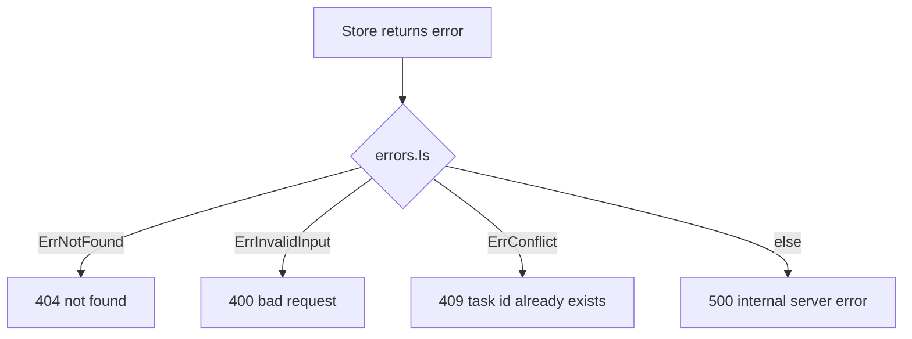
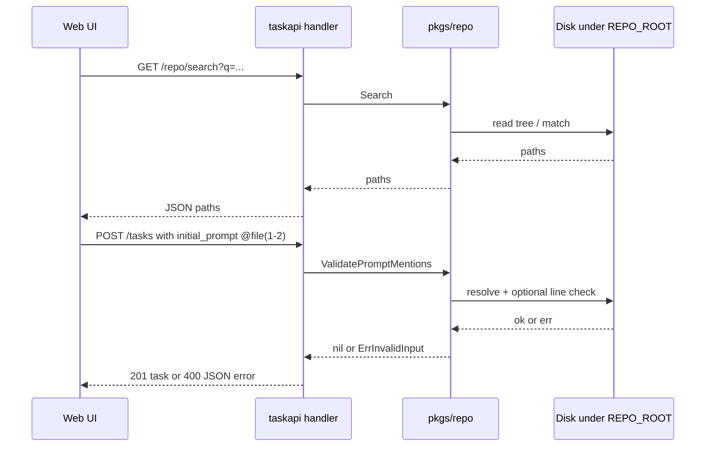

# taskapi — HTTP API (REST)

Authoritative routes, query/body limits, status codes, and JSON error shapes for `taskapi`. **SSE** (`GET /events`): [API-SSE.md](./API-SSE.md). **Environment variables** and startup: [RUNTIME-ENV.md](./RUNTIME-ENV.md). **Persistence:** [PERSISTENCE.md](./PERSISTENCE.md). Architecture hub: [DESIGN.md](./DESIGN.md).

The mux is mounted at `/` (no `/api` prefix). Registered families: tasks, SSE, health endpoints (plain JSON), **`GET /metrics`** (Prometheus text), and optionally repo (see below).

## Health

| Endpoint | Purpose | Response |
| -------- | ------- | -------- |
| `GET /health` | Backward-compatible liveness | `200` JSON includes `"status":"ok"` and **`version`** (from `runtime/debug.ReadBuildInfo`: release module version, short **`vcs.revision`**, **`devel`**, or **`unknown`**) — does not hit the database. |
| `GET /health/live` | Explicit liveness | Same JSON shape as `GET /health`. |
| `GET /health/ready` | Readiness | `200` with `checks`, **`version`** (same rules as liveness), and `"status":"ok"` after pool **`Ping`** plus **`SELECT 1`** (**`store.DefaultReadyTimeout`** / 2s deadline), and when **`REPO_ROOT`** is configured `checks.workspace_repo: ok` if that directory still exists. `503` `degraded` if any run check fails (`database` and/or `workspace_repo` set to `fail`; when the DB fails first, `workspace_repo` may be omitted). On **`database`** failure, **`readiness check failed`** at **Warn** includes **`timeout_sec`** **`2`** and **`deadline_exceeded`** when the error chain is **`context.DeadlineExceeded`**. |

## Rate limiting

All non-exempt routes on the API stack are subject to **`T2A_RATE_LIMIT_PER_MIN`** (see [RUNTIME-ENV.md](./RUNTIME-ENV.md)). Limits are enforced in-process with `golang.org/x/time/rate`; they are **not** shared across multiple `taskapi` replicas—use a reverse proxy or API gateway for a global budget.

When a request is rejected with **429**, structured logs emit **`rate limit exceeded`** at **Warn** (`operation` **`http.rate_limit`**) with **`client_ip`**, **`method`**, **`path`**, and the same **`request_id`** as other middleware (after access middleware assigns or echoes **`X-Request-ID`**), so operators can tie limit events to access lines.

## Max request body (`T2A_MAX_REQUEST_BODY_BYTES`)

Cap on incoming body size for all routes on the API stack (including JSON bodies on mutating methods). Default is **1 MiB** (`1048576`) when the env var is unset or invalid; set **`T2A_MAX_REQUEST_BODY_BYTES=0`** to disable. Wired as **`WithMaxRequestBody`** before **`WithIdempotency`** so oversized bodies fail before idempotency reads the body. When **`Content-Length`** alone proves the body is over the cap, structured **Warn** logs (`operation` **`handler.max_body`**, msg **`request body over limit`**) include **`limit`**, **`content_length`**, and **`request_id`** (after access middleware).

## Idempotency (`Idempotency-Key`)

`POST`, `PATCH`, and `DELETE` may include header **`Idempotency-Key`** (non-empty after trim; maximum **128** bytes, else `400` JSON `{"error":"idempotency key too long"}`). When **`T2A_IDEMPOTENCY_TTL`** is non-zero (default **24h**), the server caches successful responses (**200**, **201**, **204** only) keyed by **HTTP method**, **URL path**, the trimmed key, and **SHA-256 of the body** for `POST`/`PATCH` (DELETE has no body fingerprint). A repeat request with the same tuple replays the cached status, JSON headers (`Content-Type`, `X-Content-Type-Options`), and body without re-running the handler. Concurrent duplicates share one handler execution (`golang.org/x/sync/singleflight`). **`4xx`/`5xx` responses are not cached** (safe retries). To bound memory, the in-process cache evicts oldest entries when either **`T2A_IDEMPOTENCY_MAX_ENTRIES`** (default `2048`) or **`T2A_IDEMPOTENCY_MAX_BYTES`** (default `8388608`) is exceeded; set either to `0` to disable that specific bound. Eviction emits **`idempotency cache evicted entries`** at **Warn** (`operation` **`handler.idempotency`**) with **`request_id`** for the mutating request whose successful response write triggered pruning (when access middleware ran). For keyed `POST`/`PATCH`, unknown or negative `Content-Length` returns **`400`** (`idempotency requires known content length`), and body length above **1 MiB** returns **`413`** (`request body too large for idempotency`). Empty `Idempotency-Key` leaves behavior unchanged. **Warn** logs on those precondition failures (overlong key, body read error) include **`request_id`** when the request passed access middleware.

## Prometheus (`GET /metrics`)

`GET /metrics` serves the default registry in Prometheus text format (Go client). It is **not** behind the access-log or HTTP-metrics middleware, so scrapes do not emit `http.access` lines or `taskapi_http_*` series for themselves. Responses use the same baseline hardening headers as other browser-facing routes (`handler.WrapPrometheusHandler`).

HTTP traffic that **does** pass through the API stack records:

| Metric | Type | Labels | Notes |
| ------ | ---- | ------ | ----- |
| `taskapi_http_in_flight` | Gauge | — | In-flight requests (health probe paths excluded). |
| `taskapi_http_requests_total` | Counter | `method`, `route`, `code` | `route` is the matched mux pattern (e.g. `GET /tasks/{id}`) when set; otherwise **`other`** (limits cardinality on 404s). |
| `taskapi_http_request_duration_seconds` | Histogram | `method`, `route` | Default buckets; health probe paths excluded. |
| `taskapi_http_rate_limited_total` | Counter | — | Incremented when a request is rejected with **429** (per-IP limit). |
| `taskapi_http_idempotent_replay_total` | Counter | — | Incremented when a response is served from the idempotency cache (not on singleflight coalescing alone). |
| `taskapi_sse_subscribers` | Gauge | — | Connected **`GET /events`** clients for this process (in-memory hub; not shared across replicas). |

There is **no authentication** on `/metrics`; restrict at the network or reverse proxy in production.

## Task resource (`/tasks`)

| Capability     | Method / path            | Notes                                                                                                                                                                                                                                                                                                                                                                                                                                                   |
| -------------- | ------------------------ | ------------------------------------------------------------------------------------------------------------------------------------------------------------------------------------------------------------------------------------------------------------------------------------------------------------------------------------------------------------------------------------------------------------------------------------------------------- |
| Create task    | `POST /tasks`            | Title required after trim; optional `id` (else UUID); optional `draft_id` (client draft identity used to attach prior `POST /tasks/evaluate` snapshots to the created task); default status `ready`; **`priority` required** (one of `low` / `medium` / `high` / `critical`); optional `task_type` (`general` / `bug_fix` / `feature` / `refactor` / `docs`, default `general`). Optional `parent_id` (existing task) for nesting; optional `checklist_inherit` (bool) — when true, `parent_id` is required. **409** if `id` is supplied and already exists. Response is a task **tree** (`children[]` nested).                                                                                                                                                                         |
| Evaluate draft | `POST /tasks/evaluate`   | Evaluates a draft task payload before creation and persists each evaluation snapshot. Request accepts the creation fields (`id`, `title`, `initial_prompt`, `status`, `priority`, `task_type`, `parent_id`, `checklist_inherit`) plus optional `checklist_items` (`[{ "text": "..." }]`). Response includes `evaluation_id`, `created_at`, `overall_score`, `overall_summary`, section scores/suggestions (`sections[]`), and cohesion feedback (`cohesion_score`, `cohesion_summary`, `cohesion_suggestions[]`). Suggestions are intentionally randomized per request. |
| Save task draft | `POST /task-drafts` | Upserts a named draft for task creation. Body: `{ "id"?, "name", "payload" }`, where `payload` is the current create-form state (title/prompt/priority/task type/parent/checklist/subtask drafts and optional latest evaluation summary). Returns `{ "id", "name", "created_at", "updated_at" }`. |
| List task drafts | `GET /task-drafts` | Returns recent drafts ordered by `updated_at DESC`. Query `limit` supports `0..100` (default 50). **400** if `limit` exceeds 32 bytes (abuse guard). |
| Get task draft | `GET /task-drafts/{id}` | Returns one saved draft envelope with payload for resume flow. |
| Delete task draft | `DELETE /task-drafts/{id}` | Deletes a saved draft. Also performed automatically during successful `POST /tasks` when `draft_id` is supplied. |
| List tasks     | `GET /tasks`             | Query `limit` (0–200, default 50). **Offset paging:** `offset` (≥ 0). **Keyset paging (preferred at scale):** `after_id` (UUID) — roots with `id > after_id`; **mutually exclusive** with `offset` (presence of an `offset` query key is rejected when `after_id` is set). Roots ordered by `id ASC`. Response includes `has_more` when another page may exist (server fetches `limit+1` roots). Each element includes `children[]` with the full descendant subtree. Non-positive `limit` is coerced to 50. When using `after_id`, `offset` in the JSON body is **0**. **400** if `limit` or `offset` exceeds 32 bytes, or `after_id` exceeds 128 bytes (abuse guard).                                                                                                                                                                                                                          |
| Task stats     | `GET /tasks/stats`       | Returns global counters across **all** tasks (not paged list data): `{ "total": number, "ready": number, "critical": number, "by_status": { ... }, "by_priority": { ... }, "by_scope": { "parent": number, "subtask": number } }`. `ready` and `critical` are convenience fields; use grouped maps for expandable dashboards.                                                                                                                                                                                                                                                                                                 |
| Get one task   | `GET /tasks/{id}`        | Empty or whitespace `id` → 400. **`{id}`** path segment over **128 bytes** (after trim) → **400** (abuse guard). JSON includes `parent_id`, `checklist_inherit`, and nested `children[]` for all descendants.                                                                                                                                                                                                                                                                                                                                                                                                                         |
| Checklist      | `GET /tasks/{id}/checklist` | `200` JSON `{ "items": [ { "id", "sort_order", "text", "done" } ] }`. Definitions are owned by the task or by the nearest ancestor that does not inherit; `done` reflects completions recorded for **this** task id.                                                                                                                                                                                                 |
| Add checklist item | `POST /tasks/{id}/checklist/items` | Body `{"text":"..."}` (required). Rejected when `checklist_inherit` is true on the task. `X-Actor` on follow-up audit. `201` returns the new row.                                                                                                                                                                                                                                                                    |
| Checklist item patch | `PATCH /tasks/{id}/checklist/items/{itemId}` | Body must contain **exactly one** of: `{"text":"..."}` (non-empty after trim) or `{"done": true|false}`. **`text`** — updates the definition row; allowed for `user` or `agent`; rejected when `checklist_inherit` is true on the task (same as add/delete). **`done`** — **requires `X-Actor: agent`**; human default `user` receives `400`. Item must belong to the definition source for that task. `200` returns full `{ "items": [...] }`. `X-Actor` stored on audit for both.                                                                                                                                                                                                                                                           |
| Remove checklist item | `DELETE /tasks/{id}/checklist/items/{itemId}` | Rejected when `checklist_inherit` is true. `204`.                                                                                                                                                                                                                                                                                                                                                                  |
| Task audit log | `GET /tasks/{id}/events` | Without paging params: all events in **ascending** `seq` (oldest first). With `limit` and/or `before_seq` / `after_seq`: **keyset-paged** slice in **descending** `seq` (newest first): first page uses `limit` only; **older** rows use `before_seq=<seq>` (strictly older than that `seq`); **newer** rows use `after_seq=<seq>` (strictly newer). Response adds `total`, `range_start` / `range_end` (1-based ranks in newest-first order), `has_more_newer`, `has_more_older`. `offset` is not supported. Always includes `approval_pending`. Each event row may include `user_response`, `user_response_at`, and `response_thread` (conversation) when set. `limit` 0–200 (non-positive coerced to 50). **400** if `limit`, `before_seq`, or `after_seq` exceeds 32 bytes (abuse guard). 404 if the task does not exist.                                                                                                                                                                                                                                                                                        |
| One audit event | `GET /tasks/{id}/events/{seq}` | Same fields as a single row in the list: `task_id`, `seq`, `at`, `type`, `by`, `data`, optional `user_response` / `user_response_at` / `response_thread` when set. 404 if no row matches; 400 if `seq` is not a positive integer or exceeds 32 bytes.                                                                                                                                                                                                                                                                                         |
| Event user input | `PATCH /tasks/{id}/events/{seq}` | Body `{"user_response":"<text>"}` (non-empty after trim). Appends one message to `response_thread` for event types that accept responses (`approval_requested`, `task_failed` — see `domain.EventTypeAcceptsUserResponse`). `user_response` / `user_response_at` track the latest **user** message in the thread. Header `X-Actor` is `user` (default) or `agent` for attribution on the new message. Returns the same JSON shape as `GET` for that event. 400 if the type does not accept input, text empty, or exceeds 10 000 bytes. 404 if the event does not exist. |
| Partial update | `PATCH /tasks/{id}`      | At least one of: `title`, `initial_prompt`, `status`, `priority`, `checklist_inherit`, `parent_id`. JSON `null` for `parent_id` clears the parent (orphan). `checklist_inherit` true requires a parent. Setting status to `done` is rejected until every descendant is `done` and every checklist item for this task (including inherited definitions) has `done: true` for this task. Response is a task tree. When `REPO_ROOT` is configured, `initial_prompt` is checked for `@` mentions. |
| Delete task    | `DELETE /tasks/{id}`     | 204, empty body. Empty `id` → 400. Rejected (400) if the task still has subtasks (`parent_id` pointing to this id).                                                                                                                                                                                                                                                                                                                                                                                                                      |

### Documented `400` JSON `error` strings

**`GET /tasks`:**

- `limit must be integer 0..200` — `limit` is present but not a decimal integer in **0–200** (includes values **> 200** and non-numeric values such as `nope`).
- `offset must be non-negative integer` — `offset` is present but negative or not a valid integer.
- `offset cannot be used with after_id` — `after_id` is set and the query string also includes an `offset` key (even `offset=0`).
- `after_id must be a UUID` — `after_id` is non-empty but not a valid UUID string.
- `limit value too long` — raw `limit` query value exceeds **32** bytes.
- `offset value too long` — raw `offset` query value exceeds **32** bytes.
- `after_id too long` — raw `after_id` value exceeds **128** bytes.

**`GET /tasks/{id}/events`** (query validation when any of `limit`, `before_seq`, or `after_seq` is present; task must exist or the handler returns **404** first):

- `offset is not supported for task events; use before_seq or after_seq` — the query string includes a non-empty `offset` value.
- `before_seq and after_seq cannot both be set` — both cursors are non-empty after trim.
- `before_seq or after_seq too long` — trimmed `before_seq` or trimmed `after_seq` value exceeds **32** bytes.
- `limit too long` — raw `limit` query value exceeds **32** bytes (abuse guard; not the same wording as `GET /tasks`).
- `limit must be integer 0..200` — `limit` is present but not a decimal integer in **0–200** (includes values **> 200** and non-numeric values such as `nope`).
- `before_seq must be a positive integer` — `before_seq` is non-empty after trim but not a valid integer **≥ 1**.
- `after_seq must be a positive integer` — same for `after_seq`.

**`GET /tasks/{id}/events/{seq}`** and **`PATCH /tasks/{id}/events/{seq}`** (`{seq}` path segment):

- `seq too long` — trimmed `{seq}` exceeds **32** bytes.
- `seq must be a positive integer` — empty after trim, `0`, negative, non-numeric, or otherwise not a valid integer **≥ 1**.

**Checklist `PATCH`:**

- `send exactly one of text or done` — body included both `text` and `done`, or neither field was provided for the one-of choice.
- `text required` — `text` was sent but is empty after trim.
- `only the agent may mark checklist items done or undone` — body set `done` while `X-Actor` is not `agent` (including default user).
- `cannot update inherited checklist definitions from this task` — `text` update while `checklist_inherit` is true on the subject task.

**Path segment length:** The same **128-byte** cap (after trim) applies to `{id}` and `{itemId}` on other task routes (`PATCH /tasks/{id}`, checklist, `GET|PATCH /tasks/{id}/events…`, `GET|DELETE /task-drafts/{id}`, etc.); overlong segments return **400** before store access.

**Event thread append:** `PATCH` appends run in one SQL transaction. On **PostgreSQL**, the store takes a row lock on the matching `task_events` row while merging the thread so concurrent appends cannot drop messages (read-modify-write races). Default **SQLite** tests use a single pooled connection for the in-memory DB.

Headers: `X-Actor` is `user` (default) or `agent`, stored on audit events for attribution. It is not an authentication mechanism. Optional `X-Request-ID` (trimmed, max 128 chars): if the client sends it, the same value is echoed on the response and used as `request_id` in logs; otherwise the server assigns a UUID.

Authentication: if `T2A_API_TOKEN` is configured, non-exempt routes require `Authorization: Bearer <token>` and return `401` JSON `{"error":"unauthorized"}` when missing/invalid. Health and metrics endpoints remain unauthenticated for probes/scrapers. Denied attempts log **`api auth denied`** at **Warn** (`operation` **`http.api_auth`**) with **`method`**, **`path`**, and **`request_id`** when the request passed access middleware.

Baseline **response** hardening (JSON via `setJSONHeaders`, `GET /events` after the stream is accepted, **429** rate-limit bodies, and **`GET /metrics`** via `handler.WrapPrometheusHandler`): `Cache-Control: no-store`, `X-Frame-Options: DENY`, `Referrer-Policy: no-referrer`, `Content-Security-Policy: default-src 'none'; frame-ancestors 'none'`, `X-Content-Type-Options: nosniff`, and `Permissions-Policy: camera=(), microphone=(), geolocation=(), payment=()`. A reverse proxy or gateway may add or override security headers for production.

JSON: request bodies reject unknown fields and reject trailing data after the top-level value. Successful task list/get/create/patch bodies are task **trees**: each node uses `domain.Task` fields (`id`, `title`, `initial_prompt`, `status`, `priority`, `parent_id`, `checklist_inherit`) plus optional `children` (same shape, nested arbitrarily deep). `POST /tasks/evaluate` returns a persisted draft-evaluation envelope (`evaluation_id`, score fields, and suggestion arrays), not a task tree.

New audit `type` values include checklist (`checklist_item_added`, `checklist_item_toggled`, `checklist_item_updated`, `checklist_item_removed`), `checklist_inherit_changed`, and the rest of `domain.EventType` (e.g. `subtask_added` on the **parent** when a child task is created with `parent_id`, and `subtask_removed` on the **parent** when that child is deleted, both with payload `child_task_id` and `title`).

Task error responses use JSON `{"error":"..."}` for mapped store errors. When the request ran through access middleware (normal `taskapi` stack), the body may also include **`request_id`** (same value as response header **`X-Request-ID`** and `request_id` in structured logs) so clients can correlate failures with server-side traces.

Structured logs: when a request finishes, `taskapi` logs `http request complete` with `operation` `http.access`, `method`, `path`, matched `route`, `query` (raw query string, truncated), `x_actor`, `status`, `duration_ms`, and `bytes_written` (`GET /health`, `GET /health/live`, and `GET /health/ready` skip that line to avoid probe noise; they still get **`X-Request-ID`** and **`request_id` on `r.Context()`** like other routes). Every JSON line includes monotonic **`log_seq`** and **`log_seq_scope`**: **`request`** when the record used the per-request counter from access middleware, **`process`** otherwise (startup, `/health` path handling—probe requests do not attach the per-request counter, so their logs stay **`process`**-scoped, background work). Correlation lines include **`obs_category`** (`http_access`, `http_io`, `helper_io`) for filtering JSONL. At **`slog.LevelDebug`**, handlers also emit **`http.io`** lines with `phase` `in` or `out`, the same handler `operation` string as errors/access correlation, **`call_path`** (nested handler/helper chain, e.g. `tasks.create > decodeJSON > actorFromRequest`), and structured **inputs** (path ids, parsed query/limit, body field lengths and short previews for titles/prompts/text—never secrets). Nested helpers log **`helper.io`** with `phase` `helper_in` / `helper_out`, the same `call_path`, and a **`function`** field (e.g. `decodeJSON`, `writeStoreError`, `storeErrHTTPResponse`). Use **`RunObserved`** in `pkgs/tasks/handler` when a helper should log explicit input/output key/value pairs through the same `helper.io` pattern. **`phase` `out`** success responses include `response_json_bytes` and `response_body` (UTF-8–truncated JSON preview, capped ~16 KiB); `204 No Content` routes log `response_empty` instead. Handler errors use `operation` plus `http_status`; client errors (4xx) are Warn, server errors (5xx) are Error. Those lines and GORM SQL traces share `request_id` when the store used `r.Context()`. Background work (for example the optional SSE dev ticker) has no request id. Process-wide `slog` records go to the per-run JSON-lines file (not stderr, except the startup path line). GORM uses `gorm.io/gorm/logger.NewSlogLogger` with the same logger. SSE publish fanout is logged at Debug (`operation` `tasks.sse.publish`, `subscribers`, `event_type`, `task_id`) when there is at least one subscriber. Checklists, repeatable coverage measurement, and guidance on metrics/tracing: [OBSERVABILITY.md](./OBSERVABILITY.md).

## Optional workspace repo (`REPO_ROOT`)

When `REPO_ROOT` is set at startup, `taskapi` wires `pkgs/repo` into the handler. This supports the optional web UI feature: type `@` in `initial_prompt` to pick files under that root and optional line ranges.

Agent-oriented layering for this slice: `.cursor/rules/14-repo-workspace-extensibility.mdc`.

### `GET /repo/search`

| Query | Meaning                                                                                                             |
| ----- | ------------------------------------------------------------------------------------------------------------------- |
| `q`   | Search string (implementation-defined matching in `pkgs/repo`); returns a capped list of repo-relative paths (larger cap when `q` is empty for @-mention browse). |

- 200 JSON: `{ "paths": [ "..." ] }`
- 400 JSON if `q` exceeds 512 bytes (abuse guard; substring search cost scales with query length).
- 503 JSON if repo not configured: `{ "error": "..." }`
- 500 JSON on internal search failure (message is generic; details in logs).

### `GET /repo/file`

| Query  | Meaning                 |
| ------ | ----------------------- |
| `path` | Repo-relative file path |

- 200 JSON: `{ "path", "content" (UTF-8 text, empty if binary), "binary", "truncated", "size_bytes", "line_count", "warning"?: string }` — full file for preview up to 32 MiB; binary or invalid UTF-8 sets `binary: true` with empty `content`; larger files set `truncated: true`.
- 400 if `path` missing, invalid, or longer than 4096 bytes; 404 if file missing; 503 if repo not configured; 500 on read failure.

### `GET /repo/validate-range`

| Query          | Meaning                      |
| -------------- | ---------------------------- |
| `path`         | Repo-relative file path      |
| `start`, `end` | 1-based inclusive line range |

- 200 JSON: `{ "ok": true/false, "line_count"?: number, "warning"?: string }` — used to warn about invalid ranges without always returning non-200.
- 400 if `path` is longer than 4096 bytes, or if `start` or `end` is longer than 32 bytes (abuse guard; line numbers are short decimal strings).

`POST /tasks` / `PATCH /tasks/{id}`: when `rep` is non-nil, `initial_prompt` is passed through `repo.ValidatePromptMentions` so unresolved paths or bad ranges fail with `domain.ErrInvalidInput` → 400 JSON error (same as other task validation errors).

Repo routes use JSON for both success and error bodies, unlike task CRUD errors above.
