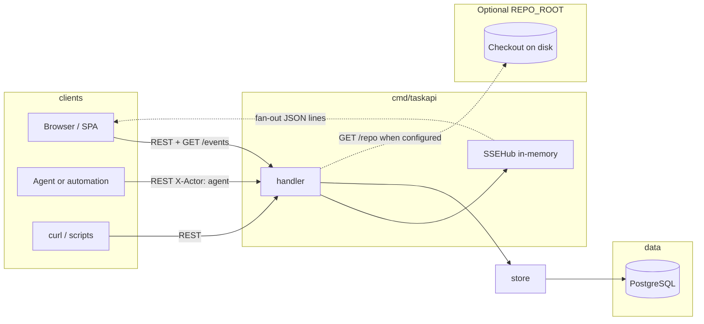
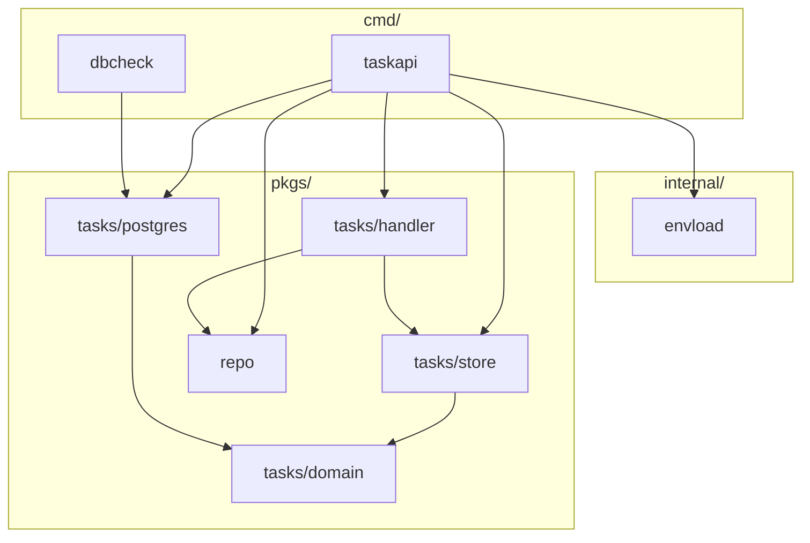
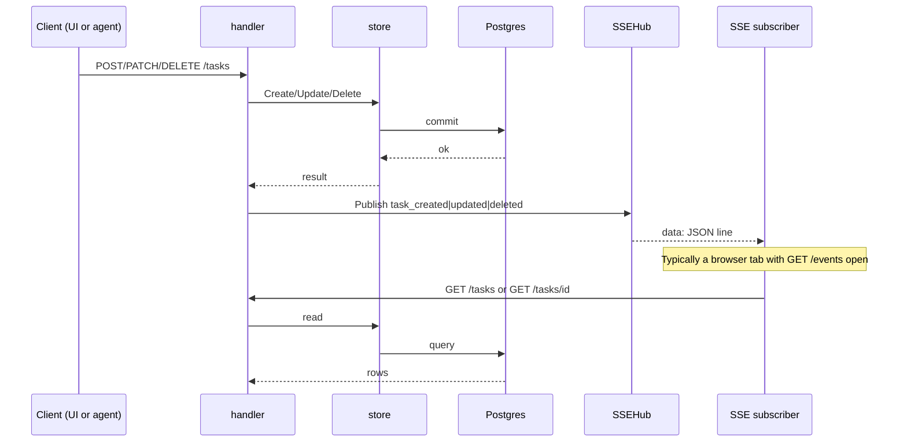
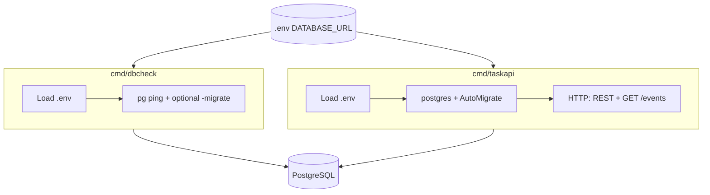
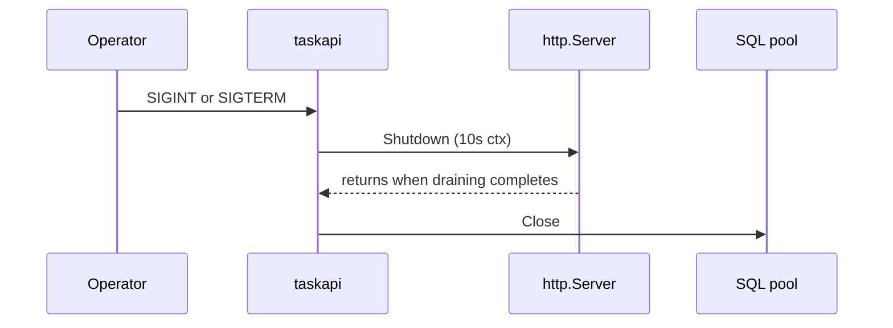
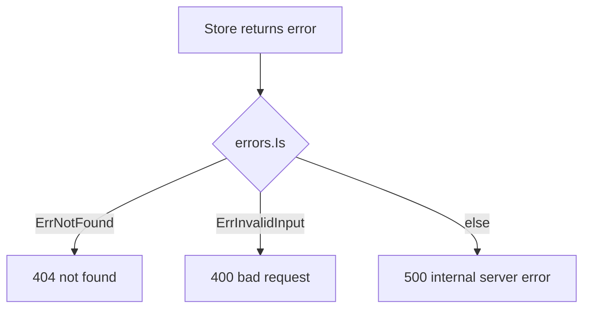
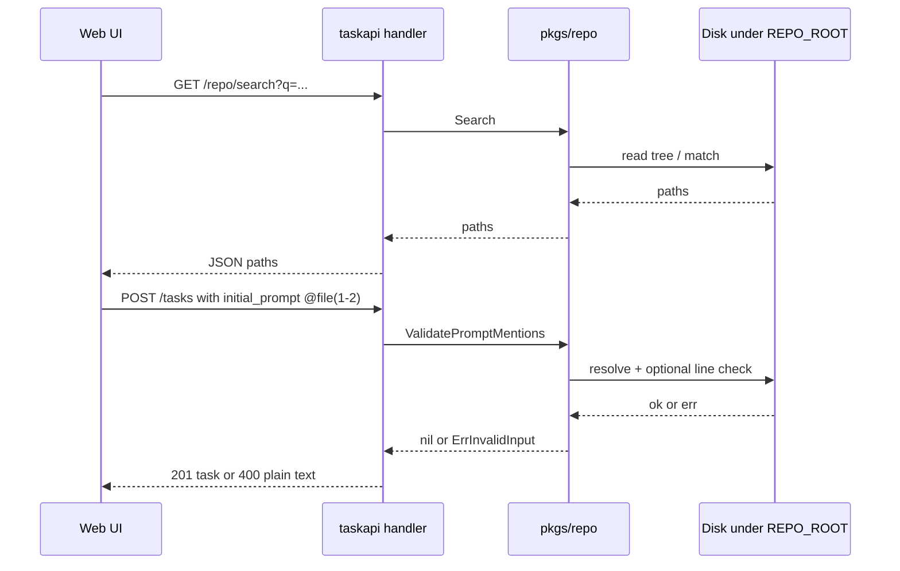
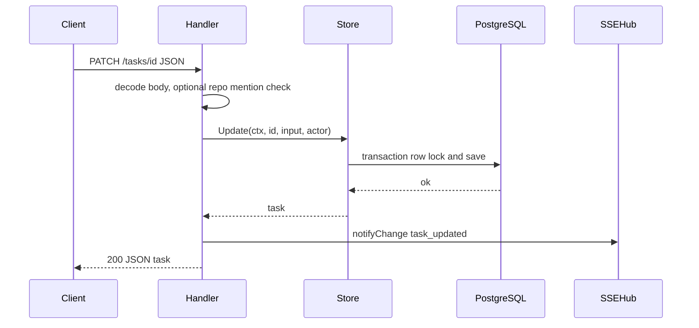

# T2A — system design

Backend design for `taskapi`: data flow, HTTP + SSE, persistence, env vars, tradeoffs. Entry points: [docs/README.md](./README.md) (index), root [README.md](../README.md) (commands), `go doc` (packages).

## Goals

- Support mass delegation: lots of tasks in flight, with agents and people acting through the same system without ad-hoc state.
- Postgres is the single source of truth: tasks plus an append-only `task_events` audit trail.
- Humans, scripts, and agents all change state through the same REST API; the store validates and records audit events (`X-Actor` distinguishes user vs agent on events).
- Browsers and runners can subscribe to lightweight “something changed” signals (`GET /events`) and refetch JSON from the REST API when they need full rows.

## Architecture overview




The handler exposes REST routes and `GET /events` (SSE). After a successful write it calls `notifyChange`, which publishes through `SSEHub`. The store is the only persistence layer for tasks; it maps errors to `domain.ErrNotFound` and `domain.ErrInvalidInput`, and appends `task_events` on create and on meaningful updates.

The SSE hub is in-memory only: it is not durable and not shared across OS processes. It only notifies clients connected to this server instance.

When `REPO_ROOT` is set, `taskapi` also opens `pkgs/repo` for read-only workspace search and line-range checks used by the UI; see [Optional workspace repo](#optional-workspace-repo-repo_root).

### Go package dependencies (high level)




## Write path and live UI (sequence)




SSE is a hint: it does not carry full task bodies. The follow-up GET returns authoritative JSON.

## Binaries (`cmd`)




`dbcheck` runs once: connectivity check, optional migrate, then exit. `taskapi` is the long-lived HTTP server; the SSE hub exists only inside that process.

Environment loading: `taskapi` uses `internal/envload.Load`. `dbcheck` does not import that package but follows the same rules: walk from `cwd` to find `go.mod`, default `<repo-root>/.env` or `-env`, `godotenv.Overload`, and a non-empty `DATABASE_URL`. `dbcheck` uses a 30s context deadline around `PingContext`; `taskapi` has no analogous startup ping beyond `gorm.Open`.

## Startup flow (`taskapi`)

1. **Log file** — create the log directory (`-logdir`, else `T2A_LOG_DIR`, else `./logs` under the process working directory), then open a new file `taskapi-YYYY-MM-DD-HHMMSS-<nanos>.jsonl` (local time). Default `slog` output is JSON, one object per line, at **`slog.LevelDebug` and above** (so `Debug` trace lines and SSE fanout logs are included, not only `Info`+), written only to that file. The first line after open records `operation` `taskapi.openTaskAPILogFile` with the file path; after `slog.SetDefault`, all process logs use the same file. The handler wraps the JSON `slog` handler so records emitted with an HTTP request context get a `request_id` field (from `X-Request-ID` or a generated UUID), correlating access logs, API error lines, and GORM SQL traces for the same request. A single line is printed to **stderr** with the absolute log path so operators know where to read logs.
2. `envload.Load` — resolve `.env` (repo root or `-env`), load with `godotenv.Overload`, require `DATABASE_URL`.
3. `postgres.Open` — GORM connection to Postgres; rejects empty/whitespace DSN; configures the underlying `database/sql` pool (max open/idle, connection lifetime). No startup `Ping` (unlike `dbcheck`).
4. `postgres.Migrate` — `AutoMigrate` for `domain.Task` and `domain.TaskEvent` on every startup (keeps schema aligned with models).
5. `store.NewStore`, `handler.NewSSEHub`, optional `repo.OpenRoot(REPO_ROOT)` when the env var is non-empty, then `handler.NewHandler(store, hub, rep)` — `rep` may be nil when `REPO_ROOT` is unset (no repo routes beyond 503). The API mux is wrapped with `handler.WithAccessLog` (request id, one completion line per request) and `handler.WithRecovery` (panic → 500 JSON).
6. `http.Server` on `-port` (default 8080): `ReadHeaderTimeout` and `ReadTimeout` bound slow clients; `IdleTimeout` caps idle keep-alive; `MaxHeaderBytes` caps request headers (~1 MiB). `WriteTimeout` is not set so long-lived `GET /events` streams are not cut off.

### Graceful shutdown

On SIGINT / SIGTERM, `taskapi` calls `http.Server.Shutdown` with a 10s deadline, then `Close` on the SQL pool, then syncs and closes the log file.




## Environment variables (`taskapi`)


| Variable       | Required                   | Purpose                                                                                                                                                                                                                                                                                                                                      |
| -------------- | -------------------------- | -------------------------------------------------------------------------------------------------------------------------------------------------------------------------------------------------------------------------------------------------------------------------------------------------------------------------------------------- |
| `DATABASE_URL` | Yes (after `envload.Load`) | Postgres connection string for GORM.                                                                                                                                                                                                                                                                                                         |
| `REPO_ROOT`    | No                         | Absolute path to a directory on the machine running `taskapi`. When non-empty and valid, enables [`/repo` routes](#optional-workspace-repo-repo_root) and validates `initial_prompt` `@` file mentions on `POST /tasks` and `PATCH /tasks/{id}`. When empty, repo routes respond with 503 JSON and prompts are not validated for mentions. |
| `T2A_LOG_DIR`  | No                         | Default directory for `taskapi` JSON log files when `-logdir` is not set. If both are empty, `./logs` (relative to the process working directory) is used.                                                                                                                                                                                                                                                |


`dbcheck` uses the same `.env` discovery for `DATABASE_URL` only; it does not use `REPO_ROOT`.

## REST API — task and event routes

The mux is mounted at `/` (no `/api` prefix). Registered families: tasks, SSE, `GET /health` (plain JSON), and optionally repo (see below).

### Task resource (`/tasks`)


| Capability     | Method / path            | Notes                                                                                                                                                                                                                                                                                                                                                                                                                                                   |
| -------------- | ------------------------ | ------------------------------------------------------------------------------------------------------------------------------------------------------------------------------------------------------------------------------------------------------------------------------------------------------------------------------------------------------------------------------------------------------------------------------------------------------- |
| Create task    | `POST /tasks`            | Title required after trim; optional `id` (else UUID); default status `ready`, priority `medium`. Optional `parent_id` (existing task) for nesting; optional `checklist_inherit` (bool) — when true, `parent_id` is required. Response is a task **tree** (`children[]` nested).                                                                                                                                                                                                                        |
| List tasks     | `GET /tasks`             | Query `limit` (0–200, default 50), `offset` (≥ 0) over **root** tasks only (`parent_id` null). Roots ordered by `id ASC`. Each element includes `children[]` with the full descendant subtree. Non-positive `limit` is coerced to 50.                                                                                                                                                                                                                          |
| Get one task   | `GET /tasks/{id}`        | Empty or whitespace `id` → 400. JSON includes `parent_id`, `checklist_inherit`, and nested `children[]` for all descendants.                                                                                                                                                                                                                                                                                                                                                                                                                         |
| Checklist      | `GET /tasks/{id}/checklist` | `200` JSON `{ "items": [ { "id", "sort_order", "text", "done" } ] }`. Definitions are owned by the task or by the nearest ancestor that does not inherit; `done` reflects completions recorded for **this** task id.                                                                                                                                                                                                 |
| Add checklist item | `POST /tasks/{id}/checklist/items` | Body `{"text":"..."}` (required). Rejected when `checklist_inherit` is true on the task. `X-Actor` on follow-up audit. `201` returns the new row.                                                                                                                                                                                                                                                                    |
| Toggle checklist item | `PATCH /tasks/{id}/checklist/items/{itemId}` | Body `{"done": true|false}`. Item must belong to the definition source for that task. `200` returns full `{ "items": [...] }`. `X-Actor` stored on audit.                                                                                                                                                                                                                                                           |
| Remove checklist item | `DELETE /tasks/{id}/checklist/items/{itemId}` | Rejected when `checklist_inherit` is true. `204`.                                                                                                                                                                                                                                                                                                                                                                  |
| Task audit log | `GET /tasks/{id}/events` | Without paging params: all events in **ascending** `seq` (oldest first). With `limit` and/or `before_seq` / `after_seq`: **keyset-paged** slice in **descending** `seq` (newest first): first page uses `limit` only; **older** rows use `before_seq=<seq>` (strictly older than that `seq`); **newer** rows use `after_seq=<seq>` (strictly newer). Response adds `total`, `range_start` / `range_end` (1-based ranks in newest-first order), `has_more_newer`, `has_more_older`. `offset` is not supported. Always includes `approval_pending`. Each event row may include `user_response`, `user_response_at`, and `response_thread` (conversation) when set. `limit` 0–200 (non-positive coerced to 50). 404 if the task does not exist.                                                                                                                                                                                                                                                                                        |
| One audit event | `GET /tasks/{id}/events/{seq}` | Same fields as a single row in the list: `task_id`, `seq`, `at`, `type`, `by`, `data`, optional `user_response` / `user_response_at` / `response_thread` when set. 404 if no row matches; 400 if `seq` is not a positive integer.                                                                                                                                                                                                                                                                                         |
| Event user input | `PATCH /tasks/{id}/events/{seq}` | Body `{"user_response":"<text>"}` (non-empty after trim). Appends one message to `response_thread` for event types that accept responses (`approval_requested`, `task_failed` — see `domain.EventTypeAcceptsUserResponse`). `user_response` / `user_response_at` track the latest **user** message in the thread. Header `X-Actor` is `user` (default) or `agent` for attribution on the new message. Returns the same JSON shape as `GET` for that event. 400 if the type does not accept input, text empty, or exceeds 10 000 bytes. 404 if the event does not exist. |
| Partial update | `PATCH /tasks/{id}`      | At least one of: `title`, `initial_prompt`, `status`, `priority`, `checklist_inherit`, `parent_id`. JSON `null` for `parent_id` clears the parent (orphan). `checklist_inherit` true requires a parent. Setting status to `done` is rejected until every descendant is `done` and every checklist item for this task (including inherited definitions) has `done: true` for this task. Response is a task tree. When `REPO_ROOT` is configured, `initial_prompt` is checked for `@` mentions. |
| Delete task    | `DELETE /tasks/{id}`     | 204, empty body. Empty `id` → 400. Rejected (400) if the task still has subtasks (`parent_id` pointing to this id).                                                                                                                                                                                                                                                                                                                                                                                                                      |


Headers: `X-Actor` is `user` (default) or `agent`, stored on audit events for attribution. It is not an authentication mechanism. Optional `X-Request-ID` (trimmed, max 128 chars): if the client sends it, the same value is echoed on the response and used as `request_id` in logs; otherwise the server assigns a UUID.

JSON: request bodies reject unknown fields and reject trailing data after the top-level value. Successful task list/get/create/patch bodies are task **trees**: each node uses `domain.Task` fields (`id`, `title`, `initial_prompt`, `status`, `priority`, `parent_id`, `checklist_inherit`) plus optional `children` (same shape, nested arbitrarily deep).

New audit `type` values: `checklist_item_added`, `checklist_item_toggled` (see `domain.EventType`).

Task error responses use plain text (not JSON):




Structured logs: when a request finishes, `taskapi` logs `http request complete` with `operation` `http.access`, `method`, `path`, matched `route`, `query` (raw query string, truncated), `x_actor`, `status`, `duration_ms`, and `bytes_written` (`GET /health` is skipped to avoid probe noise). Every JSON line includes monotonic **`log_seq`** and **`log_seq_scope`**: **`request`** when the record used request context from access middleware (per-request counter), **`process`** otherwise (startup, `/health`, background work). Correlation lines include **`obs_category`** (`http_access`, `http_io`, `helper_io`) for filtering JSONL. At **`slog.LevelDebug`**, handlers also emit **`http.io`** lines with `phase` `in` or `out`, the same handler `operation` string as errors/access correlation, **`call_path`** (nested handler/helper chain, e.g. `tasks.create > decodeJSON > actorFromRequest`), and structured **inputs** (path ids, parsed query/limit, body field lengths and short previews for titles/prompts/text—never secrets). Nested helpers log **`helper.io`** with `phase` `helper_in` / `helper_out`, the same `call_path`, and a **`function`** field (e.g. `decodeJSON`, `writeStoreError`, `storeErrHTTPResponse`). Use **`RunObserved`** in `pkgs/tasks/handler` when a helper should log explicit input/output key/value pairs through the same `helper.io` pattern. **`phase` `out`** success responses include `response_json_bytes` and `response_body` (UTF-8–truncated JSON preview, capped ~16 KiB); `204 No Content` routes log `response_empty` instead. Handler errors use `operation` plus `http_status`; client errors (4xx) are Warn, server errors (5xx) are Error. Those lines and GORM SQL traces share `request_id` when the store used `r.Context()`. Background work (for example the optional SSE dev ticker) has no request id. Process-wide `slog` records go to the per-run JSON-lines file (not stderr, except the startup path line). GORM uses `gorm.io/gorm/logger.NewSlogLogger` with the same logger. SSE publish fanout is logged at Debug (`operation` `tasks.sse.publish`, `subscribers`, `event_type`, `task_id`) when there is at least one subscriber. Checklists, repeatable coverage measurement, and guidance on metrics/tracing: [OBSERVABILITY.md](./OBSERVABILITY.md).

## Optional workspace repo (`REPO_ROOT`)

When `REPO_ROOT` is set at startup, `taskapi` wires `pkgs/repo` into the handler. This supports the optional web UI feature: type `@` in `initial_prompt` to pick files under that root and optional line ranges.

Agent-oriented layering for this slice: `.cursor/rules/14-repo-workspace-extensibility.mdc`.

### `GET /repo/search`


| Query | Meaning                                                                                                             |
| ----- | ------------------------------------------------------------------------------------------------------------------- |
| `q`   | Search string (implementation-defined matching in `pkgs/repo`); returns up to a capped list of repo-relative paths. |


- 200 JSON: `{ "paths": [ "..." ] }`
- 503 JSON if repo not configured: `{ "error": "..." }`
- 500 JSON on internal search failure (message is generic; details in logs).

### `GET /repo/validate-range`


| Query          | Meaning                      |
| -------------- | ---------------------------- |
| `path`         | Repo-relative file path      |
| `start`, `end` | 1-based inclusive line range |


- 200 JSON: `{ "ok": true/false, "line_count"?: number, "warning"?: string }` — used to warn about invalid ranges without always returning non-200.

`POST /tasks` / `PATCH /tasks/{id}`: when `rep` is non-nil, `initial_prompt` is passed through `repo.ValidatePromptMentions` so unresolved paths or bad ranges fail with `domain.ErrInvalidInput` → 400 plain text (same as other task validation errors).




Repo routes use JSON for both success and error bodies, unlike task CRUD errors above.

## Server-Sent Events (`GET /events`)

Connected clients receive `text/event-stream`. The stream tells them a task id changed so they can call REST again for full rows.

Responses also set `Cache-Control: no-cache`, `Connection: keep-alive`, and `X-Accel-Buffering: no` so reverse proxies (e.g. nginx) disable response buffering for SSE.

Failure modes: if the handler was constructed with a nil hub, the server returns 503 `event stream unavailable`. If the `ResponseWriter` does not implement `http.Flusher`, the server returns 500 `streaming unsupported` (unusual with `net/http` defaults).

Wire format:

- `Content-Type: text/event-stream`
- First frame: `retry: 3000` (reconnect hint, ms)
- Each event: one `data:` line with JSON:

```json
{"type":"task_created|task_updated|task_deleted","id":"<task-uuid>"}
```


| Trigger                         | `type`         |
| ------------------------------- | -------------- |
| Successful `POST /tasks`        | `task_created` |
| Successful `PATCH /tasks/{id}`  | `task_updated` |
| Successful `DELETE /tasks/{id}` | `task_deleted` |


### Dev-only: SSE “cron” (`T2A_SSE_TEST=1`)

For local UI work, `taskapi` can start a background ticker (no extra HTTP routes). Set `T2A_SSE_TEST=1` (never enable in production without intent). Every 3s by default (override with `T2A_SSE_TEST_INTERVAL`, or `0` to disable the ticker), the process:

1. Optionally runs **lifecycle simulation** when `T2A_SSE_TEST_LIFECYCLE=1`: every `T2A_SSE_TEST_LIFECYCLE_EVERY` ticker fires (default `5`), creates a task with id prefix `t2a-devsim-` or deletes one such task (no subtasks), then publishes `task_created` or `task_deleted` on the SSE hub.
2. Pages through `store.List` with limit 200 and increasing offset — same flat ordering as `store.ListFlat` (`id ASC` over all tasks).
3. For each task row, calls `store.AppendTaskEvent` with actor `agent` up to **`T2A_SSE_TEST_EVENTS_PER_TICK`** times per tick (default `1`, max `50`) using the next `domain.EventType` in a fixed rotation that includes every `domain.EventType` once per cycle (order: `pkgs/tasks/devsim` `EventCycle`). The next type is chosen from `len(task_events) mod len(cycle)` so successive appends walk through all types. Sample JSON `data` is attached (realistic shapes for plans, artifacts, checklist rows, approvals, etc.; `from`/`to` for status, priority, prompt, and title/message events).
4. If `T2A_SSE_TEST_SYNC_ROW=1`, after each append `store.ApplyDevTaskRowMirror` updates the task row when the synthetic event maps to fields (status, priority, title, initial prompt, terminal completed/failed). Marking **done** uses the same checklist/subtask rules as `PATCH`; mirror steps that violate those rules are skipped (debug log only).
5. If `T2A_SSE_TEST_USER_RESPONSE=1`, after an `approval_requested` or `task_failed` append, `store.AppendTaskEventResponseMessage` adds a synthetic user thread line (same path as `PATCH /tasks/{id}/events/{seq}`).
6. Publishes `task_updated` on the SSE hub after each simulated task’s append cycle (and lifecycle publishes as above). Clients still treat REST/DB as authoritative.

| Env | Meaning |
| --- | --- |
| `T2A_SSE_TEST=1` | Enable ticker (required). |
| `T2A_SSE_TEST_INTERVAL` | Tick interval (e.g. `3s`); `0` disables the ticker. |
| `T2A_SSE_TEST_EVENTS_PER_TICK` | Appends per task per tick (`1`–`50`, default `1`). |
| `T2A_SSE_TEST_SYNC_ROW=1` | Mirror task row after each synthetic append when applicable. |
| `T2A_SSE_TEST_USER_RESPONSE=1` | Synthetic user message on `approval_requested` / `task_failed` rows. |
| `T2A_SSE_TEST_LIFECYCLE=1` | Random create/delete of `t2a-devsim-*` tasks. |
| `T2A_SSE_TEST_LIFECYCLE_EVERY` | Run lifecycle every N ticks (default `5` when lifecycle is on). |

There are no extra dev-only HTTP paths; only normal REST + `GET /events` apply.

Clients typically use `EventSource` in the browser (or any SSE-capable client), parse each `data` line, then call `GET /tasks` or `GET /tasks/{id}`. Treat REST and the database as authoritative. The SPA debounces bursts, then invalidates cached **list** queries and only **detail** subtrees for task ids present on the `data` lines (falling back to invalidating all task queries if no id could be parsed), so open pages for unrelated tasks are not refetched on every event.

## Persistence and audit (`store`)

Tasks: CRUD via GORM; ordering and list limits match the store package doc.

REST shape vs audit: the JSON task resource has no `created_at` / `updated_at` fields. Timestamps live only on `task_events` (`At` in UTC when the event is written). Operators needing “when did this task last change?” should query audit rows (or add a future API field).

Concurrency: `Update` runs in a transaction and loads the task row with a row lock (`SELECT … FOR UPDATE` via GORM). Concurrent patches to the same task serialize; there is no ETag / version on the task row—last successful transaction wins.

Audit: append-only `task_events` for typed changes. Event type strings are `domain.EventType` values (e.g. `task_created`, `status_changed`, `prompt_appended`; title edits are stored as `message_added` in code). Used for history and debugging; events are not replayed into the SSE hub.

Schema: `postgres.Migrate` runs GORM `AutoMigrate` for `domain.Task` and `domain.TaskEvent` only. There are no checked-in versioned SQL migrations or down migrations.

## Extensibility

Use a vertical slice so new behavior stays testable and reviewable:

1. `domain` — Add or adjust types, enums, and validation; no database or HTTP imports.
2. `store` — Add use-case methods (clear inputs, transactions, audit rows as needed). Map errors to `domain.ErrNotFound` and `domain.ErrInvalidInput` only; do not log inside the store.
3. `handler` — Decode and validate HTTP bodies, call the store, translate errors to status codes, then call `notifyChange` after successful writes so SSE subscribers refetch. Keep business rules out of the handler when they belong in store or domain.
4. Optional `web/` — Extend `web/src/types/` and `web/src/api/` (`parseTaskApi` and related parsers); then UI under `web/src/tasks/`. Do not add raw `fetch` calls in components for task APIs.

Mutating task request (happy path):



Changing JSON shapes, routes, or SSE payload types also requires updating `docs/DESIGN.md` and the client parsers in lockstep; see `.cursor/rules/11-api-contracts.mdc`. For agent checklists: tasks stack — `.cursor/rules/13-tasks-stack-extensibility.mdc`; workspace repo (`REPO_ROOT`, `/repo/*`, `pkgs/repo`) — `.cursor/rules/14-repo-workspace-extensibility.mdc`; GORM models / AutoMigrate / SQLite test schema — `.cursor/rules/15-database-schema.mdc`.

## Technical choices


| Choice                                   | Rationale                                                                                                         |
| ---------------------------------------- | ----------------------------------------------------------------------------------------------------------------- |
| Go `net/http` and Go 1.22 route patterns | Small surface, no extra router dependency.                                                                        |
| GORM + Postgres                          | Production DB; `AutoMigrate` for bootstrap; tests use SQLite via `testdb.OpenSQLite` and the same store code. |
| SSE instead of WebSockets                | Updates are server-to-client only; simpler for notify-only.                                                       |
| In-memory `SSEHub`                       | Few moving parts for one process; no Redis/NATS in v1.                                                            |
| Small SSE payload (`type` + `id`)        | Keeps streams light; clients use REST for bodies.                                                                 |
| Structured logging (`slog`)              | Matches project logging rules at API boundaries.                                                                  |


## Limitations

1. The SSE hub is in RAM and scoped to one process. Multiple `taskapi` replicas do not share subscribers; load balancers can split `/events` from the instance that handles writes.
2. SSE delivery is best-effort: each subscriber has a bounded buffer (32); slow clients may drop events. For guaranteed history, use the database and `task_events`.
3. No authentication or authorization in this module; `X-Actor` is labeling, not identity proof.
4. No rate limiting or a dedicated max body size; request headers are capped via `MaxHeaderBytes`, and read timeouts bound how long the server waits for the request (including body). Very large JSON bodies are not explicitly rejected beyond memory and timeout behavior.
5. Task CRUD error bodies are plain text, not a structured JSON envelope; `/repo/*` uses JSON errors (see [Optional workspace repo](#optional-workspace-repo-repo_root)).
6. `dbcheck` does not serve HTTP; it only checks DB (and optionally migrates).
7. `GET /health` returns `{"status":"ok"}` only; it does not probe the database. For readiness, use `dbcheck`, port checks, or an outer proxy health model.
8. `taskapi` serves plain HTTP — TLS is expected at a reverse proxy or load balancer, not inside this binary.
9. Schema evolution is `AutoMigrate` only — no versioned migration files, rollback story, or drift detection beyond what GORM provides.
10. List ordering is fixed (`id ASC`); no sort or filter query parameters.
11. `POST /tasks` with a client-supplied `id` that already exists fails at the database layer and is surfaced as 500 (not a dedicated 409 conflict response).
12. No ETag / If-Match on tasks; concurrent edits to the same row last-winner within locking rules (see Persistence).
13. If JSON encoding of a success response fails after headers are sent, the handler logs an error; clients may see a truncated body (rare for `domain.Task` shapes).

## Out of scope (today)

- CORS (assume same origin or a gateway in front).
- Idempotency keys on `POST`.
- Outbound webhooks.
- ETag / conditional GET (possible future optimization; see `UI_TASK.MD`).
- Versioned SQL migrations and multi-step schema upgrades.
- Built-in metrics / OpenTelemetry (only `slog` logs today).

## Optional browser client (`web/`)

Optional Vite + React app under `web/` uses `/tasks`, `/events`, and `/repo` as documented here. SPA-specific details: [WEB.md](./WEB.md). Commands and npm scripts: root [README.md](../README.md).

## Related references


| Document                         | Role                                            |
| -------------------------------- | ----------------------------------------------- |
| [docs/README.md](./README.md)  | Doc index and update rules.                     |
| [Root README.md](../README.md) | Run commands, dev scripts, `curl` examples. |
| [WEB.md](./WEB.md)             | `web/` SPA only.                            |
| `pkgs/tasks/handler/doc.go`      | Routes next to code.                            |
| `pkgs/tasks/store/doc.go`        | Store behavior and extensibility notes.           |
| `pkgs/repo`                      | `REPO_ROOT`, `go doc`.                      |
| `cmd/taskapi/doc.go`             | Flags and wiring.                               |


