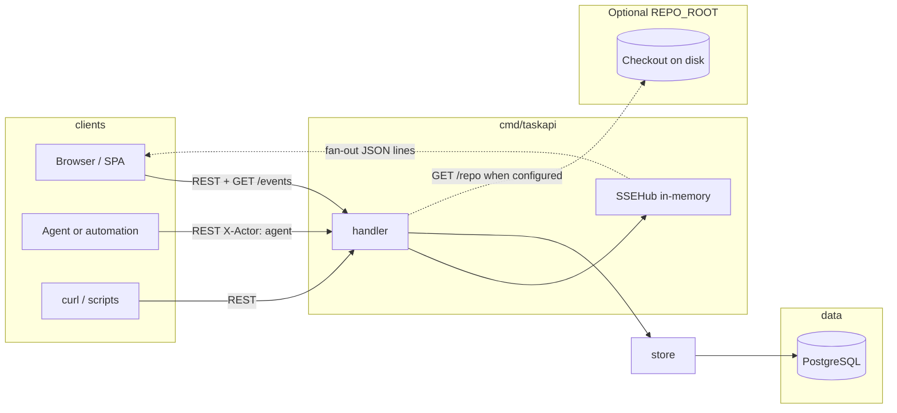
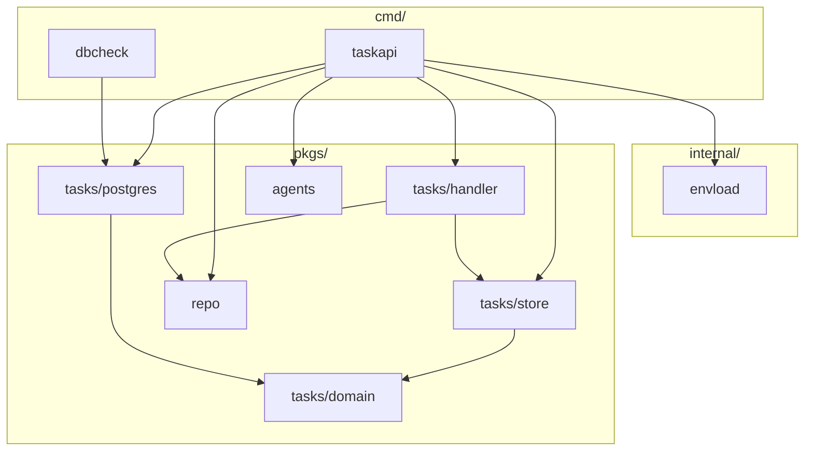
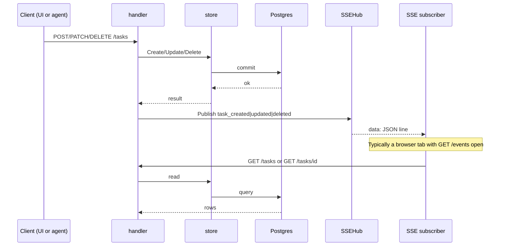

# T2A — system design (hub)

Backend design for `taskapi`: data flow, tradeoffs, and links to **focused contract docs**. Entry points: [docs/README.md](./README.md) (index), root [README.md](../README.md) (commands), `go doc` (packages).

**Product angle:** T2A is a control plane for agent-heavy workflows—as execution shifts to agents, orchestration moves out of the IDE into a shared API and persistent store. See [docs/PRODUCT.md](./PRODUCT.md) and the root [README](../README.md).

## Contract docs (taskapi)

| Doc | Contents |
|-----|----------|
| [API-HTTP.md](./API-HTTP.md) | REST routes (`/tasks`, `/repo`, health, metrics), rate limits, idempotency, task JSON, documented `400` strings. |
| [API-SSE.md](./API-SSE.md) | `GET /events`, wire format, dev-only synthetic SSE env vars. |
| [RUNTIME-ENV.md](./RUNTIME-ENV.md) | Environment variables, `dbcheck`, startup/shutdown, HTTP timeouts. |
| [AGENT-QUEUE.md](./AGENT-QUEUE.md) | Ready-task notifier, in-memory queue, reconcile loop, fairness ordering. |
| [PERSISTENCE.md](./PERSISTENCE.md) | GORM, `task_events`, concurrency, AutoMigrate scope. |
| [EXTENSIBILITY.md](./EXTENSIBILITY.md) | Vertical slice: domain → store → handler → `web/`. |

**`cmd/taskapi` wiring (code, not prose contracts):** binary layout [`cmd/taskapi/README.md`](../cmd/taskapi/README.md); startup env parsing in [`internal/taskapiconfig`](../internal/taskapiconfig); HTTP middleware stack in [`pkgs/tasks/middleware`](../pkgs/tasks/middleware) (`Stack` in `stack.go`, called from [`internal/taskapi`](../internal/taskapi) `NewHTTPHandler` with `calltrace.Path`); REST/SSE handlers in [`pkgs/tasks/handler`](../pkgs/tasks/handler) ([`README.md`](../pkgs/tasks/handler/README.md)).

## Goals

- Support mass delegation: lots of tasks in flight, with agents and people acting through the same system without ad-hoc state.
- Postgres is the single source of truth: tasks plus an append-only `task_events` audit trail.
- Humans, scripts, and agents all change state through the same REST API; the store validates and records audit events (`X-Actor` distinguishes user vs agent on events).
- Browsers and runners can subscribe to lightweight “something changed” signals (`GET /events`) and refetch JSON from the REST API when they need full rows.

## Architecture overview

The handler exposes REST routes and `GET /events` (SSE). After a successful write it calls `notifyChange`, which publishes through `SSEHub`. The store is the only persistence layer for tasks; it maps errors to `domain.ErrNotFound` and `domain.ErrInvalidInput`, and appends `task_events` on create and on meaningful updates.

The SSE hub is in-memory only: it is not durable and not shared across OS processes. It only notifies clients connected to this server instance.

Ready-task delivery to in-process consumers (bounded queue + reconcile) is documented in **[AGENT-QUEUE.md](./AGENT-QUEUE.md)**.

When `REPO_ROOT` is set, `taskapi` also opens `pkgs/repo` for read-only workspace search and line-range checks used by the UI; see [API-HTTP.md](./API-HTTP.md#optional-workspace-repo-repo_root).

### Go package dependencies (high level)

## Write path and live UI (sequence)

SSE is a hint: it does not carry full task bodies. The follow-up GET returns authoritative JSON.

## Technical choices

| Choice                                   | Rationale                                                                                                         |
| ---------------------------------------- | ----------------------------------------------------------------------------------------------------------------- |
| Go `net/http` and Go 1.22 route patterns | Small surface, no extra router dependency.                                                                        |
| GORM + Postgres                          | Production DB; `AutoMigrate` for bootstrap; tests use SQLite via `tasktestdb.OpenSQLite` and the same store code. |
| SSE instead of WebSockets                | Updates are server-to-client only; simpler for notify-only.                                                       |
| In-memory `SSEHub`                       | Few moving parts for one process; no Redis/NATS in v1.                                                            |
| Small SSE payload (`type` + `id`)        | Keeps streams light; clients use REST for bodies.                                                                 |
| Structured logging (`slog`)              | Matches project logging rules at API boundaries.                                                                  |

## Limitations

1. The SSE hub is in RAM and scoped to one process. Multiple `taskapi` replicas do not share subscribers; load balancers can split `/events` from the instance that handles writes.
2. SSE delivery is best-effort: each subscriber has a bounded buffer (32); slow clients may drop events. For guaranteed history, use the database and `task_events`.
3. No authentication or authorization in this module; `X-Actor` is labeling, not identity proof.
4. Per-IP HTTP rate limiting is in-memory per process (`T2A_RATE_LIMIT_PER_MIN`); replicas do not share state. `RemoteAddr` is the only client key (no trusted `X-Forwarded-For`). Request bodies are capped to **1 MiB** by default (`T2A_MAX_REQUEST_BODY_BYTES`), can be tuned higher, or disabled with `0`; headers are also capped via `MaxHeaderBytes`, and read timeouts bound how long the server waits for the request (including body).
5. Task CRUD error bodies are JSON `{"error":"<message>"}` for handler-mapped failures (404 / 400 / 409 / 500); `/repo/*` uses the same JSON error shape (see [API-HTTP.md](./API-HTTP.md#optional-workspace-repo-repo_root)).
6. `dbcheck` does not serve HTTP; it only checks DB (and optionally migrates).
7. `GET /health` and `GET /health/live` are liveness-only (no database probe). Use `GET /health/ready` for in-process readiness (DB ping + trivial SQL, optional workspace directory stat when `REPO_ROOT` is set); `dbcheck` remains useful for CLI and migrations.
8. `taskapi` serves plain HTTP — TLS is expected at a reverse proxy or load balancer, not inside this binary.
9. Schema evolution is `AutoMigrate` only — no versioned migration files, rollback story, or drift detection beyond what GORM provides.
10. List ordering is fixed (`id ASC`); no sort or filter query parameters beyond `after_id` keyset paging.
11. `POST /tasks` with a client-supplied `id` that already exists returns **409** JSON `{"error":"task id already exists"}` (`domain.ErrConflict`).
12. No ETag / If-Match on tasks; concurrent edits to the same row last-winner within locking rules (see [PERSISTENCE.md](./PERSISTENCE.md)).
13. If JSON encoding of a success response fails after headers are sent, the handler logs an error; clients may see a truncated body (rare for `domain.Task` shapes).
14. **`Idempotency-Key`** is honored only inside a single `taskapi` process (in-memory cache + `singleflight`); multiple replicas or restarts do not share entries. Cache memory is bounded by `T2A_IDEMPOTENCY_MAX_ENTRIES` / `T2A_IDEMPOTENCY_MAX_BYTES` with oldest-entry eviction. For keyed `POST`/`PATCH`, unknown `Content-Length` is rejected with `400` and oversized bodies with `413`.

## Out of scope (today)

- CORS (assume same origin or a gateway in front).
- Outbound webhooks.
- ETag / conditional GET (possible future optimization; see `UI_TASK.MD`).
- Versioned SQL migrations and multi-step schema upgrades.
- OpenTelemetry-style distributed tracing (only `slog` logs and Prometheus HTTP metrics today).

## Optional browser client (`web/`)

Optional Vite + React app under `web/` uses `/tasks`, `/events`, and `/repo` as documented in the contract docs above. SPA-specific details: [WEB.md](./WEB.md). Commands and npm scripts: root [README.md](../README.md).

## Related references

| Document                         | Role                                            |
| -------------------------------- | ----------------------------------------------- |
| [docs/README.md](./README.md)  | Doc index and update rules.                     |
| [Root README.md](../README.md) | Run commands, dev scripts, `curl` examples. |
| [WEB.md](./WEB.md)             | `web/` SPA only.                            |
| [REORGANIZATION-PLAN.md](./REORGANIZATION-PLAN.md) | Phased layout cleanup roadmap. |
| `pkgs/tasks/handler/doc.go`      | Routes next to code.                            |
| `pkgs/tasks/store/doc.go`        | Store behavior and extensibility notes.           |
| `pkgs/repo`                      | `REPO_ROOT`, `go doc`.                      |
| `cmd/taskapi/doc.go`             | Flags and wiring.                               |
