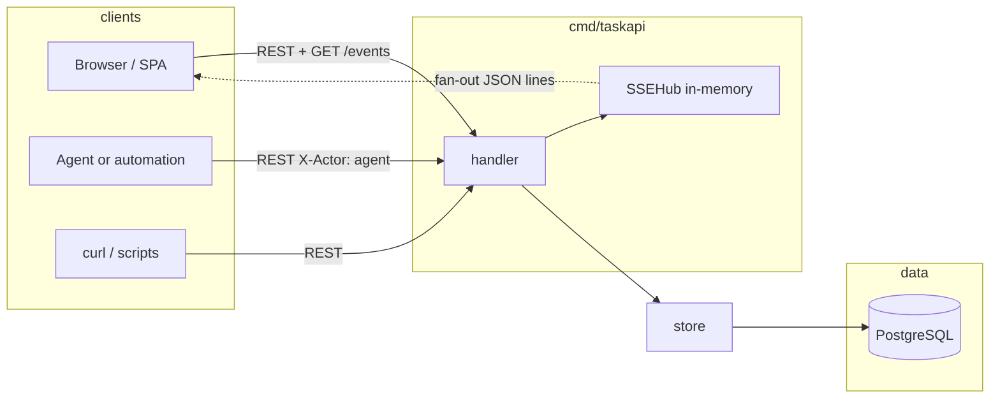
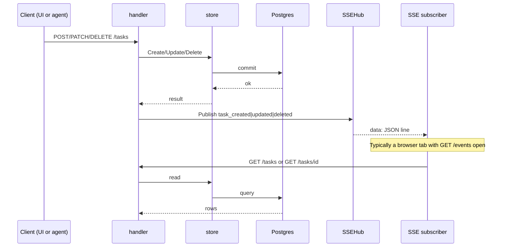
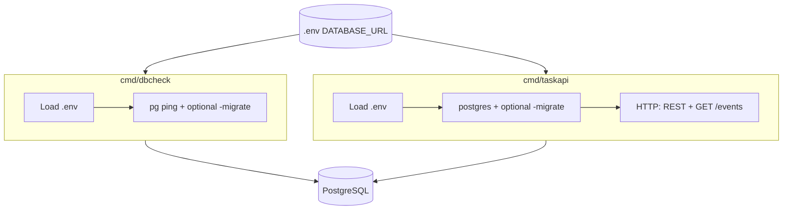

# T2A — system design

Backend for **delegating many tasks to agents** (and operators): how `taskapi` fits together—data flow, HTTP surface, real-time notifications, and tradeoffs. Package comments and `README.md` remain the day-to-day entry points; this file is the map.

## Goals

- Support **mass delegation**: lots of tasks in flight, with agents and people acting through the same system without ad-hoc state.
- Postgres is the single source of truth: tasks plus an append-only `task_events` audit trail.
- Humans, scripts, and agents all change state through the same REST API; the store validates and records audit events (`X-Actor` distinguishes user vs agent on events).
- Browsers and runners can subscribe to lightweight “something changed” signals (`GET /events`) and refetch JSON from the REST API when they need full rows.

## Architecture overview



The handler exposes REST routes and `GET /events` (SSE). After a successful write it calls `notifyChange`, which publishes through `SSEHub`. The store is the only persistence layer for tasks; it maps errors to `domain.ErrNotFound` and `domain.ErrInvalidInput`, and appends `task_events` on create and on meaningful updates.

The SSE hub is in-memory only: it is not durable and not shared across OS processes. It only notifies clients connected to this server instance.

## Write path and live UI (sequence)



SSE is a hint: it does not carry full task bodies. The follow-up GET returns authoritative JSON.

## Binaries (`cmd`)



`dbcheck` runs once: connectivity check, optional migrate, then exit. `taskapi` is the long-lived HTTP server; the SSE hub exists only inside that process.

**Environment loading:** `taskapi` uses `internal/envload.Load`. `dbcheck` does not import that package but follows the same rules: walk from `cwd` to find `go.mod`, default `<repo-root>/.env` or `-env`, `godotenv.Overload`, and a non-empty `DATABASE_URL`. `dbcheck` uses a **30s** context deadline around `PingContext`; `taskapi` has no analogous startup ping beyond `gorm.Open`.

## Startup flow (`taskapi`)

1. `envload.Load` — resolve `.env` (repo root or `-env`), load with `godotenv.Overload`, require `DATABASE_URL`.
2. `postgres.Open` — GORM connection to Postgres; rejects empty/whitespace DSN; configures the underlying `database/sql` pool (max open/idle, connection lifetime). No startup `Ping` (unlike `dbcheck`).
3. Optional `-migrate` — `AutoMigrate` for `domain.Task` and `domain.TaskEvent`.
4. `store.NewStore`, `handler.NewSSEHub`, `handler.NewHandler(store, hub)` — one hub per process.
5. `http.Server` on `-port` (default **8080**): **`ReadHeaderTimeout`** and **`ReadTimeout`** bound slow clients; **`IdleTimeout`** caps idle keep-alive; **`MaxHeaderBytes`** caps request headers (~1 MiB). **`WriteTimeout` is not set** so long-lived **`GET /events`** streams are not cut off. Graceful shutdown on SIGINT/SIGTERM (**10s** timeout), then **`Close`** on the SQL pool.

## REST API — coverage

| Capability | Method / path | Notes |
|------------|----------------|--------|
| Create task | `POST /tasks` | Title required after trim; optional `id` (else UUID); default status `ready`, priority `medium`. |
| List tasks | `GET /tasks` | Query `limit` (0–200, default 50), `offset` (≥ 0). **Non-positive `limit` is coerced to 50** in the store (so `limit=0` means the default page size, not “zero rows”). Results are ordered by **`id ASC`** (lexicographic string order, not creation time unless IDs happen to sort that way). |
| Get one task | `GET /tasks/{id}` | Empty or whitespace `id` → 400. |
| Partial update | `PATCH /tasks/{id}` | At least one optional field must decode to a **non-nil** pointer (omitted key and JSON `null` both leave that field unchanged and do not count). To set `initial_prompt` to empty, send `""`. Title cannot be cleared (empty string after trim is rejected). See store for validation and audit events. |
| Delete task | `DELETE /tasks/{id}` | 204, empty body. Empty `id` → 400. |

The HTTP mux is mounted at **`/`** with no additional path prefix: only the routes above are served (no `/health`).

Headers: `X-Actor` is `user` (default) or `agent`, stored on audit events for attribution. It is not an authentication mechanism.

JSON: request bodies reject unknown fields and reject trailing data after the top-level value. Successful task bodies use `domain.Task` with `json` tags (snake_case keys).

Errors: 404 with plain text `not found`, 400 with `bad request`, 500 with `internal server error`. There is no JSON error envelope today. Structured logs at the handler use **`operation`** and **`http_status`**; client errors (4xx) are logged at **Warn**, server errors (5xx) at **Error**.

## Server-Sent Events (`GET /events`)

Connected clients receive `text/event-stream`. The stream tells them a task id changed so they can call REST again for full rows.

Responses also set `Cache-Control: no-cache`, `Connection: keep-alive`, and **`X-Accel-Buffering: no`** so reverse proxies (e.g. nginx) disable response buffering for SSE.

**Failure modes:** if the handler was constructed with a nil hub, the server returns **503** `event stream unavailable`. If the `ResponseWriter` does not implement `http.Flusher`, the server returns **500** `streaming unsupported` (unusual with `net/http` defaults).

Wire format:

- `Content-Type: text/event-stream`
- First frame: `retry: 3000` (reconnect hint, ms)
- Each event: one `data:` line with JSON:

```json
{"type":"task_created|task_updated|task_deleted","id":"<task-uuid>"}
```

| Trigger | `type` |
|---------|--------|
| Successful `POST /tasks` | `task_created` |
| Successful `PATCH /tasks/{id}` | `task_updated` |
| Successful `DELETE /tasks/{id}` | `task_deleted` |

Clients typically use `EventSource` in the browser (or any SSE-capable client), parse each `data` line, then call `GET /tasks` or `GET /tasks/{id}`. Treat REST and the database as authoritative.

## Persistence and audit (`store`)

Tasks: CRUD via GORM; ordering and list limits match the store package doc.

**REST shape vs audit:** the JSON task resource has **no** `created_at` / `updated_at` fields. **Timestamps live only on `task_events`** (`At` in **UTC** when the event is written). Operators needing “when did this task last change?” should query audit rows (or add a future API field).

**Concurrency:** `Update` runs in a transaction and loads the task row with a **row lock** (`SELECT … FOR UPDATE` via GORM). Concurrent patches to the **same** task serialize; there is **no ETag / version** on the task row—last successful transaction wins.

Audit: append-only `task_events` for typed changes. Event type strings are `domain.EventType` values (e.g. `task_created`, `status_changed`, `prompt_appended`; title edits are stored as `message_added` in code). Used for history and debugging; events are **not** replayed into the SSE hub.

**Schema:** `postgres.Migrate` runs GORM **`AutoMigrate`** for `domain.Task` and `domain.TaskEvent` only. There are **no** checked-in versioned SQL migrations or down migrations.

## Technical choices

| Choice | Rationale |
|--------|-----------|
| Go `net/http` and Go 1.22 route patterns | Small surface, no extra router dependency. |
| GORM + Postgres | Production DB; `AutoMigrate` for bootstrap; **tests use SQLite** via `testdb.OpenSQLite` and the same store code. |
| SSE instead of WebSockets | Updates are server-to-client only; simpler for notify-only. |
| In-memory `SSEHub` | Few moving parts for one process; no Redis/NATS in v1. |
| Small SSE payload (`type` + `id`) | Keeps streams light; clients use REST for bodies. |
| Structured logging (`slog`) | Matches project logging rules at API boundaries. |

## Limitations

1. The SSE hub is in RAM and scoped to one process. Multiple `taskapi` replicas do not share subscribers; load balancers can split `/events` from the instance that handles writes.
2. SSE delivery is best-effort: each subscriber has a bounded buffer (32); slow clients may drop events. For guaranteed history, use the database and `task_events`.
3. No authentication or authorization in this module; `X-Actor` is labeling, not identity proof.
4. No rate limiting or a dedicated max **body** size; request **headers** are capped via **`MaxHeaderBytes`**, and **read timeouts** bound how long the server waits for the request (including body). Very large JSON bodies are not explicitly rejected beyond memory and timeout behavior.
5. Error responses are plain text, not a structured JSON error type.
6. `dbcheck` does not serve HTTP; it only checks DB (and optionally migrates).
7. **No `/health` or `/readiness` HTTP routes** — use port open checks, `dbcheck`, or an outer proxy health model.
8. **`taskapi` serves plain HTTP** — TLS is expected at a reverse proxy or load balancer, not inside this binary.
9. **Schema evolution is `AutoMigrate` only** — no versioned migration files, rollback story, or drift detection beyond what GORM provides.
10. **List ordering is fixed** (`id ASC`); no sort or filter query parameters.
11. **`POST /tasks` with a client-supplied `id` that already exists** fails at the database layer and is surfaced as a **500** (not a dedicated 409 conflict response).
12. **No ETag / If-Match** on tasks; concurrent edits to the same row last-winner within locking rules (see Persistence).
13. If JSON **encoding** of a success response fails after headers are sent, the handler logs an error; clients may see a truncated body (rare for `domain.Task` shapes).

## Out of scope (today)

- CORS (assume same origin or a gateway in front).
- Idempotency keys on `POST`.
- Outbound webhooks.
- ETag / conditional GET (possible future optimization; see `UI_TASK.MD`).
- Versioned SQL migrations and multi-step schema upgrades.
- Built-in metrics / OpenTelemetry (only `slog` logs today).

## Optional browser client (`web/`)

The repo includes an optional **Vite + React** SPA under **`web/`** that consumes this document’s **REST** and **SSE** endpoints (`/tasks`, `/events`). It does **not** change server behavior or add new routes on **`taskapi`**.

- **Development:** the Vite dev server **proxies** `/tasks` and `/events` to **`taskapi`**, avoiding CORS during local work.
- **Production:** serve **`web/dist`** so the browser talks to the API with **same-origin** URLs, or terminate TLS and route at a **gateway**; the Go server still ships **without CORS** (see [Limitations](#limitations)).

Operator-facing **scripts, layout, and deployment notes** live in the root **`README.md`** (*Web UI* section), not duplicated here.

## Related references

| Document | Role |
|----------|------|
| `README.md` | Quickstart; **`taskapi`** and **`dbcheck`**; PowerShell `curl.exe`; **Web UI** (`web/`: scripts, proxy, `src` layout, production). |
| `UI_TASK.MD` | Product note on SPA + SSE. |
| `pkgs/tasks/handler/doc.go` | Routes and request rules. |
| `pkgs/tasks/store/doc.go` | Store behavior and list caps. |
| `cmd/taskapi/doc.go` | Flags and wiring. |
