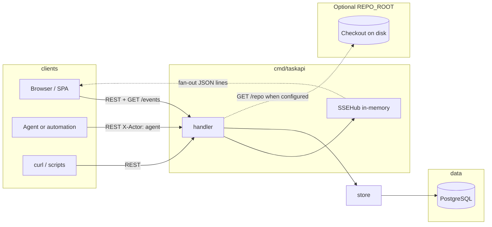
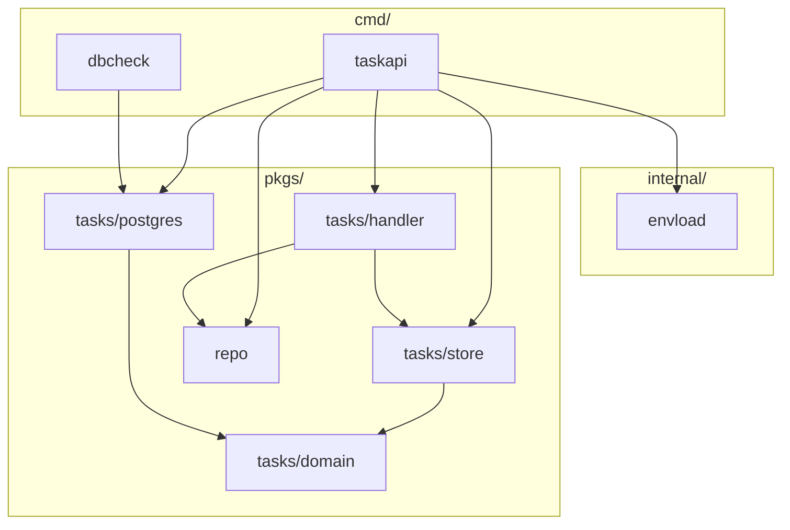
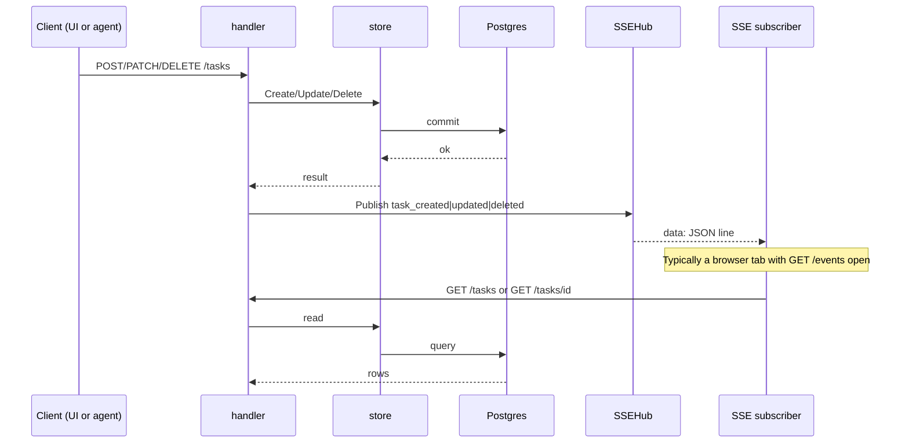
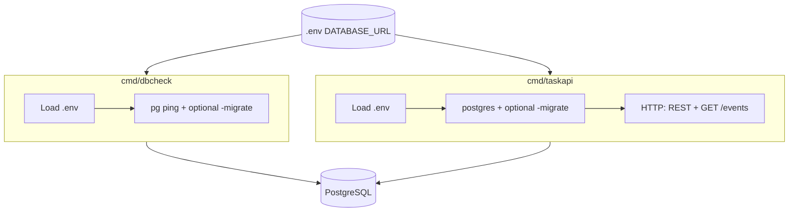
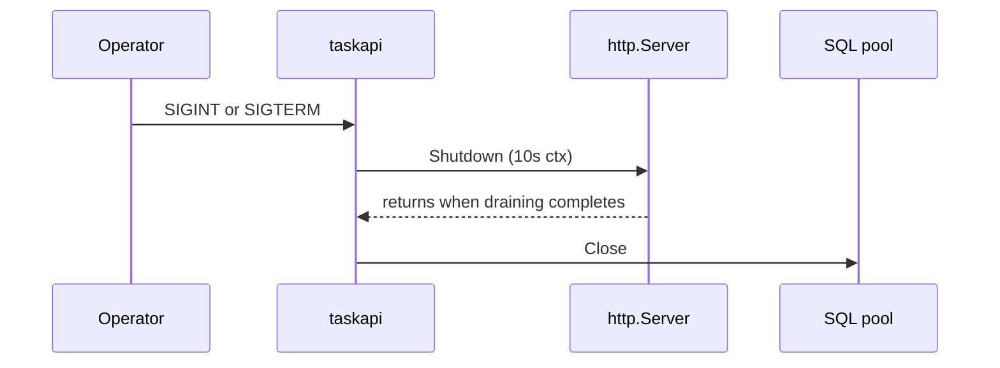
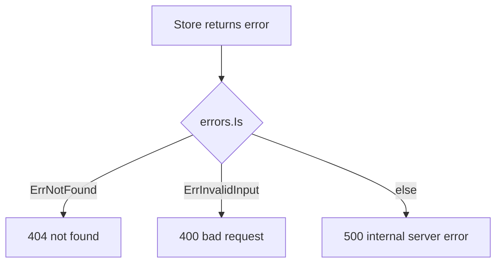
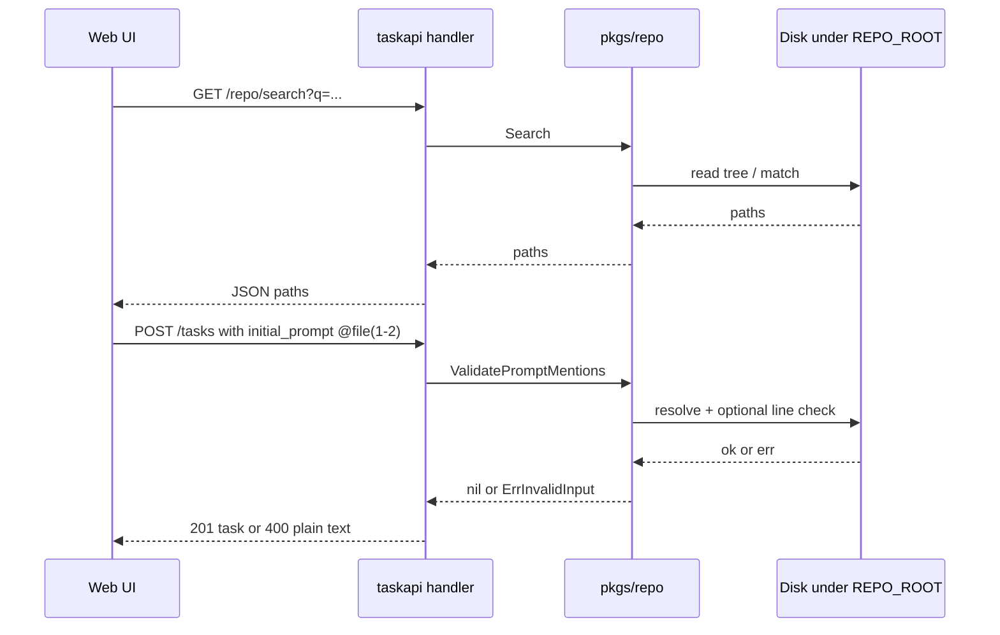

# T2A — system design

Backend design for `**taskapi**`: data flow, HTTP + SSE, persistence, env vars, tradeoffs. Entry points: `**[docs/README.md](./README.md)**` (index), root `**README.md**` (commands), `**go doc**` (packages).

## Goals

- **Support mass delegation**: lots of tasks in flight, with agents and people acting through the same system without ad-hoc state.
- Postgres is the single source of truth: tasks plus an append-only `task_events` audit trail.
- Humans, scripts, and agents all change state through the same REST API; the store validates and records audit events (`X-Actor` distinguishes user vs agent on events).
- Browsers and runners can subscribe to lightweight “something changed” signals (`GET /events`) and refetch JSON from the REST API when they need full rows.

## Architecture overview




The handler exposes REST routes and `GET /events` (SSE). After a successful write it calls `notifyChange`, which publishes through `SSEHub`. The store is the only persistence layer for tasks; it maps errors to `domain.ErrNotFound` and `domain.ErrInvalidInput`, and appends `task_events` on create and on meaningful updates.

The SSE hub is in-memory only: it is not durable and not shared across OS processes. It only notifies clients connected to this server instance.

When `**REPO_ROOT**` is set, `taskapi` also opens `**pkgs/repo**` for read-only workspace search and line-range checks used by the UI; see [Optional workspace repo](#optional-workspace-repo-repo_root).

### Go package dependencies (high level)




## Write path and live UI (sequence)




SSE is a hint: it does not carry full task bodies. The follow-up GET returns authoritative JSON.

## Binaries (`cmd`)




`dbcheck` runs once: connectivity check, optional migrate, then exit. `taskapi` is the long-lived HTTP server; the SSE hub exists only inside that process.

**Environment loading:** `taskapi` uses `internal/envload.Load`. `dbcheck` does not import that package but follows the same rules: walk from `cwd` to find `go.mod`, default `<repo-root>/.env` or `-env`, `godotenv.Overload`, and a non-empty `DATABASE_URL`. `dbcheck` uses a **30s** context deadline around `PingContext`; `taskapi` has no analogous startup ping beyond `gorm.Open`.

## Startup flow (`taskapi`)

1. `envload.Load` — resolve `.env` (repo root or `-env`), load with `godotenv.Overload`, require `DATABASE_URL`.
2. `postgres.Open` — GORM connection to Postgres; rejects empty/whitespace DSN; configures the underlying `database/sql` pool (max open/idle, connection lifetime). No startup `Ping` (unlike `dbcheck`).
3. Optional `-migrate` — `AutoMigrate` for `domain.Task` and `domain.TaskEvent`.
4. `store.NewStore`, `handler.NewSSEHub`, optional `**repo.OpenRoot(REPO_ROOT)`** when the env var is non-empty, then `**handler.NewHandler(store, hub, rep)`** — `rep` may be **nil** when `**REPO_ROOT`** is unset (no repo routes beyond **503**).
5. `http.Server` on `-port` (default **8080**): `**ReadHeaderTimeout`** and `**ReadTimeout`** bound slow clients; `**IdleTimeout**` caps idle keep-alive; `**MaxHeaderBytes**` caps request headers (~1 MiB). `**WriteTimeout` is not set** so long-lived `**GET /events`** streams are not cut off.

### Graceful shutdown

On **SIGINT** / **SIGTERM**, `taskapi` calls `**http.Server.Shutdown`** with a **10s** deadline, then `**Close`** on the SQL pool.




## Environment variables (`taskapi`)


| Variable       | Required                   | Purpose                                                                                                                                                                                                                                                                                                                                      |
| -------------- | -------------------------- | -------------------------------------------------------------------------------------------------------------------------------------------------------------------------------------------------------------------------------------------------------------------------------------------------------------------------------------------- |
| `DATABASE_URL` | Yes (after `envload.Load`) | Postgres connection string for GORM.                                                                                                                                                                                                                                                                                                         |
| `REPO_ROOT`    | No                         | Absolute path to a directory on the **machine running `taskapi`**. When non-empty and valid, enables `[/repo` routes](#optional-workspace-repo-repo_root) and validates `**initial_prompt**` `**@**` file mentions on `**POST/PATCH /tasks**`. When empty, repo routes respond with **503** JSON and prompts are not validated for mentions. |


`dbcheck` uses the same `**.env`** discovery for `**DATABASE_URL`** only; it does not use `**REPO_ROOT**`.

## REST API — task and event routes

The mux is mounted at `**/**` (no `/api` prefix). Registered families: **tasks**, **SSE**, and optionally **repo** (see below). There is **no `/health`**.

### Task resource (`/tasks`)


| Capability     | Method / path            | Notes                                                                                                                                                                                                                                                                                                                                                                                                                                                   |
| -------------- | ------------------------ | ------------------------------------------------------------------------------------------------------------------------------------------------------------------------------------------------------------------------------------------------------------------------------------------------------------------------------------------------------------------------------------------------------------------------------------------------------- |
| Create task    | `POST /tasks`            | Title required after trim; optional `id` (else UUID); default status `ready`, priority `medium`.                                                                                                                                                                                                                                                                                                                                                        |
| List tasks     | `GET /tasks`             | Query `limit` (0–200, default 50), `offset` (≥ 0). **Non-positive `limit` is coerced to 50** in the store (so `limit=0` means the default page size, not “zero rows”). Results are ordered by `**id ASC`** (lexicographic string order, not creation time unless IDs happen to sort that way).                                                                                                                                                          |
| Get one task   | `GET /tasks/{id}`        | Empty or whitespace `id` → 400.                                                                                                                                                                                                                                                                                                                                                                                                                         |
| Task audit log | `GET /tasks/{id}/events` | Append-only `task_events` for that task (seq ascending): `seq`, `at`, `type`, `by` (`user` | `agent`), `data` (JSON object). **404** if the task does not exist.                                                                                                                                                                                                                                                                                        |
| Partial update | `PATCH /tasks/{id}`      | At least one optional field must decode to a **non-nil** pointer (omitted key and JSON `null` both leave that field unchanged and do not count). To set `initial_prompt` to empty, send `""`. Title cannot be cleared (empty string after trim is rejected). When `**REPO_ROOT`** is configured, `**initial_prompt`** is checked for `**@**` file mentions (see [repo](#optional-workspace-repo-repo_root)). See store for validation and audit events. |
| Delete task    | `DELETE /tasks/{id}`     | 204, empty body. Empty `id` → 400.                                                                                                                                                                                                                                                                                                                                                                                                                      |


Headers: `X-Actor` is `user` (default) or `agent`, stored on audit events for attribution. It is not an authentication mechanism.

JSON: request bodies reject unknown fields and reject trailing data after the top-level value. Successful task bodies use `domain.Task` with `json` tags (snake_case keys).

**Task error responses** use **plain text** (not JSON):




Structured logs at the handler use `**operation**` and `**http_status**`; client errors (4xx) are logged at **Warn**, server errors (5xx) at **Error**.

## Optional workspace repo (`REPO_ROOT`)

When `**REPO_ROOT`** is set at startup, `taskapi` wires `**pkgs/repo`** into the handler. This supports the optional **web** UI feature: type `**@`** in `**initial_prompt`** to pick files under that root and optional line ranges.

### `GET /repo/search`


| Query | Meaning                                                                                                             |
| ----- | ------------------------------------------------------------------------------------------------------------------- |
| `q`   | Search string (implementation-defined matching in `pkgs/repo`); returns up to a capped list of repo-relative paths. |


- **200** JSON: `{ "paths": [ "..." ] }`
- **503** JSON if repo not configured: `{ "error": "..." }`
- **500** JSON on internal search failure (message is generic; details in logs).

### `GET /repo/validate-range`


| Query          | Meaning                      |
| -------------- | ---------------------------- |
| `path`         | Repo-relative file path      |
| `start`, `end` | 1-based inclusive line range |


- **200** JSON: `{ "ok": true/false, "line_count"?: number, "warning"?: string }` — used to warn about invalid ranges without always returning non-200.

`**POST /tasks` / `PATCH /tasks/{id}`:** when `**rep`** is non-nil, `**initial_prompt`** is passed through `**repo.ValidatePromptMentions**` so unresolved paths or bad ranges fail with `**domain.ErrInvalidInput**` → **400** plain text (same as other task validation errors).




Repo routes use **JSON** for both success and error bodies, unlike task CRUD errors above.

## Server-Sent Events (`GET /events`)

Connected clients receive `text/event-stream`. The stream tells them a task id changed so they can call REST again for full rows.

Responses also set `Cache-Control: no-cache`, `Connection: keep-alive`, and `**X-Accel-Buffering: no`** so reverse proxies (e.g. nginx) disable response buffering for SSE.

**Failure modes:** if the handler was constructed with a nil hub, the server returns **503** `event stream unavailable`. If the `ResponseWriter` does not implement `http.Flusher`, the server returns **500** `streaming unsupported` (unusual with `net/http` defaults).

Wire format:

- `Content-Type: text/event-stream`
- First frame: `retry: 3000` (reconnect hint, ms)
- Each event: one `data:` line with JSON:

```json
{"type":"task_created|task_updated|task_deleted","id":"<task-uuid>"}
```


| Trigger                         | `type`         |
| ------------------------------- | -------------- |
| Successful `POST /tasks`        | `task_created` |
| Successful `PATCH /tasks/{id}`  | `task_updated` |
| Successful `DELETE /tasks/{id}` | `task_deleted` |


### Dev-only: synthetic SSE (`T2A_SSE_TEST=1`)

For local UI work, `**taskapi**` can expose helpers that inject the **same** JSON line into the SSE hub as real mutations (clients still refetch via REST).

Set `**T2A_SSE_TEST=1`** in the environment (never enable in production without intent). A background ticker every **`3s`** (unless `**T2A_SSE_TEST_INTERVAL**` overrides, or `**0**` disables the ticker) runs the **same persistence path as `PATCH /tasks`**: a no-op priority update on the **first task** in list order (`id ASC`), then **`task_updated`** on the SSE hub. If there are no tasks, ticks are skipped.

When test mode is on, each successful `**POST /tasks**` still emits the normal `**task_created**` for the new row, then **also** performs that same **`store.Update` + `task_updated`** for the **first task in list order** (same ordering as `GET /tasks`: `id ASC`). If the list is empty after create, the extra step is skipped.

| Method | Path               | Behavior                                                                                                                                                                           |
| ------ | ------------------ | ---------------------------------------------------------------------------------------------------------------------------------------------------------------------------------- |
| `GET`  | `/dev/sse/ping`    | **`task_updated`**: `store.Update` (no-op priority) then SSE, same as `PATCH`. Query `**id**` or first list task. **404** if no tasks / missing task. **204** on success.             |
| `POST` | `/dev/sse/publish` | **`task_updated`**: same as ping. **`task_created`** / **`task_deleted`**: SSE **only** (no DB write — use real `POST`/`DELETE /tasks` for persistence). **404** if id required and no tasks. |


Vite dev server proxies `**/dev`** to `**taskapi**` (see `**web/vite.config.ts**`) so you can open `**http://localhost:5173/dev/sse/ping**` or `**curl -X POST http://127.0.0.1:8080/dev/sse/publish ...**` against the API directly.

Clients typically use `EventSource` in the browser (or any SSE-capable client), parse each `data` line, then call `GET /tasks` or `GET /tasks/{id}`. Treat REST and the database as authoritative.

## Persistence and audit (`store`)

Tasks: CRUD via GORM; ordering and list limits match the store package doc.

**REST shape vs audit:** the JSON task resource has **no** `created_at` / `updated_at` fields. **Timestamps live only on `task_events`** (`At` in **UTC** when the event is written). Operators needing “when did this task last change?” should query audit rows (or add a future API field).

**Concurrency:** `Update` runs in a transaction and loads the task row with a **row lock** (`SELECT … FOR UPDATE` via GORM). Concurrent patches to the **same** task serialize; there is **no ETag / version** on the task row—last successful transaction wins.

Audit: append-only `task_events` for typed changes. Event type strings are `domain.EventType` values (e.g. `task_created`, `status_changed`, `prompt_appended`; title edits are stored as `message_added` in code). Used for history and debugging; events are **not** replayed into the SSE hub.

**Schema:** `postgres.Migrate` runs GORM `**AutoMigrate`** for `domain.Task` and `domain.TaskEvent` only. There are **no** checked-in versioned SQL migrations or down migrations.

## Technical choices


| Choice                                   | Rationale                                                                                                         |
| ---------------------------------------- | ----------------------------------------------------------------------------------------------------------------- |
| Go `net/http` and Go 1.22 route patterns | Small surface, no extra router dependency.                                                                        |
| GORM + Postgres                          | Production DB; `AutoMigrate` for bootstrap; **tests use SQLite** via `testdb.OpenSQLite` and the same store code. |
| SSE instead of WebSockets                | Updates are server-to-client only; simpler for notify-only.                                                       |
| In-memory `SSEHub`                       | Few moving parts for one process; no Redis/NATS in v1.                                                            |
| Small SSE payload (`type` + `id`)        | Keeps streams light; clients use REST for bodies.                                                                 |
| Structured logging (`slog`)              | Matches project logging rules at API boundaries.                                                                  |


## Limitations

1. The SSE hub is in RAM and scoped to one process. Multiple `taskapi` replicas do not share subscribers; load balancers can split `/events` from the instance that handles writes.
2. SSE delivery is best-effort: each subscriber has a bounded buffer (32); slow clients may drop events. For guaranteed history, use the database and `task_events`.
3. No authentication or authorization in this module; `X-Actor` is labeling, not identity proof.
4. No rate limiting or a dedicated max **body** size; request **headers** are capped via `**MaxHeaderBytes`**, and **read timeouts** bound how long the server waits for the request (including body). Very large JSON bodies are not explicitly rejected beyond memory and timeout behavior.
5. **Task CRUD** error bodies are plain text, not a structured JSON envelope; `**/repo/*`** uses JSON errors (see [Optional workspace repo](#optional-workspace-repo-repo_root)).
6. `dbcheck` does not serve HTTP; it only checks DB (and optionally migrates).
7. **No `/health` or `/readiness` HTTP routes** — use port open checks, `dbcheck`, or an outer proxy health model.
8. `**taskapi` serves plain HTTP** — TLS is expected at a reverse proxy or load balancer, not inside this binary.
9. **Schema evolution is `AutoMigrate` only** — no versioned migration files, rollback story, or drift detection beyond what GORM provides.
10. **List ordering is fixed** (`id ASC`); no sort or filter query parameters.
11. `**POST /tasks` with a client-supplied `id` that already exists** fails at the database layer and is surfaced as a **500** (not a dedicated 409 conflict response).
12. **No ETag / If-Match** on tasks; concurrent edits to the same row last-winner within locking rules (see Persistence).
13. If JSON **encoding** of a success response fails after headers are sent, the handler logs an error; clients may see a truncated body (rare for `domain.Task` shapes).

## Out of scope (today)

- CORS (assume same origin or a gateway in front).
- Idempotency keys on `POST`.
- Outbound webhooks.
- ETag / conditional GET (possible future optimization; see `UI_TASK.MD`).
- Versioned SQL migrations and multi-step schema upgrades.
- Built-in metrics / OpenTelemetry (only `slog` logs today).

## Optional browser client (`web/`)

Optional **Vite + React** app under `**web/`** uses `**/tasks`**, `**/events**`, and `**/repo**` as documented here. SPA-specific details: `**[WEB.md](./WEB.md)**`. Commands and `**npm**` scripts: root `**README.md**`.

## Related references


| Document                         | Role                                            |
| -------------------------------- | ----------------------------------------------- |
| `[docs/README.md](./README.md)`  | Doc index and update rules.                     |
| [Root `README.md](../README.md)` | Run commands, dev scripts, `**curl**` examples. |
| `[WEB.md](./WEB.md)`             | `**web/**` SPA only.                            |
| `pkgs/tasks/handler/doc.go`      | Routes next to code.                            |
| `pkgs/tasks/store/doc.go`        | Store behavior.                                 |
| `pkgs/repo`                      | `**REPO_ROOT**`, `go doc`.                      |
| `cmd/taskapi/doc.go`             | Flags and wiring.                               |


