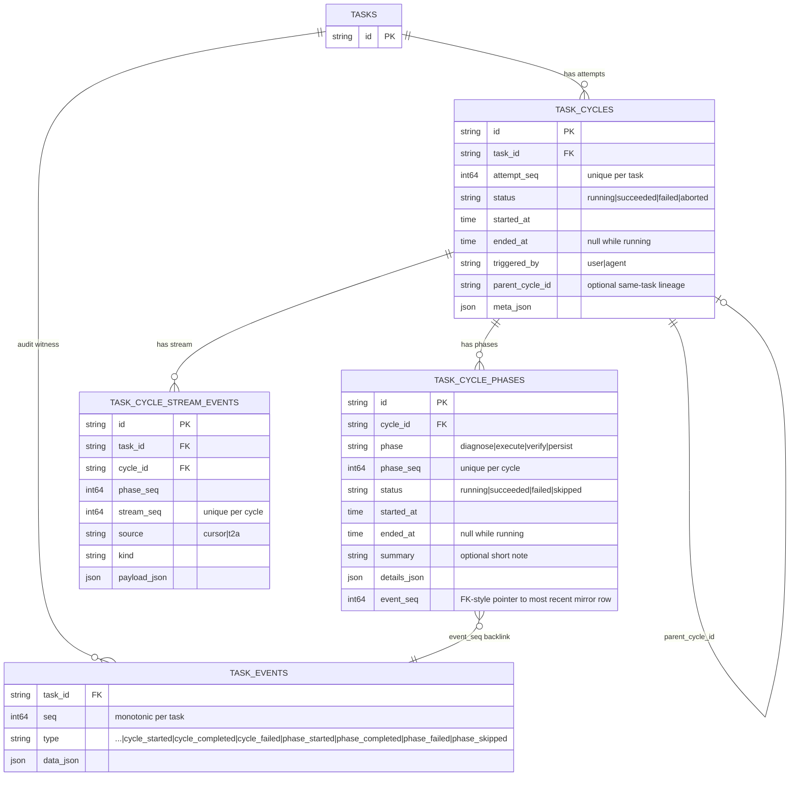
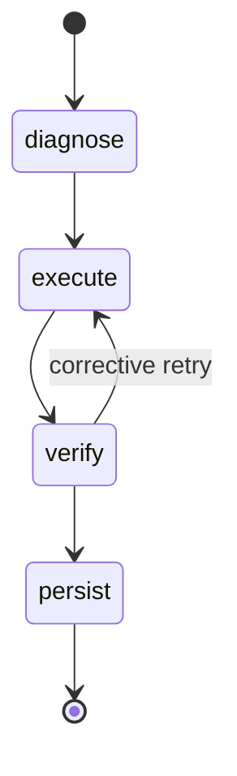

# Execution cycles

Authoritative design for the **diagnose → execute → verify → persist** loop as a first-class store primitive (`task_cycles`, `task_cycle_phases`) and how it stays consistent with the flat `task_events` audit log. Architecture hub: [DESIGN.md](./DESIGN.md). REST surface: [API-HTTP.md](./API-HTTP.md). SSE: [API-SSE.md](./API-SSE.md). Forward-looking design proposals (e.g. promoting `verify` to a substantive phase): [`proposals/`](./proposals/).

## Cycles vs phases in one minute

Think of the data model as:

```text
Task -> many cycles (attempts) -> many phases (steps inside an attempt)
```

A **cycle** is one execution attempt for a task. It answers: "is this task being attempted right now?", "which attempt number is this?", and "did the attempt succeed, fail, or abort?" Cycles live in `task_cycles` and are ordered per task by `attempt_seq`.

A **phase** is one step inside a cycle. It answers: "what part of the attempt is running or completed?" Phases live in `task_cycle_phases` and are ordered per cycle by `phase_seq`.

The intended phase path is `diagnose -> execute -> verify -> persist`, with `verify -> execute` allowed for corrective work. A cycle may therefore contain repeated phase kinds, such as `diagnose -> execute -> verify -> execute -> verify -> persist`; each visit is a separate row with a higher `phase_seq`.

Use cycles/phases for structured execution state. Use `task_events` for the full audit timeline. Every cycle/phase mutation mirrors into `task_events` in the same SQL transaction, so the two views stay consistent.

## Why this primitive exists

[`moat.md`](../moat.md) describes the work T2A is best at as a tight, observable execution loop: diagnose what the agent should attempt, execute the change, verify the result, then persist it. Until Stage 1 the only place that loop existed was the prose in `moat.md` and ad-hoc rows in `task_events`. The new tables move it into the data model so:

- workers can answer "is this task running right now?" with one indexed lookup (`task_cycles.status='running'`) instead of scanning the audit stream;
- a single attempt's worth of work is one row with a stable id (`task_cycles.id`) that artifacts, summaries, and SSE invalidations can hang off;
- the diagnose / execute / verify / persist phases are typed and ordered, so UIs and dashboards stop pattern-matching on free-form `task_events.type` strings to render "what stage are we in?";
- retries and corrective work get an explicit attempt counter (`attempt_seq`) and a transition graph (`domain.ValidPhaseTransition`) instead of an implicit convention.

The flat `task_events` log stays the single source of truth for **observability**: every cycle and phase mutation is mirrored into it inside the same SQL transaction. Nothing reads cycles instead of events for audit; nothing reads events instead of cycles for state. See **Where reads go** below.

## Schema

Two tables, owned by `pkgs/tasks/store` and registered in `pkgs/tasks/postgres/postgres.go::Migrate` alongside `task_events`. GORM tags pin the columns; the same `AutoMigrate` runs on Postgres in production and SQLite in tests (see [PERSISTENCE.md](./PERSISTENCE.md)).



**Key invariants enforced by the store** (see `pkgs/tasks/store/store_cycles.go` / `store_cycle_phases.go`):

- `(task_id, attempt_seq)` is unique on `task_cycles`; the store assigns `attempt_seq = max + 1` per task inside the same transaction that inserts the row. `attempt_seq` is a positive integer (CHECK constraint).
- `(cycle_id, phase_seq)` is unique on `task_cycle_phases`; same `max + 1` rule per cycle.
- `status` columns are CHECK-constrained to the documented enum values and indexed.
- `task_cycles.task_id` and `task_cycle_phases.cycle_id` are FK with `ON DELETE CASCADE`, so deleting a task removes its cycles and phases atomically.
- `task_cycle_stream_events` is append-only per cycle. `(cycle_id, stream_seq)` is unique, `stream_seq` is assigned by the store, and task/cycle FKs cascade with their parent rows.
- `parent_cycle_id` is optional. When set, the store rejects cross-task lineage (`ErrInvalidInput: parent_cycle_id does not belong to this task`).
- `meta_json` and `details_json` are stored as Postgres `jsonb` (`text` on SQLite) and default to `{}`; the store normalizes nil/empty input to that canonical zero value so the column never carries SQL `NULL` or an empty string.
- `task_cycle_phases.event_seq` is a soft pointer to the **most recent** mirror row in `task_events` for that phase. It is filled by the store, not by the caller. See **Dual-write invariant**.

`task_cycles` does **not** carry an `event_seq` backlink. Cycle audit rows are easily reconstructed from `(task_id, type IN ('cycle_started', 'cycle_completed', 'cycle_failed') AND data_json->>'cycle_id' = ?)`. Phases benefit more from a one-shot pointer because they have multiple transitions per row. A future read path can promote it without digging.

## State machine

`domain.ValidPhaseTransition(prev, next)` (see `pkgs/tasks/domain/cycle_state.go`) defines the legal phase graph **inside** one cycle. The previous phase is the highest-`phase_seq` row already on the cycle; an empty `prev` means "no prior phase" (cycle just started).



Two notes the diagram cannot show:

1. **Re-entry is allowed.** A cycle may walk `diagnose → execute → verify → execute → verify → persist`; each visit becomes its own `task_cycle_phases` row with a higher `phase_seq`. The state machine constrains the transition graph, not the visit count.
2. **`persist` is terminal *within the cycle*, not for the cycle row itself.** Reaching `persist` does not move `task_cycles.status` to `succeeded`; the caller still has to call `TerminateCycle(..., CycleStatusSucceeded, ...)` when it is satisfied that the persist phase landed. This separation is deliberate so workers can coordinate "the persist write succeeded but I want to record one extra verify before declaring victory" without lying to the audit log.

`CycleStatus` and `PhaseStatus` terminal sets are pinned by `domain.TerminalCycleStatus` / `domain.TerminalPhaseStatus`. Once a row is terminal it is read-only; corrective work creates a new row with a higher `attempt_seq` (cycles) or `phase_seq` (phases). Terminal rows reject further mutations with `ErrInvalidInput: cycle already terminal` / `phase already terminal`.

## Dual-write invariant

Every cycle/phase mutation appends a mirror row to `task_events` **inside the same `gorm.DB` transaction** as the cycle/phase write. If the mirror append fails, the cycle/phase row is rolled back. This is enforced by:

- `pkgs/tasks/store/store_cycles_dualwrite_test.go` — table-driven across every store entrypoint, asserts the mirror payload shape, the actor mirroring, the `event_seq` backfill, monotonic `task_events.seq` across mixed operations, and a forced-failure case that proves the cycle insert is rolled back when the mirror append fails.
- `pkgs/tasks/handler/handler_http_cycles_test.go::TestHTTP_cycle_routes_appendMirrorEvents_into_audit_log` — re-asserts the same invariant from the HTTP layer so handler refactors cannot bypass the mirror.

| Store entrypoint | Cycle/phase write | Mirror `task_events.type` | Mirror payload (top-level keys) |
| ---------------- | ----------------- | ------------------------- | ------------------------------- |
| `StartCycle`     | insert `task_cycles` (`status=running`) | `cycle_started` | `cycle_id`, `attempt_seq`, `triggered_by`, optional `parent_cycle_id` |
| `TerminateCycle` (`succeeded`) | update `task_cycles` to terminal | `cycle_completed` | `cycle_id`, `attempt_seq`, `status`, optional `reason` |
| `TerminateCycle` (`failed`/`aborted`) | update `task_cycles` to terminal | `cycle_failed` (status preserved in payload) | `cycle_id`, `attempt_seq`, `status`, optional `reason` |
| `StartPhase`     | insert `task_cycle_phases` (`status=running`) | `phase_started` | `cycle_id`, `phase`, `phase_seq` |
| `CompletePhase` (`succeeded`) | update phase to terminal | `phase_completed` | `cycle_id`, `phase`, `phase_seq`, `status`, optional `summary` |
| `CompletePhase` (`failed`)    | update phase to terminal | `phase_failed`    | same |
| `CompletePhase` (`skipped`)   | update phase to terminal | `phase_skipped`   | same |

Two consequences worth pinning:

- **`event_seq` backfill.** `StartPhase` and `CompletePhase` capture the assigned `task_events.seq` and write it back into the phase row's `event_seq` column inside the same transaction. The pointer is one-shot: `CompletePhase` overwrites the `StartPhase` value with the terminal mirror seq.
- **The seven mirror types are not interactive.** They are deliberately excluded from `domain.EventTypeAcceptsUserResponse` (see `pkgs/tasks/domain/event_user_response.go`); attempting `PATCH /tasks/{id}/events/{seq}` on a mirror row returns `400` because cycle/phase rows are the system of record for those transitions, not the audit row. The dual-write test asserts this so future drift fails CI.

## Cycle metadata (`meta_json` / `cycle_meta`)

`task_cycles.meta_json` is the adapter-facing sidecar for a cycle — free-form JSON the worker writes at `StartCycle` and never touches afterwards. The store treats the column as opaque bytes; the shape is a **runner contract**, not a database contract.

The agent worker (`pkgs/agents/worker/meta.go::buildCycleMeta`) writes a stable five-key payload for every cycle it starts, regardless of runner:

```json
{
  "runner": "cursor",
  "runner_version": "2.x.y",
  "cursor_model": "",
  "cursor_model_effective": "opus-4",
  "prompt_hash": "sha256:abc123…"
}
```

| Key | Meaning | Empty-string semantics |
|---|---|---|
| `runner` | `runner.Runner.Name()` at cycle start (e.g. `"cursor"`). | Pre-feature cycle — renders as "unknown runner" in the SPA. |
| `runner_version` | `runner.Runner.Version()` at cycle start. | Pre-feature cycle or runner does not advertise a version. |
| `cursor_model` | Operator intent. Verbatim `tasks.cursor_model` at `StartCycle`. | Operator did not pin a model; the runner's default applies. |
| `cursor_model_effective` | Resolved model the runner will actually execute against — `runner.Runner.EffectiveModel(req)`. This is the audit truth: chip copy, Prometheus `model` label, and `/tasks/stats` breakdown all read this key. | No model configured anywhere — renders as "default model" and buckets as `""` in `/tasks/stats`. |
| `prompt_hash` | `sha256` of the prompt string handed to the runner. Used for correlation across retries. | Never empty for cycles the worker starts. |

The API layer exposes the same keys under a typed projection (`cycle_meta`) on `/tasks/{id}/cycles[/{cycleId}]` so the SPA never has to re-parse the raw JSON. See [API-HTTP.md](./API-HTTP.md).

**Invariants**

- Keys are additive only. A future runner may include additional keys; consumers MUST ignore unknown keys.
- Values are always strings. Empty strings are the intentional "no value" encoding; `null` / omission is equivalent but the worker always emits the empty string.
- The pair (`cursor_model`, `cursor_model_effective`) can diverge whenever the operator left the task's model unset and the runner fell through to its default. That divergence is the point — it lets the breakdown panel attribute outcomes to the *resolved* model rather than the operator's intent.
- Pre-feature cycles (before the V2 keys shipped) carry only `{runner, runner_version, prompt_hash}`. The SPA and the stats aggregator both treat missing keys as empty strings; no migration is needed.

## Where reads go

| Question | Read from | Why not the other side |
| -------- | --------- | ---------------------- |
| What's the current attempt for this task? | `task_cycles` (`status=running`, latest `attempt_seq`). | The audit stream answers "what happened" not "what is true now"; scanning it for the latest `cycle_started` without a matching `cycle_completed`/`cycle_failed` is more expensive and racier. |
| List all attempts for this task. | `GET /tasks/{id}/cycles` → `ListCyclesForTask` (ordered `attempt_seq DESC`). | Same reason: the cycle row is the typed, indexed record. |
| What phase is the current cycle in? | `GET /tasks/{id}/cycles/{cycleId}` (`phases[]` ordered `phase_seq ASC`). | `task_events` does not encode "currently running phase" except by absence of a terminating mirror row; the cycle row is the source of truth. |
| Audit history (everything that happened, in order). | `GET /tasks/{id}/events`. | Cycles and phases each only carry the **most recent** transition state in their own row; reconstructing the full history requires the audit log. |
| Cursor live-update history for one attempt. | `GET /tasks/{id}/cycles/{cycleId}/stream`. | Cursor stream events can be high-volume and tool-shaped, so they live outside the human-scale `task_events` timeline. |
| Which audit row recorded a phase's most recent transition? | `task_cycle_phases.event_seq` (foreign-key style pointer to `task_events.seq`). | One-shot pointer beats `data_json->>'phase_id'` scans. |
| Did anything change for this cycle (live UI hint)? | `GET /events` SSE → `task_cycle_changed` (carries `id`=task, `cycle_id`=cycle). | SSE is a fan-out hint; clients still call REST for full bodies. See [API-SSE.md](./API-SSE.md). |

## Concurrency rules

The store enforces the following invariants inside the same transaction as the row write so they are race-safe across handlers:

- **At most one running cycle per task.** `assertNoRunningCycleForTaskTx` rejects `StartCycle` with `ErrInvalidInput: task already has a running cycle`. Recovery path is `Idempotency-Key` on `POST /tasks/{id}/cycles` (the global handler middleware already replays the original 201 for the same key); a deliberately new attempt requires `TerminateCycle` first.
- **At most one running phase per cycle.** `assertNoRunningPhaseForCycleTx` rejects `StartPhase` with `ErrInvalidInput: cycle already has a running phase`. Pattern: complete the running phase before starting the next one (or skip it).
- **Terminal rows are read-only.** `TerminateCycle` / `CompletePhase` reject re-termination with `ErrInvalidInput: cycle already terminal` / `phase already terminal`.
- **Phase transitions follow `ValidPhaseTransition`.** Invalid transitions surface as `ErrInvalidInput: phase transition "<prev>" -> "<next>" not allowed`.
- **Cross-task lineage is rejected.** Both `StartCycle` (`parent_cycle_id`) and the handler's `assertCycleBelongsToTask` preflight return `ErrInvalidInput` / `404` when a cycle id from one task is referenced under another task. The store does not let a `parent_cycle_id` straddle tasks; the handler defends `cycleId` URL segments belonging to a different `taskId` because `task_cycles.id` is unique on its own.

The "at most one running" guards are implemented as in-TX `SELECT ... LIMIT 1` checks rather than partial unique indexes because GORM `AutoMigrate` does not drive Postgres-only `CREATE UNIQUE INDEX ... WHERE status = 'running'` migrations. A future Postgres-only post-migration hook can add the partial unique index as a belt-and-braces backup; the in-TX guard stays for SQLite test parity.

## HTTP and SSE surface

REST routes, request/response shapes, idempotency, and `400` strings are pinned in [API-HTTP.md](./API-HTTP.md) under **Task execution cycles (`/tasks/{id}/cycles`)**. SSE notifications (`task_cycle_changed`) are pinned in [API-SSE.md](./API-SSE.md). Two cross-cutting points worth restating here:

- The handler ignores any `triggered_by` field in the request body and always derives the actor from `X-Actor` (default `user`), matching the rest of `taskapi`. The `triggered_by` column on `task_cycles` is set by the store from that header, not by the body, so request shape and stored state cannot drift.
- `GET /tasks/{id}/cycles` ships with limit-based pagination (`?limit=` + `has_more` envelope). The `/events` keyset cursor pattern is a deliberate followup; the store does not yet expose a cursor for `task_cycles`.

## What's intentionally out (today)

- **`task_cycle_artifacts` table.** Artifacts (test logs, diff bundles, screenshots) live in `task_cycle_phases.details_json` until a UI demands a browser. Promoting them to a typed table is a future slice once worker output volume justifies it.
- **Cross-cycle dependencies.** No "cycle B depends on cycle A" graph; this matters once multiple workers cooperate on the same task. The current `parent_cycle_id` covers same-task lineage (e.g. a corrective sub-attempt) and nothing else.
- **Retry / backoff policy.** A worker-side concern, not a data-model concern. The substrate only records what happened; deciding whether to start another `StartCycle` is the worker's job.
- **Visual cycle Gantt / dependency graph.** The current UI surfaces cycle activity through `TaskUpdatesTimeline` (mirror events) plus `useTaskCycles` / `useTaskCycle` data hooks; a dedicated cycles panel is a list with phase rollups, not a chart, and remains an open design opportunity for [`proposals/`](./proposals/).
- **Versioned migrations for the new tables.** They are picked up by the same `AutoMigrate` call as the rest of the schema; a global migration overhaul (Goose, Atlas, …) is a separate `docs/PERSISTENCE.md` decision.

## Related

- [moat.md](../moat.md) — the prose origin of the diagnose → execute → verify → persist loop.
- [`proposals/`](./proposals/) — forward-looking design work for the cycles surface (e.g. substantive `verify` / `persist` phases, cycles UI panel).
- [API-HTTP.md](./API-HTTP.md) — REST contract for `/tasks/{id}/cycles…`.
- [API-SSE.md](./API-SSE.md) — `task_cycle_changed` payload and trigger surface.
- [PERSISTENCE.md](./PERSISTENCE.md) — store, `task_events`, AutoMigrate scope.
- [DESIGN.md](./DESIGN.md) — architecture hub and limitations.
- [AGENT-QUEUE.md](./AGENT-QUEUE.md) — ready-task queue that V1 agent workers will read before driving cycles.
- [AGENTIC-LAYER-PLAN.md](./AGENTIC-LAYER-PLAN.md) — Cursor CLI worker rollout that consumes this substrate.
