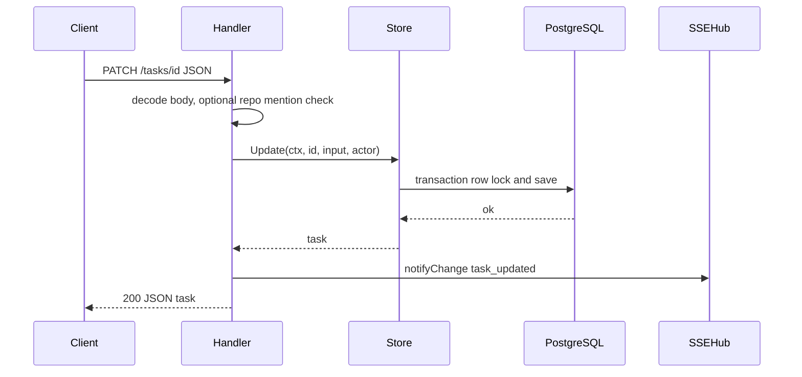

# Extensibility (tasks stack)

Use a vertical slice so new behavior stays testable and reviewable:

1. `domain` — Add or adjust types, enums, and validation; no database or HTTP imports.
2. `store` — Add use-case methods (clear inputs, transactions, audit rows as needed). Map errors to `domain.ErrNotFound` and `domain.ErrInvalidInput` only; do not log inside the store.
3. `handler` — Decode and validate HTTP bodies, call the store, translate errors to status codes, then call `notifyChange` after successful writes so SSE subscribers refetch. Keep business rules out of the handler when they belong in store or domain.
4. Optional `web/` — Extend `web/src/types/` and `web/src/api/` (`parseTaskApi` and related parsers); then UI under `web/src/tasks/`. Do not add raw `fetch` calls in components for task APIs.

Mutating task request (happy path):

Changing JSON shapes, routes, or SSE payload types requires updating **[API-HTTP.md](./API-HTTP.md)** and **[API-SSE.md](./API-SSE.md)** (and the [DESIGN.md](./DESIGN.md) hub if limitations or strategy change) and the client parsers in lockstep. Rule pointers: `.cursor/rules/13-tasks-stack-extensibility.mdc` (tasks stack); workspace repo (`app_settings.repo_root`, `/repo/*`, `pkgs/repo`) — `.cursor/rules/14-repo-workspace-extensibility.mdc`; GORM models / AutoMigrate / SQLite test schema — `.cursor/rules/15-database-schema.mdc`.
