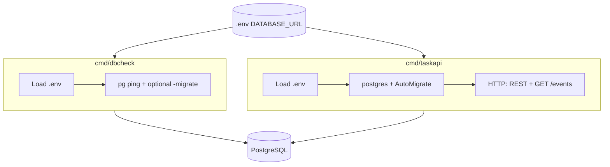
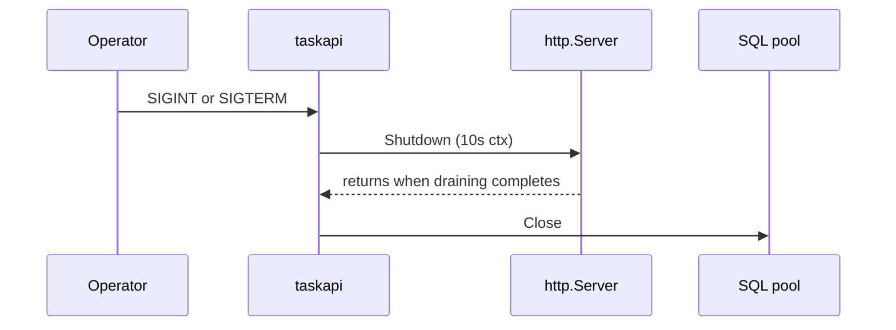

# taskapi — runtime, startup, and environment

Binaries, startup sequence, graceful shutdown, HTTP timeout constants, and **environment variables** for `taskapi` and `dbcheck`. REST and SSE contracts live in [API-HTTP.md](./API-HTTP.md) and [API-SSE.md](./API-SSE.md). Architecture hub: [DESIGN.md](./DESIGN.md).

**Implementation:** `taskapi`-only parsing for listen host, JSON log level / minimized logging, agent queue/reconcile interval, and dev SSE ticker interval is in [`internal/taskapiconfig`](../internal/taskapiconfig) (`go doc`). The **`With*`** middleware stack around `handler.NewHandler` is composed in [`pkgs/tasks/middleware`](../pkgs/tasks/middleware) (`Stack` in `stack.go`) and applied from [`internal/taskapi`](../internal/taskapi) (`NewHTTPHandler`, passing `calltrace.Path` for access logs). Rate limits, idempotency caps, and other HTTP knobs are read from env inside `pkgs/tasks/middleware` when those middlewares initialize.

## Binaries (`cmd`)

`dbcheck` runs once: connectivity check, optional migrate, then exit. `taskapi` is the long-lived HTTP server; the SSE hub exists only inside that process.

Environment loading: `taskapi` uses `internal/envload.Load`. `dbcheck` does not import that package but follows the same rules: walk from `cwd` to find `go.mod`, default `<repo-root>/.env` or `-env`, `godotenv.Overload`, and a non-empty `DATABASE_URL`. `dbcheck` uses **`postgres.DefaultPingTimeout`** (**30s**) around **`PingContext`** only. With **`-migrate`**, **`postgres.Migrate`** runs under a separate **120s** deadline (**`postgres.DefaultMigrateTimeout`**, same as **`taskapi`** startup migrate). The **`dbcheck.start`** line includes **`ping_timeout_sec`** and, when **`-migrate`** is set, **`migrate_timeout_sec`**. `taskapi` has no analogous startup ping beyond `gorm.Open`, but **`postgres.Migrate`** uses that same default bound; **`migrate ok`** and **`migrate failed`** log **`timeout_sec`** (**`120`**), and **`migrate failed`** includes **`deadline_exceeded`** when that bound is hit.

## Startup flow (`taskapi`)

1. **Logging** — The resolved `.env` file (same rules as `envload.Load`: repo-root `.env` or `-env`) is **overlaid into the process environment first** when it exists, so **`T2A_LOG_DIR`**, **`T2A_LOG_LEVEL`**, and **`T2A_DISABLE_LOGGING`** in `.env` apply before the log file is opened. Full `envload.Load` (including `DATABASE_URL` validation) still runs afterward. If **`-disable-logging`** is set or **`T2A_DISABLE_LOGGING`** is truthy (`1`, `true`, `yes`, `on`, case-insensitive), **no** JSON log file is created; **`slog`** uses a **text** handler on **stderr** at **`Error`** only (no access lines, GORM SQL logs, or `Info` startup lines). Otherwise: create the log directory (`-logdir`, else `T2A_LOG_DIR`, else `./logs` under the process working directory), then open a new file `taskapi-YYYY-MM-DD-HHMMSS-<nanos>.jsonl` (local time). `slog` output is JSON, one object per line, written only to that file. **Minimum level** is controlled by `-loglevel` (if set) else `T2A_LOG_LEVEL`, else **`info`** (records `Info`, `Warn`, and `Error`; omits `Debug` trace noise—lighter default for production). Set **`debug`** for full trace lines (including `taskapi.openTaskAPILogFile` bootstrap, handler/helper `http.io` / `helper.io`, domain trace hooks, and SSE fanout at `Debug`). **`warn`** or **`error`** further reduce volume. After `slog.SetDefault`, the handler wraps the base `slog` handler so records emitted with an HTTP request context get a `request_id` field (from `X-Request-ID` or a generated UUID), correlating access logs, API error lines, and GORM SQL traces for the same request when JSON file logging is enabled. **stderr** notes either minimized mode or the absolute log path and effective minimum level.
2. `envload.Load` — resolve `.env` (repo root or `-env`), load with `godotenv.Overload`, require `DATABASE_URL`.
3. `postgres.Open` — GORM connection to Postgres; rejects empty/whitespace DSN; configures the underlying `database/sql` pool (max open/idle, connection lifetime). No startup `Ping` (unlike `dbcheck`).
4. `postgres.Migrate` — `AutoMigrate` for `domain.Task` and `domain.TaskEvent` on every startup (keeps schema aligned with models), under **`postgres.DefaultMigrateTimeout`** (currently **120s**) so startup cannot hang indefinitely on a stuck database.
5. `store.NewStore`, **`(*store.Store).SetReadyTaskNotifier`** to the in-process agent queue (defaults in env table), `handler.NewSSEHub`, optional `repo.OpenRoot(REPO_ROOT)` when the env var is non-empty, then `internal/taskapi.NewHTTPHandler` → `middleware.Stack(handler.NewHandler(store, hub, rep), calltrace.Path)` — `rep` may be nil when `REPO_ROOT` is unset (no repo routes beyond 503). A background **`agents.RunReconcileLoop`** goroutine reconciles **all ready** tasks from the database against the in-memory pending set. `middleware.Stack` adds recovery, metrics, access logging, rate limiting, optional auth, timeouts, body cap, and idempotency (see [`pkgs/tasks/handler/README.md`](../pkgs/tasks/handler/README.md)).
6. `http.Server` on `-port` (default 8080): `ReadHeaderTimeout` and `ReadTimeout` bound slow clients; `IdleTimeout` caps idle keep-alive; `MaxHeaderBytes` caps request headers (~1 MiB). `WriteTimeout` is not set so long-lived `GET /events` streams are not cut off.

### Graceful shutdown

On SIGINT / SIGTERM, `taskapi` calls `http.Server.Shutdown` with a 10s deadline, then `Close` on the SQL pool, then syncs and closes the log file if one was opened. If GORM cannot expose the underlying `*sql.DB` for close, or `Close` returns an error, the process exits **1** after logging (`database close skipped` / `database close`); otherwise shutdown ends with exit **0**.

### Timeout constants (code)

| Area | Where defined | Purpose |
| ---- | ------------- | ------- |
| HTTP server | `cmd/taskapi/main.go` (`shutdownTimeout`, `readHeaderTimeout`, `readTimeout`, `idleTimeout`, `maxRequestHeaders`) | `Server.Shutdown` deadline (10s), slowloris / slow-body bounds, idle keep-alive cap, header size cap. Logged on **`taskapi.http_limits`**. `WriteTimeout` is intentionally unset (SSE). |
| DB ping (CLI) | `postgres.DefaultPingTimeout` | `dbcheck` **`PingContext`** only (30s). |
| AutoMigrate | `postgres.DefaultMigrateTimeout` | `taskapi` startup migrate and `dbcheck -migrate` (120s). |
| Readiness DB probe | `store.DefaultReadyTimeout` | `GET /health/ready` → `(*Store).Ready` (2s). |

## Environment variables (`taskapi`)

| Variable       | Required                   | Purpose                                                                                                                                                                                                                                                                                                                                      |
| -------------- | -------------------------- | -------------------------------------------------------------------------------------------------------------------------------------------------------------------------------------------------------------------------------------------------------------------------------------------------------------------------------------------- |
| `DATABASE_URL` | Yes (after `envload.Load`) | Postgres connection string for GORM.                                                                                                                                                                                                                                                                                                         |
| `T2A_LISTEN_HOST` | No | HTTP bind host/IP for `taskapi`. Default when unset: **`127.0.0.1`** (local-only). Set **`0.0.0.0`** (or another explicit interface) to accept remote connections. `-host` flag overrides this env var. |
| `T2A_API_TOKEN` | No | When non-empty, enables bearer-token auth for API routes. Clients must send `Authorization: Bearer <token>` for non-exempt routes; exempt: `GET /health`, `/health/live`, `/health/ready`, and `/metrics`. |
| `T2A_HTTP_REQUEST_TIMEOUT` | No | Request execution timeout (Go duration) applied to non-SSE API routes via context deadline. Default when unset: **30s**. Invalid/negative values fall back to **30s**. **`0`** disables request-timeout middleware. `GET /events` is exempt. |
| `REPO_ROOT`    | No                         | Absolute path to a directory on the machine running `taskapi`. When non-empty and valid, enables [`/repo` routes](./API-HTTP.md#optional-workspace-repo-repo_root) and validates `initial_prompt` `@` file mentions on `POST /tasks` and `PATCH /tasks/{id}`. When empty, repo routes respond with 503 JSON and prompts are not validated for mentions. |
| `T2A_LOG_DIR`  | No                         | Default directory for `taskapi` JSON log files when `-logdir` is not set. If both are empty, `./logs` (relative to the process working directory) is used.                                                                                                                                                                                                                                                |
| `T2A_LOG_LEVEL` | No                        | Minimum `slog` level for the JSON log file: `debug`, `info`, `warn`, `error` (case-insensitive; `warning` accepted for `warn`). Ignored when `-loglevel` is set. Default when unset: `info`. No effect when logging is minimized (see `T2A_DISABLE_LOGGING`).                                                                                                                                                |
| `T2A_DISABLE_LOGGING` | No                  | When `1`, `true`, `yes`, or `on` (case-insensitive): no JSONL file; only `slog.Error` to stderr. Same as `-disable-logging`. Overrides file logging and `-logdir` / `T2A_LOG_DIR`.                                                                                                                                                                                                                          |
| `T2A_GORM_SLOW_QUERY_MS` | No               | GORM SQL trace: statements slower than this many milliseconds log at **Warn** (default **200**). Set to **0** to disable the slow-SQL branch (successful queries stay at Info when the GORM log level is Info). Invalid or negative values fall back to **200**.                                                                                                                                                                                                              |
| `T2A_RATE_LIMIT_PER_MIN` | No               | Per-client-IP HTTP rate limit (token bucket, requests per minute). Default when unset: **120**. **`0`** disables limiting. Invalid or negative values fall back to **120**. Key is the host part of `RemoteAddr` only (forwarded headers are **not** trusted). Exempt: `GET /health`, `/health/live`, `/health/ready`, `/metrics` (defense in depth; `/metrics` is on the outer mux today). Over limit: **`429`** plain text `rate limit exceeded`, header **`Retry-After: 60`**. |
| `T2A_IDEMPOTENCY_TTL` | No | In-process idempotency cache for mutating requests that send **`Idempotency-Key`**. Go `time.ParseDuration` value (e.g. `24h`, `30m`). Default when unset: **24h**. Invalid or negative values fall back to **24h**. **`0`** disables caching (header ignored). Not shared across replicas. |
| `T2A_IDEMPOTENCY_MAX_ENTRIES` | No | Max in-process idempotency cache entries. Default when unset: **2048**. Invalid or negative values fall back to **2048**. **`0`** disables entry-count bounding. |
| `T2A_IDEMPOTENCY_MAX_BYTES` | No | Max in-process idempotency cache memory budget (stored response-body bytes). Default when unset: **8388608** (8 MiB). Invalid or negative values fall back to **8388608**. **`0`** disables byte-size bounding. |
| `T2A_MAX_REQUEST_BODY_BYTES` | No | Rejects request bodies larger than this many bytes with **`413`** JSON `{"error":"request body too large"}` (checks **`Content-Length`** when present, and **`http.MaxBytesReader`** so the stream cannot exceed the cap). Default when unset or invalid: **1 MiB** (`1048576`). Set **`0`** to disable the cap explicitly. |
| `T2A_USER_TASK_AGENT_QUEUE_CAP` | No | In-process **`pkgs/agents`** queue depth (bounded buffer). Default **256** when unset, zero, or invalid (invalid values log **Warn** and use the default). The store calls **`NotifyReadyTask`** after commits that leave a task **ready** (create or status transition). Not durable; not shared across `taskapi` processes. See [AGENT-QUEUE.md](./AGENT-QUEUE.md). |
| `T2A_USER_TASK_AGENT_RECONCILE_INTERVAL` | No | Background **`ReconcileReadyTasksNotQueued`** tick interval after the startup run. Default **`5m`** when unset or invalid (**Warn** on invalid). Set to **`0`** for startup-only reconcile (no periodic ticker). See [AGENT-QUEUE.md](./AGENT-QUEUE.md). |
| `T2A_AGENT_WORKER_ENABLED` | No | Opts the in-process Cursor CLI agent worker in. Truthy values: `1`, `true`, `yes`, `on` (case-insensitive). Default when unset or any other value: **disabled** — `taskapi` behaves exactly as before V1 (no probe, no orphan sweep, no dequeue). When enabled, startup verifies the cursor binary (`T2A_AGENT_WORKER_CURSOR_BIN`) and the working directory (`T2A_AGENT_WORKER_WORKING_DIR`); failures **exit 1**. See [AGENT-WORKER.md](./AGENT-WORKER.md). |
| `T2A_AGENT_WORKER_CURSOR_BIN` | No | Path to the Cursor CLI binary used by the runner adapter and the startup probe. Default when unset or blank: **`cursor`** (resolved against `PATH`). Absolute paths pin a specific build. Only consulted when `T2A_AGENT_WORKER_ENABLED` is truthy. See [AGENT-WORKER.md](./AGENT-WORKER.md). |
| `T2A_AGENT_WORKER_RUN_TIMEOUT` | No | Per-run wall-clock cap forwarded to `runner.Request.Timeout` and to the `context.WithTimeout` wrapping each `runner.Run`. Go duration string (e.g. `5m`, `30s`). Default when unset, invalid, zero, or negative: **`5m`** (**Warn** on invalid). Only consulted when the worker is enabled. See [AGENT-WORKER.md](./AGENT-WORKER.md). |
| `T2A_AGENT_WORKER_WORKING_DIR` | No | Working directory passed to `runner.Request.WorkingDir`. Default when unset or blank: **`REPO_ROOT`** if set, else the process working directory. Validated at startup; non-existent or non-directory paths exit 1 with `agent worker working dir not usable`. Only consulted when the worker is enabled. See [AGENT-WORKER.md](./AGENT-WORKER.md). |

`dbcheck` uses the same `.env` discovery for `DATABASE_URL` only; it does not use `REPO_ROOT`.

## Related

- [OBSERVABILITY.md](./OBSERVABILITY.md) — structured logs, `http.access`, metrics.
- [API-SSE.md](./API-SSE.md) — dev-only `T2A_SSE_TEST` env vars (also summarized there).
