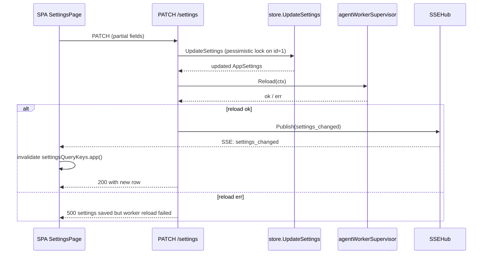

# App settings (UI-driven config)

Authoritative reference for the singleton **`app_settings`** row that drives the in-process [agent worker](./AGENT-WORKER.md), the workspace repo (`/repo/*`, `@`-mention autocomplete), and the SPA Settings page. This row replaces the historical `T2A_AGENT_WORKER_*` and `REPO_ROOT` environment variables — env vars are no longer read at runtime for these knobs and the row is the only source of truth ("saved until changed").

## Where to change settings

- **SPA Settings page** — gear icon in the header → `/settings`. Renders [`web/src/settings/SettingsPage.tsx`](../web/src/settings/SettingsPage.tsx) on top of [`useAppSettings`](../web/src/settings/useAppSettings.ts).
- **HTTP API** — `GET /settings`, `PATCH /settings`, `POST /settings/probe-cursor`, `POST /settings/list-cursor-models`, `POST /settings/cancel-current-run` (see [API-HTTP.md](./API-HTTP.md#app-settings) and [API-SSE.md](./API-SSE.md) for the `settings_changed` / `agent_run_cancelled` SSE events).
- **DB row** — table `app_settings`, primary key `id = 1` (CHECK enforces singleton). Authored by `pkgs/tasks/store` via `GetSettings` / `UpdateSettings`. AutoMigrate creates the table; first read seeds it with `domain.DefaultAppSettings`.

There is no env-var fallback. If you want to bake a default into a fresh deployment, do it through `PATCH /settings` (e.g. as part of provisioning) rather than environment variables.

## Field reference

All fields live in [`pkgs/tasks/domain/app_settings.go`](../pkgs/tasks/domain/app_settings.go) (`domain.AppSettings`) and are exposed verbatim on the wire via [`pkgs/tasks/handler/handler_settings.go`](../pkgs/tasks/handler/handler_settings.go).

| Field | Type | Default (first boot) | Effect |
|-------|------|----------------------|--------|
| `worker_enabled` | bool | `true` | Master switch for the in-process agent worker. When `false` the supervisor stays idle (queue + reconcile loop still run). Idle reason: `disabled_by_settings`. |
| `agent_paused` | bool | `false` | Operator-facing soft pause, distinct from `worker_enabled` in intent. Use it when you want to stop the worker dequeuing for a few minutes (e.g. before a deploy) without flipping the master switch. The SPA header chip exposes this as a one-click toggle. Idle reason: `paused_by_operator`. Surfaces under `agent.paused` in `GET /system/health`. |
| `runner` | string | `"cursor"` | Identifier from [`pkgs/agents/runner/registry`](../pkgs/agents/runner/registry). Currently only `cursor` is registered; a future runner lands as one new file in that package. |
| `repo_root` | string | `""` | Absolute (or process-relative) path to the workspace the worker and `/repo/*` operate against. **Empty means "not configured"**: the supervisor stays idle, repo endpoints respond `409 repo_root_not_configured`, and `@`-mention validation is skipped on `POST /tasks` / `PATCH /tasks/{id}`. |
| `cursor_bin` | string | `""` | Cursor CLI binary path. Empty means "auto-detect from PATH" (`cursor`). Absolute paths pin a specific build; relative names go through `PATH` lookup. The supervisor and `POST /settings/probe-cursor` both invoke `cursor.Probe(<cursor_bin>, --version)` for the runner version recorded in the audit trail. |
| `cursor_model` | string | `""` | Optional Cursor model forwarded to the runner. Empty means omit the model flag so Cursor uses the account/default model. |
| `max_run_duration_seconds` | int (≥ 0) | `0` (no limit) | Per-run wall-clock cap forwarded to `runner.Request.Timeout`. `0` means "no limit" — `runner.Run` is not wrapped with a timeout and only ends on completion, operator cancel, or process shutdown. Positive values are honoured exactly; negatives are rejected by the DB CHECK. |
| `agent_pickup_delay_seconds` | int (≥ 0) | `5` | Delay applied to newly-created ready tasks before the worker can dequeue them. `0` disables the delay. |
| `display_timezone` | string | `""` | IANA timezone used by the SPA to render operator-facing timestamps. Empty means auto-detect from the browser. Non-empty values are validated with `time.LoadLocation`. |
| `optimistic_mutations_enabled` | bool | `true` | Compatibility field retained on the wire and in the DB. Optimistic mutations are always enabled for new rows and no longer configurable in Settings. |
| `sse_replay_enabled` | bool | `true` | Compatibility field retained on the wire and in the DB. Lossless SSE replay is always active in `/events`; older rows are migrated to true on read. |
| `updated_at` | RFC3339 string (response only) | server clock | Stamp of the last successful upsert. The SPA renders "last changed N ago" off this field; not accepted on `PATCH`. |

## HTTP surface

See [API-HTTP.md](./API-HTTP.md#app-settings) for the canonical JSON shapes. Quick map:

- **`GET /settings`** → `200` with the full row (defaults seeded on first call). Always available — does not require the agent worker to be running.
- **`PATCH /settings`** → `200` with the updated row. Body is partial; pointer fields distinguish "not provided" from explicit zeros (e.g. `max_run_duration_seconds: 0` ⇒ "no limit" vs. omitted ⇒ leave the previous value untouched). Empty body returns `400 patch body must include at least one field`. On success, the supervisor `Reload`s in-process and the hub publishes `settings_changed` (no id) so the SPA refetches without polling. Returns `503` when the supervisor is not wired (tests, dry-runs).
- **`POST /settings/probe-cursor`** → `200` with `{ ok, runner, version, error }`. Empty `runner` / `binary_path` fall back to the stored `app_settings.runner` / `cursor_bin`. Probe failures return `200 OK` with `ok: false` and the error in `error` so the SPA can render the message inline; only wiring/storage failures return non-2xx.
- **`POST /settings/list-cursor-models`** → `200` with `{ ok, runner, binary_path, models, error }`. Empty `runner` / `binary_path` fall back to the stored `app_settings.runner` / `cursor_bin`. Cursor CLI list failures return `200 OK` with `ok: false` and the error in `error`; unsupported runners return `400`.
- **`POST /settings/cancel-current-run`** → `200` with `{ cancelled }`. When `true`, the hub publishes `agent_run_cancelled` (no id) so the SPA flips its "Cancel current run" button back to idle without polling. The cancelled cycle is terminated with reason `cancelled_by_operator` (see [EXECUTION-CYCLES.md](./EXECUTION-CYCLES.md)).

## Lifecycle

The supervisor's `Reload` re-reads the row, decides whether to spawn / drain the worker, and probes the runner binary. Reload is idempotent: when no material field changed (worker still on, same runner / binary / repo root), the supervisor logs `agent worker supervisor reload skipped` and leaves the in-flight worker alone.

## Validation

`store.UpdateSettings` rejects the patch with `domain.ErrInvalidInput` (HTTP 400) when:

- `runner` is set to a non-empty string that is not registered in `pkgs/agents/runner/registry`.
- `max_run_duration_seconds` is negative.
- `repo_root` is set to a path that contains a NUL byte.

The DB CHECK constraints enforce the singleton id and the non-negative timeout; AutoMigrate keeps the schema aligned across SQLite (tests) and Postgres (production).

`repo_root` is **not** validated for "directory exists" on `PATCH` — operators set it before mounting the volume in some deployment flows, and the supervisor reports `repo_root_open_failed` on the next reload instead. The SPA banner picks that up via `GET /health/ready` (`workspace_repo: fail`).

## Migration from env vars

| Old env var | Replacement |
|-------------|-------------|
| `T2A_AGENT_WORKER_ENABLED` | `app_settings.worker_enabled` (default true). |
| `T2A_AGENT_WORKER_CURSOR_BIN` | `app_settings.cursor_bin` (empty ⇒ PATH lookup). |
| `T2A_AGENT_WORKER_RUN_TIMEOUT` | `app_settings.max_run_duration_seconds` (default `0` = no limit, no longer 5m). |
| `T2A_AGENT_WORKER_WORKING_DIR` | `app_settings.repo_root` (the worker no longer has a separate working-dir knob; the workspace repo is the working dir). |
| `REPO_ROOT` | `app_settings.repo_root`. |

Existing `.env` files referencing these variables are silently ignored. Remove them or leave them for documentation only.

## Test-only overrides

Real-cursor smoke tests (`pkgs/agents/runner/cursor/cursor_real_smoke_test.go`, `pkgs/tasks/agentreconcile/agent_real_cursor_e2e_test.go`) honour the test-only env var **`T2A_TEST_CURSOR_BIN`** to point at a specific binary path during the test run. This is unrelated to the production `app_settings.cursor_bin` field; it only controls test wiring.
