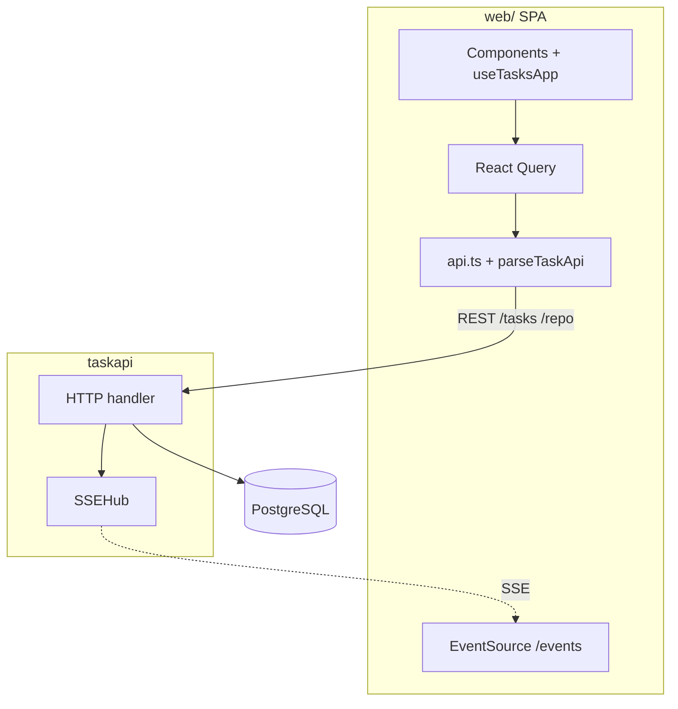
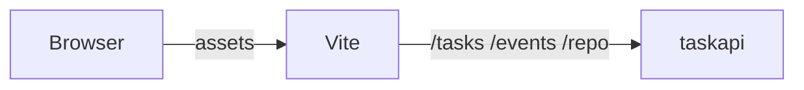
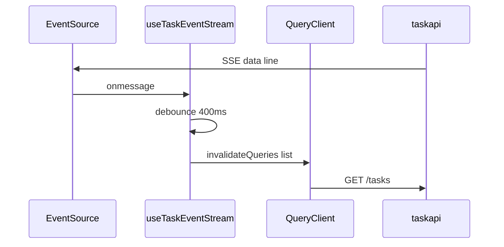

# Browser client (`web/`)

Canonical description of the optional **Vite + React + TypeScript** SPA. Server contracts (**`/tasks`**, **`/events`**, **`/repo`**) are in **`docs/DESIGN.md`**. **Where this doc sits in the tree:** **`docs/README.md`**.

## Scope

**Does:** CRUD UI for **`/tasks`**; **TanStack Query** for list + mutations; **`EventSource('/events')`** with **400ms** debounced **`invalidateQueries`**; **`parseTaskApi`** on JSON before use; **TipTap** rich prompt (bold, headings, lists, code) with **`initial_prompt`** stored as **HTML**; **`@`** file mentions via **`/repo`** when **`REPO_ROOT`** is set (see **DESIGN**). If **`REPO_ROOT`** is unset, typing **`@`** shows a hint that no repo is configured for search.

**Does not:** Auth; serving **`dist`** from **`taskapi`**; CORS in Go (use same origin or a gateway — **DESIGN**, limitations).

## Stack

Vite 5, React 18, TypeScript strict, TanStack Query (**`queryClient.ts`**), TipTap (**`RichPromptEditor`**), **`fetch`** only in **`api.ts`**, Vitest + Testing Library (**`fetch`** / **`EventSource`** mocked in tests).

## SPA in the system

SSE carries **`type` + `id`** only; rows come from **`GET /tasks`**.

## Dev vs production

**Dev:** browser → Vite → proxies **`/tasks`**, **`/events`**, **`/repo`** → **`taskapi`**. **`VITE_TASKAPI_ORIGIN`** in **`web/vite.config.ts`** picks the API target (default **`http://127.0.0.1:8080`**).

**Prod:** **`npm run build`** → **`web/dist/`**; serve so **`/tasks`**, **`/events`**, **`/repo`** match the API origin (or gateway).

**Mermaid (dev path):**

## React Query + SSE

- **Query key:** **`taskQueryKeys.list()`** → **`GET /tasks`** (limit 200 in **`api.ts`**).
- **Loading:** **`loading`** = no cached list yet; **`listRefreshing`** = background refetch (mutations, invalidation, focus, SSE); **`saving`** = mutation in flight (not background list fetch).
- **SSE:** each **`data:`** line schedules debounced invalidation → refetch list; **`parseTaskApi`** runs on the response.

## Module map (`web/src/`)

| Path | Role |
|------|------|
| **`main.tsx`** | **`QueryClientProvider`**. |
| **`App.tsx`** | **`useTasksApp`** + presentational components. |
| **`queryClient.ts`** | Defaults: stale time, **`gcTime`**, retries, **`refetchOnWindowFocus`**, dev **`QueryCache`/`MutationCache` `onError`**. |
| **`taskQueryKeys.ts`** | Stable keys (e.g. **`['tasks','list']`**). |
| **`api.ts`** | **`fetch`** for **`/tasks`** and **`/repo`**-related calls. |
| **`parseTaskApi.ts`** | **`parseTask`**, **`parseTaskListResponse`** from **`unknown`**. |
| **`types.ts`** | Types aligned with REST JSON. |
| **`hooks/useTasksApp.ts`** | Forms, dialogs, query + mutations. |
| **`hooks/useTaskEventStream.ts`** | **`EventSource`**, debounced invalidation. |
| **`components/`** | Forms, table, **`RichPromptEditor`** (TipTap), dialogs, **`ErrorBanner`**, **`StreamStatusHint`**, selects. |
| **`extensions/`** | **`repoFileSuggestion`** (`@` + **`/repo/search`**). |
| **`promptFormat.ts`** | HTML vs legacy plain text, preview stripping for the task table. |
| **`test/`** | Vitest setup, **`EventSource`** stub, **`requestUrl`**. |

## JSON boundary

Responses are **`unknown`** until **`parseTaskApi`** runs; bad shapes fail with tests in **`parseTaskApi.test.ts`** and **`api.test.ts`**.

## Testing

**`npm test`** / **`npm run build`** from **`web/`** after meaningful UI or **`api.ts`** changes (see **`.cursor/rules/10-web-ui.mdc`**). No real network in default tests.

## Client limitations

Same-origin or gateway in prod; SSE is a hint; no offline/conflict UI; React Query Devtools not bundled.
