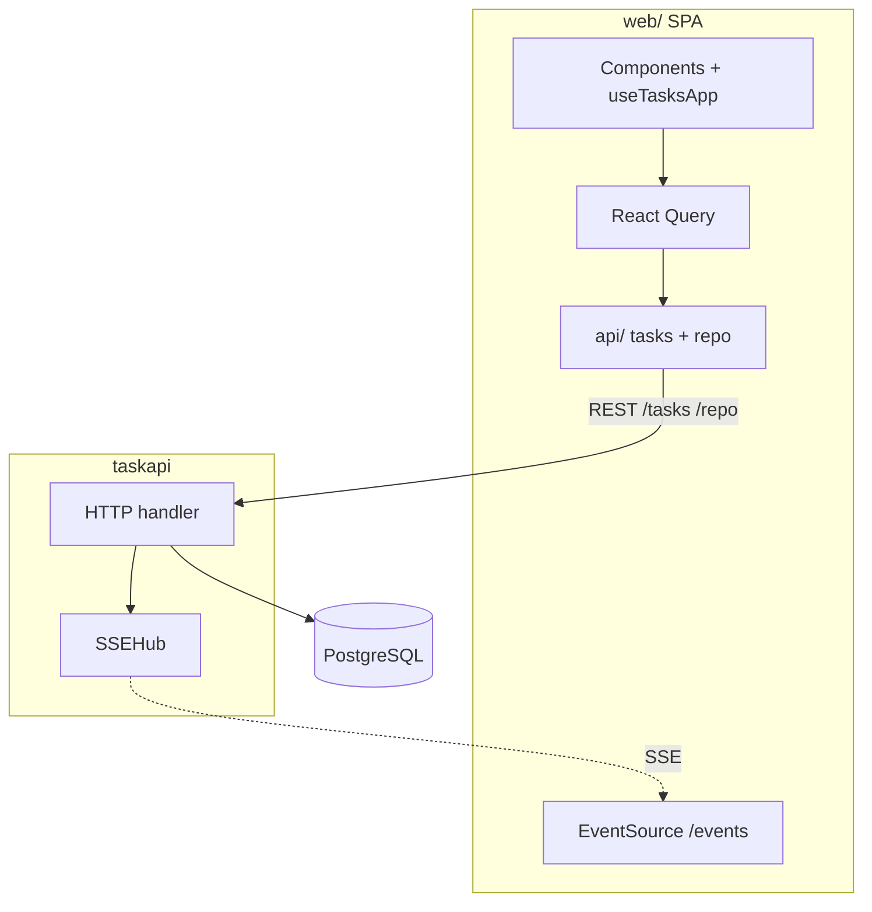
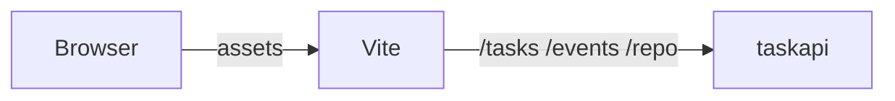
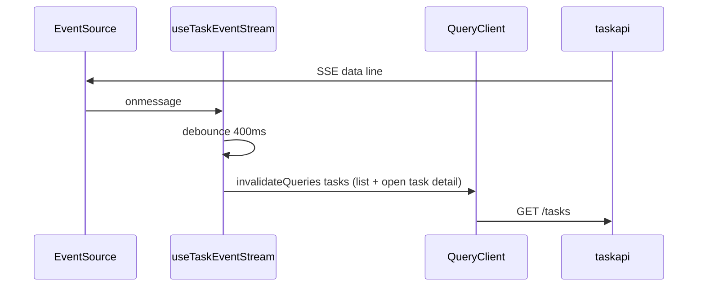

# Browser client (`web/`)

Canonical description of the optional Vite + React + TypeScript SPA. Server contracts (`/tasks`, `/events`, `/repo`) are in [docs/DESIGN.md](./DESIGN.md). Where this doc sits in the tree: [docs/README.md](./README.md).

## Scope

Does: CRUD UI for `/tasks` (home list shows root tasks only; subtasks on task detail and in the create-modal parent picker); TanStack Query for list + mutations; checklist `GET` / add (`POST`) / remove (`DELETE`) under `/tasks/{id}/checklist` in the UI, with done-state shown read-only and a progress summary; marking items done uses `PATCH` with `X-Actor: agent` only (see DESIGN); `EventSource('/events')` with 400ms debounced cache invalidation: list queries plus per-id detail prefixes parsed from SSE `data` (see `tasks/sseInvalidate.ts`); `parseTaskApi` on JSON before use (tasks are recursive trees with `children`, `parent_id`, `checklist_inherit`, optional `task_type`); task creation drafts via `/task-drafts` (resume picker, autosave debounce, explicit **Save draft** action, and delete-on-create via `draft_id`); TipTap rich prompt (bold, headings, lists, code) with `initial_prompt` stored as HTML; `@` file mentions via `/repo` when `REPO_ROOT` is set (see DESIGN). If `REPO_ROOT` is unset, typing `@` shows a hint that no repo is configured for search.

Does not: Auth; serving `dist` from `taskapi`; CORS in Go (use same origin or a gateway — DESIGN, limitations).

## Stack

Vite 5, React 18, TypeScript strict, TanStack Query (`queryClient.ts`), TipTap (`RichPromptEditor`, `RichPromptMenuBar`, `MentionRangePanel`), `fetch` only under `src/api/` (import `@/api` or `../api`), Vitest + Testing Library (`fetch` / `EventSource` mocked in tests). App-wide CSS: `src/app/App.css` imports partials from `src/app/styles/` (e.g. task list, task detail, timeline).

## Recent hardening and refactors

- Virtualized **task graph** (`tasks/pages/TaskGraphPage.tsx`) reads layout numbers from `tasks/graphLayout.ts` as **`GRAPH_LAYOUT_PX`**; they must stay aligned with **`--task-graph-*`** in `src/app/styles/app-design-tokens.css` and `.task-graph-node` in `app-task-detail.css` (culling math assumes **16px per rem**). Drift is guarded by `tasks/graphLayout.test.ts`. The graph header summary uses correct singular/plural copy and **`aria-live="polite"`** so node counts are announced when the tree loads or changes. **Container queries** share **`--task-graph-cq-max`** (`40rem`): the skeleton viewport (`task-graph-skeleton`) tightens skeleton card **`gap`** and inner padding; the loaded viewport (`task-graph-viewport`) tightens **`.task-graph-node`** padding and internal gaps only — **card width / height / canvas padding** stay tied to **`GRAPH_LAYOUT_PX`** and are unchanged at narrow widths.
- Task detail prompt rendering now sanitizes stored HTML before DOM injection (`tasks/promptFormat.ts` + `TaskDetailPage`) to block script/event-handler and unsafe-link payloads while preserving safe rich-text tags.
- Prompt UI markup was extracted into `tasks/components/TaskDetailPromptSection.tsx` to keep `TaskDetailPage` smaller and easier to maintain.
- Frontend tests expanded around prompt sanitization edge cases (unsafe protocols, external-link attributes, dangerous tag removal).

## SPA in the system

SSE carries `type` + `id` only; rows come from `GET /tasks`.

## Dev vs production

Dev: browser → Vite → proxies `/tasks`, `/events`, `/repo` → `taskapi`. `VITE_TASKAPI_ORIGIN` in `web/vite.config.ts` picks the API target (default `http://127.0.0.1:8080`). Full-page loads to `/tasks/{id}` must still serve the SPA: the dev proxy bypasses to `index.html` when `Accept` includes `text/html` (so refresh on a task detail URL does not return raw JSON from `GET /tasks/{id}`).

Prod: `npm run build` → `web/dist/`; serve so `/tasks`, `/events`, `/repo` match the API origin (or gateway).

Mermaid (dev path):

## React Query + SSE

- Query keys: `taskQueryKeys.list(page)` → `GET /tasks` with `limit` / `offset` over **root** tasks (`tasks/paging.ts` page sizes); responses include `has_more`, and `listTasks` can pass `afterId` for keyset `after_id` (see DESIGN). The home table shows those roots only (`flattenTaskTreeRoots`), while `flattenTaskTree` still drives the create-modal parent dropdown. `taskQueryKeys.checklist(taskId)` → `GET /tasks/{id}/checklist`. `taskQueryKeys.events(taskId, cursor)` → keyset-paged `GET /tasks/{id}/events` (`before_seq` / `after_seq`, newest first) with `total`, `range_*`, `has_more_*`, and `approval_pending`.
- Drafts: `task-drafts` query drives resume picker before opening create modal. The create form keeps a local `draft_id`; autosave calls `POST /task-drafts` after a short debounce when content exists, and **Save draft** triggers the same endpoint immediately (manual save cancels a pending autosave timer first).
- Loading: `loading` = no cached list yet; `listRefreshing` = background refetch (mutations, invalidation, focus, SSE); `saving` = mutation in flight (not background list fetch). The header shows **Connected** while `EventSource` is open and does not toggle a second “syncing” pill for background refetch; if the stream is down, **Syncing…** can appear while the list refetches. The “Syncing with server…” line under **All tasks** is hidden while SSE is live (same reason). `createPending` / modal `busy` show spinners during mutations.
- SSE: each `data:` line contributes task ids to a debounced batch → invalidate list page(s) and only detail/checklist/events caches for those ids (not every open task). `parseTaskApi` runs on REST responses. Server dev mode `T2A_SSE_TEST` emits synthetic events about every 3s by default, so refetches can still be frequent for the home list when many tasks change.

## Module map (`web/src/`)

| Path | Role |
|------|------|
| `app/` | `main.tsx` (entry, `BrowserRouter`, `QueryClientProvider`), `App.tsx` (routes: `/`, `/tasks/:taskId`, `/tasks/:taskId/events/:eventSeq`), `App.css`, `App.test.tsx`. |
| `lib/queryClient.ts` | Defaults: stale time, `gcTime`, retries, `refetchOnWindowFocus`, dev cache `onError`. |
| `lib/useDelayedTrue.ts` | Delays showing the task list loading line; `smoothTransitions={false}` on `TaskListSection` in tests. |
| `lib/useHysteresisBoolean.ts` | Hides flicker from brief React Query refetches: `useTasksApp` drives “syncing” for the list + header after sustained `isFetching`. |
| `tasks/sseInvalidate.ts` | Collects task ids from SSE `data` lines for targeted `invalidateQueries` (list root + per-id detail prefix). |
| `types/` | Shared task domain types (`task.ts`, barrel `index.ts`); imported as `@/types`. |
| `tasks/` | Task feature: `queryKeys.ts`, `hooks/`, `components/`, `pages/` (`TaskHome`, `TaskDetailPage`, `TaskEventDetailPage` + `TaskUpdatesTimeline` — single chronological list; rows link to per-event detail; needs-user event types (`taskEventNeedsUser.ts`) get distinct row styling and link `aria-label`; collapsible initial prompt by default; audit data from `GET /tasks/{id}/events` / `GET /tasks/{id}/events/{seq}`; optional `user_response` on events; needs-user types use `PATCH /tasks/{id}/events/{seq}` via `patchTaskEventUserResponse` in `api/tasks.ts`; human text from `taskEventLabels.ts` is `title` / `aria-label` only; `taskStatusNeedsUser.ts` classifies task `status` for list filter grouping, `data-needs-user` on status pills, task detail stance), `extensions/`, `promptFormat.ts`, `taskAttention.ts`, `taskEventLabels.ts`. |
| `tasks/` | Task feature: `queryKeys.ts`, `hooks/`, `components/`, `pages/` (`TaskHome`, `TaskDetailPage`, `TaskEventDetailPage` + `TaskUpdatesTimeline` — single chronological list; rows link to per-event detail; needs-user event types (`taskEventNeedsUser.ts`) get distinct row styling and link `aria-label`; collapsible initial prompt by default; audit data from `GET /tasks/{id}/events` / `GET /tasks/{id}/events/{seq}`; optional `user_response` on events; needs-user types use `PATCH /tasks/{id}/events/{seq}` via `patchTaskEventUserResponse` in `api/tasks.ts`; human text from `taskEventLabels.ts` is `title` / `aria-label` only; `taskStatusNeedsUser.ts` classifies task `status` for list filter grouping, `data-needs-user` on status pills, task detail stance; draft UX in `DraftResumeModal` + create modal autosave/manual save pipeline). |
| `shared/` | Cross-feature components and helpers (e.g. `ErrorBanner`). |
| `api/` | HTTP + JSON parsing: `index.ts` re-exports `tasks.ts`, `repo.ts`, `parseTaskApi.ts`, `shared.ts`. |
| `test/` | Vitest setup, `EventSource` stub, `requestUrl`. |

## JSON boundary

Responses are `unknown` until `parseTaskApi` runs; bad shapes fail with tests in `api/parseTaskApi.test.ts` and `api/tasks.test.ts`. JSON error bodies from `taskapi` may include optional `request_id` (see [DESIGN.md](./DESIGN.md)); `api/shared.ts` `readError` appends it to the message so UI errors stay correlated with `X-Request-ID` / access logs.

## Testing

`npm test` / `npm run lint` / `npm run build` from `web/` after meaningful UI or `src/api/` changes (see `.cursor/rules/10-web-ui.mdc`). No real network in default tests.

## Client limitations

Same-origin or gateway in prod; SSE is a hint; no offline/conflict UI; React Query Devtools not bundled.
