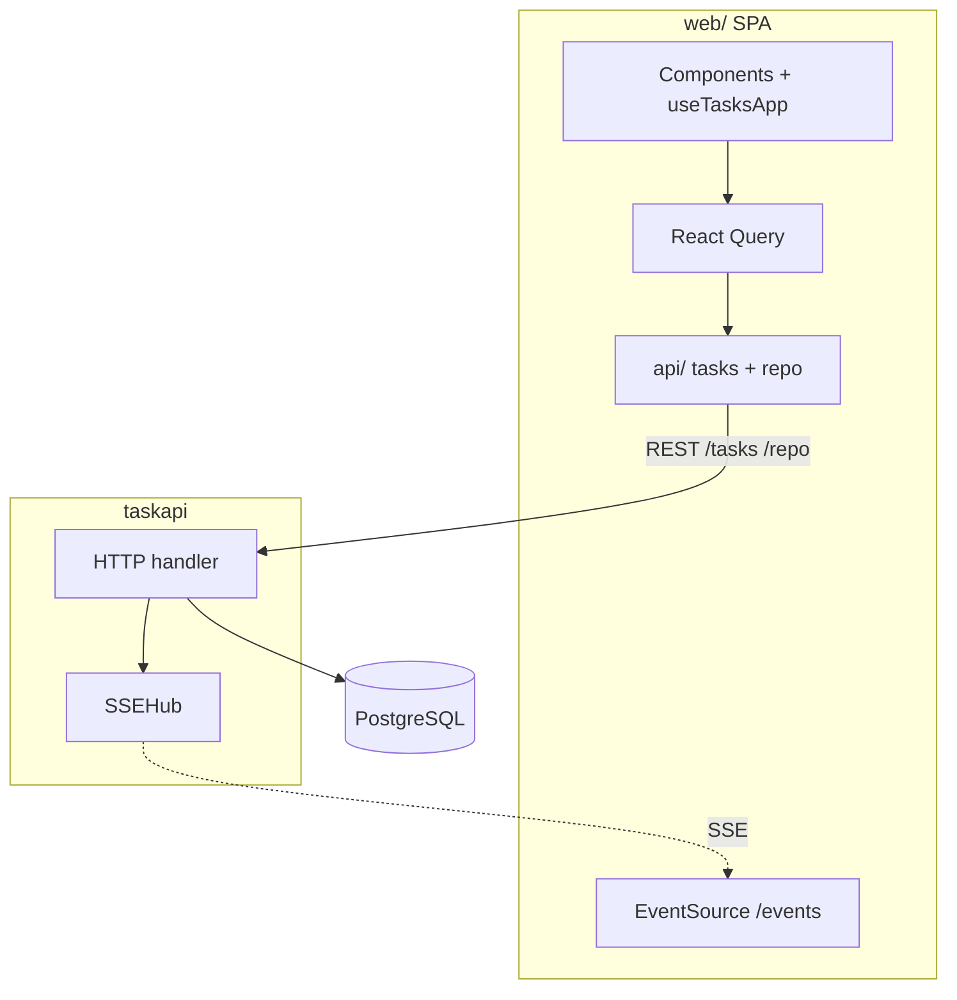
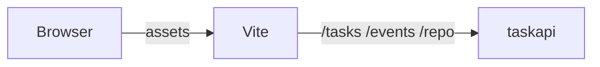
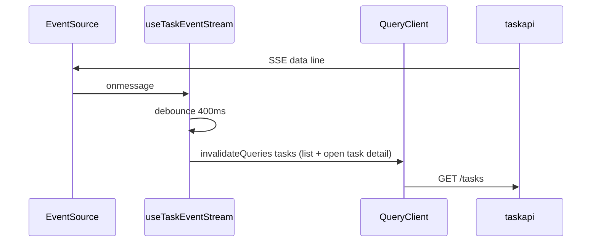

# Browser client (`web/`)

Canonical description of the optional Vite + React + TypeScript SPA. Server contracts (`/tasks`, `/events`, `/repo`) are in [docs/DESIGN.md](./DESIGN.md). Where this doc sits in the tree: [docs/README.md](./README.md).

## Scope

Does: CRUD UI for `/tasks`; TanStack Query for list + mutations; `EventSource('/events')` with 400ms debounced `invalidateQueries`; `parseTaskApi` on JSON before use; TipTap rich prompt (bold, headings, lists, code) with `initial_prompt` stored as HTML; `@` file mentions via `/repo` when `REPO_ROOT` is set (see DESIGN). If `REPO_ROOT` is unset, typing `@` shows a hint that no repo is configured for search.

Does not: Auth; serving `dist` from `taskapi`; CORS in Go (use same origin or a gateway — DESIGN, limitations).

## Stack

Vite 5, React 18, TypeScript strict, TanStack Query (`queryClient.ts`), TipTap (`RichPromptEditor`, `RichPromptMenuBar`, `MentionRangePanel`), `fetch` only under `src/api/` (import `@/api` or `../api`), Vitest + Testing Library (`fetch` / `EventSource` mocked in tests).

## SPA in the system

SSE carries `type` + `id` only; rows come from `GET /tasks`.

## Dev vs production

Dev: browser → Vite → proxies `/tasks`, `/events`, `/repo` → `taskapi`. `VITE_TASKAPI_ORIGIN` in `web/vite.config.ts` picks the API target (default `http://127.0.0.1:8080`). Full-page loads to `/tasks/{id}` must still serve the SPA: the dev proxy bypasses to `index.html` when `Accept` includes `text/html` (so refresh on a task detail URL does not return raw JSON from `GET /tasks/{id}`).

Prod: `npm run build` → `web/dist/`; serve so `/tasks`, `/events`, `/repo` match the API origin (or gateway).

Mermaid (dev path):

## React Query + SSE

- Query keys: `taskQueryKeys.list(page)` → `GET /tasks` with `limit` / `offset` (`tasks/paging.ts` page sizes); `taskQueryKeys.events(taskId, cursor)` → keyset-paged `GET /tasks/{id}/events` (`before_seq` / `after_seq`, newest first) with `total`, `range_*`, `has_more_*`, and `approval_pending`.
- Loading: `loading` = no cached list yet; `listRefreshing` = background refetch (mutations, invalidation, focus, SSE); `saving` = mutation in flight (not background list fetch). Status copy (“Loading…”, “Syncing…”) waits briefly before appearing; the task list panel fades in when data is ready. `createPending` / modal `busy` show spinners during mutations without that delay.
- SSE: each `data:` line schedules debounced invalidation → refetch list; `parseTaskApi` runs on the response.

## Module map (`web/src/`)

| Path | Role |
|------|------|
| `app/` | `main.tsx` (entry, `BrowserRouter`, `QueryClientProvider`), `App.tsx` (routes: `/`, `/tasks/:taskId`, `/tasks/:taskId/events/:eventSeq`), `App.css`, `App.test.tsx`. |
| `lib/queryClient.ts` | Defaults: stale time, `gcTime`, retries, `refetchOnWindowFocus`, dev cache `onError`. |
| `lib/useDelayedTrue.ts` | Delays showing loading/sync status so very short fetches do not flash unreadable lines; `smoothTransitions={false}` on `TaskListSection` / `StreamStatusHint` for tests. |
| `types/` | Shared task domain types (`task.ts`, barrel `index.ts`); imported as `@/types`. |
| `tasks/` | Task feature: `queryKeys.ts`, `hooks/`, `components/`, `pages/` (`TaskHome`, `TaskDetailPage`, `TaskEventDetailPage` + `TaskUpdatesTimeline` — timeline rows link to per-event detail; collapsible initial prompt by default; audit data from `GET /tasks/{id}/events` / `GET /tasks/{id}/events/{seq}`; human text from `taskEventLabels.ts` is `title` / `aria-label` only; `taskEventNeedsUser.ts` classifies event types into “needs your input” vs informational for sectioning and the event detail stance line; `taskStatusNeedsUser.ts` does the same for task `status` — list filter grouping, `data-needs-user` on status pills, task detail stance), `extensions/`, `promptFormat.ts`, `taskAttention.ts`, `taskEventLabels.ts`. |
| `shared/` | Cross-feature components and helpers (e.g. `ErrorBanner`). |
| `api/` | HTTP + JSON parsing: `index.ts` re-exports `tasks.ts`, `repo.ts`, `parseTaskApi.ts`, `shared.ts`. |
| `test/` | Vitest setup, `EventSource` stub, `requestUrl`. |

## JSON boundary

Responses are `unknown` until `parseTaskApi` runs; bad shapes fail with tests in `api/parseTaskApi.test.ts` and `api/tasks.test.ts`.

## Testing

`npm test` / `npm run build` from `web/` after meaningful UI or `src/api/` changes (see `.cursor/rules/10-web-ui.mdc`). No real network in default tests.

## Client limitations

Same-origin or gateway in prod; SSE is a hint; no offline/conflict UI; React Query Devtools not bundled.
