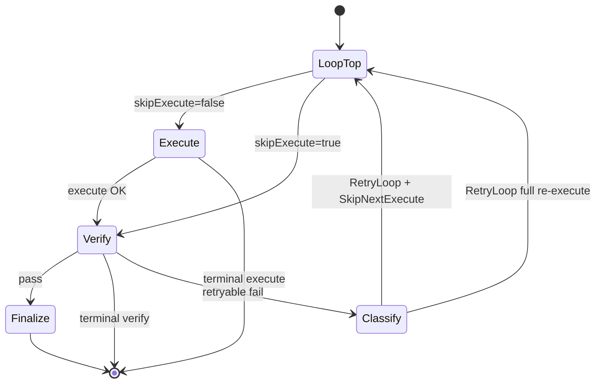

# ADR-0028: In-Cycle Verify-Only Retry

**Date:** 2026-06-19
**Status:** Accepted
**Deciders:** Engineering

## Context

On any retryable verify failure inside one cycle, `runCycleLoop` always re-enters execute (`runner.Run` + `ScrubCycleArtifacts`), even when execute succeeded, commits ingested, and `criteria-report.json` remains valid. Cross-cycle operator resume already skips execute via `skipFirstExecute` ([ADR-0015](ADR-0015-dual-retry-modes.md), `resumeEntryVerifyOnly`). This ADR extends the same loop flag to **in-cycle** retries when execute artifacts and git anchors are still valid and the failure is **infra-only**.

Extends [ADR-0018](ADR-0018-harness-orchestration-fsm.md) and [ADR-0021](ADR-0021-harness-execute-orchestration.md).

## Decision

When verify fails retryably inside one cycle:

1. Classify failure (`infra` vs `implementation`) and evaluate structural execute-validity gates.
2. If gates pass and failure class is `infra`, set `VerifyEffects.SkipNextExecute` so the next loop iteration skips `runCycleLoopExecute` (no scrub, no runner).
3. Otherwise retain today's full execute↔verify retry path.

### State diagram (`runCycleLoop`)

`skipExecute` is set from `SkipNextExecute` on retry continue; cleared after one skipped iteration (same as cross-cycle `skipFirstExecute`).

### Decision table

| Failure class | Structural gates | Retry mode | `SkipNextExecute` |
|---------------|------------------|------------|-------------------|
| `infra` | all pass | verify_only | true |
| `implementation` | any | full_reexecute | false |
| any | any gate fail | full_reexecute | false |
| tamper / budget exhausted | — | terminal | — |

### Failure taxonomy

| Class | Meaning | Examples |
|-------|---------|----------|
| `infra` | Verify machinery failed; execute output may still be valid | Verify runner timeout/error; verify-report parse retry; criterion command step error before verdict assembly |
| `implementation` | Execute output or verify-agent judgment says work is not done | `ClaimedDone=false` (`VerifierAgentSelf`); verify agent rejects claimed-done (`VerifierVerifyAgent`, failed) |
| `terminal` | No retry loop | Tamper; retry budget exhausted |

### Structural gates (execute still valid)

| Gate | Pass condition |
|------|----------------|
| `ExecuteReachedVerify` | Last execute phase completed with `ContinueToVerify` |
| `CriteriaReportValid` | `criteria-report.json` parses for expected criterion IDs |
| `GitHeadMatchesAnchor` | Current HEAD equals `postExecuteHeadSHA` (or git skipped) |
| `CommitIngestOK` | Last execute commit ingest succeeded (or git skipped / not attempted) |

### Invariants

- `SkipNextExecute == true` ⇒ must not call `runCycleLoopExecute` (no `ScrubCycleArtifacts`, no `runner.Run`).
- Tamper ⇒ never skip execute; terminal immediately.
- Locked `previouslyPassed` criteria unchanged on verify-only retry.
- Atomic completion contract unchanged: checklist rows commit only on cycle success.
- Cross-cycle `skipFirstExecute` behavior unchanged (EC-10).

### Feedback routing

| Retry mode | Feedback destination |
|------------|---------------------|
| verify_only | verify prompt only |
| full_reexecute | execute + verify (today) |

### Code map

| File | Responsibility |
|------|----------------|
| `internal/orchestration/retry_mode.go` | Pure `ClassifyVerifyRetryMode` + reason codes |
| `internal/orchestration/machine.go` | `DecideVerifyRetryWithValidity` |
| `internal/orchestration/outcomes.go` | `VerifyEffects.SkipNextExecute` |
| `verify_retry_eligibility.go` | Harness I/O: gather classify input, anchor post-execute state |
| `cycle_loop.go` | Wire classifier + effects; log `retry_mode` / `reason_code` |
| `cycle.go` | `processState` anchors |
| `pkgs/tasks/domain/cycle_state.go` | `ValidVerifyOnlyRetryTransition` for verify→verify ledger rows |
| `pkgs/tasks/store/internal/cycles/phases.go` | StartPhase accepts verify-only retry transition |

### Observability

Structured log fields on verify retry: `retry_mode` (`verify_only` | `full_reexecute`), `reason_code` (stable enum from `retry_mode.go`).

### Edge-case catalog

| ID | Scenario | Retry mode | Notes |
|----|----------|------------|-------|
| EC-01 | Verify infra fail; structural gates pass | verify_only | Primary value case |
| EC-02 | Verify agent rejects claimed-done | full_reexecute | Conservative default |
| EC-03 | Execute did not claim criterion done | full_reexecute | Self-claim gate |
| EC-04 | criteria-report missing/invalid | full_reexecute | Structural gate fail |
| EC-05 | Git HEAD changed since post-execute anchor | full_reexecute | Structural gate fail |
| EC-06 | Commit ingest failed | full_reexecute | Structural gate fail |
| EC-07 | Verify tampered | terminal | No retry loop |
| EC-08 | Retry budget exhausted | terminal | |
| EC-09 | Partial pass: A locked, B fails (infra) | verify_only on B | Locked criteria untouched |
| EC-10 | Cross-cycle `skipFirstExecute` resume | unchanged | Regression guard |
| EC-11 | Process restart mid-cycle | unchanged | Out of scope (#5) |

### Explicit non-goals

- Liberal LLM-retry policy (verify-agent rejection always re-executes).
- Process restart / resume parity ([HARNESS_IMPROVEMENTS](../HARNESS_IMPROVEMENTS.md) #5).
- Harness trace correlation (#2).
- New config surface or UI.

## Consequences

### Positive

- Fewer execute phases and token spend on infra-only verify retries.
- Reuses proven `skipExecute` loop flag; no new retry subsystem.

### Negative / Trade-offs

- Additional anchors on `processState`; harness must keep gates in sync with git/report state.
- Contributors must read failure taxonomy before extending classifier.

## Alternatives Considered

| Alternative | Reason Rejected |
|-------------|-----------------|
| Skip execute on any verify retry | Unsafe when implementation needs fixing |
| New retry strategy registry | Over-engineered for one branch |
| Config flag for verify-only | Policy should be deterministic |

## Related

- [docs/domain/harness.md](../domain/harness.md)
- [HARNESS_IMPROVEMENTS.md](../../HARNESS_IMPROVEMENTS.md) item #1

## Test traceability appendix

| EC ID | Test |
|-------|------|
| EC-01 | `TestEdgeCase_EC01_verifyInfra_skipsExecute` |
| EC-02 | `TestClassify_EC02_verifyAgentReject_fullReexecute`, `TestEdgeCase_EC02_verifyAgentReject_fullReexecute` |
| EC-03 | `TestClassify_EC03_claimedNotDone_fullReexecute`, `TestEdgeCase_EC03_claimedNotDone_fullReexecute` |
| EC-04 | `TestClassify_EC04_reportInvalid_fullReexecute`, `TestEdgeCase_EC04_reportMissing_fullReexecute` |
| EC-05 | `TestClassify_EC05_headChanged_fullReexecute` |
| EC-06 | `TestClassify_EC06_ingestFailed_fullReexecute` |
| EC-07 | `TestEdgeCase_EC07_tamper_terminal` (existing verify tamper tests) |
| EC-08 | `TestClassify_EC08_budgetExhausted_terminal` |
| EC-09 | `TestEdgeCase_EC09_partialPass_infraVerifyOnly` |
| EC-10 | `TestVerifyOnlyCrossCycleResume_runCycleLoopSkipsRunnerExecute` |
| EC-11 | Document only |
