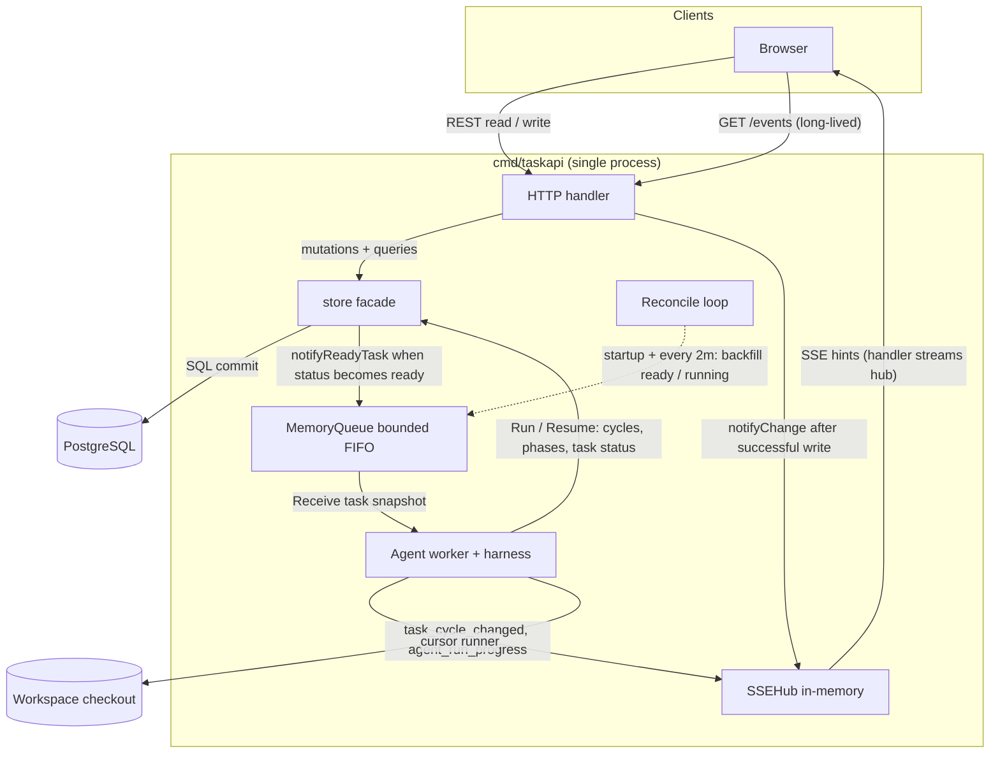
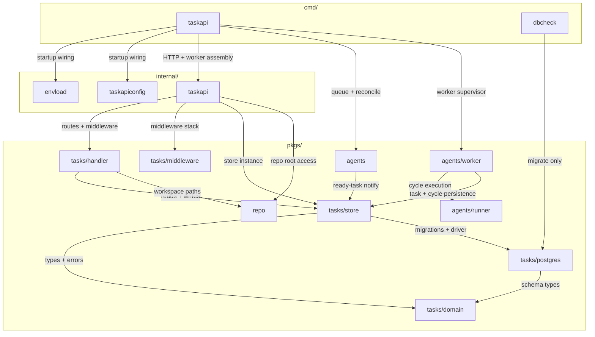
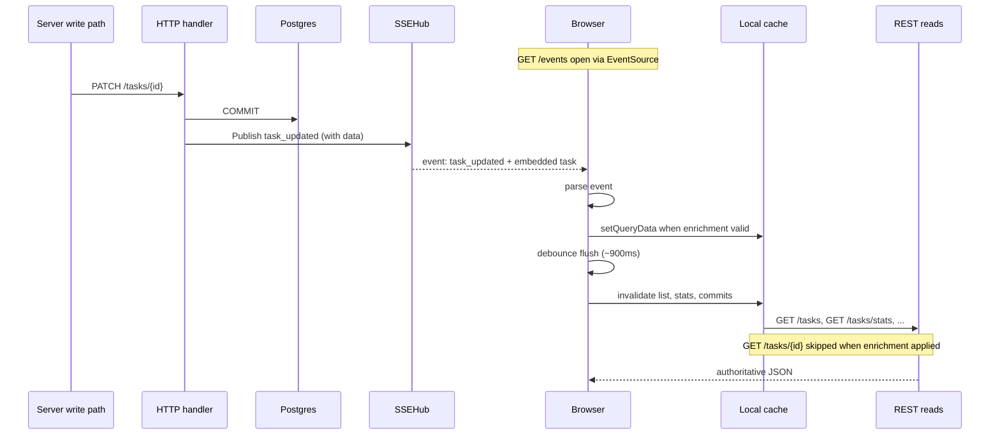
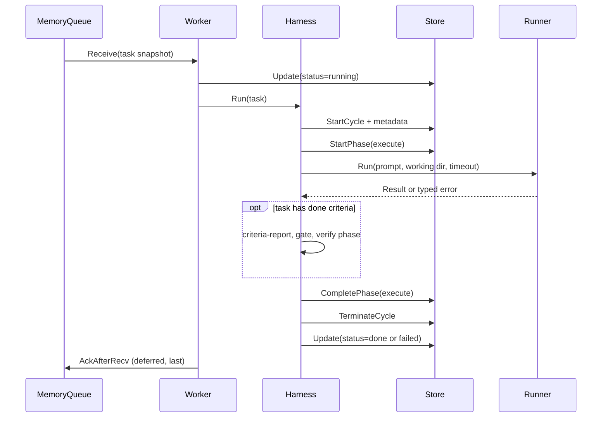

# Architecture

How `taskapi` is shaped: data flow, persistence, the agent worker, and the event hub.

| | |
| --- | --- |
| **Applies to** | `cmd/taskapi`, `pkgs/tasks/*`, `pkgs/agents/*`, `web/` live updates |
| **Audience** | Contributors onboarding to the backend, worker, or browser sync paths |
| **Prerequisite** | Repo checkout; [guide.md](./guide.md) for doc routing |
| **Companion articles** | [data-model.md](./data-model.md), [api.md](./api.md), [configuration.md](./configuration.md), [domain/](./domain/) deep dives |

## In this article

- [Overview](#overview)
- [System](#system)
  - [Example: creating a task](#example-creating-a-task)
- [Go packages](#go-packages)
  - [Example: how a handler write reaches the database](#example-how-a-handler-write-reaches-the-database)
- [Write path and live UI](#write-path-and-live-ui)
  - [Example: another tab learns about a task update](#example-another-tab-learns-about-a-task-update)
- [Persistence](#persistence)
- [SSE hub](#sse-hub)
- [Ready-task queue and reconcile](#ready-task-queue-and-reconcile)
- [Agent worker and harness](#agent-worker-and-harness)
  - [Lifecycle of one task](#lifecycle-of-one-task)
  - [Example: from queue pickup to cycle completion](#example-from-queue-pickup-to-cycle-completion)
  - [Runner abstraction](#runner-abstraction)
  - [Cursor adapter](#cursor-adapter)
  - [Process-restart phase finalization and resume](#process-restart-phase-finalization-and-resume)
- [Limitations](#limitations)

## Overview

Hamix coordinates agent work as a set of tasks stored in Postgres and exposed through one HTTP server (`taskapi`). Operators and automation use the same REST API to create tasks, change status, and read results. The database is the source of truth for tasks, projects, execution cycles, and an append-only `task_events` audit log.

The browser keeps the UI current without polling. Each tab holds a long-lived event connection; when a write commits, the server pushes a small hint and the browser refetches full JSON from REST when it needs to. Agent pickup is a separate path: ready tasks go on an in-memory queue consumed by a worker that runs the cursor CLI against a workspace checkout on disk.

Tasks can belong to a project so shared context carries across runs. Execution order between tasks is expressed with `depends_on` edges, not nested task trees.

The rest of this article walks from the runtime diagram through package layout, browser sync, persistence, and worker behavior. Use [data-model.md](./data-model.md) and [api.md](./api.md) for schemas and routes; use [configuration.md](./configuration.md) for env vars and `app_settings`.

## System

One `taskapi` process serves REST and SSE, owns the in-memory hub and queue, and optionally runs the agent worker when `app_settings.repo_root` is set. After Postgres commits, two independent realtime paths fork: SSE notifies browsers; MemoryQueue delivers `status=ready` task snapshots to the worker. Not every write uses both paths.



### Example: creating a task

Follow the diagram by walking through what happens when someone creates a task in the UI. The user fills out the form and clicks create, the browser sends `POST /tasks`, and the server stores a new row. In the common case the task starts in `status=ready` (waiting for an agent to pick it up). This walkthrough also assumes a workspace is configured (`app_settings.repo_root` is set) so the agent worker is running.

Each step below follows the same shape: a short paragraph describes what happens, then a single line names the arrows in the diagram that the step uses.

**Step 1. The browser sends the request and the server commits a new row.**
The handler validates the submitted fields and calls `store.Create`. The store inserts the new row into `tasks`, persists any checklist items and dependencies, and appends a `task_created` line to the `task_events` audit log. All of that runs inside one database transaction. When the transaction succeeds, the handler replies with `201 Created` and the full task JSON. The tab that submitted the form is now up to date and does not need to wait for anything else.
*In the diagram:* `Browser → HTTP handler` (REST read / write), then `HTTP handler → store facade → PostgreSQL` (mutations + queries, SQL commit).

**Step 2. The successful commit triggers two independent paths.**
The create path looks like a normal REST write until the transaction commits. After the commit, two consumers act on the same write. The event hub notifies any other browser tab that is currently connected. The in-memory queue hands the new task to the agent worker. These two consumers are separate, and the rest of the walkthrough covers each in turn.
*In the diagram:* `HTTP handler → SSEHub` (notifyChange after successful write) and `store facade → MemoryQueue` (notifyReadyTask when status becomes ready).

**Step 3. The event hub keeps other browser tabs consistent.**
The tab that submitted the form already has the new task in its response, but other tabs and other users do not. To close that gap, the handler calls `notifyTaskChanged`, which publishes a `task_created` event to `SSEHub` with the full task embedded inline. The publish only runs if the commit succeeded; failed writes never publish. Browsers do not poll for these events. Each tab opens a long-lived `GET /events` connection at startup using the browser's built-in `EventSource` (a one-way stream from server to browser). When the event arrives, the browser either drops the embedded task into its local cache or invalidates the affected queries and refetches from REST. See [Write path and live UI](#write-path-and-live-ui) for the full invalidation behavior.
*In the diagram:* `HTTP handler → SSEHub` (publish) and `SSEHub → Browser` (SSE hints), with `Browser → HTTP handler` (`GET /events`) holding the connection open.

**Step 4. The in-memory queue feeds the agent worker.**
A task created in `status=ready` still needs to be picked up and executed, which is a separate concern from UI updates. Inline with the same commit, the store facade checks whether the task is eligible for pickup. A task is eligible when `status` is `ready` and `pickup_not_before` is not set in the future. If both conditions hold, the facade calls `notifyReadyTask`, which puts a copy of the task on `MemoryQueue`, an in-process FIFO queue used only by the worker. The browser has no visibility into this queue. Because the queue is bounded, an enqueue can fail under load. A failed enqueue does not fail the create, because the task is safely stored in Postgres and the reconcile loop will discover it on its next pass.
*In the diagram:* `store facade → MemoryQueue` (notifyReadyTask), with the dotted `Reconcile loop → MemoryQueue` arrow acting as the backstop.

**Step 5. The worker consumes the queue and the harness drives the run.**
A single worker goroutine consumes the queue. When it receives a task, it reloads the latest row from the store, transitions the task to `running`, and hands control to the harness, the component that orchestrates one agent run from start to finish. From this point on, the worker is the active driver of writes. It records cycle and phase progress back through the store, publishes `task_cycle_changed` and `agent_run_progress` events to `SSEHub` as the run progresses, and invokes the cursor CLI inside the workspace checkout to do the actual work. The events the harness publishes travel the same hub-to-browser path used in Step 3, which is why the task detail view updates live while the agent is executing.
*In the diagram:* `MemoryQueue → Agent worker + harness` (Receive task snapshot), then `Agent worker + harness → store facade` (Run / Resume), `Agent worker + harness → SSEHub` (task_cycle_changed, agent_run_progress), and `Agent worker + harness → Workspace checkout` (cursor runner).

**Why the two paths stay separate.**
Events serve UI visibility. The queue serves agent scheduling. The two paths share the same database commit but nothing else, and they can fail independently. As a concrete example, a task created with `status=blocked` still publishes an event so every browser sees the new row, but `notifyReadyTask` skips it and the worker does not run.

For more detail on each path, see [domain/sse-hub.md](domain/sse-hub.md) for the event hub, [domain/agent-queue.md](domain/agent-queue.md) for queue and reconcile behavior, and [domain/workspace-repo.md](domain/workspace-repo.md) for the workspace checkout.

## Go packages

Go code is grouped by import boundary: `cmd` wires binaries, `internal` holds assembly private to one binary, and `pkgs` holds domain logic importable across binaries. Dependencies flow inward toward `domain`, which has no database or HTTP imports.



### Example: how a handler write reaches the database

Follow the diagram from process startup through a single request. The walkthrough ends with a `PATCH /tasks/{id}` that changes task fields.

**Step 1. `cmd/taskapi` starts the process and hands off to assembly code.**
The `taskapi` binary loads environment and config, opens the database, constructs the store, SSE hub, and optional agent worker, then builds the HTTP handler. It does not contain business logic itself.
*In the diagram:* `taskapi → envload`, `taskapi → taskapiconfig`, `taskapi → taskapi` (internal assembly), `taskapi → agents`, `taskapi → agents/worker`.

**Step 2. Internal assembly exposes the public HTTP surface.**
`internal/taskapi` registers routes on `tasks/handler`, attaches `tasks/middleware`, and passes the shared `tasks/store` instance and repo helper into the handler constructor.
*In the diagram:* `taskapi (internal) → tasks/handler`, `taskapi (internal) → tasks/middleware`, `taskapi (internal) → tasks/store`, `taskapi (internal) → repo`.

**Step 3. The handler validates the request and calls the store.**
`tasks/handler` maps HTTP to store calls. For a patch it parses JSON, checks domain rules at the boundary, and invokes `store.Update`. It may also call `repo` when the request touches workspace paths or `@` mentions.
*In the diagram:* `tasks/handler → tasks/store`, and optionally `tasks/handler → repo`.

**Step 4. The store facade delegates to domain packages and the database.**
`tasks/store` is a thin facade over `pkgs/tasks/store/internal/<domain>/`. It translates driver errors to `domain` sentinels (`ErrNotFound`, `ErrInvalidInput`) and composes cross-entity transactions through exported `…InTx` helpers. Schema setup lives in `tasks/postgres`.
*In the diagram:* `tasks/store → tasks/domain` (types + errors), `tasks/store → tasks/postgres` (migrations + driver).

Black-box HTTP tests live in `internal/handlertest/`. Middleware `Stack` is composed in `internal/taskapi.NewHTTPHandler`.

## Write path and live UI

Browsers keep the UI current through a two-step pattern: the server pushes a lightweight event over a long-lived connection, then the browser refetches authoritative JSON from REST when needed. SSE carries hints only; REST carries full task bodies.



### Example: another tab learns about a task update

This walkthrough covers the browser side of the [System](#system) diagram after a write has already committed. Assume an agent run finishes and the harness updates the task to `status=done`.

**Step 1. A write commits on the server.**
The harness (or a REST handler) persists the new task state to Postgres, then publishes `task_updated` to `SSEHub`. Enriched publishes include the full task JSON in the event payload.
*In the diagram:* `Server write path → HTTP handler → Postgres` (COMMIT), then `HTTP handler → SSEHub` (Publish).

**Step 2. The browser receives the event on its open stream.**
Each tab opens `GET /events` at startup and holds it open with `EventSource`. When the hub publishes, the handler streams the event to every connected tab.
*In the diagram:* `SSEHub → Browser` (event delivery), with `Browser` already connected via `GET /events`.

**Step 3. The browser updates local state.**
The event handler parses the JSON line. If the payload includes a valid embedded task, the browser writes it directly into the local cache for that task id. If parsing fails or the frame is hint-only, it queues the task id for invalidation instead.
*In the diagram:* `Browser → Local cache` (setQueryData when enrichment valid).

**Step 4. Debounced invalidation triggers REST refetches.**
Related queries (task list, stats, commits) are invalidated after a short debounce window (~900ms, max 2.5s) so bursts of events collapse into one refetch batch. The cache layer refetches stale queries from REST. When enrichment already updated the task detail cache, `GET /tasks/{id}` is skipped for that id.
*In the diagram:* `Local cache → REST reads` (GET /tasks, GET /tasks/stats, …), with the note that `GET /tasks/{id}` may be skipped.

See [domain/sse-hub.md](domain/sse-hub.md) for hub mechanics and coalescing rules.

## Persistence

GORM + Postgres. Schema migration is `AutoMigrate` only — no versioned migration files. The same migration runs against SQLite in tests via `tasktestdb.OpenSQLite`. Deep dive: [domain/persistence.md](domain/persistence.md) (facade, dual-write, verdict vs report files).

| Table | Purpose |
|---|---|
| `tasks` | Tasks (optional `project_id`, flat tags + milestone, gate JSON, `depends_on` via `task_dependencies`). |
| `task_events` | Append-only audit log. Every cycle/phase mutation appends a mirror row in the same SQL transaction. Deep dive: [domain/task-events.md](domain/task-events.md). |
| `task_cycles` / `task_cycle_phases` | Typed execution-cycle substrate (see [data-model.md](./data-model.md)). |
| `task_cycle_commits` | Worker-indexed git commits per task/cycle (agent claims in criteria-report). See [domain/cycle-commits.md](./domain/cycle-commits.md). |
| `task_cycle_stream_events` | Durable normalized Cursor `stream-json` progress for one attempt. |
| `task_checklist_items` / `task_checklist_completions` | Per-task done criteria. See [domain/done-criteria.md](./domain/done-criteria.md). |
| `task_dependencies` | Directed acyclic graph between tasks. |
| `task_drafts` | Persisted create-form state (autosave + named drafts). |
| `projects` / `project_context_items` / `project_context_edges` | Long-lived projects and curated shared context. |
| `task_context_snapshots` | Immutable cycle-scoped copies of the context bundle handed to a runner. |
| `app_settings` | Singleton (`id=1`) UI-driven configuration (see [configuration.md](./configuration.md)). |

Concurrency: `Update` runs in a transaction with `SELECT … FOR UPDATE`; concurrent patches serialize. There is no ETag — last successful transaction wins. JSON task responses carry no `created_at` / `updated_at` fields; timestamps live on `task_events`.

## SSE hub

In-memory ring buffer keyed by monotonic event id. Deep dive: [domain/sse-hub.md](domain/sse-hub.md).

- Each `Publish` allocates a new id, marshals the frame, and stores it (default **1024** entries). On reconnect, `EventSource` sends `Last-Event-ID`; the handler replays every retained frame newer than that value, then enters the live loop. If the requested id is older than the oldest retained entry, the handler emits one `resync` directive and the client drops caches.
- Subscriber buffer: **256** entries. Slow consumers are evicted with a `resync` frame.
- Heartbeat: a `: heartbeat` comment line every **15s** so proxies do not idle-kill the connection.
- Coalescing: identical `{type,id}` hint-only frames inside a **50ms** window are dropped. `task_cycle_changed` and `agent_run_progress` are intentionally never coalesced.

## Ready-task queue and reconcile

Bounded in-memory FIFO for the agent worker. Deep dives: [domain/agent-queue.md](domain/agent-queue.md) (queue mechanics), [domain/task-scheduling.md](domain/task-scheduling.md) (readiness predicates, enqueue vs admission).

`pkgs/agents` ships `domain.Task` snapshots into a bounded in-memory FIFO (`MemoryQueue`, default depth **256**, configurable via `HAMIX_USER_TASK_AGENT_QUEUE_CAP`).

- After a successful commit that leaves a task `ready`, `Store.notifyReadyTask` enqueues a snapshot. If the queue is full, the mutation still succeeds (the notify failure is `Warn`-logged).
- `PickupWakeScheduler` defers enqueue when `pickup_not_before` is in the future. Startup `Hydrate` reloads deferred rows.
- `agents.RunReconcileLoop` runs `ReconcileReadyTasksNotQueued` and `ReconcileRunningTasksNotQueued` once at startup and every 2 minutes (fixed in code, `ReconcileTickInterval`). Ready reconcile pages `store.ListReadyTaskQueueCandidates` in oldest-first order so backlog is not starved. Running reconcile pages open cycles and enqueues tasks still `status='running'` when not already pending.

**Invariant (ready queue):** the queue never contains a task the SQL filter `status='ready' AND (pickup_not_before IS NULL OR pickup_not_before <= now())` would reject.

**Invariant (running resume):** the queue may contain `status='running'` tasks with an open cycle after process restart — admission calls `Harness.Resume` instead of starting a new cycle.

The queue is single-process: multiple `taskapi` replicas with the worker enabled are **not supported** (startup finalization and in-memory queue would race in-flight cycles).

## Agent worker and harness

`pkgs/agents/worker` is the single in-process consumer of `pkgs/agents.MemoryQueue`. It handles queue admission (reload, readiness, ready→running, ack ordering) and delegates cycle choreography to `pkgs/agents/harness`. The worker runs when `app_settings.repo_root` is set and can be toggled from the Settings page. Supervisor boot, reload, and hot-swap: [domain/agent-supervisor.md](domain/agent-supervisor.md).

The harness (`pkgs/agents/harness`) wraps `runner.Run`: execute/verify phase loop, criteria injection, report-file contracts, adversarial verification, git integrity checks, and crash/shutdown recovery of in-flight cycle state. See [domain/harness.md](./domain/harness.md), [ADR-0005](./adr/ADR-0005-extract-agent-harness.md), [domain/done-criteria.md](./domain/done-criteria.md), [domain/execute-agent.md](./domain/execute-agent.md), and [domain/verify-agent.md](./domain/verify-agent.md).

### Lifecycle of one task

One worker goroutine pulls tasks from the queue, runs the harness for each admission, and defers queue acknowledgment until the run finishes or bails out. The diagram below shows the happy path from dequeue through cycle termination.



### Example: from queue pickup to cycle completion

Assume a `status=ready` task is already on `MemoryQueue` from the [System](#system) enqueue path.

**Step 1. The worker receives a task from the queue.**
The worker blocks on `Receive`, which removes the task id from the queue's pending set. It registers a deferred `AckAfterRecv` before doing any work so the ack always runs last, even on panic or early return.
*In the diagram:* `MemoryQueue → Worker` (Receive task snapshot).

**Step 2. The worker reloads the row and marks the task running.**
Before starting a new cycle, the worker reloads the latest task from the store and transitions `status` to `running`. This prevents a second ready pickup for the same task while the cycle is open.
*In the diagram:* `Worker → Store` (Update status=running).

**Step 3. The harness opens a cycle and runs the execute phase.**
The worker calls `Harness.Run`. The harness records cycle metadata, starts an execute phase in the store, builds the prompt (including project context and criteria), and invokes the configured runner against the workspace checkout.
*In the diagram:* `Worker → Harness` (Run), then `Harness → Store` (StartCycle, StartPhase execute), then `Harness → Runner` (Run).

**Step 4. Optional verify phase and cycle termination.**
When the task has done criteria, the harness parses `criteria-report.json`, may gate on `claimed_done`, starts a verify phase, and parses `verify-report.json`. It then completes the execute phase, terminates the cycle with `succeeded`, `failed`, or `aborted`, and sets the task to `done` or `failed`.
*In the diagram:* `Harness → Harness` (criteria + verify, when applicable), then `Harness → Store` (CompletePhase, TerminateCycle, Update status).

**Step 5. The worker acknowledges the queue entry.**
`AckAfterRecv` runs last. It is idempotent and pairs with the manual-ack contract documented on `MemoryQueue`. While a cycle runs, duplicate ready pickup is prevented by `status=running`, not by the pending set after dequeue.
*In the diagram:* `Worker → MemoryQueue` (AckAfterRecv).

On panic, the worker runs best-effort cleanup on a fresh 5s background context (`CompletePhase(failed, "panic")`, `TerminateCycle(failed, "panic")`, `Update(failed)`) before ack. On shutdown after `runner.Run` returns, the same shape runs with reason `"shutdown"` and cycle status `aborted`.

### Runner abstraction

```go
type Runner interface {
    Run(ctx context.Context, req Request) (Result, error)
    Name() string
    Version() string
    EffectiveModel(req Request) string
}

type Request struct {
    TaskID     string
    AttemptSeq int64
    Phase      domain.Phase
    Prompt     string
    WorkingDir string
    Timeout    time.Duration
    Env        map[string]string
}
```

Errors must wrap one of `runner.ErrTimeout`, `runner.ErrNonZeroExit`, `runner.ErrInvalidOutput`, or be a generic adapter failure. The harness's `classifyRunOutcome` maps each to a `cycle_failed` mirror with a fixed `reason` string (`runner_timeout`, `runner_non_zero_exit`, `runner_invalid_output`, `runner_error`).

`Name()`, `Version()`, and `EffectiveModel()` feed cycle metadata once per cycle. `prompt_hash` is `sha256(initial_prompt)` — never the body.

**Production adapter:** `cursor` (`pkgs/agents/runner/cursor`). **Scaffold:** `claude-code` is registered but not production-ready. Adding a new CLI adapter: implement `runner.Runner`, register via `init()` in `register.go`, blank-import in `pkgs/agents/runner/registry/all/all.go`. Full contributor checklist: [domain/runner-adapters.md](domain/runner-adapters.md).

### Cursor adapter

- Invocation: `cursor --print --output-format stream-json`. Prompt fed on stdin. Working directory is `app_settings.repo_root`. Timeout is `app_settings.max_run_duration_seconds` (`0` = no limit).
- Env allowlist (`cursor.defaultPassthroughEnvKeys`): curated `PATH` / home keys plus required non-secret Windows process keys. `DATABASE_URL` and any `HAMIX_*` key are scrubbed unconditionally.
- Redaction (`cursor.Redact`): `Authorization: …` and cookies, `HAMIX_…=value` assignments, absolute home paths rewritten to `~`.
- Live progress: `stream-json` lines are read line-by-line and normalized into `runner.ProgressEvent`, published as ephemeral `agent_run_progress` SSE frames (not persisted in `task_events`).
- Startup probe: `cursor --version` runs once per supervisor reload. Probe failure logs an error and exits the worker (fail-loud per the engineering bar). The worker is not started without a successful probe.

### Process-restart phase finalization and resume

`worker.FinalizeInterruptedPhases` (also exposed as deprecated `SweepOrphanRunningCycles`) runs once at startup before `Worker.Run` begins, only when the supervisor decides the worker can run.

1. Every `task_cycle_phases.status='running'` → `CompletePhase(failed, "process_restart")`.
2. Cycles and tasks are **not** aborted or failed — open cycles stay `running` so `Harness.Resume` can continue the same attempt.

After finalization, `agents.ReconcileRunningTasksNotQueued` (startup + every reconcile tick) enqueues running tasks whose cycle is still open. Worker admission routes them to `Harness.Resume` instead of `Harness.Run`.

Resume reconstructs a logical checkpoint from the phase ledger, verify/criteria report tables, context snapshots, and git state (see [ADR-0006](adr/ADR-0006-phase-boundary-resume.md)). The checkpoint is encoded in composed `runner.Request.Prompt`, not new runner fields.

Idempotent: no-op on a clean DB. Skipped when the worker is disabled.

## Limitations

1. The SSE hub is in RAM, single-process. Load balancers can split `/events` from the instance that handles writes; multiple replicas do not share subscribers.
2. SSE delivery is best-effort: the per-subscriber buffer is bounded and slow clients are evicted with a `resync` frame.
3. No authentication or authorization beyond optional bearer token (`HAMIX_API_TOKEN`); `X-Actor` is labeling, not identity proof.
4. Per-IP HTTP rate limiting is in-memory per process (`HAMIX_RATE_LIMIT_PER_MIN`); replicas do not share state. `RemoteAddr` is the only client key (no trusted `X-Forwarded-For`).
5. Request bodies cap at 1 MiB by default (`HAMIX_MAX_REQUEST_BODY_BYTES`).
6. `Idempotency-Key` is honored only inside a single `taskapi` process.
7. Schema evolution is `AutoMigrate` only — no versioned migration files.
8. List ordering is fixed (`id ASC`); no sort or filter query parameters beyond `after_id` keyset paging.
9. **Cycles vs audit log:** typed `task_cycles` / `task_cycle_phases` are authoritative for live execution state. Every mutation mirrors into `task_events` in the same SQL transaction. Do not merge those concerns back into a single store.
10. **Agent worker is single-process.** No retry/backoff; one attempt per task. No per-cycle workspace isolation — sequential runs share the working directory.
11. `dbcheck` does not serve HTTP. `GET /health` and `/health/live` are liveness-only (no DB probe); `/health/ready` does a DB ping + `SELECT 1` plus a workspace directory stat when `app_settings.repo_root` is set.
12. `taskapi` serves plain HTTP. TLS belongs at a reverse proxy or load balancer.
13. No CORS (assume same origin or a gateway in front).
