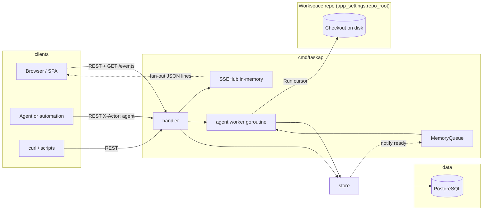
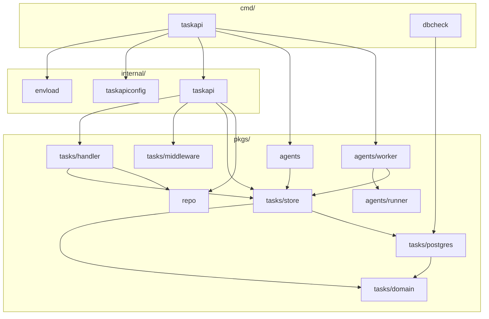
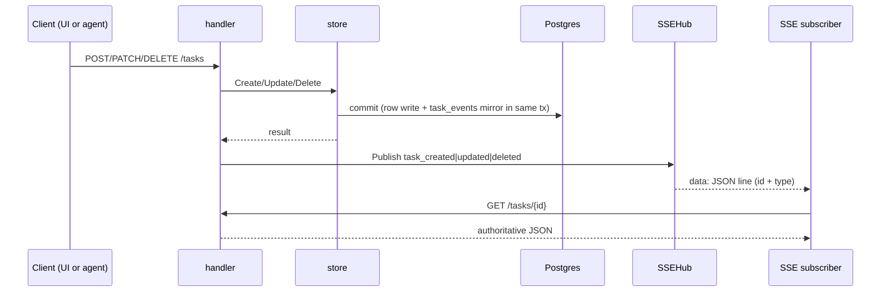
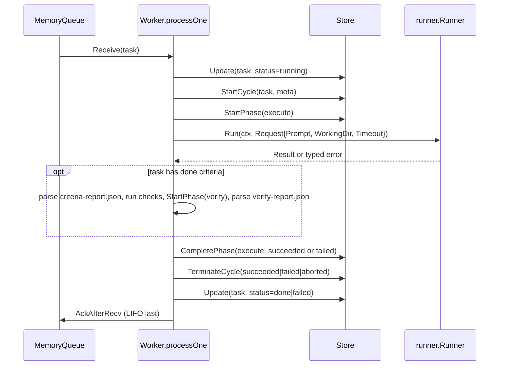

# Architecture

How `taskapi` is shaped: data flow, the persistence layer, the agent worker, and the SSE hub. Data model lives in [data-model.md](./data-model.md); endpoint surface in [api.md](./api.md); configuration in [configuration.md](./configuration.md).

## Goals

- Lots of tasks in flight; humans, scripts, and agents act through the same REST API.
- Postgres is the single source of truth: projects, tasks, execution cycles, context snapshots, and an append-only `task_events` audit trail.
- Browsers and runners subscribe to lightweight "something changed" SSE hints and refetch JSON from REST.
- Long-running work preserves shared context across tasks (`project_id`) without collapsing the subtask tree (`parent_id`). The two answer different questions.

## System



Successful writes call `notifyChange`, which publishes through `SSEHub`. The store maps DB errors to `domain.ErrNotFound` and `domain.ErrInvalidInput`, and appends `task_events` on every meaningful mutation. The SSE hub is in-memory only — not durable, not shared across processes. `GET /repo/*` and `@`-mention validation use `pkgs/repo` only when `app_settings.repo_root` is configured.

## Go packages



`domain` has no DB or HTTP dependency. `store` is a thin facade over per-domain packages under `pkgs/tasks/store/internal/<domain>/`; cross-domain transactions compose via exported `…InTx` helpers. `handler` is the routing layer; black-box HTTP tests live in `internal/handlertest/`. Middleware lives in `pkgs/tasks/middleware`; `Stack` is composed in `internal/taskapi.NewHTTPHandler`.

## Write path and live UI



SSE is a hint. The follow-up GET returns the authoritative body.

## Persistence

GORM + Postgres. Schema migration is `AutoMigrate` only — no versioned migration files. The same migration runs against SQLite in tests via `tasktestdb.OpenSQLite`.

| Table | Purpose |
|---|---|
| `tasks` | Tasks (optional `project_id`, optional `parent_id`, flat tags + milestone, gate JSON, `depends_on` via `task_dependencies`). |
| `task_events` | Append-only audit log. Every cycle/phase mutation appends a mirror row in the same SQL transaction. |
| `task_cycles` / `task_cycle_phases` | Typed execution-cycle substrate (see [data-model.md](./data-model.md)). |
| `task_cycle_stream_events` | Durable normalized Cursor `stream-json` progress for one attempt. |
| `task_checklist_items` / `task_checklist_completions` | Per-task done criteria. |
| `task_dependencies` | Directed acyclic graph between tasks. |
| `task_drafts` | Persisted create-form state (autosave + named drafts). |
| `task_draft_evaluations` | Snapshots from `POST /tasks/evaluate`. |
| `projects` / `project_context_items` / `project_context_edges` | Long-lived projects and curated shared context. |
| `task_context_snapshots` | Immutable cycle-scoped copies of the context bundle handed to a runner. |
| `app_settings` | Singleton (`id=1`) UI-driven configuration (see [configuration.md](./configuration.md)). |

Concurrency: `Update` runs in a transaction with `SELECT … FOR UPDATE`; concurrent patches serialize. There is no ETag — last successful transaction wins. JSON task responses carry no `created_at` / `updated_at` fields; timestamps live on `task_events`.

## SSE hub

In-memory ring buffer keyed by monotonic event id. Each `Publish` allocates a new id, marshals the frame, and stores it (default 1024 entries). On reconnect, `EventSource` sends `Last-Event-ID`; the handler replays every retained frame newer than that value, then enters the live loop. If the requested id is older than the oldest retained entry, the handler emits one `resync` directive and the client drops caches.

- Subscriber buffer: 32 entries. Slow consumers are evicted with a `resync` frame.
- Heartbeat: a `: heartbeat` comment line every 15s so proxies do not idle-kill the connection.
- Coalescing: identical `{type,id}` frames inside a 50ms window are dropped. `task_cycle_changed` and `agent_run_progress` are intentionally never coalesced.

## Agent worker

`pkgs/agents/worker` is the single in-process consumer of `pkgs/agents.MemoryQueue`. It is enabled by default whenever `app_settings.repo_root` is set; toggle from the SPA Settings page. Disabled by default if no workspace is configured.

### Lifecycle of one task



- `AckAfterRecv` runs last. Until terminate succeeds, the task id stays in the queue's pending set so a notify+reconcile race cannot start a second cycle.
- Panic recovery runs before ack on a fresh 5s background context: best-effort `CompletePhase(failed, "panic")` + `TerminateCycle(failed, "panic")` + `Update(task, failed)`.
- Shutdown branch after `runner.Run` returns: same shape with reason `"shutdown"` and cycle status `aborted`.

### Runner abstraction

```go
type Runner interface {
    Run(ctx context.Context, req Request) (Result, error)
    Name() string
    Version() string
}

type Request struct {
    TaskID     string
    AttemptSeq int64
    Phase      domain.Phase
    Prompt     string
    WorkingDir string
    Timeout    time.Duration
    Env        map[string]string
}
```

Errors must wrap one of `runner.ErrTimeout`, `runner.ErrNonZeroExit`, `runner.ErrInvalidOutput`, or be a generic adapter failure. The worker's `classifyRunOutcome` maps each to a `cycle_failed` mirror with a fixed `reason` string (`runner_timeout`, `runner_non_zero_exit`, `runner_invalid_output`, `runner_error`).

`Name()` and `Version()` go into `task_cycles.meta_json` once per cycle. `prompt_hash` is `sha256(initial_prompt)` — never the body.

V1 ships exactly one adapter (`pkgs/agents/runner/cursor`). Adding Claude Code / Codex lands as one new file in `pkgs/agents/runner/` plus a registry entry in `pkgs/agents/runner/registry`.

### Cursor adapter

- Invocation: `cursor --print --output-format stream-json`. Prompt fed on stdin. Working directory is `app_settings.repo_root`. Timeout is `app_settings.max_run_duration_seconds` (`0` = no limit).
- Env allowlist (`cursor.defaultPassthroughEnvKeys`): curated `PATH` / home keys plus required non-secret Windows process keys. `DATABASE_URL` and any `T2A_*` key are scrubbed unconditionally.
- Redaction (`cursor.Redact`): `Authorization: …` and cookies, `T2A_…=value` assignments, absolute home paths rewritten to `~`.
- Live progress: `stream-json` lines are read line-by-line and normalized into `runner.ProgressEvent`, published as ephemeral `agent_run_progress` SSE frames (not persisted in `task_events`).
- Startup probe: `cursor --version` runs once per supervisor reload. Probe failure logs an error and exits the worker (fail-loud per the engineering bar). The worker is not started without a successful probe.

### Process-restart orphan sweep

`worker.SweepOrphanRunningCycles` runs once at startup before `Worker.Run` begins, only when the supervisor decides the worker can run.

1. Every `task_cycle_phases.status='running'` → `CompletePhase(failed, "process_restart")` (phase-first so `TerminateCycle` does not reject).
2. Every `task_cycles.status='running'` → `TerminateCycle(aborted, "process_restart")`.
3. For each cycle aborted by step 2 whose task is still `StatusRunning` → `Update(task, failed)`.

Idempotent: no-op on a clean DB. Skipped when the worker is disabled.

## Ready-task queue and reconcile

`pkgs/agents` ships `domain.Task` snapshots into a bounded in-memory FIFO (`MemoryQueue`, default depth `256`, configurable via `T2A_USER_TASK_AGENT_QUEUE_CAP`).

- After a successful commit that leaves a task `ready`, `Store.notifyReadyTask` enqueues a snapshot. If the queue is full, the mutation still succeeds (the notify failure is `Warn`-logged).
- `PickupWakeScheduler` defers enqueue when `pickup_not_before` is in the future. Startup `Hydrate` reloads deferred rows.
- `agents.RunReconcileLoop` runs `ReconcileReadyTasksNotQueued` once at startup and every 2 minutes (fixed in code, `ReconcileTickInterval`). It pages `store.ListReadyTaskQueueCandidates` in oldest-first order so backlog is not starved.

**Invariant:** the queue never contains a task the SQL filter `status='ready' AND (pickup_not_before IS NULL OR pickup_not_before <= now())` would reject.

The queue is single-process: multiple `taskapi` replicas with the worker enabled are **not supported** (the orphan sweep would race in-flight cycles).

## Limitations

1. The SSE hub is in RAM, single-process. Load balancers can split `/events` from the instance that handles writes; multiple replicas do not share subscribers.
2. SSE delivery is best-effort: the per-subscriber buffer is bounded and slow clients are evicted with a `resync` frame.
3. No authentication or authorization beyond optional bearer token (`T2A_API_TOKEN`); `X-Actor` is labeling, not identity proof.
4. Per-IP HTTP rate limiting is in-memory per process (`T2A_RATE_LIMIT_PER_MIN`); replicas do not share state. `RemoteAddr` is the only client key (no trusted `X-Forwarded-For`).
5. Request bodies cap at 1 MiB by default (`T2A_MAX_REQUEST_BODY_BYTES`).
6. `Idempotency-Key` is honored only inside a single `taskapi` process.
7. Schema evolution is `AutoMigrate` only — no versioned migration files.
8. List ordering is fixed (`id ASC`); no sort or filter query parameters beyond `after_id` keyset paging.
9. **Cycles vs audit log:** typed `task_cycles` / `task_cycle_phases` are authoritative for live execution state. Every mutation mirrors into `task_events` in the same SQL transaction. Do not merge those concerns back into a single store.
10. **Agent worker is single-process.** No retry/backoff; one attempt per task. No per-cycle workspace isolation — sequential runs share the working directory.
11. `dbcheck` does not serve HTTP. `GET /health` and `/health/live` are liveness-only (no DB probe); `/health/ready` does a DB ping + `SELECT 1` plus a workspace directory stat when `app_settings.repo_root` is set.
12. `taskapi` serves plain HTTP. TLS belongs at a reverse proxy or load balancer.
13. No CORS (assume same origin or a gateway in front).
