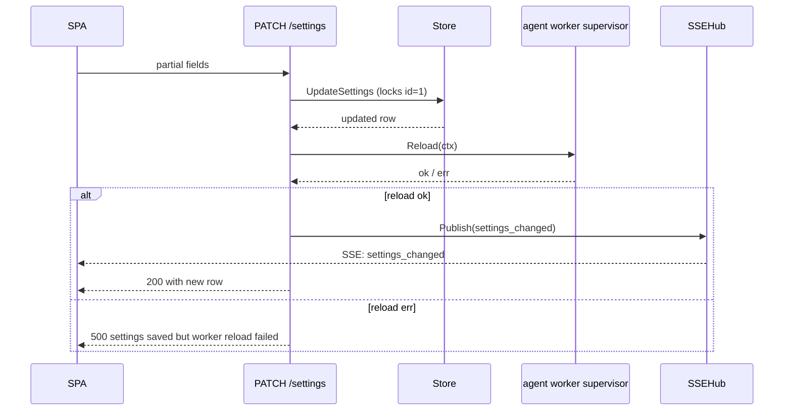

# Configuration

Two surfaces:

- **Environment variables** — process-level knobs (logging, listen host, HTTP limits, agent queue capacity, idempotency cache). Authoritative source: `internal/taskapiconfig` and `pkgs/tasks/middleware`.
- **`app_settings` DB row** — UI-driven runtime config (workspace repo, agent worker, runner, verify loop). Singleton row (`id=1`) authored from the SPA Settings page or `PATCH /settings`. Authoritative source: `pkgs/tasks/domain/app_settings.go`.

The two surfaces do not overlap. Anything in `app_settings` is **not** driven by env vars (and historical env vars like `HAMIX_AGENT_WORKER_*` and `REPO_ROOT` are silently ignored).

## In this article

- [Environment variables](#environment-variables)
- [Schema migrations](#schema-migrations)
- [App settings](#app-settings-app_settings-row)
- [Metrics](#metrics-get-metrics)

## Environment variables

`taskapi` loads `.env` from the repo root via `internal/envload.Load`. `dbcheck` follows the same discovery rule for `DATABASE_URL`. Docker Compose also loads the same file via `env_file` in [compose.yml](../compose.yml).

> **Note** — [.env.example](../.env.example) lists only `DATABASE_URL` and optional logging knobs. The tables below are the full operator reference (defaults, flags, and dev-only tunables).

| Variable | Required | Default | Purpose |
|---|---|---|---|
| `DATABASE_URL` | Yes (after env load) | — | Postgres connection string for GORM. |
| `HAMIX_LISTEN_HOST` | No | `127.0.0.1` | HTTP bind host. `0.0.0.0` for all interfaces. `taskapi -host` flag overrides. |
| `HAMIX_API_TOKEN` | No | — | When set, `Authorization: Bearer <token>` required on every route except `/health*` and `/metrics`. |
| `HAMIX_HTTP_REQUEST_TIMEOUT` | No | `30s` | Go duration. Request execution timeout for non-SSE routes via context deadline. `0` disables. `GET /events` is exempt. |
| `HAMIX_LOG_DIR` | No | `./logs` | Directory for JSON log files. `taskapi -logdir` flag overrides. |
| `HAMIX_LOG_LEVEL` | No | `info` | Minimum `slog` level (`debug` / `info` / `warn` / `error`). `taskapi -loglevel` flag overrides. |
| `HAMIX_DISABLE_LOGGING` | No | — | `1`/`true`/`yes`/`on`: no JSONL file; only `slog.Error` to stderr. Same as `taskapi -disable-logging`. |
| `HAMIX_MIGRATE` | No | — | `1`/`true`/`yes`/`on`: run `postgres.Migrate` at taskapi startup. Same as `taskapi -migrate`. Default: skip migrate. |
| `HAMIX_GORM_SLOW_QUERY_MS` | No | `200` | Statements slower than this log at `Warn`. `0` disables slow-SQL branch. |
| `HAMIX_RATE_LIMIT_PER_MIN` | No | `120` | Per-IP token bucket. `0` disables. Key is `RemoteAddr` host (no trusted `X-Forwarded-For`). Exempt: `/health*`, `/metrics`. Over limit: `429 rate limit exceeded` with `Retry-After: 60`. |
| `HAMIX_IDEMPOTENCY_TTL` | No | `24h` | Idempotency cache TTL for `Idempotency-Key`. `0` disables. In-process only — not shared across replicas. |
| `HAMIX_IDEMPOTENCY_MAX_ENTRIES` | No | `2048` | Max idempotency cache entries. `0` disables entry-count bounding. |
| `HAMIX_IDEMPOTENCY_MAX_BYTES` | No | `8388608` (8 MiB) | Max idempotency cache memory. `0` disables byte bounding. |
| `HAMIX_MAX_REQUEST_BODY_BYTES` | No | `1048576` (1 MiB) | Reject larger bodies with `413 request body too large`. `0` disables. |
| `HAMIX_USER_TASK_AGENT_QUEUE_CAP` | No | `256` | Bounded depth of `pkgs/agents.MemoryQueue`. Not durable, not shared. See [domain/agent-queue.md](domain/agent-queue.md). |
| `HAMIX_AGENT_WORKER_CONCURRENCY` | No | `4` | In-process worker pool size (`pkgs/agents/worker.Pool`). Valid range 1–32; invalid or unset values clamp to default. Slots share one queue and one `WorktreeGate` — sequential within a worktree, parallel across worktrees. See [ADR-0039](adr/ADR-0039-fixed-worktree-branch.md) and [domain/agent-queue.md](domain/agent-queue.md). |
| `HAMIX_WORKER_REPORT_DIR` | No | `<os.TempDir()>/hamix-worker` | Worker-managed scratch root for the agent ↔ worker side-channel report files (`criteria-report.json`, `verify-report.json`). Lives outside `app_settings.repo_root` so customer working trees stay clean. The supervisor probes writability at startup; failure logs a `report_dir_not_writable` warn and the worker still starts (verify will fail loudly on the first run instead of silently). The per-cycle `<dir>/<cycle_id>/` subdirectory is GC'd at cycle terminate so disk use stays bounded. |
| `HAMIX_SSE_TEST` | No | — | Dev: enable synthetic SSE ticker. See [api.md](./api.md). |
| `HAMIX_SSE_TEST_*` | No | — | Dev tuning (interval, events per tick, lifecycle simulation). See [api.md](./api.md) and [domain/sse-hub.md](domain/sse-hub.md). |

### Local development (optional)

| Variable | Default | Purpose |
| --- | --- | --- |
| `HAMIX_HOST_HOME` | Host `HOME` / `USERPROFILE` (Docker Compose only) | Host path bind-mounted to `/host-home` in [compose.yml](../compose.yml) and [compose.prod.yml](../compose.prod.yml). Optional override when full home is too broad (e.g. narrow to `C:/Users/me/projects`). |
| `HAMIX_HOST_CLI_DIR` | `/usr/local/bin` (production Compose only) | Host directory bind-mounted read-only to `/host-cli` in [compose.prod.yml](../compose.prod.yml). Point Settings → `cursor_bin` at `/host-cli/cursor` after mount. See [docker.md](./docker.md). |
| `HAMIX_PATH_MAP` | — | Optional JSON object mapping **container prefix → host prefix** (e.g. `{"/host-home":"/Users/me"}`). Git API `host_path` fields and legacy Settings `repo_root` responses show host paths; inbound requests stay container paths. Invalid JSON logs a warn at boot and is ignored. |
| `HAMIX_BROWSE_ROOTS` | — | Comma-separated absolute paths. When set, **replaces** DB-sourced workspace roots (registered git repositories) for the picker. Use for CI or restricted deployments where git_repositories rows should not drive the picker. Also constrains `GET /settings/browse-dirs` to these paths; without it, browse-dirs performs full-disk listing for register-repo bootstrap. |
| `DEV_TASKAPI_PORT` | `8080` | Non-default API port when using `scripts/dev.*`. Set `VITE_TASKAPI_ORIGIN` in `web/.env.local` to match. |
| `DEV_TASKAPI_STARTUP_TIMEOUT_SEC` | `150` | Port-wait timeout when using `scripts/dev.* -Migrate` sugar (derived from migrate timeout + grace). |
| `VITE_TASKAPI_ORIGIN` | `http://127.0.0.1:8080` | Vite dev proxy target (`web/` only). See [web.md](./web.md). |
| `VITE_UI_TEST_MODE` | — | When `true`/`1`, demo JSON for some GET routes (layouts without DB seed). Mutations still hit taskapi. Settings → UI test mode. |

Reconcile tick interval is fixed in code (`pkgs/agents.ReconcileTickInterval`, 2 minutes), not an env var.

### Startup sequence (`taskapi`)

1. Resolve `.env` (repo-root or `-env`), overlay logging env vars first so `HAMIX_LOG_*` apply before the log file is opened, then `envload.Load` (requires `DATABASE_URL`).
2. Open the log file (`taskapi-YYYY-MM-DD-HHMMSS-<nanos>.jsonl` under `HAMIX_LOG_DIR`). When `HAMIX_DISABLE_LOGGING` is set, only `slog.Error` goes to stderr (text handler).
3. `postgres.Open` — GORM connection. Configures `database/sql` pool (max open/idle, lifetime). No startup `Ping`.
4. `postgres.CheckSchemaDrift` — compare code `SchemaRevision` to `schema_meta` row; stderr + log alert when migrate is required.
5. **Optional** `postgres.Migrate` — only when `taskapi -migrate` or `HAMIX_MIGRATE=1`; otherwise skipped (see [Schema migrations](#schema-migrations)).
6. `store.NewStore`, `(*store.Store).SetReadyTaskNotifier` (in-process queue), `(*store.Store).SetPickupWake` (deferred ready), `handler.NewSSEHub`.
7. Agent worker supervisor (`cmd/taskapi/run_agentworker.go`) reads `app_settings`, builds the runner via `pkgs/agents/runner/registry`, probes the binary, and starts the worker when conditions are met. Deep dive: [domain/agent-supervisor.md](domain/agent-supervisor.md).
8. `internal/taskapi.NewHTTPHandler` wires store + hub + repo into `handler.NewHandler`, then applies `pkgs/tasks/middleware.Stack` (recovery, metrics, access logging, rate limit, optional auth, timeouts, body cap, idempotency).
9. `http.Server` on `-port` (default 8080). `ReadHeaderTimeout` / `ReadTimeout` / `IdleTimeout` / `MaxHeaderBytes` are set; `WriteTimeout` is intentionally **not** set so SSE streams are not cut off.

### Graceful shutdown

On `SIGINT`/`SIGTERM`: `http.Server.Shutdown` with a 10s deadline, then close the SQL pool, sync and close the log file. Exit code `0` on clean shutdown, `1` if `Close` errors.

### `dbcheck`

`go run ./cmd/dbcheck` connects, pings (`postgres.DefaultPingTimeout` = 30s), optionally migrates (`-migrate`, 120s), and exits. Does not serve HTTP.

### Build identity

`/health`, `/health/live`, `/health/ready` return `version` (from `runtime/debug.ReadBuildInfo`). `taskapi` logs the same value on the `listening` line; `dbcheck` logs it on `dbcheck.start`. Use it to confirm which binary handled traffic.

### Request correlation

Every request gets a `request_id` (from `X-Request-ID` or a generated UUID). The handler wraps `slog` so access logs, GORM SQL traces, and JSON error bodies (`request_id` field) all share that value. JSON error bodies may include `request_id`; the SPA's `readError` appends it to error messages.

## Schema migrations

Hamix uses GORM **AutoMigrate** plus idempotent upgrade steps in [`pkgs/tasks/postgres/postgres.go`](../pkgs/tasks/postgres/postgres.go) (`postgres.Migrate`). There are no numbered SQL migration files. An integer **`SchemaRevision`** in [`schema_revision.go`](../pkgs/tasks/postgres/schema_revision.go) is stored in the `schema_meta` table after migrate; bump it in the same PR as any domain model or migrate-step change (CI enforces).

**Two-step workflow:** migrate first, then start servers.

| Step | Command | When |
| --- | --- | --- |
| **1. Migrate** | `.\scripts\migrate.ps1` / `./scripts/migrate.sh` | First-time setup; after `git pull` with schema changes; production deploy before traffic |
| **2. Dev servers** | `.\scripts\dev.ps1` / `./scripts/dev.sh` | Daily dev — does **not** migrate by default |

| When | Where | What runs |
| --- | --- | --- |
| **Explicit migrate** (primary) | `scripts/migrate.*` or `go run ./cmd/dbcheck -migrate` | `postgres.Migrate` + backfill under `postgres.DefaultMigrateTimeout` (120s); updates `schema_meta` |
| **Dev servers** | `scripts/dev.*` | Starts taskapi (no migrate) + Vite. Optional `-Migrate` sugar runs step 1 first. |
| **taskapi boot** (optional) | `-migrate` or `HAMIX_MIGRATE=1` | Same migrate as `dbcheck -migrate` when set; default is skip + drift check |
| **Production deploy** | `dbcheck -migrate` (image includes `/app/dbcheck`) | Release step 1 before rolling out taskapi without migrate |

If code `SchemaRevision` exceeds the database, taskapi logs an error, prints a stderr banner, and `GET /health/ready` returns `503` with `checks.schema=pending` until migrate runs.

See [ADR-0034](adr/ADR-0034-opt-in-schema-migration.md).

## App settings (`app_settings` row)

Singleton row in Postgres (CHECK enforces `id=1`). AutoMigrate creates the table; first read seeds it with `domain.DefaultAppSettings`. Authored via the SPA Settings page (gear icon → `/settings`) or `PATCH /settings`.

| Field | Type | Default | Effect |
|---|---|---|---|
| `agent_paused` | bool | `false` | Operator-facing soft pause exposed as a one-click toggle in the SPA header chip. The agent worker always starts at boot; pause is the only "stop dequeuing" knob. Idle reason: `paused_by_operator`. Surfaces in `GET /system/health`. |
| `runner` | string | `"cursor"` | Identifier from `pkgs/agents/runner/registry`. Production: `cursor`. Scaffold: `claude-code` (registered but not production-ready). See [domain/runner-adapters.md](domain/runner-adapters.md). |
| `repo_root` | string | `""` | Absolute path to the workspace the worker and `/repo/*` operate against. Set from Settings → **Agent workspace** → **Choose project folder** (stored as the absolute path taskapi sees). **Empty = not configured**: supervisor stays idle, repo routes respond `409 repo_root_not_configured`, `@`-mention validation is skipped. See [domain/workspace-repo.md](domain/workspace-repo.md). |
| `cursor_bin` | string | `""` | Cursor CLI binary path. Empty = `PATH` lookup of `cursor`. Absolute paths pin a build. |
| `cursor_model` | string | `""` | Optional Cursor model forwarded to the runner. Empty = omit the model flag (Cursor uses account default). |
| `max_run_duration_seconds` | int (≥0) | `0` | Per-run wall-clock cap on `runner.Request.Timeout`. `0` = no limit. |
| `stream_idle_stuck_seconds` | int (≥0) | `60` | Stdout silence threshold after the first line before killing a hung cursor run and attempting evidence recovery. `0` = disabled. Suspicious/kill-warning tiers are derived (`stuck/2`, `stuck−5s`). |
| `agent_pickup_delay_seconds` | int (≥0) | `5` | Delay applied to new ready tasks before the worker can dequeue them. `0` disables. |
| `display_timezone` | string | `""` | IANA timezone for SPA timestamps. Empty = browser auto-detect. Validated via `time.LoadLocation`. |
| `optimistic_mutations_enabled` | bool | `true` | Always-on compatibility field. |
| `sse_replay_enabled` | bool | `true` | Always-on compatibility field. |
| `verify_max_retries` | int (≥0) | `2` | Max execute↔verify retry loops per cycle. |
| `verify_runner_name` | string | `""` | Adversarial verify runner id. Empty = reuse execute runner. When set to a different id (e.g. `claudecode`), the supervisor builds and probes that runner separately at startup and on every `PATCH /settings`; build/probe failure logs `verify_runner_probe_failed` / `verify_runner_build_failed` and demotes verify to "reuse execute runner" so the worker keeps running. Setting it equal to `runner` is equivalent to leaving it empty. |
| `verify_runner_model` | string | `""` | Optional model for the verify runner. Changing this triggers a worker restart on `PATCH /settings`. |
| `verify_command_timeout_seconds` | int (>0) | `120` | Wall-clock cap per optional criterion shell check during verify. |
| `cursor_session_resume_enabled` | bool | `true` | When `false`, every `runner.Run` uses a fresh Cursor chat and full prompt compose (pre-ADR-0031 behavior). See [cursor-session-resume.md](domain/cursor-session-resume.md). |
| `updated_at` | RFC3339 (response only) | server clock | Last successful upsert. SPA shows "last changed N ago". |

> **Note** — Execute-phase git commits are **always required** when `repo_root` is a git worktree (clean tree + indexed ancestry before verify). The former `agent_commit_execute_work` toggle and legacy cycle markers message markers were removed in [ADR-0014](adr/ADR-0014-cycle-commit-tracking.md). See [domain/cycle-commits.md](domain/cycle-commits.md).

### Validation

`store.UpdateSettings` rejects (`400`) when:

- `runner` is non-empty and not in `pkgs/agents/runner/registry`.
- `max_run_duration_seconds` is negative.
- `stream_idle_stuck_seconds` is negative.
- `verify_max_retries` is negative.
- `repo_root` contains a NUL byte.

`repo_root` is **not** validated for "directory exists" on `PATCH` — the supervisor reports `repo_root_open_failed` on the next reload, surfaced via `/health/ready` (`workspace_repo: fail`).

### Lifecycle on `PATCH /settings`

Supervisor reload semantics (idle reasons, hot-swap, cancel): [domain/agent-supervisor.md](domain/agent-supervisor.md).



`Reload` is idempotent: when no material field changed, the supervisor leaves the in-flight worker alone.

### Migration from env vars

The variables below are silently ignored if still present in `.env`. Move the values into `app_settings` via the SPA or `PATCH /settings`.

| Old env var | Replacement |
|---|---|
| `HAMIX_AGENT_WORKER_ENABLED` | Deprecated. The agent worker always starts; use the header pause toggle (`agent_paused`) for a runtime stop. |
| `HAMIX_AGENT_WORKER_CURSOR_BIN` | `app_settings.cursor_bin`. |
| `HAMIX_AGENT_WORKER_RUN_TIMEOUT` | `app_settings.max_run_duration_seconds` (default `0` = no limit, not 5m). |
| `HAMIX_AGENT_WORKER_WORKING_DIR` | Removed — register git repositories on `/worktrees`; tasks bind `worktree_id` (branch via `git_worktrees.branch_id`). |
| `REPO_ROOT` | Removed — same as above ([ADR-0033](./adr/ADR-0033-git-worktrees-and-branches.md)). |

### Test-only override

Real-cursor smoke tests honour `HAMIX_TEST_CURSOR_BIN` to point at a specific binary path. This is unrelated to production `app_settings.cursor_bin`; it only wires test runs.

## Metrics (`GET /metrics`)

Prometheus scrape endpoint. Most series are stable; one label set needs operator awareness:

### `hamix_agent_runs_by_model_total` cardinality

The `model` label is not capped at the wire. Watch with:

```promql
count({__name__="hamix_agent_runs_by_model_total"})
```

If it spikes, check for typos in `tasks.cursor_model` / `app_settings.cursor_model`, and cap label values at the scraper with `metric_relabel_configs`. The older `hamix_agent_runs_total{runner,terminal_status}` series is byte-identical to the pre-feature shape and always safe for alerting.
