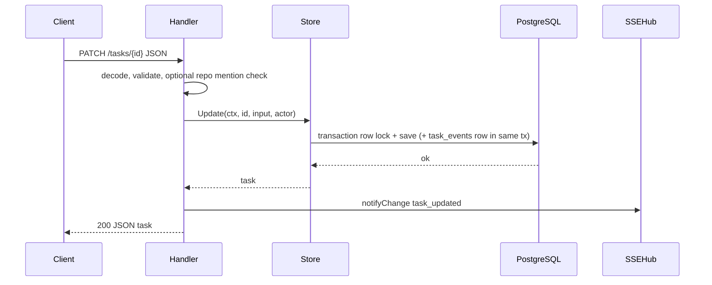

# Contributing — developer guide

How to change T2A safely: vertical slices, contract sync, tests, and local troubleshooting.

| | |
| --- | --- |
| **Applies to** | Adding features, splitting handlers, tests, and debugging local failures |
| **Audience** | Human contributors and agents implementing code changes |
| **Prerequisite** | [guide.md](./guide.md) for doc navigation; [AGENTS.md](../AGENTS.md) for scoped paths and verify commands |
| **Not in this article** | Install and run ([README.md](../README.md)), API reference ([api.md](./api.md)), agent routing ([AGENTS.md](../AGENTS.md)) |

## In this article

- [Overview](#overview)
- [Before you open a PR](#before-you-open-a-pr)
- [Add a feature (vertical slice)](#add-a-feature-vertical-slice)
- [Keep contracts in sync](#keep-contracts-in-sync)
- [When the handler package grows](#when-the-handler-package-grows)
- [Tests](#tests)
- [Troubleshooting](#troubleshooting)
- [See also](#see-also)

## Overview

This is the **canonical** contributor guide. Root [CONTRIBUTING.md](../CONTRIBUTING.md) is a GitHub stub (security + one verify command). For learning the project, start with [guide.md](./guide.md). For “where is the code for X?”, use [AGENTS.md](../AGENTS.md) and [agent-map.md](./agent-map.md).

> **Note** — Prefer one vertical slice per PR. Update reference docs in the same commit when behavior or contracts change.

> **Important** — All `fetch` calls live in `web/src/api/` only. After a successful handler write, call `notifyChange` so SSE subscribers refetch.

> **Warning** — Never commit `.env` or secrets. Copy [.env.example](../.env.example) locally and set `DATABASE_URL`.

## Before you open a PR

- [ ] `.env` configured; schema applied: `go run ./cmd/dbcheck -migrate` (see [README.md](../README.md))
- [ ] Full local bar passes: `./scripts/check.sh` or `.\scripts\check.ps1` (Go-only: `CHECK_SKIP_WEB=1`)
- [ ] First-time or lockfile change: `(cd web && npm ci)` before the check script
- [ ] API, JSON, SSE, or settings changed → [Keep contracts in sync](#keep-contracts-in-sync) checklist done
- [ ] New behavior has tests (prefer failing test first, then implement until green)
- [ ] Focused doc updated when observable behavior changes ([docs/README.md](./README.md) index)

Commands (same as CI):

```bash
go vet ./... && go test ./... -count=1
cd web && npm test -- --run && npm run lint && npm run check:standards && npm run build
```

> **Tip** — Before grepping the tree, check [AGENTS.md](../AGENTS.md) §Where to find X for the subsystem you are editing.

## Add a feature (vertical slice)

Prefer one slice from `domain` to the UI:

1. **`domain`** — Types, enums, validation. No DB, no HTTP imports.
2. **`store`** — Use-case methods with clear inputs, transactions, and audit rows. Map DB errors to `domain.ErrNotFound` / `domain.ErrInvalidInput` only. Do not log inside the store.
3. **`handler`** — Decode and validate the body, call the store, translate errors to status codes, then call `notifyChange` after a successful write. Business rules belong in `store` / `domain`, not in the handler.
4. **`web/`** (optional) — Extend `web/src/types/`, then `web/src/api/` (`parseTaskApi` and friends), then UI under `web/src/<feature>/`.

For **task UI** under `web/src/tasks/`, use the family folder + barrel pattern described in [web.md](./web.md).

Sequence for a mutating task request:



## Keep contracts in sync

When you change REST paths, query params, response shapes, SSE payload types, audit event types, env vars, or `app_settings` fields:

| Change | Update |
| --- | --- |
| Routes, status codes, request bodies | [api.md](./api.md); handler godoc is authoritative for edge behavior |
| Architecture limits or component wiring | [architecture.md](./architecture.md) |
| Env vars or app settings | [configuration.md](./configuration.md) |
| SSE event names or fanout | [domain/sse-hub.md](./domain/sse-hub.md); handler `notifyChange` paths |
| Task JSON on the wire | `web/src/api/parseTaskApi*.ts`, `web/src/types/`, Go `handler_*_json.go` / domain types |
| Middleware order | `pkgs/tasks/middleware.Stack` (wired by `internal/taskapi.NewHTTPHandler`) |

Default tests must not require real Postgres or outbound network.

## When the handler package grows

The handler package is intentionally **flat** (one directory, `package handler`). See `pkgs/tasks/handler/README.md` for the file→route map.

### Already split out

| Concern | Package |
| --- | --- |
| HTTP middleware chain | `pkgs/tasks/middleware` |
| Black-box middleware tests | `internal/middlewaretest` |
| Call stack / `call_path` | `pkgs/tasks/calltrace` |
| JSON at boundaries | `pkgs/tasks/apijson` |
| Black-box HTTP tests | `internal/handlertest` |
| Security-header expectations | `internal/httpsecurityexpect` |

### Conventions

- **Whitebox** tests (unexported symbols): stay `package handler` in `pkgs/tasks/handler/`.
- **Black-box HTTP** tests: prefer `internal/handlertest`.
- Do **not** create `handler/subpkg` with `package handler` — Go does not allow it.

### When a file feels too large

Extract in small PRs: task JSON DTOs → dedicated package; repo HTTP surface when stable; more tests → `internal/handlertest`. File size targets: `.cursor/rules/CODE_STANDARDS.mdc`.

## Tests

- Default Go tests use SQLite via `internal/tasktestdb.OpenSQLite` — not real Postgres.
- Integration tests needing `DATABASE_URL`: gate with `//go:build integration`.
- Web: co-located Vitest + MSW under `web/src/test/` (see `.cursor/rules/UI_AUTOMATION/testing-recipes.mdc`).
- **TDD default:** failing test first, then implement until green. Go patterns: `.cursor/rules/backend-engineering-bar.mdc` §11.

Run the full command list under [Before you open a PR](#before-you-open-a-pr). Middleware test placement: `pkgs/tasks/middleware/README.md` § Tests.

<a id="troubleshooting"></a>

## Troubleshooting

| Symptom | First step | Details |
| --- | --- | --- |
| Full reload on `/tasks/<id>` shows raw JSON | Restart Vite dev server | [#full-reload-on-tasksid-shows-raw-json](#full-reload-on-tasksid-shows-raw-json) |
| SSE connected but Updates timeline empty | `T2A_SSE_TEST=1` in `.env`, restart `taskapi` | [#sse-connected-but-the-updates-timeline-does-not-grow](#sse-connected-but-the-updates-timeline-does-not-grow) |
| Fetch / EventSource errors | Confirm `taskapi` on `:8080` and dev script running | [#web-cannot-reach-the-api-fetch--eventsource-errors](#web-cannot-reach-the-api-fetch--eventsource-errors) |
| No repository for file search | Set **Workspace repository** in SPA Settings | [#no-repository-is-configured-for-file-search](#no-repository-is-configured-for-file-search) |
| Match API error to logs | Use `request_id` from JSON body / `X-Request-ID` | [#matching-a-failing-request-to-logs](#matching-a-failing-request-to-logs) |
| Tests fail with database errors | Use SQLite helpers or `//go:build integration` | [#tests-fail-with-database-or-connection-errors](#tests-fail-with-database-or-connection-errors) |
| Local checks still fail | Re-run with `-count=1`, compare CI | [#local-checks-fail--quick-playbook](#local-checks-fail--quick-playbook) |

<a id="full-reload-on-tasksid-shows-raw-json"></a>

### Full reload on `/tasks/<id>` shows raw JSON

In dev, Vite proxies `/tasks` to `taskapi`. A full page navigation must still serve the SPA. Fix: pull the current `web/vite.config.ts` (it bypasses the proxy when `Accept` includes `text/html`) and restart `npm run dev`.

<a id="sse-connected-but-the-updates-timeline-does-not-grow"></a>

### SSE "Connected" but the Updates timeline does not grow

Without the dev ticker, `task_updated` SSE only fires after real writes. Set `T2A_SSE_TEST=1` in `.env` and restart `taskapi`. Use `T2A_SSE_TEST_EVENTS_PER_TICK` for faster churn, `T2A_SSE_TEST_SYNC_ROW=1` so task headers match, `T2A_SSE_TEST_LIFECYCLE=1` for create/delete hints. See [api.md](./api.md).

<a id="no-repository-is-configured-for-file-search"></a>

### `No repository is configured for file search` in the rich prompt

`app_settings.repo_root` is empty. Open the SPA, click the gear icon, set the **Workspace repository** to an absolute path. The supervisor reloads in-process; no `taskapi` restart needed.

<a id="web-cannot-reach-the-api-fetch--eventsource-errors"></a>

### Web cannot reach the API (fetch / EventSource errors)

`taskapi` not running, wrong port, or proxy target mismatch. Default API is `http://127.0.0.1:8080`. If you change the API port, set `VITE_TASKAPI_ORIGIN` for Vite (and `DEV_TASKAPI_PORT` for `scripts/dev.*`).

<a id="matching-a-failing-request-to-logs"></a>

### Matching a failing request to logs

JSON error bodies may include `request_id` (and the response echoes `X-Request-ID`). The same value appears on `http.access` lines and related handler logs. Build version: `GET /health` returns `version`; `taskapi` logs the same string on its `listening` line.

`GET /tasks` (`tasks.list`) is the highest-traffic read route. On failure, search logs for `operation=tasks.list` with `msg=request failed`. Structured `failure_stage` values: `parse_list_params`, `store_list`, `response_encode`, `body`, `newline`.

<a id="tests-fail-with-database-or-connection-errors"></a>

### Tests fail with "database" or connection errors

Default tests should use SQLite helpers. If a test needs `DATABASE_URL`, gate with `//go:build integration` or refactor to `tasktestdb.OpenSQLite`.

<a id="local-checks-fail--quick-playbook"></a>

### Local checks fail — quick playbook

1. **Re-run without cache:** `go test ./... -count=1` from the repo root.
2. **Flaky env-related Go tests:** do not use `t.Parallel()` with `t.Setenv` / `t.Chdir` in the same test.
3. **Web failures:** from `web/`, run `npm ci`, then `npm test -- --run`, `npm run lint`, `npm run check:standards`, `npm run build`.
4. **Still stuck:** compare with CI (`.github/workflows/ci.yml`) and run the full bar from [Before you open a PR](#before-you-open-a-pr).

## See also

- [guide.md](./guide.md) — documentation layers and learning paths
- [README.md](./README.md) — doc index by topic
- [AGENTS.md](../AGENTS.md) — scoped paths, Where to find X, verify commands
- [agent-map.md](./agent-map.md) — repository paths by subsystem
- [api.md](./api.md) — REST + SSE endpoint surface
- [web.md](./web.md) — SPA architecture and task sync
- [CONTRIBUTING.md](../CONTRIBUTING.md) — GitHub PR stub (security + verify command)
