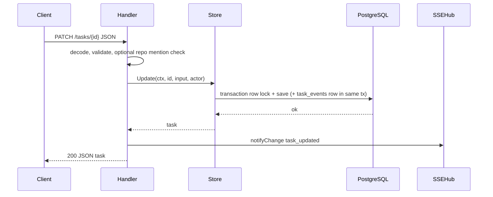

# Contributing

Day-to-day reference for adding features, splitting handler code, and debugging local failures. PR checklist and security policy live in the root [CONTRIBUTING.md](../CONTRIBUTING.md).

## Adding a feature (vertical slice)

Prefer one slice from `domain` to the UI:

1. **`domain`** — Types, enums, validation. No DB, no HTTP imports.
2. **`store`** — Use-case methods with clear inputs, transactions, and audit rows. Map DB errors to `domain.ErrNotFound` / `domain.ErrInvalidInput` only. Do not log inside the store. Cross-domain transactions compose via exported `…InTx` helpers.
3. **`handler`** — Decode and validate the body, call the store, translate errors to status codes, then call `notifyChange` after a successful write so SSE subscribers refetch. Business rules belong in `store` / `domain`, not in the handler.
4. **`web/`** (optional) — Extend `web/src/types/`, then `web/src/api/` (`parseTaskApi` and friends), then UI under `web/src/<feature>/`. Never add raw `fetch` calls in components.

Sequence for a mutating task request:



Whenever you change JSON shapes, routes, SSE payload types, or audit event types: update [api.md](./api.md), `web/src/api/parseTaskApi.ts`, and Go handler/store tests in lockstep. Default tests must not require real Postgres or network.

## Splitting `pkgs/tasks/handler`

The handler package is intentionally **flat** (one directory, `package handler`) because Go ties package identity to the folder. That keeps `NewHandler`, route registration, and shared test helpers simple but means many `*_test.go` files live next to production code.

### What is already split out

| Concern | Package | Why it left `handler` |
|---|---|---|
| HTTP middleware chain | `pkgs/tasks/middleware` | No import cycle with `handler`. |
| Black-box middleware tests | `internal/middlewaretest` | Keeps `middleware/` smaller. |
| Call stack / `call_path` / helper.io | `pkgs/tasks/calltrace` | Shared by `handler`, `middleware`, `internal/taskapi` without cycles. |
| JSON truncation at boundaries | `pkgs/tasks/apijson` | Shared helpers. |
| Black-box HTTP tests | `internal/handlertest` | Same pattern as `middlewaretest`. |
| Security-header expectations | `internal/httpsecurityexpect` | Avoids `handler` tests importing `handlertest` (cycle). |

See `pkgs/tasks/handler/README.md` for the file→route map.

### Conventions for new work

1. Prefer small vertical slices (above).
2. **New tests**:
   - **Whitebox** (need unexported symbols, fixtures next to `testdata/`): keep `package handler` in `pkgs/tasks/handler/`.
   - **Black-box HTTP** (only `NewHandler`, `With*`, `httptest`, `http.Client`): prefer `internal/handlertest`; migrate older colocated tests when you touch them.
3. **Do not** create `handler/subpkg` with `package handler` — Go does not allow it. A subdirectory must be a new import path.

### When a file feels too large

Sensible next extractions (in order, when stable boundaries exist):

1. Task JSON DTOs + encode/decode helpers → e.g. `pkgs/tasks/taskjson` (`taskCreateJSON`, list params, tree encoding).
2. Repo HTTP surface → thin `pkgs/tasks/repohandler` or keep in `repo_handlers.go` until file size forces a split.
3. More black-box tests → `internal/handlertest` + the `NewServer*` helpers.

Refactor in small PRs (one extraction or one test-directory move at a time) with `go test ./...` and `api.md` updates when behavior or JSON changes.

File size targets follow `.cursor/rules/CODE_STANDARDS.mdc`.

## Tests

Default Go tests must use SQLite helpers (`tasktestdb.OpenSQLite`), not real Postgres. Integration tests that need `DATABASE_URL` must be gated with `//go:build integration`.

- `go vet ./...`
- `go test ./... -count=1` (matches CI)
- `(cd web && npm ci && npm test -- --run && npm run lint && npm run check:standards && npm run build)`
- Full local bar: `./scripts/check.sh` (Unix) or `.\scripts\check.ps1` (Windows). Go-only fast path: `CHECK_SKIP_WEB=1`.

**TDD default for agents:** for bugs and features, add or adjust a failing test first, then implement until green. Recipes live in `.cursor/rules/BACKEND_AUTOMATION/go-testing-recipes.mdc` (Go) and `.cursor/rules/UI_AUTOMATION/testing-recipes.mdc` (`web/`).

## Troubleshooting

### Full reload on `/tasks/<id>` shows raw JSON

In dev, Vite proxies `/tasks` to `taskapi`. A full page navigation must still serve the SPA. Fix: pull the current `web/vite.config.ts` (it bypasses the proxy when `Accept` includes `text/html`) and restart `npm run dev`.

### SSE "Connected" but the Updates timeline does not grow

Without the dev ticker, `task_updated` SSE only fires after real writes. Set `T2A_SSE_TEST=1` in `.env` and restart `taskapi`. Use `T2A_SSE_TEST_EVENTS_PER_TICK` for faster churn, `T2A_SSE_TEST_SYNC_ROW=1` so task headers match, `T2A_SSE_TEST_LIFECYCLE=1` for create/delete hints. See [api.md](./api.md).

### `No repository is configured for file search` in the rich prompt

`app_settings.repo_root` is empty. Open the SPA, click the gear icon, set the **Workspace repository** to an absolute path. The supervisor reloads in-process; no `taskapi` restart needed.

### Web cannot reach the API (fetch / EventSource errors)

`taskapi` not running, wrong port, or proxy target mismatch. Default API is `http://127.0.0.1:8080`. If you change the API port, set `VITE_TASKAPI_ORIGIN` for Vite (and `DEV_TASKAPI_PORT` for `scripts/dev.*`).

### Matching a failing request to logs

JSON error bodies may include `request_id` (and the response echoes `X-Request-ID`). The same value appears on `http.access` lines and related handler logs. Build version: `GET /health` returns `version`; `taskapi` logs the same string on its `listening` line; `dbcheck` on `dbcheck.start`.

`GET /tasks` (`tasks.list`) is the highest-traffic read route. On failure, search logs for `operation=tasks.list` with `msg=request failed` (4xx warn, 5xx error). Structured fields help triage:

| `failure_stage` | Meaning | Typical `http_status` |
|-----------------|---------|----------------------|
| `parse_list_params` | Bad `limit`, `offset`, or `after_id` query | 400 |
| `store_list` | Persistence read failed after params validated | 500 |

`parse_list_params` logs include raw query echoes (`limit_q`, `offset_q`, `after_id_q`). `store_list` logs include resolved `limit`, `offset`, `after_id`, and `pagination_mode` (`offset` or `keyset`). Truncated or empty 200 bodies on an otherwise successful list may show `msg=response write failed` with `failure_stage` `body` or `newline` (client disconnect mid-write).

### Tests fail with "database" or connection errors

Default tests should use SQLite helpers. If a test needs `DATABASE_URL`, gate with `//go:build integration` or refactor to `tasktestdb.OpenSQLite`.

### Local checks fail — quick playbook

1. **Re-run without cache:** `go test ./... -count=1` from the repo root.
2. **Flaky env-related Go tests:** do not use `t.Parallel()` with `t.Setenv` / `t.Chdir` in the same test. Split or serialize.
3. **Database errors in default tests:** see above.
4. **Web failures:** from `web/`, run `npm ci`, then `npm test -- --run`, `npm run lint`, `npm run check:standards`, `npm run build`. Clear stale installs (`rm -rf node_modules` then `npm ci`) if versions drift.
5. **Still stuck:** compare with CI (`.github/workflows/ci.yml`) and run the full bar: `./scripts/check.sh` or `.\scripts\check.ps1`.

### Prometheus `t2a_agent_runs_by_model_total` cardinality

The `model` label is not capped at the wire. Watch with:

```promql
count({__name__="t2a_agent_runs_by_model_total"})
```

If it spikes, check for typos in `tasks.cursor_model` / `app_settings.cursor_model`, and cap label values at the scraper with `metric_relabel_configs`. The older `t2a_agent_runs_total{runner,terminal_status}` series is byte-identical to the pre-feature shape and always safe for alerting.
