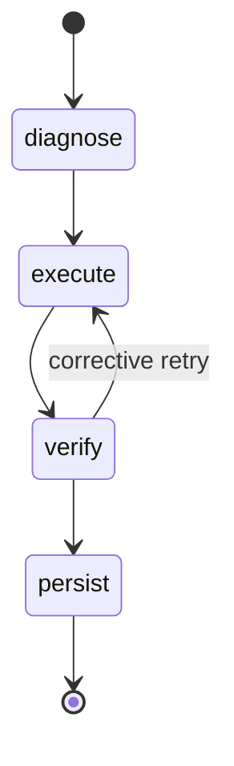
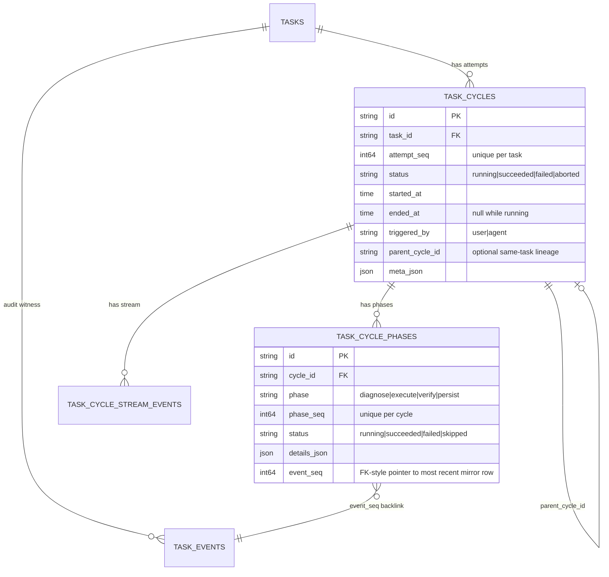

# Data model

Tasks, projects, execution cycles/phases, checklists, dependencies, and gates. HTTP shapes are in [api.md](./api.md); how the worker drives this substrate is in [architecture.md](./architecture.md).

## Project → Task

Work hierarchy is **Project → Task**. Tasks may have:

- `project_id` (optional) — shared-context membership. Projects are long-lived containers for memory across many tasks.
- `parent_id` (optional, **depth-1 only**) — the parent must itself be a root task.
- `tags` and `milestone` — flat labels for organization within a project.
- `depends_on` — directed acyclic graph of task-level dependencies.

`project_id` answers "which long-running body of work shares context with this task?" `parent_id` answers "which task owns this subtask?" They are independent. A project is not a task parent; subtasks are not project children. See [adr/ADR-0002-flatten-task-hierarchy.md](./adr/ADR-0002-flatten-task-hierarchy.md) for the migration decision.

## Task fields

| Field | Type | Notes |
|---|---|---|
| `id` | string (UUID) | Server-assigned when omitted. |
| `title` | string | Required after trim. |
| `initial_prompt` | string (HTML) | TipTap rich text; validated for `@`-mentions when `app_settings.repo_root` is set. |
| `status` | enum | `ready` / `running` / `blocked` / `review` / `done` / `failed` / `on_hold`. Default `ready`. `on_hold` is operator-set: pickup is gated on `status = ready` so an `on_hold` task is intentionally kept out of the worker's queue until the operator flips it back to `ready` (PATCH `/tasks/{id}`). |
| `priority` | enum | `low` / `medium` / `high` / `critical`. Required at create. |
| `task_type` | enum | `general` / `bug_fix` / `feature` / `refactor` / `docs`. Default `general`. |
| `project_id` | string \| null | Optional project membership. |
| `parent_id` | string \| null | Optional parent (depth-1). |
| `project_context_item_ids` | string[] | Explicit allowlist of project context items for runner snapshots. Cleared on `project_id` change. |
| `tags` | string[] | Free-form, `^[a-z0-9][a-z0-9._-]{0,31}$`. |
| `milestone` | string \| null | Single anchor per task, `^[a-zA-Z0-9][a-zA-Z0-9 ._-]{0,63}$` when set. |
| `depends_on` | string[] | Hydrated from `task_dependencies` (FK cascade). |
| `gate` | object \| null | Per-task dequeue pause (see below). |
| `pickup_not_before` | RFC3339 UTC \| null | Defer when the worker may dequeue. |
| `cursor_model` | string | Optional model override at runtime. |
| `checklist_inherit` | bool | When true, definitions live on the nearest ancestor that does not inherit; requires `parent_id`. |

The JSON resource has **no** `created_at` / `updated_at` fields. Timestamps live on `task_events`.

## Dependencies

- Storage: `task_dependencies(task_id, depends_on_task_id)` with FK cascade.
- A task in `ready` is worker-eligible only when every predecessor has `status = done`.
- Completing a task notifies dependents whose deps are now satisfied.
- Self-deps and cycles return `400 invalid input`.
- API: incremental via `GET/POST/DELETE /tasks/{id}/dependencies`; full replace via `depends_on` on `PATCH /tasks/{id}`.

## Gate

```json
{
  "kind": "manual_approval",
  "status": "locked | active | pending_release | released",
  "hold": false,
  "pending_release_deadline_utc": "RFC3339 optional",
  "criteria": []
}
```

- Worker dequeue requires `gate IS NULL` OR `gate.status = released`.
- Operator actions: `PATCH /tasks/{id}/gate` with `action ∈ release | hold | clear_hold`.
- Auto-release after grace deadline is **not** implemented; release is operator-driven.

## Worker readiness (all must pass)

1. `status = ready`
2. `pickup_not_before` is null or `<= now()`
3. All `depends_on` predecessors have `status = done`
4. `gate` is null or `gate.status = released`

If a task is dequeued but fails (3) or (4) on reload, the worker sets `pickup_not_before` ~60s ahead and skips the run.

## Scheduling (`pickup_not_before`)

`domain.Task.PickupNotBefore *time.Time` → indexed column `pickup_not_before`. `nil` means "pick up as soon as the worker is free".

- Wire format: RFC3339 UTC string. JSON `null` on `PATCH` clears the field. Empty string is rejected on `POST` (`400`).
- Default deferral on create: `app_settings.agent_pickup_delay_seconds` applies when creating `status=ready` and the client omits `pickup_not_before`.
- Eligibility predicate: `status='ready' AND (pickup_not_before IS NULL OR pickup_not_before <= now())` — see `pkgs/tasks/store/internal/ready/ready.go` (`ListQueueCandidates`).
- Three paths to the worker: immediate notify on commit, `PickupWakeScheduler` for future times, reconcile (2m tick) as backstop. **Invariant:** the in-memory queue never contains a task the SQL predicate would reject.
- Single-process: `MemoryQueue` and `PickupWakeScheduler` are not shared across replicas. Keep NTP aligned on app hosts and Postgres so process and DB clocks agree.

## Execution cycles and phases

```text
Task -> many cycles (attempts) -> many phases (steps in an attempt)
```

A **cycle** is one execution attempt. Cycles live in `task_cycles` and are ordered per task by `attempt_seq` (positive integer, `max + 1` assigned by the store inside the same transaction as the insert).

A **phase** is one step inside a cycle. Phases live in `task_cycle_phases` and are ordered per cycle by `phase_seq`. The intended path is `diagnose → execute → verify → persist`, with `verify → execute` allowed for corrective retries. A cycle may repeat phase kinds — each visit is a separate row with a higher `phase_seq`.



`domain.ValidPhaseTransition(prev, next)` defines the graph. `persist` is terminal **within the cycle**, not for the cycle row itself — the caller still has to `TerminateCycle(succeeded)`.

### Schema



### Store invariants

- `(task_id, attempt_seq)` and `(cycle_id, phase_seq)` are unique. Stores assign `max + 1` in the same transaction.
- `task_cycles.task_id` and `task_cycle_phases.cycle_id` are FK with `ON DELETE CASCADE`.
- At most one running cycle per task. `StartCycle` rejects with `ErrInvalidInput: task already has a running cycle`.
- At most one running phase per cycle. `StartPhase` rejects with `ErrInvalidInput: cycle already has a running phase`.
- Terminal rows are read-only. Corrective work means a new row with a higher seq.
- Cross-task lineage is rejected. `parent_cycle_id` must reference a cycle on the same task.
- `meta_json` and `details_json` are `jsonb` (Postgres) / `text` (SQLite) and default to `{}`.

### Dual-write invariant

Every cycle/phase mutation appends a mirror row to `task_events` **inside the same `gorm.DB` transaction**. If the mirror append fails, the cycle/phase row is rolled back.

| Store entrypoint | Cycle/phase write | Mirror `task_events.type` |
|---|---|---|
| `StartCycle` | insert `task_cycles` (`status=running`) | `cycle_started` |
| `TerminateCycle(succeeded)` | update to terminal | `cycle_completed` |
| `TerminateCycle(failed|aborted)` | update to terminal | `cycle_failed` (status preserved in payload) |
| `StartPhase` | insert `task_cycle_phases` (`status=running`) | `phase_started` |
| `CompletePhase(succeeded|failed|skipped)` | update to terminal | `phase_completed` / `phase_failed` / `phase_skipped` |

`StartPhase` and `CompletePhase` capture the assigned `task_events.seq` and write it back into `task_cycle_phases.event_seq` in the same transaction. The pointer is one-shot: `CompletePhase` overwrites the `StartPhase` value with the terminal mirror seq.

Mirror rows are non-interactive: `PATCH /tasks/{id}/events/{seq}` returns `400` for these seven types because the cycle/phase row is the system of record.

### Cycle metadata (`meta_json` / `cycle_meta`)

`task_cycles.meta_json` is an adapter-facing sidecar — opaque to the store, contract-defined by the runner. The agent worker writes a stable five-key payload at `StartCycle`:

```json
{
  "runner": "cursor",
  "runner_version": "2.x.y",
  "cursor_model": "",
  "cursor_model_effective": "opus-4",
  "prompt_hash": "sha256:abc123…"
}
```

| Key | Meaning |
|---|---|
| `runner` | `runner.Runner.Name()` at cycle start (e.g. `"cursor"`). |
| `runner_version` | `runner.Runner.Version()` at cycle start. |
| `cursor_model` | Operator intent (verbatim `tasks.cursor_model`). |
| `cursor_model_effective` | Model the runner will actually execute against — audit truth. |
| `prompt_hash` | `sha256` of the prompt string. Never the body. |

Keys are additive only; consumers must ignore unknown keys. Values are always strings (empty string = "no value"). The API surfaces a typed projection `cycle_meta` on `/tasks/{id}/cycles[/{cycleId}]` so the SPA does not re-parse the raw JSON.

### Where reads go

| Question | Read from |
|---|---|
| What's the current attempt for this task? | `task_cycles` (`status=running`, latest `attempt_seq`). |
| List all attempts for this task. | `GET /tasks/{id}/cycles`. |
| What phase is the current cycle in? | `GET /tasks/{id}/cycles/{cycleId}` (`phases[]`, `phase_seq ASC`). |
| Audit history (everything that happened, in order). | `GET /tasks/{id}/events`. |
| Cursor live-update history for one attempt. | `GET /tasks/{id}/cycles/{cycleId}/stream`. |
| Did anything change for this cycle (live UI hint)? | SSE `task_cycle_changed` (`id` = task, `cycle_id` = cycle). |

## Checklist (done criteria)

Per-task acceptance requirements. Stored in `task_checklist_items` (definitions: `id`, `task_id`, `sort_order`, `text`, optional `check` shell command) and `task_checklist_completions` (per-subject ledger: `task_id`, `item_id`, `at`, `done_by`, `evidence`, `verified_by`, `verifier_reasoning`, `cycle_id`).

**Inheritance:** When `checklist_inherit` is true on a task, definitions live on the nearest ancestor that does not inherit. `done` is tracked per subject task.

| `verified_by` value | Meaning |
|---|---|
| `agent_self` | Execute agent claimed done in the criteria report (not sufficient alone when `verify_enabled`). |
| `verify_agent` | Adversarial verify phase accepted the criterion. |
| `deterministic_check` | Optional `check` shell command exited 0. |
| `human_override` | Reserved; schema only. |
| `legacy` | Pre-V1.1 rows backfilled at migrate; never written by the new worker. |

### Edit locks

| State | Add | Edit text/check | Delete | Agent mark done |
|---|---|---|---|---|
| Open (no running cycle) | yes | yes | yes* | yes |
| Cycle running | no (409) | no (409) | no (409) | yes |
| Verified (completion exists) | yes | no (409) | no (409) | yes |

\*Delete blocked if any subject has marked the item done.

### Worker verification loop

When `app_settings.verify_enabled` is true (default):

1. **Execute** — prompt includes all criteria with stable ids and the **absolute** worker-managed path the agent must write its report to (`<worker-managed dir>/<cycle_id>/criteria-report.json`, see "Report file contracts" below).
2. **Deterministic checks** — for each item with a non-empty `check`, the worker runs the command in the execute working dir with `app_settings.check_command_timeout_seconds`.
3. **Verify** — the verify runner runs in the execute working dir (where execute's uncommitted changes live so the verifier can inspect actual file contents) and writes its verdict to the **absolute** worker-managed `<worker-managed dir>/<cycle_id>/verify-report.json` path. The verifier MUST NOT modify any path inside the working dir. The worker enforces this with a pre/post integrity snapshot of `git status --porcelain` plus `git rev-parse HEAD`; the whitelist is empty (report files live outside the working tree, so any porcelain diff is tampering), any HEAD movement, or any failure to capture the post-snapshot terminates the cycle as `verify_tampered` (terminal — no retries, no completion rows). When the working dir is not a git repo, the integrity check is bypassed and logged once at startup. Adversarial separation: when `app_settings.verify_runner_name` is set, the verify pass runs on a different runner adapter (and optionally a different model) than execute — see `docs/configuration.md`.
4. **Decision** — all pass → atomic `SetDoneWithEvidence` + `status=done`; any fail → retry execute up to `verify_max_retries` (hard cap 10) or terminate with reason `verification_failed:<id>,<id>,…` (sorted, deduped failing criterion IDs after the prefix) and **no** completion rows. The `verification_failed` prefix is contract-stable; consumers MUST use prefix matching (`startsWith`). Bare `verification_failed` (older cycles) remains a valid value. The reason column is 256 chars; long failure lists are truncated with a trailing `…` while keeping the prefix intact.
5. **Retry efficiency** — verdicts that passed in earlier attempts are carried in memory across retries. The next execute prompt lists them under "Already verified (do not re-do)" and excludes them from the active checklist; the next verify pass short-circuits them. The atomic-decision contract is preserved: nothing is committed to `task_checklist_completions` until the cycle terminates `succeeded`, at which point all passes (this attempt + earlier) land in one transaction. On terminal failure, no completion rows are written even for criteria that passed on every attempt.

When `verify_enabled` is false, the worker uses the legacy bulk-mark path (empty evidence). Existing `legacy` rows remain valid.

### Report file contracts

Paths live under a **worker-managed scratch directory** (`<worker-managed dir>/<cycle_id>/...`) which the operator never sees. The worker resolves the directory from `T2A_WORKER_REPORT_DIR` (default `<os.TempDir()>/t2a-worker`); the agent CLI is told the absolute path in its prompt and writes there directly. The directory lives outside `app_settings.repo_root` so customer working trees stay clean and the verify-pass integrity check has an empty whitelist (any porcelain diff against the working tree during verify is tampering). The per-cycle subdirectory is GC'd by the worker at cycle terminate so disk use stays bounded.

| File | Writer | Schema |
|---|---|---|
| `<worker-managed dir>/<cycle_id>/criteria-report.json` | Execute agent | `{ "criteria": [{ "id", "claimed_done", "evidence" }] }` |
| `<worker-managed dir>/<cycle_id>/verify-report.json` | Verify agent | `{ "criteria": [{ "id", "verified", "reasoning" }] }` |

Limits: 256 KB per report file; `evidence` and `reasoning` ≤ 16 KB each; verify `reasoning` ≥ 40 chars when `verified=true`. Duplicate ids in a report → invalid. Symlinks rejected.

## Project context

Curated context nodes (`project_context_items`) and user-curated relationships (`project_context_edges`, typed `relation` + `1..5 strength`) owned by a project. A task's run captures the user-selected bundle in `task_context_snapshots` — immutable, cycle-scoped.

Mental model: project = process, task = thread. Project = shared memory; task = reader; run = immutable snapshot of what the runner actually saw.

Out of scope today: embeddings / vector search, autonomous memory pruning, summarization daemons, tenancy / sharing / billing, automatic migration of legacy tasks into synthetic projects.

## Audit log (`task_events`)

Append-only. Event type strings are `domain.EventType` values (`task_created`, `status_changed`, `prompt_appended`, `message_added`, `subtask_added`, etc., plus the seven cycle/phase mirror types listed above). Per-task monotonic `seq`. Used for history and debugging; events are not replayed into the SSE hub.
