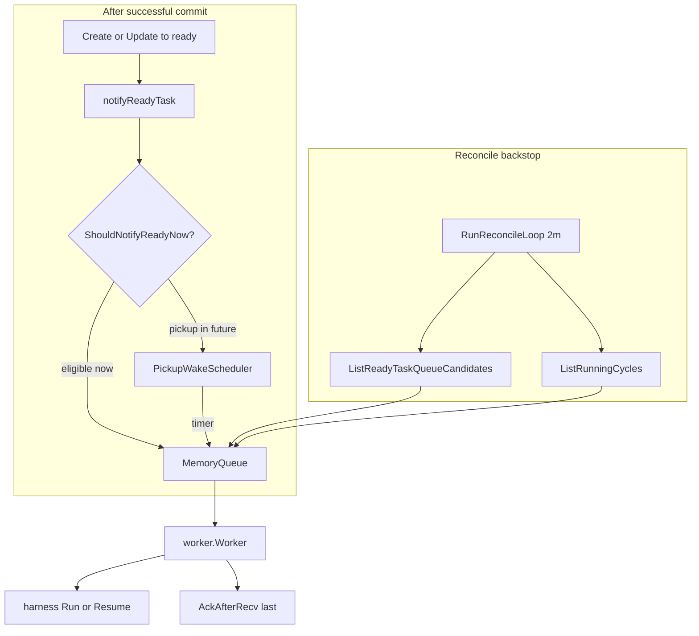
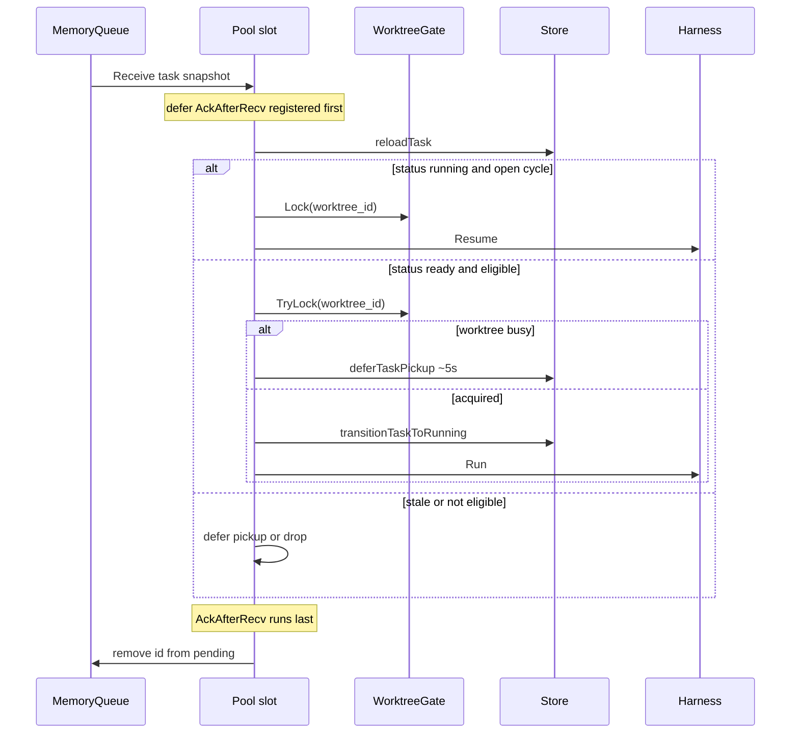

# Agent ready-task queue and reconciliation

Bounded in-memory FIFO of task snapshots for the in-process worker: notify wiring, deferred pickup, reconcile backstop, and pending-set semantics through `AckAfterRecv`.

| | |
| --- | --- |
| **Applies to** | `pkgs/agents/MemoryQueue`, `pickup_wake.go`, `reconcile.go`, `cmd/taskapi/run_agentworker.go`, `pkgs/tasks/store` notify facade |
| **Audience** | Contributors debugging stuck `ready` tasks, queue-full warnings, or post-restart resume |
| **Prerequisite** | [data-model.md](../data-model.md) (scheduling), [harness.md](./harness.md) (cycle body) |
| **Companion articles** | [sse-hub.md](./sse-hub.md), [harness.md](./harness.md), [runner-adapters.md](./runner-adapters.md) |

## In this article

- [Overview](#overview)
- [Key concepts](#key-concepts)
- [How it works](#how-it-works)
- [Enqueue on ready transition](#enqueue-on-ready-transition)
- [Deferred pickup](#deferred-pickup)
- [Worker consumption and admission](#worker-consumption-and-admission)
- [Reconciliation](#reconciliation)
- [Invariants](#invariants)
- [Configuration](#configuration)
- [Observability](#observability)
- [Testing strategy](#testing-strategy)
- [Best practices](#best-practices)
- [Limitations](#limitations)
- [See also](#see-also)

## Overview

When a task row is committed in **`status=ready`**, the store may push a **full `domain.Task` snapshot** into an optional in-process queue. A **worker pool** (default 4 slots, `HAMIX_AGENT_WORKER_CONCURRENCY`) shares one queue and runs [harness.md](./harness.md) admission (`Run` or `Resume`) per dequeued task.

The queue is:

- **Bounded** — default capacity 256 (`HAMIX_USER_TASK_AGENT_QUEUE_CAP`)
- **Non-blocking for producers** — full buffer returns `ErrQueueFull`; the DB commit still succeeds
- **Volatile** — lost on process crash; **reconcile** refills from Postgres on startup and every 2 minutes
- **Deduped by task id** — at most one pending entry per id via the `pending` set

Package tradeoffs: [`pkgs/agents/doc.go`](../../pkgs/agents/doc.go).

> **Important** — SSE ([sse-hub.md](./sse-hub.md)) notifies browsers; the queue delivers work to the worker. They are separate paths after the same commit.

### In scope

- `MemoryQueue`, `NotifyReadyTask`, `AckAfterRecv`, `Receive`
- `ReadyTaskNotifier` store wiring
- `PickupWakeScheduler` for future `pickup_not_before`
- `ReconcileReadyTasksNotQueued`, `ReconcileRunningTasksNotQueued`, `RunReconcileLoop`
- `ShouldNotifyReadyNow` gate
- Worker admission and ack-last ordering

### Out of scope

- Harness execute/verify loop — [harness.md](./harness.md)
- Runner adapters — [runner-adapters.md](./runner-adapters.md)
- External brokers (Redis, NATS, Postgres outbox) — deferred per `agents/doc.go`
- Multi-replica worker deployment
- SSE invalidation — [sse-hub.md](./sse-hub.md)

## Key concepts

| Term | Definition |
| --- | --- |
| **MemoryQueue** | Buffered Go channel + `pending` map of task ids |
| **NotifyReadyTask** | Producer entry; returns `ErrAlreadyQueued` or `ErrQueueFull` |
| **Pending set** | Task ids currently in the channel buffer (dedup at enqueue); cleared on `Receive` dequeue |
| **PickupWakeScheduler** | Min-heap + timer for deferred `pickup_not_before` |
| **Reconcile** | SQL scan → enqueue ids missing from pending |
| **Running reconcile** | Re-enqueue `status=running` tasks with open cycles after restart |

### Actors and trust

| Actor | Role | Trust |
| --- | --- | --- |
| **Store facade** | Calls `notifyReadyTask` once per ready transition | Trusted to gate pickup time |
| **MemoryQueue** | FIFO buffer + dedup | Trusted in single-process deployment |
| **PickupWake** | Timer-driven deferred enqueue | Trusted to respect SQL eligibility |
| **Reconcile loop** | Backstop after restarts or notify drops | Trusted to page fairly (oldest first) |
| **Worker** | Single consumer; ack last | Trusted not to double-run same id while pending |

## How it works

Startup wiring ([`startReadyTaskAgents`](../../cmd/taskapi/run_agentworker.go)):

1. `NewMemoryQueue(cap)` → `taskStore.SetReadyTaskNotifier(queue)`
2. `NewPickupWakeScheduler` → `SetPickupWake` + `Hydrate`
3. `go RunReconcileLoop(..., ReconcileTickInterval, nil)`
4. Agent worker supervisor starts consumer

## Enqueue on ready transition

[`notifyReadyTask`](../../pkgs/tasks/store/store.go) → [`notify.Holder.Notify`](../../pkgs/tasks/store/internal/notify/holder.go):

1. Store facade commits task with `status=ready` (create, update transition, or dev mirror)
2. Notifier invoked with `context.WithoutCancel` so request cancellation does not drop notify
3. **`ShouldNotifyReadyNow(pickupNotBefore, now)`** — if `pickup_not_before` is still in the future, immediate enqueue is skipped (pickup wake or reconcile handles later)
4. `MemoryQueue.tryEnqueue`:
   - Reject empty id
   - Reject if id already in **`pending`** → `ErrAlreadyQueued`
   - Non-blocking send to channel; on success add to `pending`
   - Channel full → `ErrQueueFull`
5. Notifier errors are **`Warn`-logged and swallowed** — the store mutation does not fail

Sentinel errors ([`notify.go`](../../pkgs/agents/notify.go)): `ErrQueueFull`, `ErrAlreadyQueued`.

## Deferred pickup

[`PickupWakeScheduler`](../../pkgs/agents/pickup_wake.go) implements `store.PickupWake`:

| Method | Role |
| --- | --- |
| `Hydrate` | At startup, load up to 10k deferred ready tasks and schedule timers |
| `Schedule` | Push `(task_id, pickup_not_before)` on min-heap; reset single timer |
| `Cancel` | Remove task from heap when status changes away from deferred ready |
| `fire` | Pop all due items; reload task; re-check eligibility; `NotifyReadyTask` |

Low-latency path for scheduled pickup; reconcile remains the durable backstop if a timer is missed.

## Worker consumption and admission

Shared consumers: [`worker.Pool.Run`](../../pkgs/agents/worker/pool.go) starts N goroutines (default 4), each looping on `queue.Receive(ctx)` against one `MemoryQueue` and one [`WorktreeGate`](../../pkgs/agents/worker/worktree_gate.go).

[`processOne`](../../pkgs/agents/worker/admission.go) ordering:

**Why defer `AckAfterRecv`:** each slot uses `Receive`, which already removes the id from **`pending`** when dequeuing. The deferred ack satisfies the `Recv()`+manual-ack contract documented on `MemoryQueue` and is idempotent. **Duplicate enqueue while a cycle runs** is prevented by `status=running` (ready reconcile skips running tasks), not by the pending set after dequeue.

**Worktree gate:** ready admission uses `TryLock` so a busy worktree does not block the whole pool — the slot defers and another slot can pick up work for a different worktree. Running resume uses blocking `Lock` because the task already owns the worktree.

Admission branches:

| `reloadTask` status | Action |
| --- | --- |
| `running` + open cycle | `WorktreeGate.Lock` → `Harness.Resume` (post-restart continue) |
| `ready` + `ReadyForAgentPickup` + `TryLock` ok | `transitionTaskToRunning` → `Harness.Run` |
| `ready` + worktree busy (`TryLock` false) | `deferTaskPickup` ~5s |
| `ready` but not eligible | `deferTaskPickup` ~60s |
| Other | Warn stale; return (ack still runs) |

`Receive` removes the id from `pending` when the task is dequeued. **`AckAfterRecv`** after harness is idempotent for the worker path; use **`Recv()` + `AckAfterRecv`** if you consume the channel manually without `Receive`.

## Reconciliation

[`RunReconcileLoop`](../../pkgs/agents/reconcile.go): one pass immediately, then every **`ReconcileTickInterval` (2 minutes, fixed in code, not env-configurable)**.

### Ready reconcile

`ReconcileReadyTasksNotQueued`:

- Pages `store.ListReadyTaskQueueCandidates` (FIFO: oldest `task_created` first, dialect tie-breakers — see [`ready/ready.go`](../../pkgs/tasks/store/internal/ready/ready.go))
- For each row: `NotifyReadyTask`
- `ErrAlreadyQueued` → skip (already pending or in channel)
- `ErrQueueFull` → **stop entire page** (`StoppedOnQueueFull`); retry on next tick after consumer drains

### Running reconcile

`ReconcileRunningTasksNotQueued`:

- `ListRunningCycles` → load task → enqueue if still `status=running`
- Enables [ADR-0006](../adr/ADR-0006-phase-boundary-resume.md) resume after process restart

Both passes log structured counts: scanned, enqueued, skipped_already_queued, stopped_on_queue_full.

## Invariants

| Invariant | Meaning |
| --- | --- |
| **Queue ⊆ SQL eligible** | Never enqueue a ready task SQL `ListQueueCandidates` would reject (pickup gate + `ShouldNotifyReadyNow`) |
| **Pending dedupes buffer** | At most one buffered entry per task id (`ErrAlreadyQueued`); cleared on `Receive` dequeue |
| **No double ready pickup** | While `status=running`, ready reconcile does not start a second cycle |
| **Persist beats notify** | Commit succeeds even when queue full |
| **Ready queue (architecture)** | Queue never holds a task failing `status='ready' AND (pickup_not_before IS NULL OR pickup_not_before <= now())` |
| **Running resume (architecture)** | Queue may hold `status='running'` with open cycle for resume admission |

Full scheduling fields: [data-model.md](../data-model.md) (`pickup_not_before`).

## Configuration

| Knob | Default | Reference |
| --- | --- | --- |
| `HAMIX_USER_TASK_AGENT_QUEUE_CAP` | 256 | [configuration.md](../configuration.md) |
| `HAMIX_AGENT_WORKER_CONCURRENCY` | 4 | In-process pool size (1–32); [configuration.md](../configuration.md) |
| `agent_pickup_delay_seconds` | app_settings | Default deferral on create when client omits pickup |
| `pickup_not_before` | per task | Operator or worker-set deferral |
| Reconcile tick | 2m | `ReconcileTickInterval` in code |

Worker enabled when `app_settings.repo_root` is set and agent not paused — supervisor details in [configuration.md](../configuration.md) and [runner-adapters.md](./runner-adapters.md).

## Observability

| Signal | Where |
| --- | --- |
| Startup | `ready task agent queue` log with `cap` |
| Reconcile | `ready task agent reconcile done` / `running task agent reconcile done` with counts |
| Notify failure | `ready task notifier failed` Warn (queue full, duplicate, etc.) |
| Health | `GET /system/health` — queue depth, agent runs ([api.md](../api.md)) |
| Queue introspection | `BufferCap()`, `BufferDepth()` on `MemoryQueue` |

## Testing strategy

| Layer | Files |
| --- | --- |
| Queue unit tests | `memory_queue_test.go` |
| Reconcile | `reconcile` tests in `pkgs/agents/` |
| Store notifier | `facade_tasks_test.go` (`spyReadyNotifier`) |
| Integration | `pkgs/tasks/agentreconcile/` (SQLite + worker) |
| Worker admission | `worker_test.go`, harness tests with `runnerfake` |

Default CI does not require a running agent binary.

## Best practices

- Treat reconcile as **backstop** — fix notify/pickup bugs rather than relying on the 2m tick
- Do not block in `NotifyReadyTask` — store holds no lock across notify
- **Single pool per process** — do not run multiple pools on one queue
- After adding ready transitions in store, ensure facade calls `notifyReadyTask` exactly once
- For deferred pickup, always update pickup wake on patch (`Schedule` / `Cancel`)

## Limitations

| Limitation | Detail |
| --- | --- |
| Volatile | Process crash drops buffered items; reconcile refills |
| Single-process | Not shared across `taskapi` replicas; multi-replica workers race |
| Queue full | Reconcile stops early; backlog waits for consumer |
| Snapshot staleness | Dequeued snapshot may differ from `reloadTask` — admission always reloads |
| No priority | Strict FIFO by SQL ordering, not user priority field |
| Alternatives deferred | Postgres outbox, Redis, webhook, SSE-only workers ([`agents/doc.go`](../../pkgs/agents/doc.go)) |

## See also

### Documentation

| Doc | Content |
| --- | --- |
| [task-scheduling.md](./task-scheduling.md) | Four readiness predicates, enqueue vs admission |
| [agent-supervisor.md](./agent-supervisor.md) | Worker boot/reload, reconcile tick wiring |
| [sse-hub.md](./sse-hub.md) | Browser realtime path (parallel to queue) |
| [harness.md](./harness.md) | Cycle body after admission |
| [runner-adapters.md](./runner-adapters.md) | Worker supervisor and runner build |
| [data-model.md](../data-model.md) | `pickup_not_before`, ready eligibility |
| [architecture.md](../architecture.md) | System overview |
| [configuration.md](../configuration.md) | Queue cap env var |
| [ADR-0006](../adr/ADR-0006-phase-boundary-resume.md) | Running-task resume |

### Code map

| Concern | Files |
| --- | --- |
| Queue | [`memory_queue.go`](../../pkgs/agents/memory_queue.go), [`notify.go`](../../pkgs/agents/notify.go) |
| Pickup wake | [`pickup_wake.go`](../../pkgs/agents/pickup_wake.go) |
| Reconcile | [`reconcile.go`](../../pkgs/agents/reconcile.go) |
| Store notify | [`store.go`](../../pkgs/tasks/store/store.go), [`internal/notify/holder.go`](../../pkgs/tasks/store/internal/notify/holder.go), [`facade_tasks.go`](../../pkgs/tasks/store/facade_tasks.go) |
| SQL candidates | [`store/internal/ready/ready.go`](../../pkgs/tasks/store/internal/ready/ready.go) |
| Worker admission | [`admission.go`](../../pkgs/agents/worker/admission.go), [`pool.go`](../../pkgs/agents/worker/pool.go), [`worktree_gate.go`](../../pkgs/agents/worker/worktree_gate.go) |
| Startup wiring | [`cmd/taskapi/run_agentworker.go`](../../cmd/taskapi/run_agentworker.go) |
