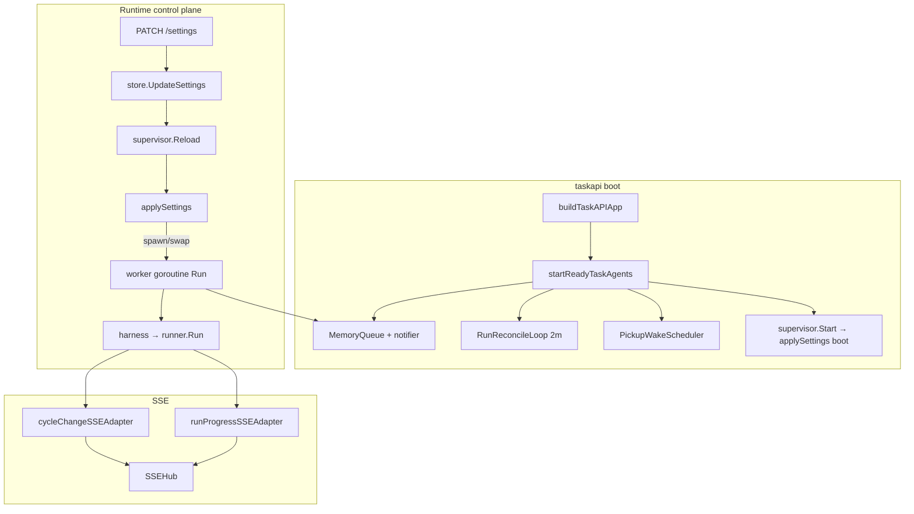
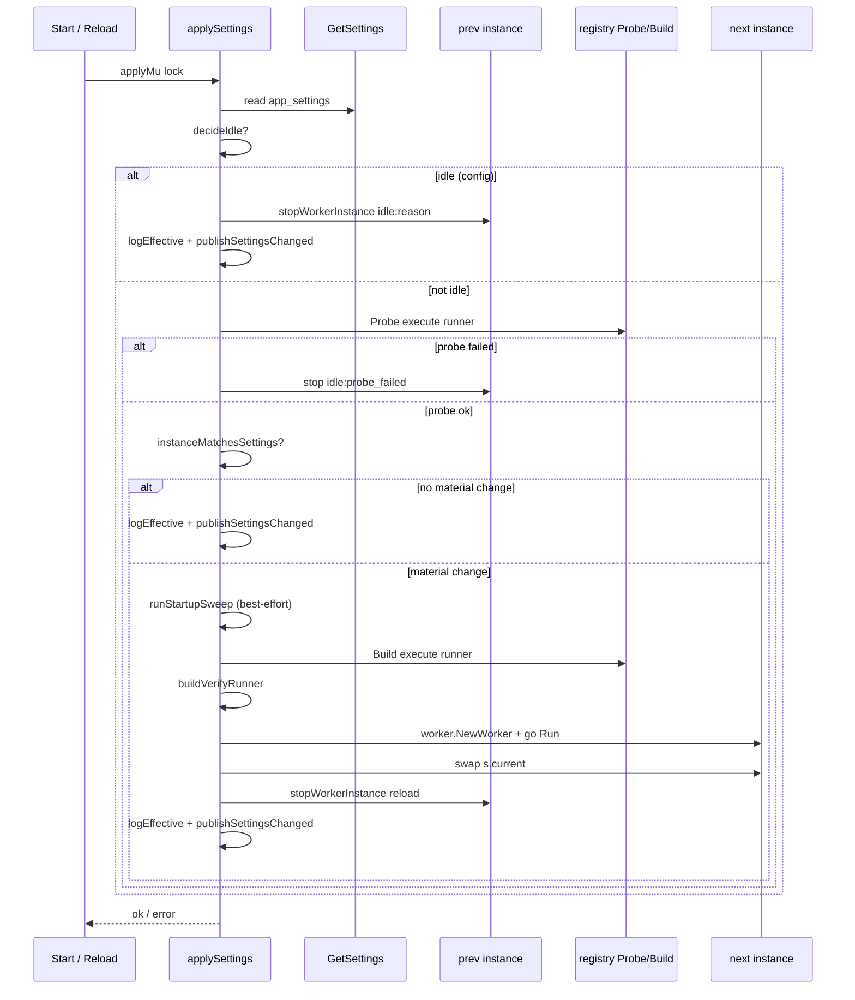

# Agent worker supervisor

In-process lifecycle owner for the single worker goroutine: settings-driven boot and hot reload, runner registry build/probe, idle gating, orphan sweep, SSE notifier wiring, and shutdown drain.

| | |
| --- | --- |
| **Applies to** | `cmd/taskapi/run_agentworker.go`, `cmd/taskapi/run_helpers.go`, `pkgs/tasks/handler/handler_settings.go` |
| **Audience** | Contributors debugging worker idle states, hot reload after Settings changes, or shutdown ordering |
| **Prerequisite** | [configuration.md](../configuration.md) (`app_settings`), [agent-queue.md](./agent-queue.md) (queue + reconcile) |
| **Companion articles** | [runner-adapters.md](./runner-adapters.md), [harness.md](./harness.md), [sse-hub.md](./sse-hub.md) |

## In this article

- [Overview](#overview)
- [Key concepts](#key-concepts)
- [How it works](#how-it-works)
- [Boot and `startReadyTaskAgents`](#boot-and-startreadytaskagents)
- [`applySettings` pipeline](#applysettings-pipeline)
- [Idle reasons](#idle-reasons)
- [Worker hot-swap and material changes](#worker-hot-swap-and-material-changes)
- [Execute vs verify runner policy](#execute-vs-verify-runner-policy)
- [Report directory](#report-directory)
- [SSE adapters](#sse-adapters)
- [`CancelCurrentRun`](#cancelcurrentrun)
- [Shutdown and `Drain`](#shutdown-and-drain)
- [Wire contracts](#wire-contracts)
- [Configuration](#configuration)
- [Observability](#observability)
- [Testing strategy](#testing-strategy)
- [Best practices](#best-practices)
- [Limitations](#limitations)
- [See also](#see-also)

## Overview

The **agent worker supervisor** (`agentWorkerSupervisor` in [`run_agentworker.go`](../../cmd/taskapi/run_agentworker.go)) sits between HTTP Settings handlers and the in-process [`worker.Worker`](../../pkgs/agents/worker/worker.go). It reads the singleton `app_settings` row, decides whether a worker should run, builds runners through [`registry`](../../pkgs/agents/runner/registry/), spawns one consumer goroutine, and swaps that incarnation on material config changes without restarting `taskapi`.

Configuration is **DB-driven**, not env-driven for worker behavior. Legacy `T2A_AGENT_WORKER_*` variables are ignored; operators use the SPA Settings page or `PATCH /settings` ([configuration.md](../configuration.md)).

> **Important** — The reconcile loop and ready-task queue always start with `taskapi`. The supervisor only gates the **worker goroutine** that drains the queue. A paused or mis-probed worker does not stop reconciliation or enqueue from the store.

### In scope

- `agentWorkerSupervisor`: `Start`, `Reload`, `CancelCurrentRun`, `Drain`, `ProbeRunner`
- Shared `applySettings` boot/reload pipeline
- `decideIdle`, `decideSchedulingIdleHint`, `instanceMatchesSettings`
- `buildVerifyRunner` demotion policy
- `cycleChangeSSEAdapter`, `runProgressSSEAdapter`
- `startReadyTaskAgents` (queue + pickup wake + reconcile + supervisor boot)
- `ensureWorkerReportDirWritable`, shutdown drain deadlines

### Out of scope

- Harness execute/verify loop — [harness.md](./harness.md)
- Queue notify, reconcile SQL, and ack ordering — [agent-queue.md](./agent-queue.md)
- Runner adapter implementation — [runner-adapters.md](./runner-adapters.md)
- SPA Settings UI — [web.md](../web.md)
- Multi-replica or external worker processes

## Key concepts

| Term | Definition |
| --- | --- |
| **Supervisor** | `agentWorkerSupervisor` — owns worker lifecycle, not cycle logic |
| **Instance** | `agentWorkerInstance` — one spawned worker: `Worker`, cancel func, `doneCh`, settings snapshot, execute + optional verify runners |
| **Material change** | Any setting that would change the next dequeue/run: pause, runner id, binary, model, repo root, per-run cap, verify runner name/model, or probed runner version |
| **Idle (hard)** | No worker goroutine; from `decideIdle` or execute probe/build failure |
| **Scheduling hint** | Diagnostic `idle_reason` on logs when worker is **running** but queue is empty only because tasks are deferred — does **not** stop the worker |
| **`applyMu`** | Serializes full `applySettings` (probe + build + spawn); separate from `s.mu` so `CancelCurrentRun` stays fast |
| **`AgentWorkerControl`** | Handler interface: `Reload`, `CancelCurrentRun`, `ProbeRunner` ([`handler.go`](../../pkgs/tasks/handler/handler.go)) |

### Actors and trust

| Actor | Role | Trust |
| --- | --- | --- |
| **Operator** | Edits `app_settings` via SPA or API | Trusted for repo path and CLI paths |
| **PATCH /settings** | Persists patch, calls `Reload` | Trusted to trigger hot reload |
| **Supervisor** | Probe/build policy, instance swap | Trusted single-process orchestrator |
| **MemoryQueue** | FIFO buffer for ready/running tasks | Trusted with single consumer |
| **Registry** | `Probe`, `Build` for registered runner ids | Trusted after compile-time `registry/all` import |
| **SSE hub** | Fan-out for settings, cycle, progress events | Trusted pub/sub; slow clients evicted per [sse-hub.md](./sse-hub.md) |

## How it works

The supervisor never enqueues tasks. After boot, [`agents.RunReconcileLoop`](../../pkgs/agents/reconcile.go) and store notify paths fill [`MemoryQueue`](../../pkgs/agents/MemoryQueue.go); the worker blocks on `queue.Receive` ([agent-queue.md](./agent-queue.md)).

## Boot and `startReadyTaskAgents`

[`startReadyTaskAgents`](../../cmd/taskapi/run_agentworker.go) runs during `buildTaskAPIApp` ([`run_helpers.go`](../../cmd/taskapi/run_helpers.go)) **before** the HTTP server accepts traffic:

1. **Queue** — `agents.NewMemoryQueue(cap)` where `cap` = `taskapiconfig.UserTaskAgentQueueCap()` (default 256, env `T2A_USER_TASK_AGENT_QUEUE_CAP`).
2. **Notifier wiring** — `taskStore.SetReadyTaskNotifier(agentQueue)`.
3. **Pickup wake** — `agents.NewPickupWakeScheduler` + `SetPickupWake` + `Hydrate(ctx)` for deferred `pickup_not_before`.
4. **Reconcile loop** — background goroutine with `agents.ReconcileTickInterval` (fixed **2 minutes**, not env-configurable).
5. **Supervisor** — `newAgentWorkerSupervisor(ctx, store, queue, hub)` then `Start(ctx)` → `applySettings(ctx, "boot")`.

`Start` also calls `logPreFeatureCycleCount` once at boot (best-effort V2 attribution stats; bounded by `agentWorkerStartupSweepTimeout`).

Returned `stopAgents` cancels reconcile and stops pickup wake; **`agentWorker.Drain()`** is separate and runs on process shutdown.

## `applySettings` pipeline

`Start` and `Reload` both call [`applySettings`](../../cmd/taskapi/run_agentworker.go) with phase `"boot"` or `"reload"`. The pipeline is serialized by **`applyMu`** so concurrent `PATCH /settings` cannot spawn duplicate worker goroutines (see `TestSupervisor_ConcurrentReloadIsSerialized`).

### Hard errors vs soft idle

| Outcome | HTTP `Reload` | Worker state |
| --- | --- | --- |
| `GetSettings` fails | **Error** → PATCH returns 500 if persisted | unchanged |
| Execute `registry.Build` fails | **Error** | previous instance stopped; `current = nil` |
| `decideIdle` true | **OK** | stopped; `current = nil` |
| Execute probe fails | **OK** | stopped; `idle_reason=probe_failed` |
| Verify build/probe fails | **OK** | worker runs; verify demoted ([below](#execute-vs-verify-runner-policy)) |
| Report dir not writable | **OK** | worker runs; warn logged |
| `drained` mid-apply | **Error** | newly spawned worker cancelled |

> **Note** — Soft idle paths return success so operators can save Settings and see status in logs/UI even when the worker cannot run yet.

### Startup orphan sweep

Before spawning a **new** instance (material change path), `runStartupSweep` calls [`worker.SweepOrphanRunningCycles`](../../pkgs/agents/worker/) with a **30s** timeout. Failure logs `sweep_err` and **continues** — slow DB must not block reload.

### `publishSettingsChanged`

After every successful `applySettings` path (including no-op reload), the supervisor publishes `settings_changed` on the hub. `PATCH /settings` **also** publishes from the handler on success — clients may see duplicate `settings_changed` frames; coalescing applies ([sse-hub.md](./sse-hub.md)).

## Idle reasons

### Hard idle (`decideIdle` + execute probe)

These prevent the worker goroutine from running. `decideIdle` runs **before** execute runner probe.

| `idle_reason` | Condition | Probe called? |
| --- | --- | --- |
| `paused_by_operator` | `app_settings.agent_paused == true` | No |
| `repo_root_not_configured` | `repo_root` empty | No |
| `repo_root_invalid` | Path missing or not a directory (`assertWorkingDirExists`) | No |
| `probe_failed` | `registry.Probe` failed for execute runner | Yes (failed) |

Execute `registry.Build` failure does not set `idle_reason` on the success path — `Reload` returns an error to the handler.

`repo_root` is **not** validated on `PATCH` for existence; invalid paths surface here and on `/health/ready` (`workspace_repo: fail`).

### Scheduling hint (worker still running)

| `idle_reason` | Condition | Worker spawned? |
| --- | --- | --- |
| `awaiting_scheduled_task` | Ready queue SQL empty **and** `stats.Scheduled > 0` | **Yes** — hint only |

Constant: `SchedulingIdleHintReason` = `"awaiting_scheduled_task"`.

`probeSchedulingHint` runs a bounded probe (2s): one-row `ListReadyTaskQueueCandidates`, then `TaskStats` if queue empty. Errors degrade to `""` so the effective-config log stays useful.

> **Important** — Scheduled tasks (`pickup_not_before > now`) are intentionally **not** hard idle. The worker must already be live when the pickup wake or reconcile tick enqueues the task ([data-model.md](../data-model.md) — the two queues).

### Effective config log

Every `applySettings` completion emits structured INFO `agent worker effective config` with fields including `phase`, `idle`, `idle_reason`, `runner`, `runner_version`, `verify_runner`, `verify_runner_status`. Use this line to debug operator-facing status without calling `GET /settings`.

## Worker hot-swap and material changes

V1 policy: **restart the worker goroutine** on material change instead of mutating a live `Worker`. Cost: one in-flight run may finish on the **old** instance until `stopWorkerInstance` drains it.

[`instanceMatchesSettings`](../../cmd/taskapi/run_agentworker.go) skips respawn when:

| Field / signal | Compared |
| --- | --- |
| `runner`, `cursor_bin`, `cursor_model` | string equality |
| `repo_root`, `max_run_duration_seconds` | equality |
| `verify_runner_name`, `verify_runner_model` | equality |
| `agent_paused` | must match (pause flip forces reload into idle branch) |
| Probed version | `inst.runner.Version()` vs fresh probe result |

Fields **not** compared (no worker restart on PATCH alone):

- `verify_max_retries`, `agent_pickup_delay_seconds`, `display_timezone`
- `verify_command_timeout_seconds`
- UI-only flags (`optimistic_mutations_enabled`, `sse_replay_enabled`)

Those affect harness behavior on the **next** cycle boundary via store reads inside the harness, not supervisor wiring.

### Swap ordering

On material change:

1. Build new `worker.Worker` and start `go w.Run(workerCtx)`.
2. Set `s.current = next` under `s.mu` (re-check `drained`).
3. `stopWorkerInstance(prev, "reload")` — cancel previous ctx, wait on `doneCh` with deadline.

`stopWorkerInstance` deadline = `runTimeout + 10s` when cap > 0; when cap is **0** (no limit), `drainNoLimitTimeout` = **5 minutes**.

## Execute vs verify runner policy

[`buildVerifyRunner`](../../cmd/taskapi/run_agentworker.go) is **opt-in** and **non-blocking** for worker startup.

| `verify_runner_name` | Action | `verify_runner_status` in log |
| --- | --- | --- |
| `""` | Worker reuses execute runner for verify | `""` |
| Same as `runner` | Reuse without second probe/build | `reuse_execute_runner` |
| Different id, probe OK, build OK | Separate `runner.Runner` passed as `VerifyRunner` | `ok` |
| Different id, probe fails | `nil` verify runner; loud warn | `demoted_probe_failed` |
| Different id, build fails | `nil` verify runner; loud warn | `demoted_build_failed` |

Verify probe uses the same `cursor_bin` as execute; model comes from `verify_runner_model` in `BuildOptions`.

> **Warning** — Execute runner probe/build failure **blocks** the worker. Verify misconfiguration only demotes — throughput continues, but adversarial verify may silently reuse the execute adapter until fixed.

Full registry contract: [runner-adapters.md](./runner-adapters.md#runtime-lifecycle).

## Report directory

Resolved by [`taskapiconfig.WorkerReportDir()`](../../internal/taskapiconfig/env.go):

| Source | Path |
| --- | --- |
| `T2A_WORKER_REPORT_DIR` (trimmed) | Operator override |
| Default | `<os.TempDir()>/t2a-worker` |

Before spawn, `ensureWorkerReportDirWritable`:

- `MkdirAll` with mode `0755`
- Creates and deletes a temp probe file

Failure logs `report_dir_not_writable` and **does not** block the worker. Verify phases fail loudly when agents cannot write side-channel JSON ([harness.md](./harness.md#side-channel-report-files)).

Per-cycle subdirs `<ReportDir>/<cycle_id>/` are GC'd by the harness; disk use stays bounded.

## SSE adapters

The supervisor wires two thin adapters from the shared [`handler.SSEHub`](../../pkgs/tasks/handler/hub.go) into `worker.Options`:

### `cycleChangeSSEAdapter`

Implements `worker.CycleChangeNotifier`:

- `PublishCycleChange(taskID, cycleID)` → hub `TaskChangeEvent{ Type: TaskCycleChanged, ID, CycleID }`
- Nil hub or blank `taskID` → no-op

Durable cycle/phase writes in the harness call this path so the SPA invalidates cycle detail without waiting for `task_updated` ([sse-hub.md](./sse-hub.md)).

### `runProgressSSEAdapter`

Implements progress notifier for live CLI stream hints:

- `PublishRunProgress` → `AgentRunProgress` with `phase_seq` and normalized `ProgressEvent` fields
- Throttle: **750ms** min interval per `(task_id, cycle_id, phase_seq)` key; map capped at **512** entries with best-effort eviction

Progress frames are **not** coalesced by the hub's hint-only coalescing — each emission is distinct for the agent UI stream.

Cancel path: handler publishes `agent_run_cancelled` when `CancelCurrentRun` returns true (supervisor does not publish cancel itself).

## `CancelCurrentRun`

| Layer | Behavior |
| --- | --- |
| `POST /settings/cancel-current-run` | Handler → `agent.CancelCurrentRun()` |
| Supervisor | Locks `s.mu`, snapshots `current`, proxies to `inst.worker.CancelCurrentRun()` |
| Worker / harness | Cancels in-flight `runner.Run`; cycle fails with `cancelled_by_operator` |

Returns `true` only when a run was active. Idle worker → `false`, HTTP 200 `{ "cancelled": false }`, no SSE.

> **Note** — Does not stop the worker goroutine or change idle state. Operators who need shutdown during a no-limit run should cancel before SIGTERM, or rely on `Drain`'s 5-minute cap.

## Shutdown and `Drain`

Process shutdown ([`runTaskAPIService`](../../cmd/taskapi/run_helpers.go)):

1. HTTP server shutdown (signal or error)
2. **`app.agentWorker.Drain()`** — sets `drained`, nils `current`, `stopWorkerInstance(..., "shutdown")`
3. **`stopAgents()`** — reconcile cancel + pickup wake stop
4. Close DB pool

`Drain` is idempotent. `applySettings` checks `drained` at entry and before swapping `current` to avoid leaking a goroutine started during shutdown.

Drain deadline matches `stopWorkerInstance` (per-run cap + 10s grace, or 5m when no limit) so harness `handleShutdownAfterRun` can finish best-effort writes against a live DB.

## Wire contracts

### HTTP surfaces

| Method | Path | Supervisor involvement |
| --- | --- | --- |
| PATCH | `/settings` | `UpdateSettings` then `Reload`; 500 if reload hard-fails |
| POST | `/settings/cancel-current-run` | `CancelCurrentRun` |
| POST | `/settings/probe-cursor` | `ProbeRunner` (same probe fn as supervisor) |
| POST | `/runners/{id}/probe` | Registry probe via handler; supervisor uses identical `registry.Probe` at reload |

Handler interface: [`AgentWorkerControl`](../../pkgs/tasks/handler/handler.go).

### SSE events (supervisor-related)

| Event | Publisher |
| --- | --- |
| `settings_changed` | Supervisor `publishSettingsChanged`; also handler on PATCH success |
| `task_cycle_changed` | `cycleChangeSSEAdapter` (harness-driven) |
| `agent_run_progress` | `runProgressSSEAdapter` (runner `OnProgress`) |
| `agent_run_cancelled` | Handler on successful cancel |

Authoritative catalog: [api.md](../api.md), [sse-hub.md](./sse-hub.md).

### Structured logs (operator debugging)

| `operation` | When |
| --- | --- |
| `taskapi.agent_worker` | Effective config (`logEffective`) |
| `taskapi.agent_worker.probe_err` | Execute probe failed |
| `taskapi.agent_worker.verify_runner_probe_err` | Verify demoted (probe) |
| `taskapi.agent_worker.verify_runner_build_err` | Verify demoted (build) |
| `taskapi.agent_worker.report_dir_not_writable` | Scratch dir probe failed |
| `taskapi.agent_worker.finalize_ok` | Orphan sweep counts |
| `taskapi.agent_worker.stop` / `stop_timeout` | Instance stopped or drain timed out |

Probe budget: **5 seconds** (`probeBudge`), matching Settings probe routes.

## Configuration

Worker behavior knobs live in **`app_settings`** ([configuration.md](../configuration.md)). Supervisor-relevant fields:

| Field | Supervisor effect |
| --- | --- |
| `agent_paused` | Hard idle `paused_by_operator` |
| `repo_root` | `WorkingDir`; hard idle if empty/invalid |
| `runner`, `cursor_bin`, `cursor_model` | Execute probe/build; material change |
| `max_run_duration_seconds` | `RunTimeout`; `0` = no limit |
| `verify_runner_name`, `verify_runner_model` | Optional verify runner; material change |

Env vars the supervisor path reads directly:

| Variable | Role |
| --- | --- |
| `T2A_USER_TASK_AGENT_QUEUE_CAP` | Queue depth at boot ([agent-queue.md](./agent-queue.md)) |
| `T2A_WORKER_REPORT_DIR` | Report scratch root |

Reconcile tick interval and queue cap defaults are **not** supervisor-owned; see [agent-queue.md](./agent-queue.md#configuration).

## Observability

| Signal | Source |
| --- | --- |
| Effective config INFO line | Every boot/reload |
| Scheduling hint in `idle_reason` | When worker runs but only scheduled tasks exist |
| Prometheus worker metrics | `taskapi.RegisterAgentWorkerMetrics()` wired in `NewWorker` |
| Pre-feature cycle count | Once at `Start` only |
| `/health/ready` workspace | Repo root usability (parallel to `repo_root_invalid`) |

The SPA observability panel maps hard idle reasons to Paused / Disabled / Probe failed states; `awaiting_scheduled_task` explains "0 ready, N scheduled" without stopping the worker.

## Testing strategy

Black-box tests in [`agent_worker_supervisor_test.go`](../../cmd/taskapi/agent_worker_supervisor_test.go):

| Test theme | Pins |
| --- | --- |
| Empty repo / paused | No probe, no worker |
| Probe failure | Idle, `Start` returns nil |
| Pause after run | `Reload` stops instance |
| No-op reload | `instanceMatchesSettings` skips respawn |
| Concurrent reload | `applyMu` serialization |
| Drain idempotency | Safe double `Drain` |
| Verify demotion | Worker still spawns |

HTTP contract tests use `fakeAgentControl` in [`handler_http_settings_contract_test.go`](../../pkgs/tasks/handler/handler_http_settings_contract_test.go).

Default CI uses stub probes — no real Cursor binary required.

## Best practices

- **Probe before Save** — Use `POST /runners/{id}/probe` or legacy probe-cursor; supervisor uses the same registry probe at reload.
- **Pause before maintenance** — `agent_paused` stops dequeuing without tearing down queue/reconcile.
- **Read effective config logs** — Faster than inferring idle state from queue depth alone.
- **Fix verify demotion promptly** — Search logs for `verify_runner_status=demoted_*`; worker keeps running but verify may not use the intended adapter.
- **Cancel long runs before deploy** — `Drain` waits up to 5 minutes when per-run cap is "no limit".

## Limitations

| Limitation | Rationale |
| --- | --- |
| **Single worker goroutine** | V1 in-process design; queue + reconcile assume one consumer |
| **Full instance swap on material change** | Simpler than live `Worker` mutation; old run may finish on stale config briefly |
| **Cursor-centric settings columns** | `cursor_bin` / `cursor_model` shared across runner ids until per-adapter settings exist ([runner-adapters.md](./runner-adapters.md)) |
| **Verify demotion is silent at HTTP layer** | Only logs + effective config; PATCH still returns 200 |
| **Duplicate `settings_changed`** | Handler + supervisor both publish on some paths |
| **No env toggle for worker** | Worker supervisor always wired; pause is `agent_paused` |
| **Drain timeout on no-limit runs** | 5m cap may abort very long runs during shutdown unless operator cancelled first |

## See also

| Doc / code | Topic |
| --- | --- |
| [agent-queue.md](./agent-queue.md) | Queue, reconcile, admission — what the worker dequeues |
| [runner-adapters.md](./runner-adapters.md) | Registry probe/build policy and adapter contract |
| [harness.md](./harness.md) | Cycle body after admission |
| [sse-hub.md](./sse-hub.md) | Hub coalescing, replay, SPA invalidation |
| [configuration.md](../configuration.md) | `app_settings` fields and PATCH lifecycle diagram |
| [api.md](../api.md) | Settings and SSE event shapes |
| [architecture.md](../architecture.md) | System overview |
| [`cmd/taskapi/run_agentworker.go`](../../cmd/taskapi/run_agentworker.go) | Implementation |
| [`cmd/taskapi/agent_worker_supervisor_test.go`](../../cmd/taskapi/agent_worker_supervisor_test.go) | Supervisor contracts |
| [ADR-0005](../adr/ADR-0005-extract-agent-harness.md) | Harness extraction from worker |
