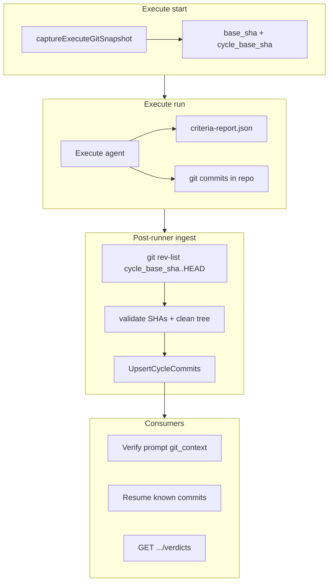

# Cycle commit tracking

How the worker indexes git commits per execution cycle, gates execute on a clean tree, and feeds verify, resume, and the verdicts API without public cycle markers.

| | |
| --- | --- |
| **Applies to** | Agent harness execute/verify phases, `task_cycle_commits`, verdicts API |
| **Audience** | Contributors touching `pkgs/agents/harness`, cycle store, or cycle detail UI |
| **Prerequisite** | [execute-agent.md](./execute-agent.md) — execute prompt and criteria self-report; [persistence.md](./persistence.md) — verdict mirror pattern |
| **Decision record** | [ADR-0014](../adr/ADR-0014-cycle-commit-tracking.md) |

## In this article

- [Overview](#overview)
- [Key concepts](#key-concepts)
- [How it works](#how-it-works)
- [Execute workflow](#execute-workflow)
- [Wire contracts](#wire-contracts)
- [Verify and resume consumption](#verify-and-resume-consumption)
- [Retry behavior](#retry-behavior)
- [Configuration](#configuration)
- [Limitations](#limitations)
- [See also](#see-also)

## Overview

When `app_settings.repo_root` points at a git worktree, every successful execute phase must end with **at least one new commit** in the cycle ancestry and a **clean working tree** before verify runs. The worker discovers commits via `git rev-list --reverse cycle_base_sha..HEAD`, validates the agent's self-reported SHAs, and upserts durable rows into `task_cycle_commits`.

> **Note** — Non-git working directories skip snapshot, ingest, and commit gates entirely (`git.skipped` in phase details). Verify integrity checks are also bypassed for non-git repos.

Public git history no longer carries `t2a:cycle=` markers ([ADR-0014](../adr/ADR-0014-cycle-commit-tracking.md) supersedes the marker policy in [ADR-0006](../adr/ADR-0006-phase-boundary-resume.md)). Resume and verify read the worker-owned commit index from the database instead of grepping commit messages.

Schema: [data-model.md](../data-model.md). HTTP surface: `GET /tasks/{id}/cycles/{cycleId}/verdicts` in [api.md](../api.md).

## Key concepts

| Term | Definition |
| --- | --- |
| **`base_sha`** | `HEAD` at execute phase start — anchor for this execute visit. |
| **`cycle_base_sha`** | First execute's `base_sha` in the cycle; ancestry range is `cycle_base_sha..HEAD`. On the first execute, equals `base_sha`. On retries, loaded from the earliest prior execute phase's `details_json.git`. |
| **Ancestry discovery** | Worker-owned `git rev-list --reverse cycle_base_sha..HEAD` — authoritative commit list, not the agent's report alone. |
| **Ingest** | Post-runner validation + `UpsertCycleCommits` before `CompletePhase(execute)`. |
| **Worker-indexed commits** | Rows in `task_cycle_commits` — durable index for prompts, resume, and UI. |

### Actors and trust

| Actor | Responsibility | Trust level |
| --- | --- | --- |
| Execute agent | Implements work; commits; lists SHAs in `criteria-report.json` | Self-report validated against ancestry |
| Worker | Snapshots anchors, discovers ancestry, gates dirty tree / rewrites, upserts DB rows | Trusted orchestrator |
| Verify agent | Reads DB commit list + live `git diff HEAD` for uncommitted remainder | Trusted when integrity holds |

### Execute failure reasons (git gates)

| Summary | Meaning |
| --- | --- |
| `execute_no_commits` | Ancestry range is empty after a successful runner exit |
| `execute_uncommitted_work` | Working tree has porcelain changes |
| `execute_invalid_commit` | Reported SHA not in ancestry, or ingest I/O error |
| `execute_rewritten_history` | A previously indexed SHA is missing from current ancestry (amend/rebase/squash) |

## How it works



At a high level:

1. **Snapshot** — Before `runner.Run`, capture repo/worktree/`HEAD`/branch and resolve `cycle_base_sha`.
2. **Prompt** — In git repos, append `## Git commits (required)` (no `t2a:` markers).
3. **Ingest** — After runner success, discover ancestry, cross-check optional `commits[]` in the criteria report, require clean tree, upsert rows.
4. **Consume** — Verify and resume prompts read `ListCommitsForCycle`; verify also appends live `git diff HEAD`.

Implementation: [`git_commits.go`](../../pkgs/agents/harness/git_commits.go), orchestration in [`cycle_loop.go`](../../pkgs/agents/harness/cycle_loop.go).

## Execute workflow

1. **`priorCycleBaseSHA`** — Walk prior execute phases in the same cycle; read `cycle_base_sha` (or `base_sha` fallback) from `task_cycle_phases.details_json.git`.
2. **`captureExecuteGitSnapshot`** — If workdir is not a git repo, set `Skipped=true` and bypass gates. Otherwise record `repo` (`app_settings.repo_root`), `worktree`, `base_sha`, `cycle_base_sha`, `base_branch`, `captured_at`.
3. **`composeExecutePrompt`** — When not skipped, prepend git commit policy via [`appendGitCommitPolicy`](../../pkgs/agents/harness/resume_prompt.go): normal messages only, list SHAs in `criteria-report.json`, new commits only (no amend/rebase/squash), do not push.
4. **`invokeRunner`** — Standard execute runner invocation.
5. **`ingestExecuteCommits`** (runner success, git repo only):
   - Parse optional `commits[]` from `criteria-report.json`.
   - Run `git rev-list --reverse cycle_base_sha..HEAD`.
   - Reject any reported SHA outside the ancestry set.
   - Fail if ancestry is empty (`execute_no_commits`).
   - Fail if `git status --porcelain` is non-empty (`execute_uncommitted_work`).
   - Load existing rows; fail if any stored SHA is absent from current ancestry (`execute_rewritten_history`).
   - `UpsertCycleCommits` with `phase_seq` = current execute phase.
6. **`CompletePhase(execute)`** — Merge git snapshot into `details_json` (`commit_count` when > 0). On ingest failure, phase/cycle/task fail with the reason above.

> **Important** — Ingest runs **after** runner success and **before** `CompletePhase(execute)`. Verify does not start until execute completes successfully.

## Wire contracts

### Execute prompt — git policy block

Rendered only when the worktree is a git repo:

```text
## Git commits (required)

Before you finish this execute phase, commit all work that satisfies criteria you are claiming.
List every commit SHA and branch in `criteria-report.json` under `commits`.

Use normal descriptive commit messages only — do **not** embed task IDs, cycle IDs, or `t2a:` markers.
Create **new commits only** — fix mistakes with a follow-up commit; never amend, rebase, or squash work from this cycle.
You may commit incrementally during the run.
Do not push.
```

### `criteria-report.json` — optional `commits[]`

| Field | Writer | Notes |
| --- | --- | --- |
| `criteria[]` | Execute agent | Unchanged — self-claim gate for verify |
| `commits[].sha` | Execute agent | Must appear in `cycle_base_sha..HEAD` when present |
| `commits[].branch` | Execute agent | Optional hint; worker falls back to `git branch --contains` then `base_branch` |

Path: `<T2A_WORKER_REPORT_DIR>/<cycle_id>/criteria-report.json`. The worker discovers ancestry independently; `commits[]` is a cross-check, not the source of truth.

### Phase details — `task_cycle_phases.details_json.git`

Written on execute complete (merged with runner details):

| Key | Meaning |
| --- | --- |
| `repo`, `worktree`, `base_sha`, `cycle_base_sha`, `base_branch` | Snapshot anchors |
| `captured_at` | RFC3339 UTC |
| `commit_count` | Present when ingest succeeded with commits |
| `skipped` | `true` when workdir is not a git repo |

### `task_cycle_commits` rows

Upserted per SHAs in ancestry order (`seq` = 1..N). Unique on `(cycle_id, sha)`. See [data-model.md](../data-model.md).

### Verify prompt — worker-indexed block

When rows exist, [`formatGitContextForPrompt`](../../pkgs/agents/harness/git_commits.go) renders repo/worktree/branch and a numbered commit list. A live `Diff:` section from `git diff HEAD` follows for any uncommitted remainder (expected empty after a passing execute gate).

### HTTP — `GET .../verdicts`

Returns `git_context` (repo, worktree, branch from first/last commit) and `commits[]` ordered by `seq ASC`. Empty arrays and omitted `git_context` when no rows — same non-404 contract as other verdict arrays. See [api.md](../api.md).

## Verify and resume consumption

| Consumer | Source | Behavior |
| --- | --- | --- |
| **Verify LLM** | `ListCommitsForCycle` + `git diff HEAD` | Git context block in verify prompt; diff for tamper/evidence context |
| **Resume execute** | `ListCommitsForCycle` via checkpoint loader | [`formatKnownCommitsForResume`](../../pkgs/agents/harness/git_commits.go) in resume notice — lists indexed SHAs and messages |
| **SPA cycle panel** | `GET .../verdicts` | Commit timeline under verdicts fetch |

Resume model ([ADR-0006](../adr/ADR-0006-phase-boundary-resume.md)) is unchanged: phase ledger + reports + context snapshots. Commit durability no longer depends on grep for `t2a:cycle=`.

> **Note** — Criteria report rows are still mirrored to `task_cycle_criteria_reports` at verify pipeline entry (not at execute complete). Commit rows are the exception — they land at execute ingest.

## Retry behavior

Execute↔verify retries start a **new execute phase** with a higher `phase_seq`. `cycle_base_sha` stays fixed to the first execute's `base_sha`, so ancestry spans the whole cycle attempt.

| Behavior | Detail |
| --- | --- |
| **Upsert semantics** | `(cycle_id, sha)` unique — re-ingest updates metadata; rows are not deleted on retry |
| **Append-only discipline** | Agents must add new commits; missing prior SHAs → `execute_rewritten_history` |
| **Growing ancestry** | Retry execute may add commits; `seq` reflects order within the full `cycle_base_sha..HEAD` range |
| **Clean tree** | Each execute visit must end clean before verify |

Locked criteria and verify retry orchestration: [harness.md](./harness.md), [verify-agent.md](./verify-agent.md).

## Configuration

| Knob | Effect |
| --- | --- |
| `app_settings.repo_root` | Must point at the git worktree for commit tracking to activate. Empty → worker idle; no commit gates. |
| `T2A_WORKER_REPORT_DIR` | Scratch root for `criteria-report.json` (unchanged). |

> **Important** — Git commits during execute are **always on** in git repos. `app_settings.agent_commit_execute_work` was removed ([ADR-0014](../adr/ADR-0014-cycle-commit-tracking.md)); there is no Settings toggle to disable commits.

Full `app_settings` reference: [configuration.md](../configuration.md).

## Limitations

| Limitation | Detail |
| --- | --- |
| **Agent discipline** | Amend/rebase/squash of cycle work fails `execute_rewritten_history`; worker cannot recover rewritten SHAs |
| **Shared `repo_root`** | Human or concurrent commits inside `cycle_base_sha..HEAD` may appear in the cycle index |
| **Single worktree** | One `repo_root` per worker; no per-task worktree isolation |
| **Criteria mirror timing** | `task_cycle_criteria_reports` still written at verify entry; commits are indexed earlier at execute ingest |
| **Non-git repos** | Entire feature skipped — execute may leave uncommitted changes with no worker commit gate |

## See also

| Doc / code | Topic |
| --- | --- |
| [ADR-0014](../adr/ADR-0014-cycle-commit-tracking.md) | Decision and alternatives |
| [ADR-0006](../adr/ADR-0006-phase-boundary-resume.md) | Phase-boundary resume (marker policy superseded) |
| [ADR-0004](../adr/ADR-0004-verdicts-on-the-db.md) | Durable verdict mirror pattern |
| [execute-agent.md](./execute-agent.md) | Execute prompt composition |
| [verify-agent.md](./verify-agent.md) | Verify pipeline and integrity |
| [persistence.md](./persistence.md) | Store facade and verdict tables |
| [`pkgs/agents/harness/git_commits.go`](../../pkgs/agents/harness/git_commits.go) | Snapshot, ingest, prompt formatting |
| [`pkgs/tasks/store/internal/commits/`](../../pkgs/tasks/store/internal/commits/) | Upsert and list store methods |
