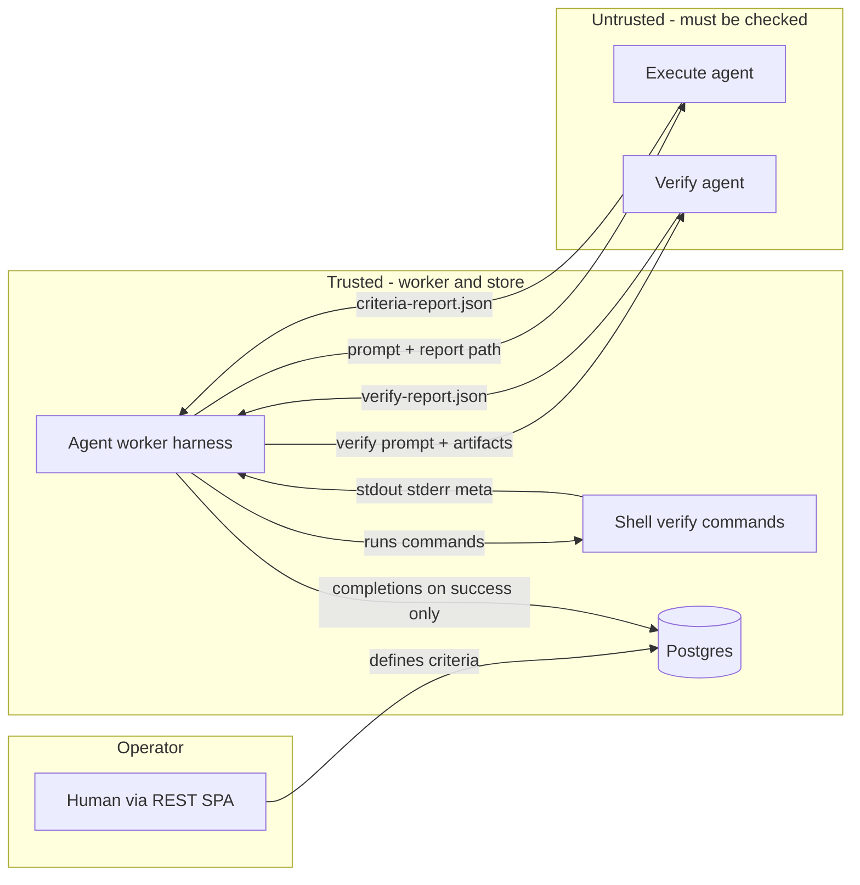

# Done criteria

Per-task acceptance requirements: how operators define them, how the agent worker verifies them, and what gets persisted when a cycle succeeds.

| | |
| --- | --- |
| **Applies to** | Checklist API, task create flow, agent worker harness, checklist UI |
| **Audience** | Contributors touching store, harness, handlers, or SPA checklist surfaces |
| **Companion article** | [verify-agent.md](./verify-agent.md) — verify-phase LLM judge; [execute-agent.md](./execute-agent.md) — execute-phase prompt composition; [harness.md](./harness.md) — cycle loop and retry orchestration |

## In this article

- [Overview](#overview)
- [Key concepts](#key-concepts)
- [How it works](#how-it-works)
- [Operator workflow](#operator-workflow)
- [Verification workflow](#verification-workflow)
- [Wire contracts](#wire-contracts)
- [Configuration](#configuration)
- [Best practices](#best-practices)
- [Limitations](#limitations)
- [See also](#see-also)

## Overview

**Done criteria** (checklist items) are operator-authored acceptance requirements attached to a task. Each criterion has a stable `id`, human-readable `text`, and optional ordered **verify commands** (shell checks the worker runs during verify).

They answer: *what must be true before this task is allowed to reach `status=done`?*

### In scope

- Definition CRUD, edit locks, and the completion ledger
- Execute → self-claim gate → verify → decision loop
- Ephemeral agent report files and durable verdict tables

### Out of scope

- **Gate criteria** on `task.gate.criteria[]` (operator checklist before dequeue release). See [data-model.md](../data-model.md) (Gate).
- Draft-task eval rubric (advisory scoring at create time)
- Full verify-agent prompt engineering — see [verify-agent.md](./verify-agent.md)
- Execute prompt composition and criteria injection — see [execute-agent.md](./execute-agent.md)

> **Important** — `POST /tasks` requires at least one non-empty criterion in `checklist_items`. Legacy rows with zero criteria still exist; those tasks skip the entire verify pipeline.

> **Note** — After [ADR-0010](../adr/ADR-0010-remove-subtasks.md), each task owns its own definitions. There is no checklist inheritance across a parent/child tree.

Schema tables and HTTP contracts remain authoritative in [data-model.md](../data-model.md) and [api.md](../api.md).

## Key concepts

| Term | Definition |
| --- | --- |
| **Done criterion** | A row in `task_checklist_items` with stable `id` and `text`. |
| **Verify command** | Optional shell check in `task_checklist_item_commands`, run by the worker before LLM verify. |
| **Self-claim** | Execute agent assertion (`claimed_done`) in `criteria-report.json`. Not final acceptance. |
| **Verify verdict** | Verify agent judgment (`verified`) in `verify-report.json`. Sole authority for `verified_by=verify_agent`. |
| **Completion ledger** | `task_checklist_completions` rows written only when the execution cycle terminates successfully. |
| **Locked pass** | Criterion verified on an earlier attempt in the same cycle; carried in `previouslyPassed` and omitted from re-verify. |

### Actors and trust



| Actor | Role | Trust |
| --- | --- | --- |
| **Operator** | Authors criterion text and optional verify commands via REST/SPA. Cannot directly mark criteria done (completion writes are `ActorAgent` only). | Trusted to define intent. Verify commands are a trusted-operator surface (shell injection risk bounded by timeout and output caps). |
| **Execute agent** | Does the work; writes `criteria-report.json` with `claimed_done` and `evidence`. | **Not trusted** for final acceptance. `claimed_done` is an assertion only. |
| **Worker shell** | Runs `task_checklist_item_commands` in `app_settings.repo_root` before LLM verify. | Trusted executor of operator-defined commands. Output is evidence input, not a pass/fail verdict. |
| **Verify agent** | Reads work and evidence; writes `verify-report.json`. Sole writer of `verified_by=verify_agent` on success. | Adversarial judge — may use a different runner/model than execute. Must not modify the working tree (enforced by git integrity check). |
| **Store** | Persists definitions, per-attempt verdict mirrors, and — only after cycle success — `task_checklist_completions`. | Source of truth for task-level "criterion is done." |

> **Important** — Nothing is written to `task_checklist_completions` until the execution cycle terminates successfully. Criteria that passed on attempt 1 but failed the overall cycle on attempt 2 leave **no** completion rows.

## How it works

Three persistence layers cooperate:

| Layer | Storage | Lifetime | Purpose |
| --- | --- | --- | --- |
| **Definitions** | `task_checklist_items`, `task_checklist_item_commands` | Until operator deletes | What "done" means |
| **Ephemeral reports** | `<T2A_WORKER_REPORT_DIR>/<cycle_id>/` | GC at cycle terminate | Agent ↔ worker wire format |
| **Durable ledger** | `task_checklist_completions`, `task_cycle_*_reports`, `task_cycle_command_runs` | Until task/cycle deleted | UI, audit, support |

The worker runs verify inside [`runCycleLoop`](../../pkgs/agents/harness/cycle_loop.go) after a successful execute phase, **only when the task has ≥1 criterion** (`verificationSnapshot.enabled`). Harness orchestration (retry loop, `previouslyPassed`, termination): [harness.md](./harness.md). Zero-criteria legacy tasks skip verify; a successful execute alone completes the task via [`completeChecklistLegacy`](../../pkgs/agents/harness/verification.go).

## Operator workflow

1. **Create** — Criteria inserted atomically with the task row (`task_checklist_items`, optional `task_checklist_item_commands`).
2. **Edit while open** — Add, edit text, or delete definitions while the task is not `running` or `done`. Verified items lock text/delete (409).
3. **Running** — Definitions frozen (409 on add/edit/delete). The agent may still receive updated completion state via the worker.
4. **Done** — All criteria must have completion rows before `status=done` ([`ValidateCanMarkDoneInTx`](../../pkgs/tasks/store/internal/checklist/validate.go)).

| State | Add | Edit text | Delete |
| --- | --- | --- | --- |
| Open (not running) | Yes | Yes | Yes* |
| Cycle running | No (409) | No (409) | No (409) |
| Verified (completion exists) | Yes | No (409) | No (409) |

\*Delete blocked if any completion exists for the item.

## Verification workflow

```mermaid
sequenceDiagram
  participant Loop as runCycleLoop
  participant Exec as ExecuteAgent
  participant Pipe as runVerificationPipeline
  participant Cmd as ShellChecks
  participant Ver as VerifyAgent
  participant DB as Store

  Loop->>Exec: Prompt with criteria ids + report path
  Exec->>Pipe: criteria-report.json
  Note over Pipe: claimed_done false → agent_self fail, skip LLM
  Pipe->>Cmd: verify_commands per criterion
  Cmd->>Pipe: temp stdout stderr meta
  Pipe->>Ver: Verify prompt + artifacts
  Ver->>Pipe: verify-report.json
  Note over Pipe: Git pre/post integrity snapshot
  alt all criteria pass
    Pipe->>Loop: success
    Loop->>DB: SetDoneWithEvidence + completions
  else any fail and retries remain
    Pipe->>Loop: verifyErr + feedback
    Loop->>Loop: verifyAttempt++, retry execute
  else retries exhausted
    Loop->>DB: terminate verification_failed ids
  end
```

1. **Execute** — [`injectCriteria`](../../pkgs/agents/harness/criteria_prompt.go) prepends active criteria and the absolute path to `criteria-report.json`. Criteria already passed in earlier attempts appear under "Already verified (do not re-do)" and are omitted from the report's expected ID set. Full prompt contract: [execute-agent.md](./execute-agent.md).
2. **Self-claim gate** — For each non-locked criterion, `claimed_done: false` fails immediately with `verified_by=agent_self`. No LLM verify runs for those IDs.
3. **Shell checks** (optional) — For criteria with `verify_commands`, the worker runs commands sequentially in `repo_root`, writing artifacts under `<report_dir>/<cycle_id>/checks/<criterion_id>/`. Failures do not skip LLM verify ([ADR-0012](../adr/ADR-0012-structured-verify-commands.md)).
4. **Verify agent** — LLM pass for every criterion that passed the self-claim gate. Optional separate runner/model via `app_settings.verify_runner_name`. See [verify-agent.md](./verify-agent.md).
5. **Integrity check** — Pre/post `git status --porcelain` + `git rev-parse HEAD` on the working dir. Any working-tree change or HEAD movement → `verify_tampered` (terminal, no retries, no completions). Non-git repos: check bypassed (logged once at startup).
6. **Decision** — All pass → [`applyVerifiedCompletions`](../../pkgs/agents/harness/verification.go) + task `done`. Any fail → retry execute up to `verify_max_retries`, carrying passed verdicts in `previouslyPassed`. Exhausted retries → cycle fails with `verification_failed:<id>,…` (prefix-stable; truncated at 256 chars).

## Wire contracts

### Definition shape (REST)

```json
{
  "checklist_items": [
    {
      "text": "Unit tests pass",
      "verify_commands": [
        { "command": "go test ./...", "expected_outcome": "All tests green" }
      ]
    }
  ]
}
```

- Max **5** verify commands per criterion.
- Criterion `text` is required at create; commands are optional.

### Execute report — `criteria-report.json`

| Field | Writer | Notes |
| --- | --- | --- |
| `criteria[].id` | Execute agent | Must match definition ids (active set only on retry) |
| `criteria[].claimed_done` | Execute agent | Assertion; not final acceptance |
| `criteria[].evidence` | Execute agent | ≤ 16 KB |
| `commits[].sha` | Execute agent | Optional self-report; worker validates against `git rev-list` ancestry |
| `commits[].branch` | Execute agent | Optional; stored on `task_cycle_commits` when present |

Path: `<report_dir>/<cycle_id>/criteria-report.json`. Injected into execute prompt as an **absolute** path outside `repo_root`.

### Verify report — `verify-report.json`

| Field | Writer | Notes |
| --- | --- | --- |
| `criteria[].id` | Verify agent | One entry per criterion evaluated this attempt |
| `criteria[].verified` | Verify agent | `true` only if criterion satisfied |
| `criteria[].reasoning` | Verify agent | ≤ 16 KB; ≥ 40 chars when `verified=true` |

Full prompt contract: [verify-agent.md](./verify-agent.md).

### Completion ledger — `task_checklist_completions`

Written only on **cycle success**, one row per passed criterion:

| Field | Meaning |
| --- | --- |
| `verified_by` | `verify_agent` on success; `agent_self` never written on success (failure-only) |
| `evidence` | From execute report |
| `verifier_reasoning` | From verify report |
| `cycle_id` | Producing cycle |

| `verified_by` | Meaning |
| --- | --- |
| `verify_agent` | Verify pass accepted (current worker) |
| `agent_self` | Failure-only: execute did not claim done |
| `deterministic_check` | Legacy rows only; never written by current worker |
| `human_override` | Reserved; schema only |
| `legacy` | Pre-V1.1 backfill; never written by current worker |

### Report file limits

From [`criteria_parse.go`](../../pkgs/agents/harness/criteria_parse.go):

- 256 KB max per report file
- 16 KB max per `evidence` / `reasoning` field
- Duplicate criterion ids in one report → invalid
- Symlinks rejected

### Verdict mirrors (durable, per attempt)

The worker upserts rows keyed by `(cycle_id, attempt_seq, criterion_id)`:

- `task_cycle_criteria_reports` — execute self-claims
- `task_cycle_verify_reports` — verify verdicts + `verifier_kind`
- `task_cycle_command_runs` — index to temp command output files

Exposed on `GET /tasks/{id}/cycles/{cycleId}/verdicts`. Pre-verdict cycles return empty arrays.

## Configuration

| Setting | Source | Default | Effect on criteria |
| --- | --- | --- | --- |
| `verify_max_retries` | `app_settings` | `2` | Max execute↔verify retry loops per cycle |
| `verify_runner_name` | `app_settings` | `""` | Empty = verify uses execute runner. Non-empty = separate runner (probe failure demotes to execute runner with warn) |
| `verify_runner_model` | `app_settings` | `""` | Optional model override for verify runner |
| `verify_command_timeout_seconds` | `app_settings` | `120` | Wall-clock cap per shell verify command |
| `T2A_WORKER_REPORT_DIR` | env | `<tmp>/t2a-worker` | Scratch root for report files (outside `repo_root`) |
| `repo_root` | `app_settings` | — | Working dir for execute + shell checks + verify integrity snapshot |

See [configuration.md](../configuration.md) for validation rules and supervisor hot-reload behavior.

## Best practices

- **Explicit acceptance contract** — Stable criterion IDs survive retries; operators and agents share the same checklist.
- **Separation of claim vs proof** — Execute asserts `claimed_done`; verify independently judges.
- **Adversarial verify option** — Different runner/model from execute ([ADR-0003](../adr/ADR-0003-verify-component-upgrade.md)).
- **Atomic completion honesty** — No partial completion rows on failed cycles.
- **Retry efficiency** — Passed criteria carried in `previouslyPassed`; execute prompts and verify short-circuit settled items.
- **Deterministic evidence channel** — Optional shell commands produce inspectable artifacts without bypassing LLM judgment ([ADR-0012](../adr/ADR-0012-structured-verify-commands.md)).
- **Rich audit trail** — Per-attempt verdict tables + `details.verification` on verify phase events for SPA timeline.
- **Tamper detection** — Post-verify git snapshot catches a verifier modifying source (when working dir is a git repo).
- **Clean working tree** — Report files live outside `repo_root`.

> **Warning** — Use read-only verify commands (tests, lint, grep). Commands that mutate the working tree can trigger `verify_tampered`.

## Limitations

| Limitation | Detail |
| --- | --- |
| LLM is sole pass authority | Exit code 0 on verify commands does not mark a criterion done. |
| Legacy zero-criteria tasks | Pre-create-requirement rows skip verify; execute success alone marks the task done. |
| Definitions locked after pickup | Operators cannot refine acceptance text mid-flight once status is `running`. |
| Non-git working dirs | Integrity check bypassed; tamper detection degraded. |
| Ephemeral agent reports | Report JSON files GC'd at cycle end; forensics rely on verdict tables and events. |
| Truncated failure reasons | `verification_failed:<ids>` capped at 256 characters. |
| `human_override` unused | Schema supports operator override; no handler/worker path writes it today. |
| Draft eval is advisory | [`pkgs/tasks/store/internal/eval/`](../../pkgs/tasks/store/internal/eval/) scores criterion quality at compose time only. |
| Verdict upsert errors are non-gating | Failure to mirror reports to DB is logged but verify continues. |
| Stale package comments | [`checklist/doc.go`](../../pkgs/tasks/store/internal/checklist/doc.go) still references removed subtask inheritance; runtime is flat per ADR-0010. |

## See also

### Documentation

| Doc | Why read it |
| --- | --- |
| [harness.md](./harness.md) | Cycle loop, resume, recovery (orchestration) |
| [execute-agent.md](./execute-agent.md) | Execute pass deep-dive (companion article) |
| [verify-agent.md](./verify-agent.md) | Verify pass deep-dive (companion article) |
| [data-model.md](../data-model.md) (Checklist) | Schema, edit locks, verdict tables |
| [api.md](../api.md) | Checklist routes, create validation, verdicts endpoint |
| [architecture.md](../architecture.md) | Worker + harness placement in `taskapi` |
| [configuration.md](../configuration.md) | Verify settings and report dir |
| [ADR-0003](../adr/ADR-0003-verify-component-upgrade.md) | Adversarial verify, integrity check, retry efficiency |
| [ADR-0012](../adr/ADR-0012-structured-verify-commands.md) | Shell checks and evidence layout |
| [ADR-0010](../adr/ADR-0010-remove-subtasks.md) | Flat tasks; no checklist inheritance |

### Code

| Package / file | Responsibility |
| --- | --- |
| [`pkgs/tasks/store/internal/checklist/`](../../pkgs/tasks/store/internal/checklist/) | Definition CRUD, completion ledger, `ValidateCanMarkDoneInTx` |
| [`pkgs/agents/harness/cycle_loop.go`](../../pkgs/agents/harness/cycle_loop.go) | Execute ↔ verify retry orchestration |
| [`pkgs/agents/harness/verification.go`](../../pkgs/agents/harness/verification.go) | Verify pipeline, integrity check, completions |
| [`pkgs/agents/harness/criteria_prompt.go`](../../pkgs/agents/harness/criteria_prompt.go) | Criteria injection into execute prompt |
| [`pkgs/agents/harness/criteria_parse.go`](../../pkgs/agents/harness/criteria_parse.go) | Report parsing and size limits |
| [`pkgs/tasks/handler/handler_create_checklist.go`](../../pkgs/tasks/handler/handler_create_checklist.go) | Create-time checklist validation |
| [`web/src/tasks/components/task-detail/checklist/`](../../web/src/tasks/components/task-detail/checklist/) | SPA checklist UI |
| [`web/src/tasks/components/task-compose/modals/ChecklistCriterionModal.tsx`](../../web/src/tasks/components/task-compose/modals/ChecklistCriterionModal.tsx) | Criterion authoring UI |
