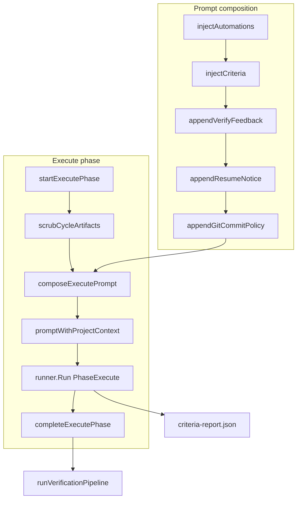

# Execute agent

How the execute phase implements task work via the configured runner, composed prompt, and `criteria-report.json` self-claim.

| | |
| --- | --- |
| **Applies to** | Agent worker harness, execute runner, task create/edit (prompt, automations, project context), cycle progress UI |
| **Audience** | Contributors touching `pkgs/agents/harness`, runner adapters, or execute-phase settings |
| **Prerequisite** | [done-criteria.md](./done-criteria.md) — criteria vocabulary and lifecycle |
| **Companion article** | [verify-agent.md](./verify-agent.md) — adversarial judge that runs after execute; [harness.md](./harness.md) — cycle loop and worker boundary |

## In this article

- [Overview](#overview)
- [Key concepts](#key-concepts)
- [How it works](#how-it-works)
- [Execute workflow](#execute-workflow)
- [Execute prompt contract](#execute-prompt-contract)
- [Wire contracts](#wire-contracts)
- [Resume behavior](#resume-behavior)
- [Configuration](#configuration)
- [Best practices](#best-practices)
- [Limitations](#limitations)
- [See also](#see-also)

## Overview

The **execute agent** is the LLM pass during `PhaseExecute`. The harness invokes it via `runner.Run` with `WorkingDir` set to `app_settings.repo_root`. The agent implements the operator's task, optionally commits work per policy, and — when the task has done criteria — writes a self-report to `criteria-report.json`.

### In scope

- Prompt composition (criteria, automations, resume, git policy, project context)
- Runner invocation, progress streaming, and phase persistence
- Criteria self-report wire format and parser expectations
- Retry inputs (locked criteria, verify feedback) and resume branches
- Failure classification (timeout, non-zero exit, cancel, shutdown)

### Out of scope

- Verify phase (LLM judge, shell checks, git tamper detection) — see [verify-agent.md](./verify-agent.md)
- Queue admission and ack ordering — `pkgs/agents/worker`
- Runner adapter internals (Cursor CLI, env allowlist, registry) — [runner-adapters.md](./runner-adapters.md)
- Gate criteria on `task.gate.criteria[]` — [data-model.md](../data-model.md) (Gate)
- Draft-task eval rubric (advisory scoring at create time)

> **Important** — The execute agent **implements work** and **self-asserts** completion via `claimed_done`. It does **not** write `task_checklist_completions` rows. Verify and the worker own final acceptance.

> **Note** — Zero-criteria legacy tasks still run execute. Verify is skipped; a successful execute alone marks the task `done`. See [data-model.md](../data-model.md).

Schema and table definitions: [data-model.md](../data-model.md) (Checklist). HTTP surfaces: [api.md](../api.md).

## Key concepts

| Term | Definition |
| --- | --- |
| **InitialPrompt** | Operator-authored rich text on the task row (`initial_prompt`); base input to composition. |
| **Composed prompt** | String built by `composeExecutePrompt` before project-context wrapping. |
| **Report dir** | `T2A_WORKER_REPORT_DIR/<cycle_id>/` — outside the git repo; holds `criteria-report.json`. |
| **Self-claim** | `claimed_done` + `evidence` in the criteria report; assertion only, not final acceptance. |
| **Locked criterion** | Passed on a prior verify attempt in the same cycle; listed as "Already verified (do not re-do)". |
| **prompt_hash** | SHA-256 of **InitialPrompt only** (not the composed prompt), stored in `task_cycles.meta_json`. |

### Actors and trust

| Actor | Role | Trust |
| --- | --- | --- |
| **Operator** | Authors `initial_prompt`, criteria, automations, and project context selection. | Trusted to define intent. |
| **Worker (harness)** | Composes prompt, invokes runner, parses criteria report after execute, hands off to verify. | Trusted orchestrator. |
| **Execute agent** | Implements work in `repo_root`; writes `criteria-report.json`. | **Not trusted** for final acceptance — self-claim is an assertion. |
| **Verify agent** | Judges criteria after execute (downstream). | Trusted verdict when integrity holds — see [verify-agent.md](./verify-agent.md). |

## How it works



Inside [`runCycleLoop`](../../pkgs/agents/harness/cycle_loop.go), execute always runs first (unless resume skips it). On success with criteria enabled, the verification pipeline reads `criteria-report.json` and continues — see [verify-agent.md](./verify-agent.md). Full loop semantics: [harness.md](./harness.md).

## Execute workflow

Each execute attempt follows this sequence in [`cycle_loop.go`](../../pkgs/agents/harness/cycle_loop.go) and [`cycle.go`](../../pkgs/agents/harness/cycle.go):

1. **`StartPhase(execute)`** — Opens the execute phase row; publishes SSE so the UI shows the phase as running.

2. **`scrubCycleArtifacts` + `ensureReportCycleDir`** — Removes any stale per-cycle report subdirectory from a prior attempt, then creates a fresh writable dir. Prevents a leftover `criteria-report.json` from satisfying parse on the wrong attempt. See [`criteria_parse.go`](../../pkgs/agents/harness/criteria_parse.go).

3. **`composeExecutePrompt`** — Builds the composed prompt (see [Execute prompt contract](#execute-prompt-contract)). Assigns it to a copy of the task as `InitialPrompt` for the runner call.

4. **`invokeRunner`** — Loads or reuses the project context snapshot, wraps the composed prompt in `<task_prompt>`, and calls `runner.Run` with timeout and cancel support. Progress callbacks persist to `task_cycle_stream_events` and publish ephemeral SSE. See [`cycle.go`](../../pkgs/agents/harness/cycle.go).

5. **Outcome classification** — `classifyRunOutcome` maps the runner error to phase/cycle/task status and a stable reason string (`runner_timeout`, `runner_non_zero_exit`, `runner_invalid_output`, `runner_error`). Operator cancel overrides with `cancelled_by_operator`.

6. **`CompletePhase(execute)`** — Persists `runner.Result` (summary, details, resolved model) on the phase row.

7. **Verify handoff** — When `verificationSnapshot.enabled`, the worker parses `criteria-report.json` and enters the verify pipeline. When disabled (zero criteria), a successful execute completes the task directly.

### Interruption paths

| Event | Behavior |
| --- | --- |
| **Operator cancel** | `CancelCurrentRun` cancels the in-flight context; cycle terminates with `cancelled_by_operator`. See [`harness.go`](../../pkgs/agents/harness/harness.go). |
| **Process shutdown** | Parent context cancelled mid-run → `handleShutdownAfterRun` → cycle `aborted`, reason `shutdown`. See [`recovery.go`](../../pkgs/agents/harness/recovery.go). |
| **Panic** | Deferred `recoverFromPanic` best-effort `CompletePhase(failed, "panic")` + `TerminateCycle(failed, "panic")`. |
| **Project context failure** | Execute fails before runner starts with `runner.ErrInvalidOutput` and summary `project context selection failed`. |

## Execute prompt contract

`composeExecutePrompt` assembles sections in a specific order. Because several helpers **prepend** blocks, the agent reads the final prompt **top to bottom** as:

| Order | Section | Source | When present |
| --- | --- | --- | --- |
| 1 | Git commits (required) | [`resume_prompt.go`](../../pkgs/agents/harness/resume_prompt.go) | Git worktree only — skipped when `WorkingDir` is empty or not a git repo |
| 2 | Worker resume notice | `appendResumeNotice` | Resume after `process_restart` during execute |
| 3 | Done criteria + Already verified | [`criteria_prompt.go`](../../pkgs/agents/harness/criteria_prompt.go) | Task has checklist items |
| 4 | Agent behaviors | [`automation_prompt.go`](../../pkgs/agents/harness/automation_prompt.go) | Task has resolved `automation_selections` |
| 5 | Operator `initial_prompt` | Task row | Always |
| 6 | Previous verification feedback | `appendVerifyFeedback` | Retry after verify failure |

At invoke time, **project context** wraps the composed body ([`project_context.go`](../../pkgs/agents/harness/project_context.go)):

```text
<project_context>
Project: ...
Summary: ...
[item blocks]
</project_context>

<task_prompt>
  ...composed sections...
</task_prompt>
```

If the task has no project context selection, the wrapper is omitted and only the composed prompt is sent.

### Git commit policy

Always required in git worktrees ([ADR-0014](../adr/ADR-0014-cycle-commit-tracking.md); supersedes [ADR-0006](../adr/ADR-0006-phase-boundary-resume.md) marker policy):

- Prompt includes `## Git commits (required)` when the execute worktree is a git repo.
- The agent must commit all work that satisfies claimed criteria before finishing execute.
- List every commit SHA and branch in `criteria-report.json` under `commits` — **no** `t2a:` markers in commit messages.
- Create **new commits only**; never amend, rebase, or rewrite SHAs from this cycle.
- **Agent-claimed ingest (ADR-0032):** after runner exit the harness ingests SHAs from `criteria-report.json` `commits[]` via `cat-file` + `git log`. Hygiene (empty claims, dirty tree, rewritten history) does **not** fail execute — additive-only policy is enforced in prompts and verify.
- Do not push.

When `WorkingDir` is empty or not a git repo, snapshot/ingest/gates are skipped.

On resume, the resume notice lists **known commits from the DB** (`ListCommitsForCycle`) rather than grepping git log. A clean tree does **not** mean the task succeeded.

See [cycle-commits.md](./cycle-commits.md) for worker ingest and schema.

### Automation injection

Per [ADR-0013](../adr/ADR-0013-prompt-automations.md), resolved library rows render under `## Agent behaviors`:

- **Yes:** `- [YES] {title}: {description}`
- **No:** `- [NO] {title}: Do NOT {description}`

Missing or archived library rows referenced by the task are skipped with a structured warn log; the cycle continues.

### Criteria block

When the task has checklist items, [`injectCriteria`](../../pkgs/agents/harness/criteria_prompt.go) prepends:

- **Already verified (do not re-do)** — Locked criteria from `previouslyPassed` (retry only). Omitted from the report's expected ID set.
- **Done criteria (required)** — Active criteria with stable `[id]` prefixes, absolute path to `criteria-report.json`, JSON schema, and instruction that `claimed_done` is an assertion only.

On retry, only **active** (non-locked) criterion ids must appear in the report.

### Example prompt (illustrative)

```text
## Git commits (required)

Before you finish this execute phase, commit all work that satisfies criteria you are claiming.
List every commit SHA and branch in `criteria-report.json` under `commits`.
Use normal descriptive commit messages only — do not embed task IDs or `t2a:` markers.
Create new commits only; do not push.

## Done criteria (required)

You must satisfy every criterion below. When finished, write a JSON report at:
`/tmp/t2a-worker/cycle-abc123/criteria-report.json`

Schema: {"criteria":[{"id":"<id>","claimed_done":true,"evidence":"..."}],"commits":[{"sha":"...","branch":"main"}]}

claimed_done is your assertion that you completed the work; the verification agent independently decides whether each criterion is satisfied.

- [crit-001] Add a health check endpoint that returns 200 with {"status":"ok"}
- [crit-002] All existing tests pass

## Agent behaviors

- [YES] Run tests before finishing: Run the project test suite and fix failures before claiming done.

Implement the feature described below.

<operator initial_prompt HTML/text follows>
```

On verify retry, a `## Previous verification feedback` block is appended at the end. On resume after restart, a `## Worker resume notice` block appears near the top (after git policy).

## Wire contracts

### Execute output — `criteria-report.json`

| Field | Writer | Notes |
| --- | --- | --- |
| `criteria[].id` | Execute agent | Must match active (non-locked) definition ids |
| `criteria[].claimed_done` | Execute agent | Self-assertion; verify gates on this |
| `criteria[].evidence` | Execute agent | ≤ 16 KB per field |

Path: `<T2A_WORKER_REPORT_DIR>/<cycle_id>/criteria-report.json`. The prompt renders this as an **absolute** path outside `repo_root` so the agent CLI does not dirty the operator's working tree.

Parser rules ([`criteria_parse.go`](../../pkgs/agents/harness/criteria_parse.go)):

- 256 KB max per report file
- 16 KB max per `evidence` field
- All expected ids required; duplicate ids rejected
- Symlinks rejected
- Missing file → verify pipeline failure

### Runner request — execute

| Field | Execute value |
| --- | --- |
| `Phase` | `execute` |
| `Prompt` | Project context (if any) + composed prompt in `<task_prompt>` |
| `WorkingDir` | `app_settings.repo_root` |
| `Timeout` | `max_run_duration_seconds` (`0` = no cap) |
| `CursorModel` | Per-task `cursor_model` override when set |
| `OnProgress` | Persists to `task_cycle_stream_events`; publishes `agent_run_progress` SSE |

See [`runner.Request`](../../pkgs/agents/runner/runner.go) and [architecture.md](../architecture.md) (Runner abstraction).

### Phase and cycle metadata

| Artifact | Content |
| --- | --- |
| `task_cycles.meta_json` | `runner`, `runner_version`, `prompt_hash` (SHA-256 of **InitialPrompt only**), plus adapter-specific keys |
| Execute phase `details_json` | Normalized `runner.Result` (summary, truncated raw output, resolved model) |
| `task_cycle_stream_events` | Durable normalized progress lines from the runner adapter |
| `task_cycle_criteria_reports` | Durable mirror of execute self-claims (written during verify pipeline, not at execute complete) |

> **Important** — `prompt_hash` correlates the operator's original prompt across replays. It does **not** hash injected criteria, automations, resume blocks, or verify feedback.

## Resume behavior

After process restart, [`Harness.Resume`](../../pkgs/agents/harness/resume.go) reconstructs checkpoint state from the phase ledger and verdict tables ([`resume_state.go`](../../pkgs/agents/harness/resume_state.go)), then re-enters `runCycleLoop` with different options:

| Resume branch | Execute behavior |
| --- | --- |
| `resumeEntryExecute` | Re-run execute with resume notice, locked criteria, and prior verify feedback |
| `resumeEntryAfterExecuteSuccess` | Skip execute (`skipFirstExecute`); enter verify only |
| `resumeEntryVerifyOnly` | Skip execute (interrupted during verify phase) |

Execute-specific resume prompts tell the agent to inspect the working tree (and cycle-tagged commits when commit policy is on) before changing anything. Full resume model: [ADR-0006](../adr/ADR-0006-phase-boundary-resume.md).

> **Note** — The runner is stateless. Resume does not continue a mid-CLI session; it starts a fresh `runner.Run` with a rehydrated prompt.

**Operator cross-cycle resume** (task `failed`, new cycle): `RunWithRetry` resume mode loads a **ContinuationBundle** from the parent ([resume-continuation.md](./resume-continuation.md)). When parent execute succeeded, verify failed, and the task-wide ledger has indexed commits, the child skips execute (`verifyOnly`). Otherwise the continuation prompt carries scope lock, known commits, and additive-only git policy — see [retry-resume.md](./retry-resume.md) and [cycle-commits.md](./cycle-commits.md).

## Configuration

| Setting | Source | Effect on execute |
| --- | --- | --- |
| `runner` | `app_settings` | Which adapter invokes the execute agent |
| `repo_root` | `app_settings` | `WorkingDir` for execute (and verify integrity snapshot) |
| `cursor_model` | `app_settings` | Default model when task has no override |
| Task `cursor_model` | task row | Per-run model override forwarded to runner |
| `max_run_duration_seconds` | `app_settings` | Wall-clock cap on execute (and verify LLM) runs; `0` = no limit |
| `T2A_WORKER_REPORT_DIR` | env | Scratch root for `criteria-report.json` |
| `automation_selections` | task row | Yes/No toggles resolved into Agent behaviors block |
| `project_id` + `project_context_item_ids` | task row | Project context snapshot for the cycle |

See [configuration.md](../configuration.md) for validation rules and supervisor hot-reload behavior.

## Best practices

- Write `criteria-report.json` to the **absolute path** in the prompt — never under `repo_root`.
- On retry, report **only active** criterion ids; omit locked passes already listed under "Already verified".
- Prefer commit policy **on** when benign process restarts are possible — tagged commits aid resume when the working tree is clean.
- Do not treat verify commands as optional — the worker runs them independently; execute evidence should describe what changed, not replace shell checks ([ADR-0012](../adr/ADR-0012-structured-verify-commands.md)).
- Use stable criterion ids exactly as shown in the prompt; do not invent or paraphrase ids in the report.

## Limitations

| Limitation | Detail |
| --- | --- |
| Self-claim not trusted | Verify must affirm each criterion; `claimed_done: false` fails immediately at the self-claim gate |
| Composed prompt not hashed | Audit trail correlates operator prompt only via `prompt_hash` |
| Automations not snapshotted on task | Library edits affect future runs ([ADR-0013](../adr/ADR-0013-prompt-automations.md)) |
| Runner is stateless | No mid-CLI session resume ([ADR-0006](../adr/ADR-0006-phase-boundary-resume.md)) |
| Report files ephemeral | GC at cycle terminate; durable criteria mirror written during verify pipeline |
| Project context snapshot once per cycle | Changing selected context items mid-cycle requires a new cycle |
| Zero-criteria legacy | No criteria report required; execute-only completion path |
| Progress adapter-specific | Normalized events depend on the registered runner (V1: Cursor `stream-json`) |

## See also

### Documentation

| Doc | Content |
| --- | --- |
| [done-criteria.md](./done-criteria.md) | Full criteria lifecycle (companion article) |
| [runner-adapters.md](./runner-adapters.md) | Runner registry, capabilities, supervisor wiring |
| [harness.md](./harness.md) | Cycle loop, resume, recovery (orchestration) |
| [verify-agent.md](./verify-agent.md) | Verify pass after execute (companion article) |
| [data-model.md](../data-model.md) (Checklist) | Schema, report contracts, edit locks |
| [architecture.md](../architecture.md) | Runner abstraction, Cursor adapter, worker lifecycle |
| [configuration.md](../configuration.md) | Execute and runner settings |
| [ADR-0005](../adr/ADR-0005-extract-agent-harness.md) | Harness extraction |
| [ADR-0006](../adr/ADR-0006-phase-boundary-resume.md) | Phase-boundary resume and commit policy |
| [ADR-0013](../adr/ADR-0013-prompt-automations.md) | Automation library injection |

### Code

| File | Responsibility |
| --- | --- |
| [`pkgs/agents/harness/cycle_loop.go`](../../pkgs/agents/harness/cycle_loop.go) | Execute/verify loop, `composeExecutePrompt` |
| [`pkgs/agents/harness/cycle.go`](../../pkgs/agents/harness/cycle.go) | `startExecutePhase`, `invokeRunner`, `completeExecutePhase`, `classifyRunOutcome` |
| [`pkgs/agents/harness/criteria_prompt.go`](../../pkgs/agents/harness/criteria_prompt.go) | Criteria + verify feedback injection |
| [`pkgs/agents/harness/automation_prompt.go`](../../pkgs/agents/harness/automation_prompt.go) | Agent behaviors block |
| [`pkgs/agents/harness/resume_prompt.go`](../../pkgs/agents/harness/resume_prompt.go) | Resume notice, git commit policy |
| [`pkgs/agents/harness/project_context.go`](../../pkgs/agents/harness/project_context.go) | Context snapshot + prompt wrapping |
| [`pkgs/agents/harness/criteria_parse.go`](../../pkgs/agents/harness/criteria_parse.go) | Report paths, parse limits |
| [`pkgs/agents/harness/resume.go`](../../pkgs/agents/harness/resume.go) | Resume entry point |
| [`pkgs/agents/harness/resume_state.go`](../../pkgs/agents/harness/resume_state.go) | Checkpoint reconstruction |
| [`pkgs/agents/harness/recovery.go`](../../pkgs/agents/harness/recovery.go) | Shutdown/panic cleanup |
| [`pkgs/agents/harness/meta.go`](../../pkgs/agents/harness/meta.go) | `prompt_hash` and cycle meta |
| [`pkgs/agents/harness/README.md`](../../pkgs/agents/harness/README.md) | Harness file map |
