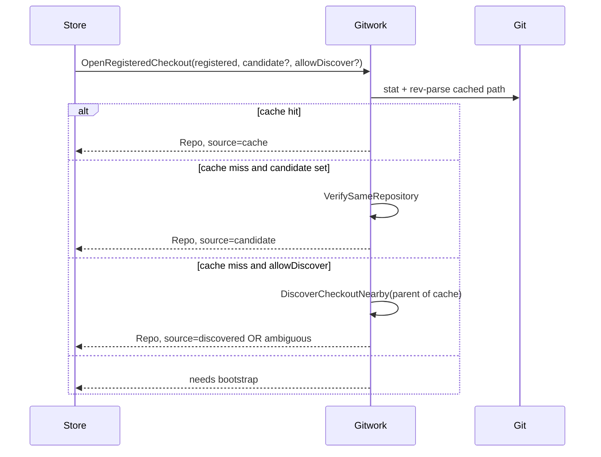

# Git checkout resolution

How Hamix opens a registered repository when DB paths may be stale, verifies operator-selected paths, and optionally discovers a moved checkout nearby.

| | |
| --- | --- |
| **Applies to** | `pkgs/gitwork/`, `pkgs/tasks/store/reconcile_git.go`, relocate handlers, workspace picker |
| **Prerequisite** | [ADR-0040](../adr/ADR-0040-git-reconcile-v2.md), [ADR-0041](../adr/ADR-0041-git-register-unify.md), [worktrees-and-branches.md](./worktrees-and-branches.md) |

## Terminology

| Term | Meaning |
| --- | --- |
| **Checkout path (cache)** | `git_repositories.path` / `git_worktrees.path` — fast lookup; may drift when folders move |
| **`git-common-dir` (identity)** | Shared object database from `git rev-parse --git-common-dir`; dedupes registration |
| **Porcelain inventory** | After a checkout opens, `git worktree list --porcelain` is source of truth for linked paths |

DB paths are **caches**. Git commands refresh them during reconcile.

## Invariants

1. **Identity** — same object database iff normalized `git-common-dir` matches **or** any stored bound branch HEAD SHA matches live `refs/heads/<name>`.
2. **Never update DB paths** without `VerifySameRepository` passing on the candidate checkout.
3. **Never auto-bind on ambiguous discovery** — zero or two-or-more verified siblings → operator must pick a path.

## Resolution flow

Order: **cache → candidate → discover** (discover only when `AllowDiscover` is true).

## Git commands (no reimplementation)

| Operation | Command |
| --- | --- |
| Open checkout | `git rev-parse --show-toplevel --git-common-dir` |
| Branch HEAD fingerprint | `git rev-parse refs/heads/<branch>` |
| Live worktree paths | `git worktree list --porcelain` |
| Repair metadata after move | `git worktree repair`, `git worktree prune` |

## Consumers

| Consumer | Uses |
| --- | --- |
| Reconcile / relocate repository | `OpenRegisteredCheckout`, then porcelain sync |
| Relocate worktree | `VerifySameRepository`, `BelongsToRepository` |
| Inventory / probe | `BelongsToRepository`, `PathKeyEqual` |
| Workspace picker | Unrestricted browse; resolution happens on relocate POST |

## Explicit non-coverage

- Non-git paths (`CursorBin`, `HAMIX_PATH_MAP`, cycle artifact paths)
- Startup silent relocate (`HAMIX_GIT_RECONCILE_ON_STARTUP` skips missing paths)
- Full-disk repo search or remote-URL fingerprinting

## See also

- [pkgs/gitwork/README.md](../../pkgs/gitwork/README.md)
- [configuration.md](../configuration.md) — `HAMIX_GIT_RECONCILE_ON_STARTUP`
