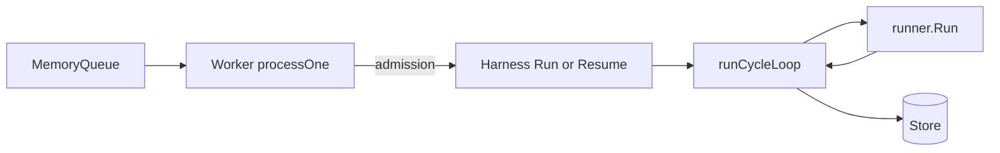
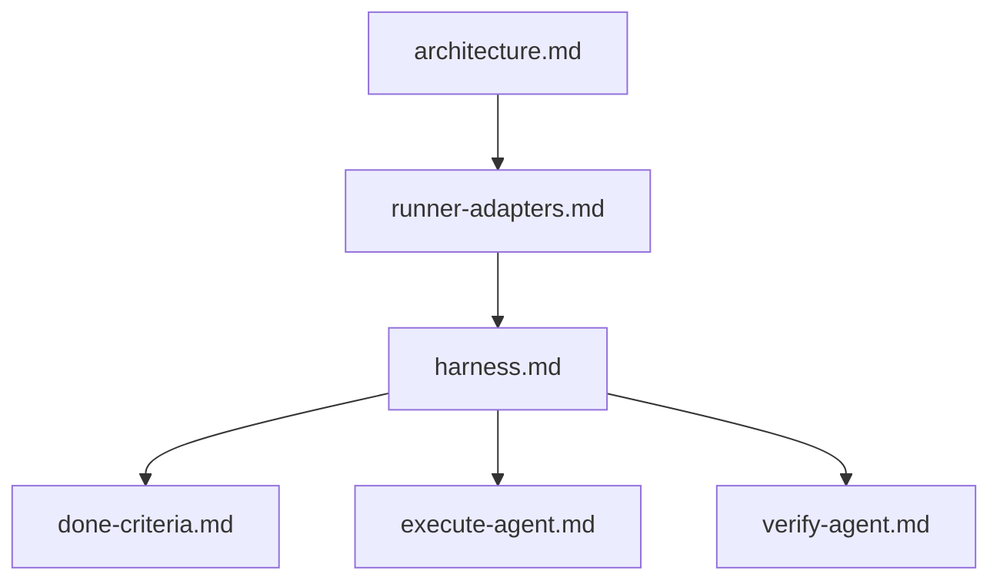
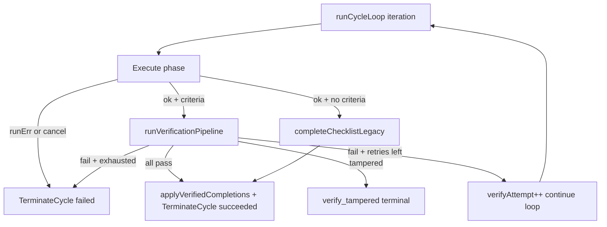

# Agent harness

Cycle choreography around `runner.Run`: phase ledger, execute/verify loop, in-memory retry state, resume, recovery, and observability seams.

| | |
| --- | --- |
| **Applies to** | `pkgs/agents/harness`, worker/harness boundary, cycle/phase store writes, agent metrics, cycle SSE |
| **Audience** | Contributors extending harness behavior, debugging stuck cycles, or wiring new runners |
| **Prerequisite** | [architecture.md](../architecture.md) — worker, runner, and SSE overview |
| **Companion articles** | [execute-agent.md](./execute-agent.md), [verify-agent.md](./verify-agent.md), [done-criteria.md](./done-criteria.md) |

## In this article

- [Overview](#overview)
- [Key concepts](#key-concepts)
- [How it works](#how-it-works)
- [Public API and construction](#public-api-and-construction)
- [Cycle lifecycle workflow](#cycle-lifecycle-workflow)
- [Resume and checkpoint reconstruction](#resume-and-checkpoint-reconstruction)
- [Recovery and termination reasons](#recovery-and-termination-reasons)
- [Side-channel report files](#side-channel-report-files)
- [Observability seams](#observability-seams)
- [Configuration](#configuration)
- [Best practices](#best-practices)
- [Limitations](#limitations)
- [See also](#see-also)

## Overview

The **harness** (`pkgs/agents/harness`) is everything wrapped around `runner.Run` that turns "run a prompt in a working directory" into a trustworthy, auditable unit of work. It owns phase choreography, prompt composition (delegating phase-specific contracts to companion docs), agent↔worker report files, adversarial verification orchestration, and crash/shutdown recovery of in-flight cycle state.

Package comment: [`doc.go`](../../pkgs/agents/harness/doc.go). Extraction rationale: [ADR-0005](../adr/ADR-0005-extract-agent-harness.md).

### In scope

- `Harness.Run` and `Harness.Resume` entry points
- `runCycleLoop` execute↔verify retry semantics and `processState`
- Store writes: `StartCycle`, `StartPhase`, `CompletePhase`, `TerminateCycle`, completion ledger
- Report-dir side channel (scrub, GC)
- Recovery paths (panic, shutdown, operator cancel) and stable termination reasons
- SSE and metrics seams

### Out of scope

- Queue admission, ack ordering, reconcile tick — [`pkgs/agents/worker/admission.go`](../../pkgs/agents/worker/admission.go)
- Runner adapter internals (Cursor CLI, env allowlist, registry) — [runner-adapters.md](./runner-adapters.md)
- Execute/verify prompt engineering — [execute-agent.md](./execute-agent.md), [verify-agent.md](./verify-agent.md)
- Operator checklist CRUD and completion ledger semantics — [done-criteria.md](./done-criteria.md)

> **Important** — The worker owns admission (`reloadTask`, readiness, `ready→running`, `AckAfterRecv` last). The harness assumes the task is already `running` when `Run` is called, or `running` with an open cycle when `Resume` is called.

## Key concepts

| Term | Definition |
| --- | --- |
| **Harness** | Concrete `harness.Harness` type; no interface or strategy registry ([ADR-0005](../adr/ADR-0005-extract-agent-harness.md)). |
| **Cycle** | One `task_cycles` row from `StartCycle` through `TerminateCycle`. |
| **Phase** | Execute or verify row in `task_cycle_phases`; each execute `runner.Run` maps to one execute phase. |
| **processState** | In-memory scratch for one task run: cycle id, running phase seq, verify retry counters, `previouslyPassed`, `verifyFeedback`. Tier **T0** — lost on process restart. |
| **Report dir** | `Options.ReportDir/<cycle_id>/` — ephemeral agent↔worker files outside `repo_root`. Tier **T1**. |
| **Phase ledger** | `task_cycle_phases` rows + verify report mirrors. Tier **T2** — survives restart ([ADR-0006](../adr/ADR-0006-phase-boundary-resume.md)). |
| **Commit index** | `task_cycle_commits` + git tree when `repo_root` configured. Tier **T3**. |
| **Completion ledger** | `task_checklist_completions` on terminal success only. Tier **T4**. |
| **Atomic completion** | `task_checklist_completions` written only on terminal cycle success via `applyVerifiedCompletions`. |

### Actors and trust

| Actor | Role | Trust |
| --- | --- | --- |
| **Worker** | Queue consumer; admission; chooses `Run` vs `Resume`; ack after harness returns. | Trusted to dequeue eligible tasks only. |
| **Harness** | Orchestrates cycle/phase ledger, prompt composition, verify pipeline, recovery. | Trusted orchestrator. |
| **Runner** | Stateless LLM/CLI execution primitive. | Executes prompt; errors classified by harness. |
| **Store** | Durable cycles, phases, verdict mirrors, completions. | Source of truth for audit and UI. |

## How it works



### Worker vs harness split

From [`admission.go`](../../pkgs/agents/worker/admission.go):

| Worker | Harness |
| --- | --- |
| `Receive`, `AckAfterRecv` (deferred last) | `StartCycle`, `StartPhase`, `CompletePhase`, `TerminateCycle` |
| `reloadTask`, readiness, gate/deps | `composeExecutePrompt`, `runVerificationPipeline` |
| `transitionTaskToRunning` (new runs) | Final `transitionTask` to `done` or `failed` |
| Chooses `Run` vs `Resume` | Implements both; shared `runCycleLoop` |

**Admission flow:**

1. `status=running` + open cycle → `Harness.Resume`
2. `status=ready` + pickup eligible → `transitionTaskToRunning` → `Harness.Run`
3. Otherwise → defer or drop (stale / not ready)

Domain article stack:



## Public API and construction

From [`harness.go`](../../pkgs/agents/harness/harness.go):

```go
h := harness.New(store, executeRunner, harness.Options{...})
h.Run(ctx, task)           // new cycle (task already running)
h.Resume(ctx, task, cycle) // continue open cycle after restart
h.CancelCurrentRun()       // operator cancel → cancels in-flight runner context
```

`cmd/taskapi/run_agentworker.go` builds `Options` from `app_settings` and passes SSE/metrics adapters. The worker wraps the harness internally and re-exports `CancelCurrentRun`.

### Options

| Field | Role |
| --- | --- |
| `RunTimeout` | Per-run wall clock on `runner.Request` (`0` = no cap) |
| `ShutdownAbortTimeout` | Bounded background ctx for panic/shutdown cleanup (default 5s) |
| `WorkingDir` | `app_settings.repo_root` |
| `ReportDir` | `T2A_WORKER_REPORT_DIR` (default `<os.TempDir()>/t2a-worker`) |
| `VerifyRunner` | Optional adversarial verify runner from supervisor |
| `Notifier` | `CycleChangeNotifier` — must not block |
| `ProgressNotifier` | Live progress SSE — must not block |
| `Metrics` | `RunMetrics` Prometheus seam |
| `Clock` | Injectable time source (tests) |

## Cycle lifecycle workflow

### Harness.Run

Numbered path in [`cycle.go`](../../pkgs/agents/harness/cycle.go):

1. Initialize `processState` with empty `previouslyPassed`; defer `recoverFromPanic`.
2. **`startCycle`** — `StartCycle` with `meta_json`: `runner`, `runner_version`, `prompt_hash` (SHA-256 of **InitialPrompt only** — see [`meta.go`](../../pkgs/agents/harness/meta.go)).
3. **`loadVerificationSnapshot`** — criteria list, `verify_max_retries`, verify runner (execute runner fallback when unset).
4. **`runCycleLoop`** — shared with `Resume` (below).
5. On terminal success: `applyVerifiedCompletions` (when criteria enabled), `TerminateCycle(succeeded)`, task `done`, report-dir GC, metrics.

### runCycleLoop retry semantics

Core loop in [`cycle_loop.go`](../../pkgs/agents/harness/cycle_loop.go):



**In-memory retry state** (`processState`):

| Field | Role |
| --- | --- |
| `previouslyPassed` | Criterion verdicts that passed on earlier attempts; merged into final completions on success only |
| `verifyFeedback` | Appended to next execute prompt after verify failure |
| `verifyAttempt` | Compared to `verificationSnapshot.maxRetries` |

**Resume loop options** (`cycleLoopOpts`):

| Flag | Effect |
| --- | --- |
| `skipFirstExecute` | Skip execute phase (resume after execute success or during verify) |
| `resumeNotice` | Prepend worker resume notice to execute prompt |
| `interruptedPhase` | Which phase was running when `process_restart` finalization occurred |

Phase-specific behavior:

- **Execute** — [execute-agent.md](./execute-agent.md)
- **Verify** — [verify-agent.md](./verify-agent.md)

## Resume and checkpoint reconstruction

[`Harness.Resume`](../../pkgs/agents/harness/resume.go) continues an open cycle after process interruption. The worker calls it when `status=running` and a `task_cycles` row is still `running`.

[`reconstructCheckpoint`](../../pkgs/agents/harness/resume_state.go) derives resume branch and in-memory state — **no dedicated checkpoint table**:

| Input | Used for |
| --- | --- |
| Phase ledger tail | Execute vs verify resume branch |
| `task_cycle_verify_reports` | Locked passes, verify attempt, retry feedback |
| Task row | Base prompt |
| `task_context_snapshots` | Project context block |
| `task_cycle_commits` | Worker-indexed SHAs for resume/verify prompts; **status** (`eligible`, `observed`, `inherited`, `superseded`) per [commit-eligibility.md](./commit-eligibility.md) |

Cross-cycle operator resume loads a **ContinuationBundle** from the parent attempt ([resume-continuation.md](./resume-continuation.md)): scope lock, status-grouped commits, verify-only routing when execute succeeded and eligible commits exist.

| Branch | Harness behavior |
| --- | --- |
| `resumeEntryExecute` | `runCycleLoop` with resume notice; re-run execute |
| `resumeEntryAfterExecuteSuccess` | Skip first execute; enter verify |
| `resumeEntryVerifyOnly` | Skip execute (interrupted during verify) |

Startup finalization (`FinalizeInterruptedPhases`), reconcile enqueue, and store transition rules: [ADR-0006](../adr/ADR-0006-phase-boundary-resume.md).

> **Note** — Each resume starts a fresh `runner.Run`. The runner is stateless; checkpoint is encoded in composed prompts only.

### Operator retry after terminal failure

When a task is `failed`, the SPA offers **Start over** (`fresh`) and **Resume from failure** (`resume`) via `POST /tasks/{id}/retry`. Intent is stored on `tasks.pending_retry` and consumed on worker pickup; the harness runs [`RunWithRetry`](../../pkgs/agents/harness/retry_run.go) instead of plain `Run`.

| Path | Trigger | Cycle row | Entry |
| --- | --- | --- | --- |
| ADR-0006 resume | Process restart; task still `running` | Same open cycle | `Harness.Resume` |
| Start over | Operator; task `failed` | New (`ParentCycleID`) | `RunWithRetry` fresh |
| Resume from failure | Operator; task `failed` | New (`ParentCycleID`) | `RunWithRetry` resume |

Deep dives: [retry-start-over.md](./retry-start-over.md), [retry-resume.md](./retry-resume.md). Decision record: [ADR-0015](../adr/ADR-0015-dual-retry-modes.md).

## Recovery and termination reasons

Stable reason strings land on cycle rows and phase summaries. Recovery paths use a **bounded background context** (`ShutdownAbortTimeout`) when the parent ctx is cancelled so audit rows still persist.

| Reason | Trigger | Cycle status | Task status |
| --- | --- | --- | --- |
| `runner_timeout` | `errors.Is(err, runner.ErrTimeout)` | failed | failed |
| `runner_non_zero_exit` | `runner.ErrNonZeroExit` | failed | failed |
| `runner_invalid_output` | `runner.ErrInvalidOutput` | failed | failed |
| `runner_error` | Other adapter error | failed | failed |
| `cancelled_by_operator` | `CancelCurrentRun` + operator flag | failed | failed |
| `shutdown` | Parent ctx cancelled mid-run | aborted | failed |
| `panic` | Deferred `recoverFromPanic` | failed | failed |
| `verify_tampered` | Post-verify git integrity failure | failed | failed |
| `verification_failed:<ids>` | Verify retries exhausted | failed | failed |
| `retry_reset_anchor_missing` | Fresh retry: no git reset anchor on parent | — | failed (no new cycle) |
| `retry_git_reset_failed` | Fresh retry: git reset/clean command failed | — | failed (no new cycle) |
| `retry_checkpoint_failed` | Resume retry: parent checkpoint load failed | — | failed (no new cycle) |
| `complete_phase_failed` | `CompletePhase` store error after runner | failed | failed |
| `checklist_completion_failed` | `applyVerifiedCompletions` error | failed | failed |
| `execute_phase_start_failed` | `StartPhase(execute)` error | failed | failed |

Recovery helpers in [`recovery.go`](../../pkgs/agents/harness/recovery.go):

| Function | When |
| --- | --- |
| `handleShutdownAfterRun` | Parent ctx dead after `runner.Run` returns |
| `recoverFromPanic` | Deferred panic safety net |
| `bestEffortTerminate` | Phase pipeline failed before/during runner |
| `bestEffortFailTask` | `StartCycle` failed (no cycle row to terminate) |
| `cleanupCycleReports` | Every exit path — report-dir GC |

If best-effort writes fail, startup orphan sweep in `cmd/taskapi` is the operator safety net.

## Side-channel report files

Worker-managed scratch under [`criteria_parse.go`](../../pkgs/agents/harness/criteria_parse.go):

```text
<ReportDir>/<cycle_id>/criteria-report.json
<ReportDir>/<cycle_id>/verify-report.json
<ReportDir>/<cycle_id>/checks/<criterion_id>/<seq>.*
```

| Operation | When |
| --- | --- |
| `scrubCycleArtifacts` | Start of each execute attempt — removes stale reports |
| `ensureReportCycleDir` | Before agent writes reports |
| `cleanupReportDir` | `TerminateCycle` and all recovery paths |

Files live **outside** `repo_root` so customer git trees stay clean. See [execute-agent.md](./execute-agent.md).

Durable mirrors (`task_cycle_criteria_reports`, `task_cycle_verify_reports`, `task_cycle_command_runs`) are upserted during the verify pipeline. Failures to mirror are logged but non-gating — forensics can use DB rows after ephemeral files are GC'd.

Report JSON includes `"schema_version": 1` ([`internal/reports`](../../pkgs/agents/harness/internal/reports/criteria_parse.go)). Parsers accept omitted or `1`; reject unknown major versions. Golden fixtures live under `internal/reports/testdata/`.

## Durability tiers

Resume and retry code must declare which tier it reads. Do not assume T1 report files exist after restart.

| Tier | Storage | Survives restart? | Used by |
| --- | --- | --- | --- |
| **T0** | `processState` in memory | No | Verify retry counters within one worker process |
| **T1** | Report dir `<cycle_id>/` | Maybe (ephemeral FS) | Agent self-report parse during active cycle |
| **T2** | Phase ledger + verify report rows | Yes | ADR-0006 resume, verify-only retry |
| **T3** | `task_cycle_commits` + git tree | Yes (when repo configured) | Cross-cycle resume, verify diff |
| **T4** | `task_checklist_completions` | Yes | Terminal success only |

Invariant tests in [`invariant_test.go`](../../pkgs/agents/harness/invariant_test.go) lock orchestration retry/tamper contracts (ADR-0018).

## Observability seams

From [`harness.go`](../../pkgs/agents/harness/harness.go) and [`metrics.go`](../../pkgs/agents/harness/metrics.go):

| Seam | Behavior |
| --- | --- |
| `CycleChangeNotifier.PublishCycleChange` | After cycle/phase store writes → `task_cycle_changed` SSE |
| `ProgressNotifier.PublishRunProgress` | Ephemeral `agent_run_progress` during `runner.Run` |
| `AppendCycleStreamEvent` | Durable normalized progress in `task_cycle_stream_events` |
| `RunMetrics.RecordRun` | Counter + duration histogram per terminal cycle |
| `RunMetrics.RecordVerifyVerdict` | Per-criterion verify outcome |
| `RunMetrics.ObserveVerifyDuration` | Wall clock per verify phase |
| `RunMetrics.ObserveVerifyRetries` | Retry count on terminal cycles |

> **Warning** — Notifier and metrics implementations must not block. The harness invokes them synchronously from the run loop and runner progress callbacks.

`recordRun` funnels every `TerminateCycle` path (happy, panic, shutdown, best-effort) so new exit paths cannot skip metrics accidentally.

## Configuration

Supervisor wiring → `Options` (full reference: [configuration.md](../configuration.md)):

| Source | Harness surface |
| --- | --- |
| `repo_root` | `Options.WorkingDir` |
| `max_run_duration_seconds` | `Options.RunTimeout` |
| `T2A_WORKER_REPORT_DIR` | `Options.ReportDir` |
| Built verify runner | `Options.VerifyRunner` |
| SSE hub adapter | `Options.Notifier`, `Options.ProgressNotifier` |
| Prometheus adapter | `Options.Metrics` |

Read at runtime from store inside harness methods:

| Setting | Effect |
| --- | --- |
| `verify_max_retries` | Max execute↔verify loops per cycle |
| `verify_command_timeout_seconds` | Per-command wall clock during verify |
| `verify_command_timeout_seconds` | Per shell verify command |

Task-level fields consumed in the loop: `cursor_model`, `automation_selections`, `project_id`, `project_context_item_ids`.

## Best practices

- Extend cycle behavior in **harness**, not worker — keep admission separate ([ADR-0005](../adr/ADR-0005-extract-agent-harness.md)).
- New terminal paths must call `TerminateCycle`, `cleanupCycleReports`, and `recordRun`.
- Preserve **atomic completion** — never write `task_checklist_completions` on failed or aborted cycles.
- Phase-specific prompt changes belong in existing `*_prompt.go` files; update [execute-agent.md](./execute-agent.md) or [verify-agent.md](./verify-agent.md) when wire contracts change.
- Prefer harness unit tests without queue plumbing (`pkgs/agents/harness/*_test.go`).
- When adding verify behavior, consider metrics (`RecordVerifyVerdict`, `ObserveVerifyRetries`) and phase `details_json` normalization in [`verification_phase_details.go`](../../pkgs/agents/harness/verification_phase_details.go).

## Limitations

| Limitation | Detail |
| --- | --- |
| No Harness interface | Single concrete type; no strategy registry yet ([ADR-0005](../adr/ADR-0005-extract-agent-harness.md)) |
| Single-process worker | `previouslyPassed` and retry counters are in-memory only |
| Runner stateless | Each phase is a fresh `runner.Run`; no mid-CLI session resume ([ADR-0006](../adr/ADR-0006-phase-boundary-resume.md)) |
| Composed prompt not in meta | Only `InitialPrompt` hashed in `meta_json` |
| Verdict mirror upsert non-gating | DB mirror failures logged; verify continues |
| Non-git repos | Integrity check bypassed per cycle |
| Notifier blocking | Slow SSE/metrics would back-pressure the run loop |
| Multi-replica workers | Not supported; two workers could race on the same task |

## See also

### Documentation

| Doc | Content |
| --- | --- |
| [persistence.md](./persistence.md) | Store writes, dual-write mirrors, verdict tables |
| [project-context.md](./project-context.md) | Context snapshots injected before execute |
| [agent-supervisor.md](./agent-supervisor.md) | Worker supervisor boundary before admission |
| [sse-hub.md](./sse-hub.md) | SSE fanout, cycle/progress publish, resync |
| [agent-queue.md](./agent-queue.md) | Worker queue admission and ack ordering |
| [runner-adapters.md](./runner-adapters.md) | Runner registry, capabilities, adding CLI adapters |
| [execute-agent.md](./execute-agent.md) | Execute phase prompt and self-report |
| [verify-agent.md](./verify-agent.md) | Verify phase LLM, commands, integrity |
| [done-criteria.md](./done-criteria.md) | Criteria lifecycle and completion ledger |
| [architecture.md](../architecture.md) | Worker queue, runner, SSE in `taskapi` |
| [configuration.md](../configuration.md) | Env vars and `app_settings` |
| [ADR-0005](../adr/ADR-0005-extract-agent-harness.md) | Harness extraction |
| [ADR-0006](../adr/ADR-0006-phase-boundary-resume.md) | Phase-boundary resume |
| [ADR-0003](../adr/ADR-0003-verify-component-upgrade.md) | Adversarial verify |
| [ADR-0012](../adr/ADR-0012-structured-verify-commands.md) | Shell verify commands |
| [ADR-0017](../adr/ADR-0017-harness-internal-domains.md) | Internal domain packages |
| [ADR-0018](../adr/ADR-0018-harness-orchestration-fsm.md) | Verify retry state machine |

### Code map

| Concern | Location |
| --- | --- |
| Entry + cycle | [`cycle.go`](../../pkgs/agents/harness/cycle.go), [`cycle_loop.go`](../../pkgs/agents/harness/cycle_loop.go) |
| Execute/verify prompts | [`internal/prompt/`](../../pkgs/agents/harness/internal/prompt/) |
| Verify pipeline | [`internal/verify/`](../../pkgs/agents/harness/internal/verify/), [`verification.go`](../../pkgs/agents/harness/verification.go) (delegators) |
| Reports | [`internal/reports/`](../../pkgs/agents/harness/internal/reports/) |
| Git + integrity | [`internal/git/`](../../pkgs/agents/harness/internal/git/), [`git_alias.go`](../../pkgs/agents/harness/git_alias.go) |
| Resume + retry | [`internal/resume/`](../../pkgs/agents/harness/internal/resume/), [`resume.go`](../../pkgs/agents/harness/resume.go), [`retry_run.go`](../../pkgs/agents/harness/retry_run.go) |
| Verify retry FSM | [`internal/orchestration/`](../../pkgs/agents/harness/internal/orchestration/) |
| Recovery | [`recovery.go`](../../pkgs/agents/harness/recovery.go) |
| Meta + metrics | [`meta.go`](../../pkgs/agents/harness/meta.go), [`metrics.go`](../../pkgs/agents/harness/metrics.go), [`effective_model.go`](../../pkgs/agents/harness/effective_model.go) |
| Core | [`harness.go`](../../pkgs/agents/harness/harness.go), [`doc.go`](../../pkgs/agents/harness/doc.go) |
| Worker boundary | [`pkgs/agents/worker/admission.go`](../../pkgs/agents/worker/admission.go) |
| Package file map | [`pkgs/agents/harness/README.md`](../../pkgs/agents/harness/README.md) |
