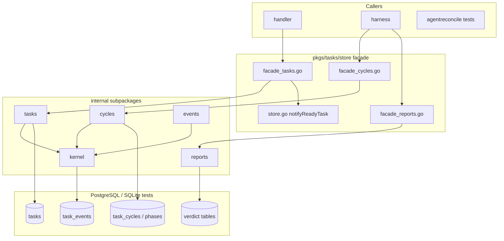
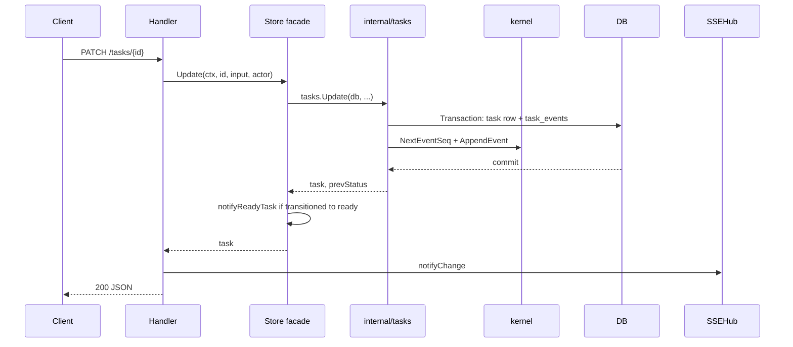
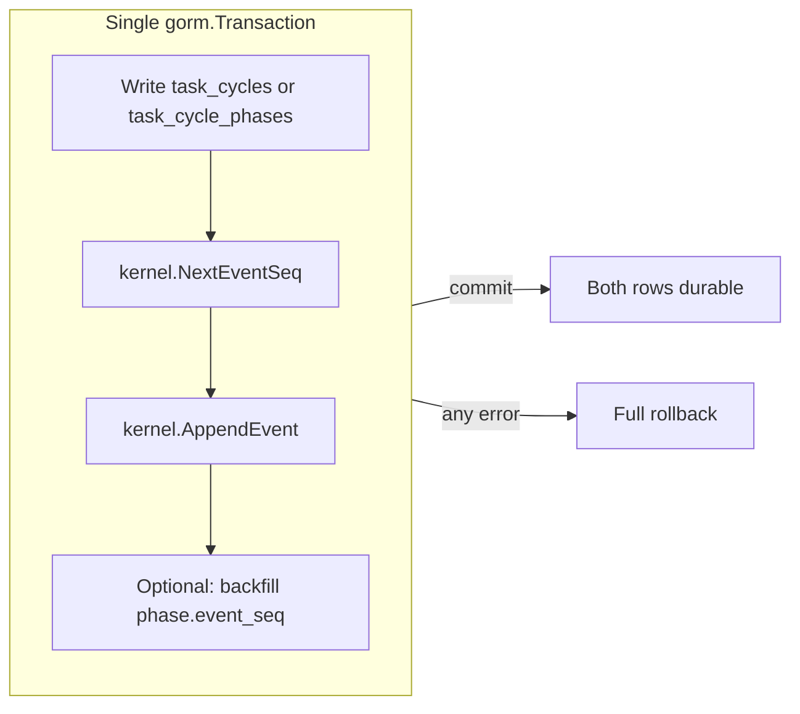
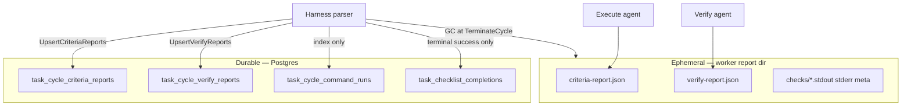
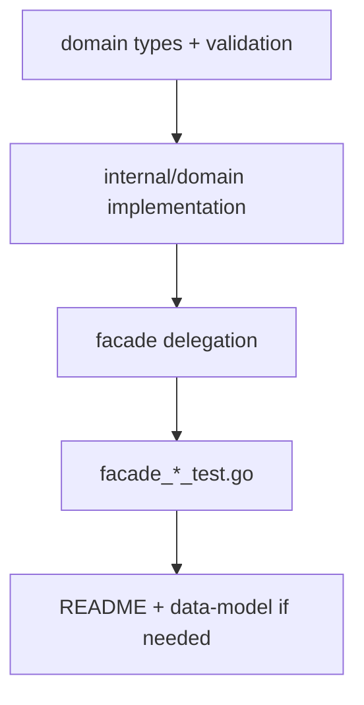

# Store facade and dual-write

GORM-backed persistence for tasks: the public `store` facade, per-domain `internal/*` packages, cycle/phase typed tables with `task_events` mirrors in one transaction, facade-only side effects, and the verdict-table vs report-file authority split.

| | |
| --- | --- |
| **Applies to** | `pkgs/tasks/store`, `internal/tasktestdb`, harness/store call sites, handler write paths |
| **Audience** | Contributors adding store methods, debugging audit drift, or tracing harness writes |
| **Prerequisite** | [data-model.md](../data-model.md) (schema, dual-write table, verdict tables) |
| **Companion articles** | [harness.md](./harness.md), [verify-agent.md](./verify-agent.md), [agent-queue.md](./agent-queue.md) |

## In this article

- [Overview](#overview)
- [Key concepts](#key-concepts)
- [How it works](#how-it-works)
- [Facade architecture](#facade-architecture)
- [Dual-write: cycles and phases](#dual-write-cycles-and-phases)
- [Verdict tables vs report files](#verdict-tables-vs-report-files)
- [Facade-only side effects](#facade-only-side-effects)
- [Cross-domain transactions](#cross-domain-transactions)
- [Workflow: adding a store method](#workflow-adding-a-store-method)
- [Invariants](#invariants)
- [Testing strategy](#testing-strategy)
- [Best practices](#best-practices)
- [Limitations](#limitations)
- [See also](#see-also)

## Overview

`pkgs/tasks/store` is the **only** persistence entry point handlers and the agent harness should use. The public surface is a **facade**: thin `(*Store)` methods in `facade_*.go` files delegate to focused packages under `internal/<domain>/`. Each subpackage owns validation, GORM transactions, and domain-specific invariants; the facade wires the shared `*gorm.DB` and fans out **process-local side effects** (ready-task notify, pickup wake) that must not leak into subpackage dependency graphs.

Two persistence patterns dominate agent work:

1. **Typed tables + audit mirror** — `task_cycles` / `task_cycle_phases` are the system of record for live execution state. Every mutation appends a matching row to `task_events` **inside the same SQL transaction** so `GET /tasks/{id}/events` remains a complete witness.
2. **Ephemeral wire files + durable verdict rows** — agents write JSON under the worker report dir; the harness parses those files and upserts normalized rows into `task_cycle_*_reports` tables. Report files are GC'd at cycle terminate; verdict tables are what the SPA and support tooling query.

Package overview: [`doc.go`](../../pkgs/tasks/store/doc.go). File map: [`README.md`](../../pkgs/tasks/store/README.md).

### In scope

- Facade layout, type aliases, delegation pattern
- `internal/cycles` dual-write to `task_events`
- `internal/kernel` audit helpers (`NextEventSeq`, `AppendEvent`)
- `internal/reports` verdict upserts (criteria + verify)
- Facade-only `notifyReadyTask` and pickup-wake scheduling
- Cross-domain `…InTx` composition
- Contributor workflow for new methods

### Out of scope

- HTTP status mapping — handlers; see [contributing.md](../contributing.md)
- Harness orchestration after store returns — [harness.md](./harness.md)
- Agent queue consumption — [agent-queue.md](./agent-queue.md)
- Postgres migration mechanics — `pkgs/tasks/postgres/migrate.go`, [architecture.md](../architecture.md)
- SSE fan-out — [sse-hub.md](./sse-hub.md) (parallel path after handler `notifyChange`)

> **Important** — The store does **not** log on errors. Callers (handlers, harness) decide whether to log. Sentinel errors are always `domain.ErrNotFound`, `domain.ErrInvalidInput`, and `domain.ErrConflict`.

## Key concepts

| Term | Definition |
| --- | --- |
| **Facade** | Public `store` package: `Store` struct + `facade_*.go` delegations + type aliases over internal types |
| **Internal subpackage** | `store/internal/<domain>/` — owns one bounded persistence concern (tasks, cycles, events, reports, …) |
| **Dual-write** | Cycle/phase row write + `task_events` append in one `gorm.DB.Transaction`; rollback on mirror failure |
| **Typed tables** | `task_cycles`, `task_cycle_phases` — authoritative for running/terminal execution state |
| **Audit mirror** | Append-only `task_events` rows for the seven cycle/phase event types; non-interactive (no user PATCH) |
| **`event_seq` backlink** | `task_cycle_phases.event_seq` → latest mirror `task_events.seq` for that phase transition |
| **Verdict tables** | `task_cycle_criteria_reports`, `task_cycle_verify_reports` — durable per-criterion evidence |
| **Report files** | Ephemeral `criteria-report.json` / `verify-report.json` under `T2A_WORKER_REPORT_DIR` |
| **`…InTx` helper** | Exported function accepting `*gorm.DB` tx so sibling subpackages compose multi-table writes atomically |

### Authority split (reads)

| Question | Authoritative source |
| --- | --- |
| Is there a running cycle? What attempt number? | `task_cycles` (`status=running`, latest `attempt_seq`) |
| What phase is in flight? Phase history? | `task_cycle_phases` (ordered by `phase_seq`) |
| Full task timeline (audit, status changes, mirrors)? | `task_events` via `GET /tasks/{id}/events` |
| Per-criterion execute self-claim for attempt N? | `task_cycle_criteria_reports` (not the JSON file after GC) |
| Per-criterion verify verdict for attempt N? | `task_cycle_verify_reports` |
| Commits indexed for a cycle (repo → branch → SHA)? | `task_cycle_commits` — see [cycle-commits.md](./cycle-commits.md) |
| Checklist items marked done on task? | `task_checklist_completions` (written only on terminal cycle success — [done-criteria.md](./done-criteria.md)) |
| Live runner token stream for one attempt? | `task_cycle_stream_events` |

Schema detail: [data-model.md](../data-model.md) (Execution cycles, Checklist, Verdict tables).

### Actors and trust

| Actor | Role | Trust |
| --- | --- | --- |
| **Handler** | Decode HTTP, call facade, map errors, `notifyChange` for SSE | Must not embed SQL or bypass facade |
| **Harness** | Cycle/phase ledger, verdict upserts, completion ledger | Trusted orchestrator; reloads task before admission |
| **Internal subpackage** | Validates inputs, runs transactions, maps GORM errors | Trusted to enforce invariants at write time |
| **Kernel** | Shared seq allocation, event append, JSON normalization, metrics | Trusted chokepoint for all audit writes |
| **Facade** | Side effects after successful commit (notify, pickup wake) | Trusted to fire notify exactly once per ready transition |

## How it works



Mutating request path (handler → store → SSE) aligns with [contributing.md](../contributing.md):



Harness cycle writes use the cycles subpackage directly through the facade (no SSE from store — harness calls `CycleChangeNotifier` separately). See [harness.md](./harness.md).

## Facade architecture

The public package exports:

- **`Store`** — holds `*gorm.DB`, ready-task notifier holder, optional pickup-wake scheduler ([`store.go`](../../pkgs/tasks/store/store.go))
- **`NewStore(db)`** — construction; notifier wired later via `SetReadyTaskNotifier`
- **Type aliases** — e.g. `StartCycleInput = cycles.StartCycleInput` so call sites stay stable when internals move
- **`facade_<domain>.go`** — one file per concern; each method is debug-log + delegate

Concern map (extend this table in the same PR when adding methods):

| Concern | Facade file | Internal package |
| --- | --- | --- |
| Wiring / notify | `store.go` | `internal/notify` |
| Tasks CRUD, trees, deps | `facade_tasks.go` | `internal/tasks` |
| Cycles & phases | `facade_cycles.go` | `internal/cycles` |
| Audit events / thread | `facade_events.go` | `internal/events` |
| Verdict mirrors | `facade_reports.go` | `internal/reports` |
| Checklist | `facade_checklist.go` | `internal/checklist` |
| Ready queue SQL | `facade_ready.go` | `internal/ready` |
| Shared kernel | — | `internal/kernel` |

Dependency direction matches [architecture.md](../architecture.md): `domain` ← `internal/*` ← facade ← `handler` / `harness`. Subpackages **never** import the public `store` package (avoids cycles). Subpackages **never** import `internal/notify`.

## Dual-write: cycles and phases

`internal/cycles` is the dual-write tier ([`internal/cycles/doc.go`](../../pkgs/tasks/store/internal/cycles/doc.go)). Every state change on typed tables also appends a mirror event through `kernel.NextEventSeq` + `kernel.AppendEvent` — never through the public `events` package — so seq allocation and JSON normalization share one code path with task CRUD and checklist writes.



### Entrypoint → mirror mapping

| Facade method | Typed write | Mirror `task_events.type` |
| --- | --- | --- |
| `StartCycle` | insert `task_cycles` (`status=running`) | `cycle_started` |
| `TerminateCycle(succeeded)` | update cycle terminal | `cycle_completed` |
| `TerminateCycle(failed\|aborted)` | update cycle terminal | `cycle_failed` (payload preserves status) |
| `StartPhase` | insert `task_cycle_phases` (`status=running`) | `phase_started` |
| `CompletePhase(succeeded)` | update phase terminal | `phase_completed` |
| `CompletePhase(failed)` | update phase terminal | `phase_failed` |
| `CompletePhase(skipped)` | update phase terminal | `phase_skipped` |

Full contract: [data-model.md](../data-model.md) (Dual-write invariant).

### Phase `event_seq` backlink

`StartPhase` and `CompletePhase` write the assigned `task_events.seq` into `task_cycle_phases.event_seq` in the same transaction. The pointer is **one-shot**: `CompletePhase` overwrites the value from `StartPhase` with the terminal mirror seq. UI and audit readers can jump from a phase row to its latest mirror event without scanning the full log.

### Cycle guards (in-TX)

| Guard | Error |
| --- | --- |
| At most one `running` cycle per task | `ErrInvalidInput: task already has a running cycle` |
| At most one `running` phase per cycle | `ErrInvalidInput: cycle already has a running phase` |
| Terminal cycle/phase rows read-only | New corrective work → higher `attempt_seq` / `phase_seq` |
| Phase transition | `domain.ValidPhaseTransition` (+ interrupt/resume escape hatch) |
| `parent_cycle_id` | Must reference a cycle on the **same** task |

Harness call order: [harness.md](./harness.md) (Cycle lifecycle workflow).

### Seq allocation concurrency

`kernel.NextEventSeq` row-locks the parent `tasks` row on Postgres (`SELECT … FOR UPDATE`) before reading `MAX(seq)`, preventing duplicate `(task_id, seq)` under concurrent writers (e.g. parallel checklist POSTs). SQLite tests skip locking — SQLite serializes writers globally. See [`kernel/events.go`](../../pkgs/tasks/store/internal/kernel/events.go).

## Verdict tables vs report files

Agent phases use a **two-layer** persistence model ([verify-agent.md](./verify-agent.md), [data-model.md](../data-model.md)):



| Layer | Writer | Lifetime | Authority |
| --- | --- | --- | --- |
| `criteria-report.json` | Execute agent (CLI) | Until cycle terminate GC | Wire format only; parse once per attempt |
| `verify-report.json` | Verify agent (CLI) | Until cycle terminate GC | Wire format only; parse once per attempt |
| `task_cycle_criteria_reports` | Harness via `UpsertCriteriaReports` | FK cascade with cycle | **Durable** execute self-claims |
| `task_cycle_verify_reports` | Harness via `UpsertVerifyReports` | FK cascade with cycle | **Durable** verify verdicts |
| `task_checklist_completions` | Harness on terminal success | Task-scoped ledger | **Durable** operator-facing "done" |

> **Note** — Verdict upserts are **not** dual-written to `task_events`. Verify-phase outcomes also appear in the mirrored `phase_completed` / `phase_failed` audit payload (`details.verification` snapshot) so the event timeline explains results without a verdicts round-trip.

`internal/reports` keys idempotency on `(cycle_id, attempt_seq, criterion_id)` — worker retries after transient DB errors rewrite the same row rather than duplicating. Bulk upsert keeps one round-trip per report parse. Rationale: [`internal/reports/reports.go`](../../pkgs/tasks/store/internal/reports/reports.go).

HTTP read surface: `GET /tasks/{id}/cycles/{cycleId}/verdicts` ([api.md](../api.md)). Pre-verdict-table cycles return empty arrays, never 404.

## Cycle commit table

Execute-phase git commits are indexed in **`task_cycle_commits`** after successful ingest ([cycle-commits.md](./cycle-commits.md)). Unlike verdict report files, commits are discovered via `git rev-list` ancestry and upserted by the harness — not parsed from a durable wire file.

| Method | Package | Notes |
| --- | --- | --- |
| `UpsertCycleCommits` | `internal/commits` via `facade_commits.go` | Idempotent on `(cycle_id, sha)`; append-only semantics |
| `ListCommitsForCycle` | same | Ordered by `seq`; consumed by resume prompts and verdicts API |
| `ListCommitsForTask` | same | Task-wide deduped ledger — verify git context reads this (ADR-0032); powers `GET /tasks/{id}/commits` |

Rows carry the full **repo → worktree → branch → commit** chain. Ingest is append-only from agent `commits[]` claims ([cycle-commits.md](./cycle-commits.md)).

## Facade-only side effects

Some behaviors intentionally stay on the facade so `internal/*` packages stay pure persistence:

### Ready-task notify

Only the facade calls `notifyReadyTask` after a successful commit ([`doc.go`](../../pkgs/tasks/store/doc.go)):

| Path | When notify fires |
| --- | --- |
| `Create` | New row committed with `status=ready` and eligible pickup |
| `Update` | Transition **to** `ready`, or `pickup_not_before` touched while still ready |
| `ApplyDevTaskRowMirror` | Dev sim sets `status=ready` |
| `notifyUnblockedDependents` | Predecessor reached `done`; dependent passes `ReadyForAgentPickup` |

Subpackages return `(task, prevStatus)`; the facade decides notify vs deferred pickup vs cancel. Notifier errors are Warn-logged and swallowed — **persist beats notify**. Deep dive: [agent-queue.md](./agent-queue.md).

### Pickup wake

When `pickup_not_before` is still in the future, the facade schedules `PickupWake` instead of immediate notify (`facade_tasks.go`). When status leaves `ready`, the facade cancels pending wake timers.

### What stays out of subpackages

- `internal/notify` — no import from `internal/tasks`, `internal/cycles`, etc.
- SSE hub — handler concern after store returns
- Agent queue — wired at `cmd/taskapi` startup via `SetReadyTaskNotifier`

## Cross-domain transactions

Multi-table writes compose by calling exported `…InTx` helpers from sibling packages inside one `db.Transaction`:

```go
err := db.WithContext(ctx).Transaction(func(tx *gorm.DB) error {
    if err := tasks.CreateCoreInTx(tx, ...); err != nil { return err }
    if err := checklist.InsertItemsInTx(tx, ...); err != nil { return err }
    return nil
})
```

Examples in production code:

| Flow | Composed helpers |
| --- | --- |
| Create task from draft | `tasks` + `drafts.DeleteByIDInTx` + checklist seed |
| Mark task done | `checklist.ValidateCanMarkDoneInTx` + status update + audit event |
| Create with checklist | task insert + checklist rows + `task_events` in one tx |

**Rule:** never call another subpackage's public `func(ctx, db, …)` entrypoint from inside an open transaction if that entrypoint starts its **own** transaction — call the `InTx` variant instead.

Cycles dual-write already runs entirely inside one transaction per method; harness callers do not need to wrap `StartCycle` / `StartPhase` again unless combining with other tables in the same atomic unit (rare — prefer harness-level sequencing).

## Workflow: adding a store method

Follow the vertical slice in [contributing.md](../contributing.md) and update the facade README table in the same PR.

1. **Domain first** — Types, enums, validation in `pkgs/tasks/domain`. No GORM imports.
2. **Pick or create internal package** — Match an existing `internal/<domain>/` boundary. New bounded concern → new subpackage + `facade_<domain>.go`.
3. **Implement in internal** — One named use-case function:
   - Input struct with trimmed IDs and explicit actor
   - Validation → `domain.ErrInvalidInput`
   - `db.WithContext(ctx).Transaction` when multiple rows or audit append
   - Map `gorm.ErrRecordNotFound` → `domain.ErrNotFound`
   - Use `kernel.AppendEvent` / `NextEventSeq` for audit rows
   - Export `…InTx` if siblings must compose
   - **Do not log errors**; defer latency via `kernel.DeferLatency`
4. **Thin facade** — Type alias (if new input struct) + `(*Store)` method: debug trace + delegate to internal with `s.db`.
5. **Side effects** — If the method can transition to `ready`, return enough info for the facade to call `notifyReadyTask` / pickup wake **after** commit (pattern in `facade_tasks.go`). Do not import `notify` from internal.
6. **Tests** — `facade_<domain>_test.go` against SQLite (`tasktestdb.OpenSQLite`); for dual-write, assert mirror row type, seq monotonicity, and rollback on mirror failure (`facade_cycles_test.go` `TestStore_DualWrite_*`).
7. **Docs** — If observable behavior changes: [api.md](../api.md), [data-model.md](../data-model.md). Update [`pkgs/tasks/store/README.md`](../../pkgs/tasks/store/README.md) concern table.



## Invariants

| Invariant | Meaning |
| --- | --- |
| **Dual-write atomicity** | Cycle/phase row and mirror `task_events` commit or roll back together |
| **Typed tables authoritative** | Running state, seq assignment, and terminal status come from `task_cycles` / `task_cycle_phases` |
| **Audit completeness** | Every cycle/phase mutation appears in `task_events`; seq monotonic per task |
| **Mirror non-interactive** | Seven cycle/phase event types reject user `PATCH` on the event thread |
| **Verdict durability** | Post-GC debugging uses verdict tables + audit snapshots, not report JSON |
| **Completion atomicity** | `task_checklist_completions` only on terminal cycle success ([harness.md](./harness.md)) |
| **Facade-only notify** | Subpackages never call `ReadyTaskNotifier`; at most one notify per ready transition |
| **Error surface** | Store returns domain sentinels only; no driver types cross the facade boundary |
| **JSON object audit payloads** | `kernel.NormalizeJSONObject` enforces `{}` default on all `task_events.data_json` writes |

## Testing strategy

| Layer | Files | What it pins |
| --- | --- | --- |
| Facade integration | `facade_*_test.go` | Public API end-to-end on SQLite |
| Dual-write contract | `facade_cycles_test.go` `TestStore_DualWrite_*` | Mirror types, `event_seq`, rollback, seq monotonicity |
| Verdict upserts | `facade_reports_test.go` | Idempotent `(cycle, attempt, criterion)` keys |
| Ready notify wiring | `facade_tasks_test.go` (`spyReadyNotifier`) | Facade fires notify on correct transitions |
| Internal white-box | `internal/<domain>/*_test.go` | Payload shape, edge validators |
| Agent integration | `pkgs/tasks/agentreconcile/` | Store + queue + worker (not imported by production) |

Default CI: `go test ./...` with in-memory SQLite — no Postgres required ([contributing.md](../contributing.md)).

Inject mirror failure: dual-write rollback test uses a test hook / constraint to prove the cycle row does not survive a failed append (`TestStore_DualWrite_StartCycle_rolls_back_when_mirror_insert_fails`).

## Best practices

- **One transaction per use-case** — Prefer explicit store methods over handlers composing multiple store calls when atomicity matters.
- **Name methods after use cases** — `StartCycle`, `UpsertVerifyReports`, not `SaveCycleRow`.
- **Keep handlers thin** — Business rules and transitions live in store/domain; handlers map errors and notify SSE.
- **Route audit through kernel** — Do not insert `task_events` rows ad hoc; use `NextEventSeq` + `AppendEvent`.
- **Extend README table** — Every new facade file or internal package gets a row in `pkgs/tasks/store/README.md`.
- **Reload after dequeue** — Harness and worker reload task state from store; do not trust stale snapshots ([agent-queue.md](./agent-queue.md)).
- **Verdict before completion** — Parse report files, upsert verdict rows, then decide terminal cycle outcome; completions ledger last.

## Limitations

| Limitation | Detail |
| --- | --- |
| No cross-process store | Facade side effects (notify, pickup wake) are in-process only; multi-replica `taskapi` does not share them |
| SQLite vs Postgres | Seq locking differs by dialect; integration quirks should stay isolated in kernel |
| Verdict tables ≠ audit log | Criteria/verify rows are normalized for UI; full narrative may still require `task_events` or stream events |
| Report files ephemeral | After cycle terminate GC, only DB verdict rows + audit snapshots remain |
| GORM abstraction | Raw SQL rare; complex queries may need dialect-specific tuning in internal packages |
| Store does not fan out SSE | Handlers must call `notifyChange` after successful writes |
| Stream events separate | Runner progress uses `task_cycle_stream_events`; not mirrored into `task_events` |

## See also

### Documentation

| Doc | Content |
| --- | --- |
| [task-events.md](./task-events.md) | Audit log HTTP surface, mirror row contract |
| [data-model.md](../data-model.md) | Schema, dual-write table, verdict columns, edit locks |
| [contributing.md](../contributing.md) | Vertical slice, handler/store split, test defaults |
| [architecture.md](../architecture.md) | System map, cycles vs audit limitation #9 |
| [harness.md](./harness.md) | Store call sequence inside cycle loop |
| [verify-agent.md](./verify-agent.md) | Report file contracts, verdict mirror flow |
| [agent-queue.md](./agent-queue.md) | `notifyReadyTask` after ready commit |
| [done-criteria.md](./done-criteria.md) | Completion ledger vs verdict tables |
| [ADR-0004](../adr/ADR-0004-verdicts-on-the-db.md) | Why verdicts persist in DB |

### Code map

| Concern | Files |
| --- | --- |
| Package overview | [`doc.go`](../../pkgs/tasks/store/doc.go), [`README.md`](../../pkgs/tasks/store/README.md) |
| Facade wiring | [`store.go`](../../pkgs/tasks/store/store.go) |
| Tasks + notify | [`facade_tasks.go`](../../pkgs/tasks/store/facade_tasks.go) |
| Cycles/phases | [`facade_cycles.go`](../../pkgs/tasks/store/facade_cycles.go), [`internal/cycles/cycles.go`](../../pkgs/tasks/store/internal/cycles/cycles.go), [`internal/cycles/phases.go`](../../pkgs/tasks/store/internal/cycles/phases.go) |
| Audit kernel | [`internal/kernel/events.go`](../../pkgs/tasks/store/internal/kernel/events.go), [`internal/kernel/json.go`](../../pkgs/tasks/store/internal/kernel/json.go) |
| Verdict upserts | [`facade_reports.go`](../../pkgs/tasks/store/facade_reports.go), [`internal/reports/reports.go`](../../pkgs/tasks/store/internal/reports/reports.go) |
| Dual-write tests | [`facade_cycles_test.go`](../../pkgs/tasks/store/facade_cycles_test.go) |
| Harness store calls | [`pkgs/agents/harness/cycle.go`](../../pkgs/agents/harness/cycle.go), [`criteria_parse.go`](../../pkgs/agents/harness/criteria_parse.go) |
| Test DB | [`internal/tasktestdb`](../../internal/tasktestdb/) |
