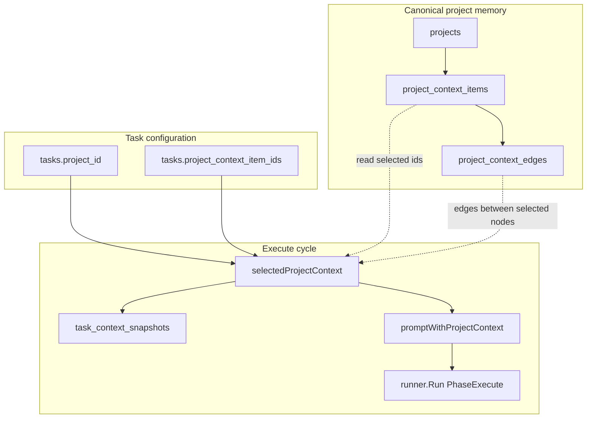

# Project context and immutable snapshots

How projects store durable shared memory, how tasks select a context bundle, and how the harness persists and injects cycle-scoped snapshots into execute prompts.

| | |
| --- | --- |
| **Applies to** | Project CRUD, context items/edges, task create/edit (project + selection), agent worker execute prompt |
| **Audience** | Contributors touching `pkgs/tasks/store/internal/projects`, `pkgs/agents/harness/project_context.go`, or project UI |
| **Prerequisite** | [harness.md](./harness.md) — cycle loop and worker boundary |
| **Companion article** | [execute-agent.md](./execute-agent.md) — composed prompt and runner invocation that consume project context |

## In this article

- [Overview](#overview)
- [Key concepts](#key-concepts)
- [How it works](#how-it-works)
- [Curate project context workflow](#curate-project-context-workflow)
- [Task selection workflow](#task-selection-workflow)
- [Snapshot and prompt injection workflow](#snapshot-and-prompt-injection-workflow)
- [Resume reuse workflow](#resume-reuse-workflow)
- [Rendered prompt contract](#rendered-prompt-contract)
- [Wire contracts](#wire-contracts)
- [Configuration](#configuration)
- [Best practices](#best-practices)
- [Limitations](#limitations)
- [See also](#see-also)

## Overview

**Project context** is T2A's first-class shared memory for long-running work. Operators curate facts, decisions, constraints, and handoff notes on a **project**; individual **tasks** opt into a subset via `project_context_item_ids`. When the worker runs execute, the harness renders that subset, wraps the composed task prompt, and **persists an immutable snapshot** (`task_context_snapshots`) before the runner starts.

Mental model ([data-model.md](../data-model.md)):

- **Project** = process (shared memory surface)
- **Task** = thread (`project_id` membership; not a parent/child hierarchy)
- **Cycle run** = immutable snapshot of what the execute agent actually saw

### In scope

- Relational storage: `projects`, `project_context_items`, `project_context_edges`, `task_context_snapshots`
- Task field `project_context_item_ids` (explicit allowlist, max 20)
- Harness selection, render, snapshot create/reuse, and `<project_context>` / `<task_prompt>` wrapping
- REST project/context routes and SSE `project_context_changed`
- Resume reuse of an existing cycle snapshot ([ADR-0006](../adr/ADR-0006-phase-boundary-resume.md))

### Out of scope

- Embeddings, vector search, hidden memory, or a separate memory service ([ADR-0001](../adr/ADR-0001-project-context.md))
- Autonomous memory pruning, summarization daemons, tenancy/sharing/billing ([data-model.md](../data-model.md))
- Automatic migration of legacy tasks into synthetic projects
- Verify-phase prompt injection (execute only)
- Public HTTP read of `task_context_snapshots` (store/harness internal today)

> **Important** — Canonical memory lives on the **project**. Snapshots are **audit copies** for one cycle. Editing project context after a snapshot does not retroactively change what that cycle recorded.

Schema and table definitions: [data-model.md](../data-model.md) (Project context). HTTP surfaces: [api.md](../api.md) (Projects).

## Key concepts

| Term | Definition |
| --- | --- |
| **Project** | Long-lived container with `name`, `description`, `context_summary`, and `active` / `archived` status. Not a task parent. |
| **Context item** | Human-inspectable node (`project_context_items`): `kind`, `title`, `body`, optional `source_task_id` / `source_cycle_id`, `pinned`. |
| **Context edge** | User-curated link between two items in the same project: `relation` + `strength` (1–5) + optional `note`. |
| **Selection** | Task JSONB `project_context_item_ids` — ordered allowlist of item ids (max 20, deduped). |
| **Rendered context** | Plain-text `<project_context>…</project_context>` block built by the harness. |
| **Context snapshot** | One immutable `task_context_snapshots` row per cycle: full JSON bundle + rendered text + token estimate. |

### Context item kinds and edge relations

| Kind (`project_context_items.kind`) | Typical use |
| --- | --- |
| `note` | General durable fact |
| `decision` | Chosen direction |
| `constraint` | Non-negotiable boundary |
| `handoff` | Cross-task continuity |

| Relation (`project_context_edges.relation`) | Meaning in prompt |
| --- | --- |
| `supports` | Source supports target |
| `blocks` | Source blocks target |
| `refines` | Source refines target |
| `depends_on` | Source depends on target |
| `related` | Loose association (default on create when omitted) |

### Actors and trust

| Actor | Role | Trust |
| --- | --- | --- |
| **Operator** | Curates project items/edges; selects ids on task create/edit. | Trusted to define shared memory and per-task subset. |
| **Store** | Validates selection ids belong to task's project; clears selection on `project_id` change. | Trusted gatekeeper. |
| **Harness** | Loads live project rows, renders prompt, writes/reuses snapshot once per cycle. | Trusted orchestrator; snapshot is source of truth for that cycle's execute runs. |
| **Execute agent** | Reads injected `<project_context>` block. | **Not trusted** to update canonical project memory — only consumes the bundle. |

## How it works



Projects and context items are edited through REST; tasks carry membership and selection. The worker path ([harness.md](./harness.md)) calls `selectedProjectContext` inside `invokeRunner` ([`cycle.go`](../../pkgs/agents/harness/cycle.go)) before every execute `runner.Run`. Full execute composition order: [execute-agent.md](./execute-agent.md).

## Curate project context workflow

Operators maintain canonical memory via project APIs ([`handler_projects.go`](../../pkgs/tasks/handler/handler_projects.go)):

1. **Create or pick a project** — `POST /projects` or use the seeded default project (`00000000-0000-4000-8000-000000000001`). See [`domain.DefaultProjectID`](../../pkgs/tasks/domain/project_defaults.go).

2. **Add context items** — `POST /projects/{id}/context` with `kind`, `title`, `body`, optional `pinned`, `source_task_id`, `source_cycle_id`. Store requires non-empty title and body ([`CreateContext`](../../pkgs/tasks/store/internal/projects/projects.go)).

3. **Link items (optional)** — `POST /projects/{id}/context/edges` with `source_context_id`, `target_context_id`, `relation`, `strength` (1–5), optional `note`. Both nodes must belong to the same project.

4. **List for UI** — `GET /projects/{id}/context` returns items (pinned first) and all edges for those items. `?pinned_only=true` limits the item list.

5. **Mutate or delete** — `PATCH` / `DELETE` on items and edges. Deleting an item removes incident edges in the same transaction.

6. **Notify subscribers** — Mutations publish SSE `project_context_changed` with `{ type, id }` (project id).

> **Note** — `context_summary` on the project row is included in the rendered harness block when non-empty. It is project-level prose, not a substitute for structured items.

## Task selection workflow

Task rows bind a project and an explicit context allowlist:

1. **Assign project** — Set `project_id` on create (`POST /tasks`) or `PATCH /tasks/{id}`. Store validates the project exists and is `active`. Clearing `project_id` also clears `project_context_item_ids` ([`applyProjectPatch`](../../pkgs/tasks/store/internal/tasks/patches.go)).

2. **Select items** — Set `project_context_item_ids` to an ordered list of context item ids (max **20**, deduped, no empty strings). Every id must exist on the task's current project ([`validateProjectContextSelection`](../../pkgs/tasks/store/internal/tasks/project_context_selection.go)). Requires `project_id` when the list is non-empty.

3. **Changing project clears selection** — PATCH `project_id` to a new value resets `project_context_item_ids` to empty. Operators must re-select items for the new project.

4. **SPA parity** — The create/edit UI stores selection in `project_context_item_ids` (not parsed from prompt chips). See `web/src/projects/projectContextRefs.ts` (`MAX_SELECTED_PROJECT_CONTEXT_ITEMS = 20` mirrors the store cap).

### When selection is omitted

| Condition | Harness behavior |
| --- | --- |
| No `project_id` | No project context block; no snapshot row |
| `project_id` set, empty `project_context_item_ids` | No project context block; no snapshot row |
| Both set with ≥1 id | Render, snapshot, and wrap execute prompt |

Projectless tasks remain fully valid ([ADR-0001](../adr/ADR-0001-project-context.md)).

## Snapshot and prompt injection workflow

On each execute invocation, [`selectedProjectContext`](../../pkgs/agents/harness/project_context.go) runs **before** `runner.Run`:

1. **Early exit** — If `project_id` is missing or `project_context_item_ids` is empty, return empty rendered text (no snapshot).

2. **Load project** — `GetProject` for metadata (`name`, `context_summary`).

3. **Load selected items** — `ListProjectContextByIDs` preserves **caller order** from `project_context_item_ids`, not database sort order.

4. **Load edges** — `ListProjectContextEdges` with the selected id set. Only edges whose **both** `source_context_id` and `target_context_id` are in the selection are included (SQL: both ends `IN` selected ids). Edges touching unselected nodes are omitted from the prompt and snapshot JSON.

5. **Reuse or create snapshot** — `GetTaskContextSnapshotForCycle(cycle_id)`:
   - **Found** — Return stored `rendered_context`, `context_json`, and `token_estimate` (resume path, second execute attempt in same cycle, etc.).
   - **Not found** — Render text, marshal `context_json`, compute token estimate, `CreateTaskContextSnapshot` (unique per `cycle_id`).

6. **Wrap prompt** — `promptWithProjectContext(composedPrompt, renderedText)` prepends `<project_context>…</project_context>` and wraps the composed body in `<task_prompt>…</task_prompt>`. If rendered text is empty, the composed prompt is passed through unchanged.

7. **Failure** — Store or render errors fail execute before the runner starts: phase `failed`, summary `project context selection failed`, wrapped as `runner.ErrInvalidOutput`. See [execute-agent.md](./execute-agent.md) (Interruption paths).

> **Important** — Snapshot creation happens on the **first** execute `invokeRunner` for a cycle. Later execute attempts in the **same** cycle reuse the stored bundle even if live project items were edited in the meantime.

## Resume reuse workflow

Phase-boundary resume ([ADR-0006](../adr/ADR-0006-phase-boundary-resume.md), [harness.md](./harness.md)) treats context snapshots as part of the checkpoint surface:

| Resume branch | Project context behavior |
| --- | --- |
| `resumeEntryExecute` | Re-run execute; `selectedProjectContext` **reuses** existing `task_context_snapshots` row when present |
| `resumeEntryAfterExecuteSuccess` | Execute skipped; snapshot already written on prior execute |
| `resumeEntryVerifyOnly` | Execute skipped; verify does not re-read or re-inject project context |

On resume execute, the harness still rebuilds criteria, resume notice, and verify feedback from current task state — only the **project context block** is frozen to the snapshot. The runner remains stateless; checkpoint is encoded in composed prompts, not runner session state.

To change which context items a run sees, start a **new cycle** (new `cycle_id` → new snapshot row).

## Rendered prompt contract

[`renderProjectContext`](../../pkgs/agents/harness/project_context.go) produces plain text (not HTML):

```text
<project_context>
Project: {project.name}
Summary: {project.context_summary}   ← omitted when blank

[{kind}] {title}
{body}

[{kind}] {title}
{body}

Relationships:
- {source title} {relation} {target title} (strength N/5): {note}   ← note omitted when blank
</project_context>
```

At invoke time, the harness concatenates:

```text
{rendered project_context block}

<task_prompt>
{composed execute prompt — criteria, initial_prompt, etc.}
</task_prompt>
```

See [execute-agent.md](./execute-agent.md) (Execute prompt contract) for composed-section order inside `<task_prompt>`.

### Token estimate

`estimateTokens` uses `(len([]rune(text)) + 3) / 4` — a coarse character-based heuristic stored on the snapshot row for observability, not an enforced limit.

## Wire contracts

### Task row (REST)

| Field | Writer | Notes |
| --- | --- | --- |
| `project_id` | Operator via POST/PATCH | Optional; must reference active project when set |
| `project_context_item_ids` | Operator via POST/PATCH | Max 20; deduped; cleared when `project_id` changes or clears |

Validation errors surface as `400` with `domain.ErrInvalidInput` messages (e.g. `project context item not found`, `project_id required for project context selection`).

### Project context item (REST)

| Field | Notes |
| --- | --- |
| `id` | Server-assigned UUID |
| `kind` | `note` \| `decision` \| `constraint` \| `handoff` |
| `title`, `body` | Required on create |
| `pinned` | List API returns pinned items first |
| `source_task_id`, `source_cycle_id` | Optional provenance |

### Project context edge (REST)

| Field | Notes |
| --- | --- |
| `source_context_id`, `target_context_id` | Must reference items in the same project |
| `relation` | `supports` \| `blocks` \| `refines` \| `depends_on` \| `related` |
| `strength` | Integer 1–5 (default 3) |
| `note` | Optional; included in rendered Relationships line when non-empty |

### Snapshot row (`task_context_snapshots`)

| Column | Content |
| --- | --- |
| `cycle_id` | Unique — one snapshot per cycle |
| `task_id`, `project_id` | Foreign keys for audit joins |
| `context_json` | Structured bundle (see below) |
| `rendered_context` | Exact text injected into execute prompt |
| `token_estimate` | Harness heuristic at snapshot time |

**`context_json` shape** (marshal site in `selectedProjectContext`):

```json
{
  "project_id": "<uuid>",
  "project": {
    "id": "<uuid>",
    "name": "...",
    "context_summary": "..."
  },
  "selected_item_ids": ["...", "..."],
  "items": [ /* domain.ProjectContextItem[] */ ],
  "edges": [ /* domain.ProjectContextEdge[] — filtered to selected nodes */ ]
}
```

No public GET route exposes this row today; tests and operators use store methods or infer from cycle audit.

### Runner request — execute

| Field | Value |
| --- | --- |
| `Phase` | `execute` |
| `Prompt` | Optional `<project_context>` + composed prompt in `<task_prompt>` |
| Other fields | Same as [execute-agent.md](./execute-agent.md) (WorkingDir, Timeout, …) |

### SSE

| Event | When |
| --- | --- |
| `project_context_changed` | Item or edge create/update/delete |
| `project_created` / `project_updated` / `project_deleted` | Project CRUD |

## Configuration

Project context has no dedicated `T2A_*` env vars. Behavior is driven by task/project data and harness wiring:

| Knob | Source | Effect |
| --- | --- | --- |
| `project_id` | task row | Enables project membership |
| `project_context_item_ids` | task row | Allowlist for render/snapshot (max 20) |
| `context_summary` | project row | Optional header line in rendered block |
| Worker / harness | `app_settings` + env | When execute runs, snapshot + inject path activates |

See [configuration.md](../configuration.md) for worker and repo settings that affect execute generally.

## Best practices

- Treat **project items** as the editable source of truth; use **snapshots** when auditing what a specific cycle saw.
- Keep selected bundles small — the 20-item cap is a manual bound; there is no semantic retrieval ([ADR-0001](../adr/ADR-0001-project-context.md)).
- Use **edges** only between items you expect to co-select; partial selection drops edges that reference unselected nodes.
- After changing `project_id`, re-pick `project_context_item_ids` before the next run.
- Prefer explicit **kinds** (`decision`, `constraint`) so execute agents scan structured sections quickly.
- To refresh context mid-initiative, edit project items **and** start a new cycle if a in-flight cycle must see updates.

## Limitations

| Limitation | Detail |
| --- | --- |
| No semantic retrieval | Relational selection only; no embeddings or vector DB ([ADR-0001](../adr/ADR-0001-project-context.md)) |
| Manual prompt bounds | Max 20 selected items; no automatic truncation by token budget in harness |
| Snapshot frozen per cycle | Live project edits do not alter an existing cycle's snapshot or resume execute context |
| Execute only | Verify phase does not receive `<project_context>` |
| Edge filtering | Only edges with both endpoints selected appear in prompt/snapshot |
| No snapshot HTTP API | `task_context_snapshots` is internal; UI cannot yet browse historical rendered text via REST |
| Project change clears selection | Easy to accidentally run with empty context after reassignment |
| Token estimate is heuristic | Not a hard limit; large bodies can exceed model context |
| Out of scope (product) | Autonomous pruning, summarization daemons, tenancy/sharing/billing, legacy task backfill ([data-model.md](../data-model.md)) |
| Out of scope (V1 memory) | Hidden memory service, second persistence technology ([ADR-0001](../adr/ADR-0001-project-context.md)) |

## See also

### Documentation

| Doc | Content |
| --- | --- |
| [execute-agent.md](./execute-agent.md) | Composed prompt, runner invoke, project context wrapping |
| [harness.md](./harness.md) | Cycle loop, resume checkpoint inputs including snapshots |
| [data-model.md](../data-model.md) (Project context) | Tables, mental model, out-of-scope list |
| [api.md](../api.md) (Projects) | REST routes and SSE events |
| [architecture.md](../architecture.md) | Persistence map, resume overview |
| [ADR-0001](../adr/ADR-0001-project-context.md) | Decision: taskapi-bound relational context + cycle snapshots |
| [ADR-0006](../adr/ADR-0006-phase-boundary-resume.md) | Resume uses existing ledger + snapshots |

### Code

| File | Responsibility |
| --- | --- |
| [`pkgs/agents/harness/project_context.go`](../../pkgs/agents/harness/project_context.go) | Select, render, snapshot reuse, prompt wrap |
| [`pkgs/agents/harness/cycle.go`](../../pkgs/agents/harness/cycle.go) | `invokeRunner` calls `selectedProjectContext` |
| [`pkgs/tasks/store/facade_projects.go`](../../pkgs/tasks/store/facade_projects.go) | Store facade for projects, context, snapshots |
| [`pkgs/tasks/store/internal/projects/projects.go`](../../pkgs/tasks/store/internal/projects/projects.go) | Project/context CRUD, snapshot insert/lookup |
| [`pkgs/tasks/store/internal/projects/edges.go`](../../pkgs/tasks/store/internal/projects/edges.go) | Edge CRUD and filtered list |
| [`pkgs/tasks/store/internal/tasks/project_context_selection.go`](../../pkgs/tasks/store/internal/tasks/project_context_selection.go) | Selection normalize + validate |
| [`pkgs/tasks/store/internal/tasks/patches.go`](../../pkgs/tasks/store/internal/tasks/patches.go) | `project_id` / selection patch rules |
| [`pkgs/tasks/domain/models.go`](../../pkgs/tasks/domain/models.go) | `Project`, `ProjectContextItem`, `ProjectContextEdge`, `TaskContextSnapshot` |
| [`pkgs/tasks/handler/handler_projects.go`](../../pkgs/tasks/handler/handler_projects.go) | HTTP project/context routes |
| [`pkgs/agents/worker/worker_test.go`](../../pkgs/agents/worker/worker_test.go) | `TestWorker_SelectedProjectContext_injectsAndSnapshotsOnlySelectedItems` |
| [`web/src/projects/projectContextRefs.ts`](../../web/src/projects/projectContextRefs.ts) | SPA selection helpers and 20-item cap |
