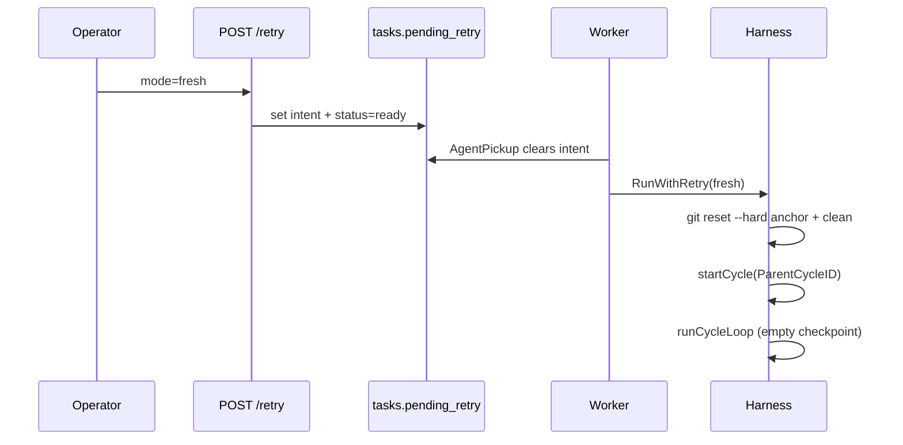

# Start over after failure

Operator **Start over** (`fresh` retry) discards a failed attempt's git/worktree delta and queues a **new execution cycle** with no checkpoint carry-forward.

## Applies to

| Area | Packages / surfaces |
| --- | --- |
| API | `POST /tasks/{id}/retry` with `{ "mode": "fresh" }` |
| Store | `tasks.pending_retry`, `RequestTaskRetry` |
| Harness | `RunWithRetry` → `runFreshRetry`, `git_reset.go` |
| SPA | Task detail **Start over** button + confirm dialog |

## In this article

- [Overview](#overview)
- [Key concepts](#key-concepts)
- [Workflow](#workflow)
- [Git reset anchor chain](#git-reset-anchor-chain)
- [Wire contracts](#wire-contracts)
- [Edge cases](#edge-cases)
- [Limitations](#limitations)
- [See also](#see-also)

## Overview

Start over is for operators who want a clean slate: the failed attempt's uncommitted or committed-but-unwanted work in the repo should not influence the next run. The product still records lineage — every retry creates a **new** `task_cycles` row with `parent_cycle_id` pointing at the failed parent and `meta.retry_mode = "fresh"`.

Out of scope: bulk retry, retry while `on_hold`, deleting parent cycle rows, reverting commits that escaped ancestry.

## Key concepts

| Term | Meaning |
| --- | --- |
| **Pending retry** | Ephemeral JSON on `tasks.pending_retry`: `{ mode, parent_cycle_id }`. Set by POST, cleared on worker pickup. |
| **Parent cycle** | Latest terminal cycle (`failed` or `aborted`, max `attempt_seq`) unless the client sends an explicit `parent_cycle_id`. |
| **Anchor SHA** | Git commit the worktree is reset to before the new cycle starts. |
| **Legacy requeue** | `PATCH failed→ready` without POST leaves `pending_retry` null → plain `RunWithRetry(nil)` (no reset, no checkpoint). |

## Workflow

1. Operator clicks **Start over** on a `failed` task; SPA confirms destructive git impact.
2. Handler validates actor `user`, task status, and parent cycle (terminal, same task).
3. Store sets `pending_retry` and `status=ready` in one transaction; audit `task_retry_requested`.
4. Ready queue notifies the worker (same path as ordinary ready tasks).
5. On pickup, `AgentPickup` reads and **clears** `pending_retry` atomically with `ready→running`.
6. Harness `runFreshRetry`:
   - Resolves anchor and runs `git reset --hard` + `git clean -fd` (or skips for non-git).
   - On reset failure: task stays/becomes `failed` with stable reason; **no new cycle row**.
   - On success: `startCycle` with `ParentCycleID` and `meta.retry_mode=fresh`, then default `runCycleLoop`.

## Git reset anchor chain

[`gitResetForFreshRetry`](../../pkgs/agents/harness/git_reset.go) resolves the anchor in order:

1. **Primary:** first execute phase on the parent cycle — `details_json.git.cycle_base_sha`.
2. **Fallback:** parent commit of the earliest SHA in `task_cycle_commits` for the parent cycle (`rev-parse <sha>^`).
3. **Else:** `retry_reset_anchor_missing` — fail loud; do not start a cycle.

> **Important** — Fresh retry never calls `startCycle` if git reset was required and failed. There is no silent skip when an anchor was expected.

Non-git `repo_root` or empty workdir: reset is skipped; the new cycle still starts with lineage metadata.

## Wire contracts

| Surface | Contract |
| --- | --- |
| `POST /tasks/{id}/retry` | Body `{ "mode": "fresh", "parent_cycle_id": "<optional>" }`. See [api.md](../api.md). |
| `tasks.pending_retry` | Not exposed on task JSON (`json:"-"`); consumed at pickup. See [data-model.md](../data-model.md). |
| Cycle meta | `retry_mode: "fresh"` on the new cycle row. |
| Audit | `task_retry_requested` with `{ mode, parent_cycle_id }`. |
| Failure reasons | `retry_reset_anchor_missing`, `retry_git_reset_failed` on task row |

## Edge cases

| Scenario | Behavior |
| --- | --- |
| Double-click Start over | `409` if already `ready` with different intent; idempotent `200` if same mode+parent |
| `PATCH failed→ready` without POST | Legacy: no git reset, no checkpoint |
| No terminal parent cycle | `422` from handler |
| Wrong / non-terminal `parent_cycle_id` | `422` |
| Parent `aborted` (shutdown) | Valid terminal parent |
| Execute died before `cycle_base_sha` persisted | Fallback chain; then `retry_reset_anchor_missing` |
| Non-git workdir | Skip reset; new cycle proceeds |
| Git reset command fails | Task → `failed`, `retry_git_reset_failed`; no new cycle |
| Worker crash after clear, before Run | Task `running` without intent → ordinary run on reconcile (rare orphan; ADR-0006 path) |
| Task deleted mid-retry | `ErrNotFound` |
| `on_hold` / `done` | POST rejected (`422`) |

## Limitations

- Does not revert commits that already landed on shared branches outside the worktree policy.
- Does not delete or mutate parent cycle DB rows.
- Does not support concurrent retries on two tasks sharing one worktree (documented deferral).
- Per-task git worktrees are out of scope for V1.

## See also

- [retry-resume.md](./retry-resume.md) — Resume from failure and three-way recovery comparison
- [ADR-0015](../adr/ADR-0015-dual-retry-modes.md) — decision record
- [cycle-commits.md](./cycle-commits.md) — `cycle_base_sha` and commit index
- [harness.md](./harness.md) — `RunWithRetry` and recovery reasons
- Code: [`retry_run.go`](../../pkgs/agents/harness/retry_run.go), [`git_reset.go`](../../pkgs/agents/harness/git_reset.go), [`handler_tasks_retry.go`](../../pkgs/tasks/handler/handler_tasks_retry.go)
