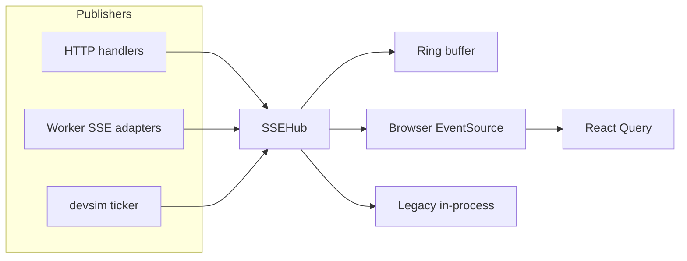
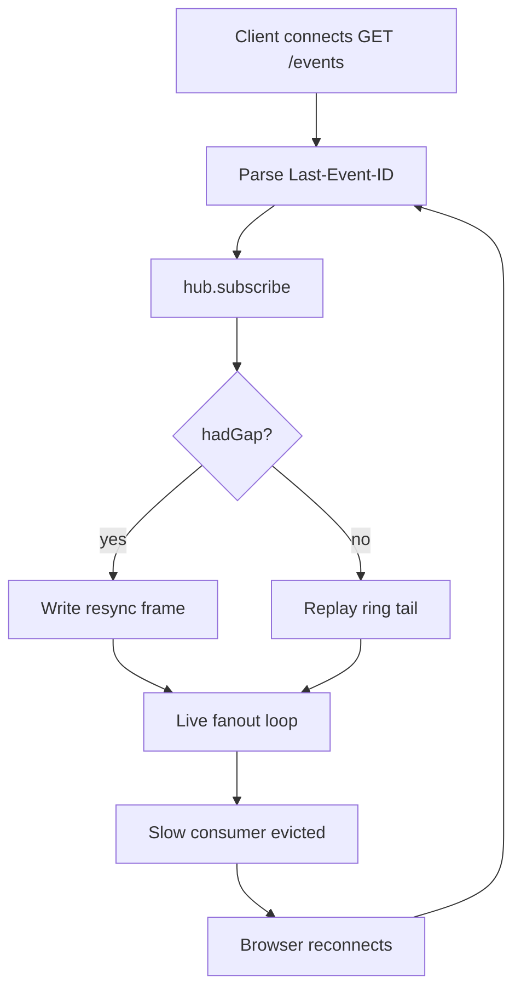

# SSE hub and realtime invalidation

In-process fanout for `GET /events`: monotonic event ids, ring-buffer replay, slow-consumer eviction, and the SPA React Query invalidation bridge.

| | |
| --- | --- |
| **Applies to** | `pkgs/tasks/realtime`, `pkgs/tasks/handler/sse_*.go`, handler notify helpers, `cmd/taskapi/run_helpers.go`, worker SSE adapters, `web/src/tasks/hooks/useTaskEventStream.ts` |
| **Audience** | Contributors adding publish sites; frontend authors changing cache invalidation; operators debugging stale UI |
| **Prerequisite** | [architecture.md](../architecture.md), [api.md](../api.md) (`GET /events`) |
| **Companion articles** | [agent-queue.md](./agent-queue.md), [harness.md](./harness.md), [execute-agent.md](./execute-agent.md) |

## In this article

- [Overview](#overview)
- [Key concepts](#key-concepts)
- [How it works](#how-it-works)
- [Server publish workflow](#server-publish-workflow)
- [Client connection workflow](#client-connection-workflow)
- [Event catalog](#event-catalog)
- [Wire contracts](#wire-contracts)
- [SPA invalidation strategy](#spa-invalidation-strategy)
- [Configuration and tuning](#configuration-and-tuning)
- [Observability](#observability)
- [Testing strategy](#testing-strategy)
- [Best practices](#best-practices)
- [Limitations](#limitations)
- [See also](#see-also)

## Overview

Server-sent events carry **change hints** to connected browsers. The authoritative task, cycle, and settings bodies always come from REST — SSE tells the SPA *what* to refetch or, when enriched, supplies the full entity inline.

The **`SSEHub`** ([`pkgs/tasks/handler/sse_hub.go`](../../pkgs/tasks/handler/sse_hub.go)) is a single in-process pub/sub with:

- A **monotonic event id** on every frame (for `Last-Event-ID` reconnect)
- A **ring buffer** (default 1024 events) for lossless replay within the window
- **Slow-consumer eviction** with a `resync` directive instead of silent frame drops
- Optional **coalescing** of duplicate hint-only `{type,id}` frames within 50ms

Production wiring: [`cmd/taskapi/run_helpers.go`](../../cmd/taskapi/run_helpers.go) constructs `NewSSEHubWith(DefaultSSEHubOptions())`.

> **Important** — SSE is not durable and not shared across `taskapi` replicas. It is also **not** the agent work queue — see [agent-queue.md](./agent-queue.md).

### In scope

- `SSEHub.Publish`, subscribe/replay, eviction, heartbeats
- `GET /events` handler (`streamEvents`)
- Event types and JSON wire shape
- HTTP handler and worker publish paths
- Prometheus + RUM metrics
- SPA: `useTaskEventStream`, `parseTaskChangeFrame`
- Dev synthetic SSE (`T2A_SSE_TEST` / `pkgs/tasks/devsim`)

### Out of scope

- REST ETag caching on read routes
- `GET /tasks/{id}/events` audit log (durable history)
- Per-handler publish inventory (see `sse_trigger_surface_test.go`)
- Load balancer sticky-session recipes
- Agent queue delivery — [agent-queue.md](./agent-queue.md)

## Key concepts

| Term | Definition |
| --- | --- |
| **Publish** | `SSEHub.Publish(TaskChangeEvent)` — coalesce, marshal, assign id, ring append, fanout |
| **Hint-only frame** | `{ type, id }` without `data` — client invalidates React Query and refetches |
| **Enriched frame** | Includes full entity in `data` — client may `setQueryData` and skip GET |
| **Ring buffer** | Fixed-size FIFO of recent events for reconnect replay |
| **Resync directive** | `{"type":"resync"}` — client drops all caches and refetches from REST |
| **Coalesce window** | 50ms dedup for identical hint-only `{type,id}` keys |
| **Legacy subscriber** | In-process `Subscribe()` on a `chan string` (tests, devsim) |

### Actors and trust

| Actor | Role | Trust |
| --- | --- | --- |
| **HTTP handlers** | Publish after successful store commits | Trusted to publish only on success |
| **Harness / worker** | Publish `task_cycle_changed`, `agent_run_progress` via adapters | Trusted; must not block harness loop |
| **SSEHub** | Fanout, replay, eviction | Trusted transport |
| **Browser EventSource** | Reconnect with `Last-Event-ID` | Untrusted consumer speed |
| **React Query** | Cache invalidation / enrichment apply | Authoritative after REST refetch |

## How it works



### Fork after store commit

Successful mutations can touch **two realtime paths**:

| Path | Consumer | Payload |
| --- | --- | --- |
| **SSE hub** | Browser SPA | Hint or enriched JSON |
| **MemoryQueue** | In-process worker | Full `domain.Task` snapshot |

See [agent-queue.md](./agent-queue.md) for the worker path. Both can fire on the same commit (for example a transition to `ready`).

### Worker SSE adapters

[`cmd/taskapi/run_agentworker.go`](../../cmd/taskapi/run_agentworker.go):

| Adapter | Event type | Notes |
| --- | --- | --- |
| `cycleChangeSSEAdapter` | `task_cycle_changed` | Harness calls `PublishCycleChange` after cycle/phase store writes |
| `runProgressSSEAdapter` | `agent_run_progress` | Throttled to 750ms per `(task, cycle, phase_seq)` before hub publish |

Progress events are **ephemeral** on the wire. Durable runner output lives in `task_cycle_stream_events` — see [execute-agent.md](./execute-agent.md).

## Server publish workflow

From [`Publish`](../../pkgs/tasks/handler/sse.go):

1. **Coalesce** — if `coalesceWindow > 0` and `coalesceKey(ev)` is non-empty, drop duplicate `{type,id}` within the window. Keys are empty (no coalesce) for:
   - `task_cycle_changed`
   - `agent_run_progress`
   - Any frame with non-nil `Data` (enrichment must not be dropped)
2. **Marshal** JSON; `RecordSSEPublish()`
3. **Allocate id** — `atomic.Uint64` increment
4. **Append** to ring (overwrite oldest when full)
5. **Fanout** — non-blocking send to each subscriber channel
6. **Evict** — full channel → remove subscriber, close `cancel`, count eviction metrics (not silent drop)

HTTP handlers use:

- `notifyChange(type, id)` — hint-only
- `notifyTaskChanged(type, id, data)` — optional enriched task tree
- `notifyCycleChanged(...)` — cycle frames with `cycle_id`

Publish only **after** the store transaction commits. Failed writes never publish ([api.md](../api.md)).

## Client connection workflow

[`streamEvents`](../../pkgs/tasks/handler/sse.go) (`GET /events`):

1. Parse `Last-Event-ID` header (invalid → 0)
2. `hub.subscribe(sinceID)` — register subscriber; replay events with `id > sinceID` unless gap detected
3. Write `retry: 3000\n\n` (EventSource reconnect hint)
4. **Gap** (`hadGap`) → single `resync` frame, no replay
5. **Else** replay buffered events with `id:` lines
6. **Live loop** — select on: request cancel, eviction `cancel`, subscriber channel, heartbeat ticker
7. **Eviction path** — writer receives on `sub.cancel`, emits `resync`, closes stream

Heartbeats: comment line `: heartbeat\n\n` every 15s (ignored by EventSource spec; keeps proxies from idle-killing TCP).

Middleware: `WithRequestTimeout` is **exempt** for `GET /events` ([`request_timeout.go`](../../pkgs/tasks/middleware/request_timeout.go)).

### Reconnect decision tree



> **Note** — `resync` frames intentionally omit an `id:` line so EventSource does not advance `Last-Event-ID` on a directive the client must treat as a full cache reset.

## Event catalog

Constants: [`TaskChangeType`](../../pkgs/tasks/handler/sse.go). Authoritative list: [api.md](../api.md).

| Type | Typical publisher | Coalesced? | `data` enrichment |
| --- | --- | --- | --- |
| `task_created` | HTTP create | Hint-only yes | Often full task tree |
| `task_updated` | HTTP patch, checklist, etc. | Hint-only yes | Often on PATCH |
| `task_deleted` | HTTP delete | Yes | No |
| `task_cycle_changed` | Harness via worker adapter | **Never** | Sometimes cycle detail |
| `agent_run_progress` | Worker progress adapter | **Never** | N/A (progress sub-object) |
| `task_gate_changed` | HTTP | Yes | No |
| `task_dependency_changed` | HTTP | Yes | No |
| `project_created` / `updated` / `deleted` | HTTP | Yes | No |
| `project_context_changed` | HTTP | Yes | No |
| `settings_changed` | Settings PATCH / supervisor reload | Yes (no id key) | No |
| `agent_run_cancelled` | Cancel-current-run | Yes | No |
| `resync` | Hub on gap or eviction | N/A | No |

**Never publishes:** failed writes, `/task-drafts/*`, `POST /tasks/evaluate`, probe/list-models routes ([api.md](../api.md)).

## Wire contracts

### Frame format

```text
id: 42
data: {"type":"task_updated","id":"<uuid>"}

```

First frame after connect: `retry: 3000\n\n`.

### `TaskChangeEvent`

| Field | When set |
| --- | --- |
| `type` | Always |
| `id` | Task or project uuid (omitted for settings/cancel/resync) |
| `cycle_id` | `task_cycle_changed`, `agent_run_progress` |
| `phase_seq` | `agent_run_progress` |
| `progress` | Normalized runner hint (kind, message, tool, …) |
| `data` | Optional full entity for enrichment fast path |

JSON uses snake_case; shape pinned by handler tests.

### Coalescing rules

`coalesceKey` returns `type + ":" + id` only for hint-only task/settings/project frames. Cycle and progress frames are informationally distinct per emission — coalescing them would hide phase transitions from the SPA.

## SPA invalidation strategy

Architecture: [ADR-0022](../adr/ADR-0022-task-sync-policy.md). Entry hook: [`useTaskEventStream.ts`](../../web/src/tasks/hooks/useTaskEventStream.ts) (transport + timers). Policy: [`web/src/tasks/sync/`](../../web/src/tasks/sync/) (`decideSyncFrame`, `decideFlushBatch`, `taskSyncCoordinator`). Frame parser: [`sseInvalidate.ts`](../../web/src/tasks/task-query/sseInvalidate.ts).

1. **`EventSource("/events")`** mounted once at app shell
2. Each `message` → `parseTaskChangeFrame(data)`
3. **`resync`** → invalidate all task queries + RUM `rumSSEResyncReceived`
4. **Task frames** → queue task id; if `data` present, validate via `parseTask` and `setQueryData`
5. **Cycle frames** → queue `(taskId, cycleId)`; optional enriched cycle detail via `parseTaskCycleDetail`
6. **Progress** → separate debounced path to `useAgentRunProgress` (not full invalidation storm)
7. **Flush** — trailing debounce **900ms**, max wait **2500ms** so worker burst (~4 cycle frames per run) collapses to one invalidation batch

Cycle frames drive most agent UI updates — the worker emits `task_cycle_changed`, not `task_updated`. Invalidating the `["tasks","detail"]` prefix keeps checklist, events, and nested subtask trees consistent when SSE only names one task id.

Enrichment fast path: when **every** task id in a flush batch was enriched and applied, skip the broad detail-prefix invalidation.

## Configuration and tuning

Production defaults ([`DefaultSSEHubOptions`](../../pkgs/tasks/handler/sse.go)):

| Option | Default | Role |
| --- | --- | --- |
| `RingSize` | 1024 | Replay window (~125 KB typical) |
| `SubscriberBuffer` | 256 | Per-client channel before eviction |
| `CoalesceWindow` | 50ms | Hint dedup (0 in test `NewSSEHub()`) |
| `HeartbeatPeriod` | 15s | Proxy keep-alive |

Dev synthetic stream ([`pkgs/tasks/devsim/`](../../pkgs/tasks/devsim/)):

| Env | Role |
| --- | --- |
| `T2A_SSE_TEST=1` | Enable background ticker |
| `T2A_SSE_TEST_INTERVAL` | Tick interval (default 3s; `0` disables) |
| `T2A_SSE_TEST_*` | Events per tick, row mirror, lifecycle sim, etc. |

Never enable devsim SSE in production without intent ([api.md](../api.md)).

Worker progress throttle: **750ms** (`agentRunProgressMinInterval` in `run_agentworker.go`) — independent of hub coalescing.

## Observability

Prometheus ([`metrics_http.go`](../../pkgs/tasks/middleware/metrics_http.go)):

| Metric | Meaning |
| --- | --- |
| `taskapi_sse_subscribers` | Connected `GET /events` clients |
| `taskapi_sse_publish_total` | Post-coalesce publishes (resync rate denominator) |
| `taskapi_sse_coalesced_total` | Dropped duplicate hints |
| `taskapi_sse_resync_emitted_total` | Gap + eviction resync directives |
| `taskapi_sse_subscriber_evictions_total` | Slow-consumer evictions |
| `taskapi_sse_subscriber_lag_seconds` | Subscriber lag estimate |
| RUM counters | SPA reconnect gap, resync received |

Aggregated snapshot: `GET /system/health` ([api.md](../api.md)).

## Testing strategy

| Layer | Files |
| --- | --- |
| Hub unit tests | `sse_test.go`, `sse_lossless_test.go`, `sse_data_enrichment_test.go` |
| HTTP trigger surface | `sse_trigger_surface_test.go` — which routes publish |
| Web parser | `sseInvalidate.test.ts` |
| App integration | `App.test.tsx` with `stubEventSource` |

## Best practices

- Publish **only after commit** — never on validation failure or rolled-back tx
- Use **enriched `data`** on hot paths (`task_created`, `task_updated`) when the SPA would otherwise refetch immediately
- Keep **progress payloads small** — raw CLI JSON stays out of the browser stream
- **Do not block** in `Publish` or notifier adapters — harness assumes non-blocking SSE
- New event types: extend `parseTaskChangeFrame` and [api.md](../api.md); unknown types fall back to broad invalidation

## Limitations

| Limitation | Detail |
| --- | --- |
| Single-process hub | Replicas do not share subscribers; LB may route `/events` away from write instance |
| Ring window | Events older than ~1024 publishes require client `resync` + full REST refetch |
| Eviction recovery | Pathological slow clients reconnect repeatedly until they keep up |
| Not a job queue | SSE carries hints, not runnable task snapshots |
| No per-user routing | All subscribers receive all event types |
| Auth | Optional bearer token only; same connection as REST |

## See also

### Documentation

| Doc | Content |
| --- | --- |
| [agent-queue.md](./agent-queue.md) | Worker queue (parallel realtime path) |
| [harness.md](./harness.md) | Cycle SSE publish points |
| [execute-agent.md](./execute-agent.md) | Durable stream events vs ephemeral progress |
| [architecture.md](../architecture.md) | System overview |
| [api.md](../api.md) | Event types and SSE route |
| [web.md](../web.md) | SPA structure |

### Code map

| Concern | Files |
| --- | --- |
| Wire types + publish port | [`pkgs/tasks/realtime/`](../../pkgs/tasks/realtime/) |
| Hub + stream + notify | [`sse_hub.go`](../../pkgs/tasks/handler/sse_hub.go), [`sse_stream.go`](../../pkgs/tasks/handler/sse_stream.go), [`sse_notify.go`](../../pkgs/tasks/handler/sse_notify.go) |
| Production wiring | [`run_helpers.go`](../../cmd/taskapi/run_helpers.go) |
| Worker adapters | [`internal/taskapi/agentworker/sse.go`](../../internal/taskapi/agentworker/sse.go) |
| Metrics | [`metrics_http.go`](../../pkgs/tasks/middleware/metrics_http.go) |
| SPA stream | [`useTaskEventStream.ts`](../../web/src/tasks/hooks/useTaskEventStream.ts), [`sseInvalidate.ts`](../../web/src/tasks/task-query/sseInvalidate.ts) |
| Dev synthetic | [`pkgs/tasks/devsim/`](../../pkgs/tasks/devsim/) |
| Handler file map | [`pkgs/tasks/handler/README.md`](../../pkgs/tasks/handler/README.md) |
