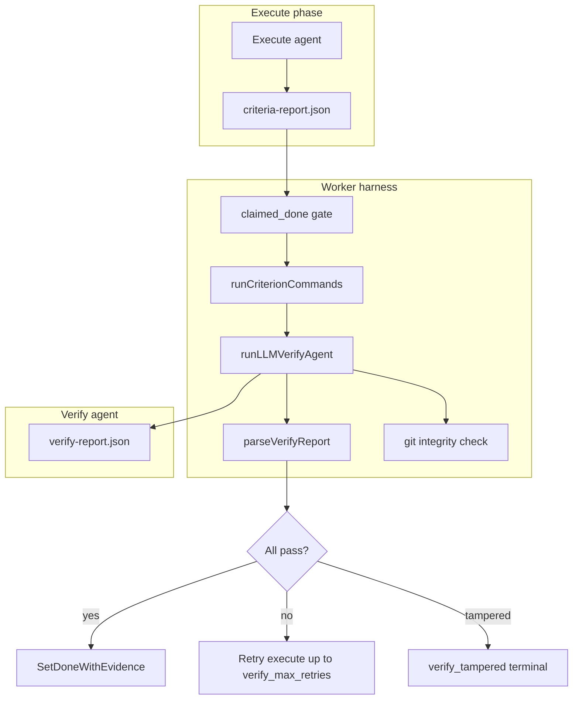

# Verify agent

How the verify phase judges done criteria after execute succeeds. For the full criteria lifecycle (definition, edit locks, completion ledger), see [done-criteria.md](./done-criteria.md). Schema and table definitions live in [data-model.md](../data-model.md) (§ Checklist). HTTP surfaces are in [api.md](../api.md). Operator knobs are in [configuration.md](../configuration.md).

## Purpose and scope

The **verify agent** is an LLM pass that runs after execute when a task has at least one done criterion. It is the **sole authority** for marking criteria complete with `verified_by=verify_agent`.

Three roles participate in verification:

- **Execute agent** — Does the work and writes a self-report (`claimed_done` + evidence). This is an assertion only; execute cannot mark criteria done in the completion ledger.
- **Worker (harness)** — Gates on `claimed_done`, runs optional shell checks, assembles the verify prompt, invokes the verify runner, parses `verify-report.json`, enforces git integrity, and decides pass / retry / fail.
- **Verify agent** — Reads evidence and returns per-criterion `verified` + `reasoning`.

Tasks with **zero criteria** (legacy rows) skip verify entirely; a successful execute alone marks the task `done`. See [data-model.md](../data-model.md).

This doc does not cover execute-side criteria injection (see [criteria_prompt.go](../../pkgs/agents/harness/criteria_prompt.go); a future execute-agent domain doc may cover it).

## Actors and trust boundaries

| Actor | Responsibility | Trust level |
| --- | --- | --- |
| Execute agent | Implement work; write `criteria-report.json` | Self-assertion only |
| Worker | Gate, shell commands, prompt assembly, parse reports, git snapshots | Trusted orchestrator |
| Verify agent | Per-criterion pass/fail + reasoning | Trusted verdict (when integrity holds) |

The worker does **not** auto-pass a criterion when a verify command exits 0. Shell output is evidence for the verify agent to interpret. See [ADR-0012](../adr/ADR-0012-structured-verify-commands.md).

When `app_settings.verify_runner_name` is set to a different runner than execute, verify is **adversarially separated** — a different adapter and optionally a different model. Build/probe failure demotes verify to reuse the execute runner with a loud log; the worker keeps running. See [ADR-0003](../adr/ADR-0003-verify-component-upgrade.md).

## End-to-end flow



1. **Execute** — The execute agent finishes work and writes `criteria-report.json` to the worker-managed report dir (outside `repo_root`). The prompt prepends all active criteria with stable ids. See [criteria_prompt.go](../../pkgs/agents/harness/criteria_prompt.go).

2. **Gate** — For each criterion, if `claimed_done` is false, the worker records an immediate failure (`verified_by=agent_self`, reasoning: execute did not claim done). Those ids are **not** sent to the verify LLM. See `runVerifyChecks` in [verification.go](../../pkgs/agents/harness/verification.go).

3. **Worker commands** — For criteria with `claimed_done: true` and attached `verify_commands`, the worker runs each command sequentially via shell (`sh -c` / `cmd /C`) in `WorkingDir` (`app_settings.repo_root`). stdout, stderr, and meta JSON are written under `<report_dir>/<cycle_id>/checks/<criterion_id>/<seq>.*`. See [verify_commands.go](../../pkgs/agents/harness/verify_commands.go).

4. **Verify LLM** — The harness builds the verify prompt (below), then calls `verifyRunner.Run` with `WorkingDir` set to the repo root. Progress streams on the verify phase's `phase_seq`.

5. **Parse and decision** — The worker parses `verify-report.json`. All criteria pass → atomic `SetDoneWithEvidence` and task `done`. Any fail → retry execute up to `verify_max_retries`, or terminate with `verification_failed:<id>,...` and **no** completion rows.

6. **Locked passes** — Criteria verified on earlier attempts in the same cycle are carried in memory (`previouslyPassed`). They are omitted from the verify prompt, short-circuited without re-running the LLM, and listed under "Already verified" in the next execute prompt. Nothing is written to `task_checklist_completions` until the cycle terminates succeeded. See [ADR-0003](../adr/ADR-0003-verify-component-upgrade.md).

## Verify prompt contract

The prompt is assembled in `runLLMVerifyAgent` ([verification.go](../../pkgs/agents/harness/verification.go)). Section order:

1. Role line: verification agent; do not modify source files.
2. Output path: write only the absolute path to `verify-report.json` (under `T2A_WORKER_REPORT_DIR`, not under `repo_root`).
3. JSON schema: `{"criteria":[{"id":"...","verified":true|false,"reasoning":"..."}]}`.
4. **Locked passes** (retry only) — ids already verified; do not include in the report.
5. **Active criteria** — For each non-locked criterion with `claimed_done: true`: `[id] text`, execute evidence string.
6. **Command evidence** (when commands ran) — Per command: command string, expected outcome, exit code, duration, paths to stdout/stderr/meta, optional stdout preview. No stderr preview. See `formatCommandEvidenceSection` in [verify_commands.go](../../pkgs/agents/harness/verify_commands.go).
7. **`Diff:`** — Output of `git diff HEAD` (truncated at 200 KiB), or a clean-tree hint when commit policy is on and the tree is clean. See [resume_prompt.go](../../pkgs/agents/harness/resume_prompt.go).
8. **Previous verification feedback** (retry only) — Appended when a prior verify attempt failed. See `appendVerifyFeedback` in [criteria_prompt.go](../../pkgs/agents/harness/criteria_prompt.go).

`WorkingDir` (repo root) is passed on `runner.Request`, not repeated in the prompt text. The verify runner can use its normal tools to read files in the repo if the diff and previews are insufficient.

### Example prompt (illustrative)

```text
You are the verification agent. Do not modify source files.
Write `/tmp/t2a-worker/cycle-abc123/verify-report.json` only.

Schema: {"criteria":[{"id":"...","verified":true|false,"reasoning":"..."}]}

- [crit-001] Add a health check endpoint that returns 200 with {"status":"ok"}
  execute claimed_done: true (assertion only)
  execute evidence: Added GET /health in handler_health.go; returns JSON status ok.

- [crit-002] All existing tests pass
  execute claimed_done: true (assertion only)
  execute evidence: Ran go test ./... locally; all green.

## Command evidence (worker-executed)

### [crit-002] command 0
Command: go test ./... -count=1
Expected outcome: all tests pass with exit code 0
exit_code=0 duration_ms=8421 truncated=false
stdout: `/tmp/t2a-worker/cycle-abc123/checks/crit-002/0.stdout`
stderr: `/tmp/t2a-worker/cycle-abc123/checks/crit-002/0.stderr`
meta: `/tmp/t2a-worker/cycle-abc123/checks/crit-002/0.meta.json`
stdout preview:
```
ok  	github.com/example/pkg/foo	0.012s
...
```

Diff:
diff --git a/pkgs/tasks/handler/handler_health.go b/pkgs/tasks/handler/handler_health.go
...
```

On retry, locked-pass and feedback blocks appear as described above.

### Expected verify output

```json
{
  "criteria": [
    {
      "id": "crit-001",
      "verified": true,
      "reasoning": "Diff adds GET /health returning {\"status\":\"ok\"} as required."
    },
    {
      "id": "crit-002",
      "verified": false,
      "reasoning": "go test output shows 1 failure in pkgs/tasks/handler."
    }
  ]
}
```

Parser rules ([criteria_parse.go](../../pkgs/agents/harness/criteria_parse.go)): report file ≤ 256 KiB; `reasoning` ≤ 16 KiB; when `verified=true`, `reasoning` must be ≥ 40 characters; no duplicate ids; symlinks rejected.

## Criterion commands

Operators attach optional shell checks per criterion via `verify_commands` on task create or checklist API. Limits: 5 commands per criterion; command ≤ 512 chars; `expected_outcome` ≤ 2048 chars ([domain/verify_commands.go](../../pkgs/tasks/domain/verify_commands.go)).

| Property | Behavior |
| --- | --- |
| Who runs them | Worker harness, not execute or verify LLM |
| When | After gate, before verify LLM; only for `claimed_done: true` |
| Where | `app_settings.repo_root` (execute's uncommitted changes visible) |
| Timeout | `verify_command_timeout_seconds` (default 120s) per command |
| Output cap | 256 KiB per stdout/stderr stream; `truncated=true` in meta when clipped |
| stdout preview in prompt | Full content if ≤ 4 KiB; else first 40 lines (or first 4 KiB) |
| Exit code 0 | Does **not** auto-pass the criterion |

Command failures (non-zero exit, timeout, start error) are included in the evidence bundle; the verify LLM still runs and decides.

**Warning:** Commands that mutate the working tree can trigger `verify_tampered` on the post-verify git snapshot. Prefer read-only checks (tests, lint, grep).

Evidence file layout:

```text
<report_dir>/<cycle_id>/checks/<criterion_id>/<seq>.stdout
<report_dir>/<cycle_id>/checks/<criterion_id>/<seq>.stderr
<report_dir>/<cycle_id>/checks/<criterion_id>/<seq>.meta.json
```

Durable index: `task_cycle_command_runs` (see [data-model.md](../data-model.md)). SPA timeline: `GET /tasks/{id}/cycles/{cycleId}/verdicts` → `command_runs[]`.

## Outputs and durability

| Artifact | Writer | Lifetime |
| --- | --- | --- |
| `criteria-report.json` | Execute agent | Ephemeral; GC at cycle terminate |
| `verify-report.json` | Verify agent | Ephemeral; GC at cycle terminate |
| Check stdout/stderr/meta | Worker | Ephemeral; GC at cycle terminate |
| `task_cycle_criteria_reports` | Worker (mirror) | Durable |
| `task_cycle_verify_reports` | Worker (mirror) | Durable |
| `task_cycle_command_runs` | Worker (mirror) | Durable |
| `task_checklist_completions` | Worker | Written only on terminal cycle success |

Report dir root: `T2A_WORKER_REPORT_DIR` (default `<os.TempDir()>/t2a-worker`). Per-cycle subdirs are created before verify and removed at terminate. See [ADR-0004](../adr/ADR-0004-verdicts-on-the-db.md).

## Integrity enforcement

Before `StartPhase(verify)`, the worker captures `git status --porcelain` and `git rev-parse HEAD`. After verify completes, it captures again. Any working-tree change, HEAD movement, or snapshot error → terminal `verify_tampered` (no retries, no completion rows). Report files live outside the repo, so the whitelist is empty — any porcelain diff during verify is tampering.

When the working dir is not a git repo, the check is bypassed (logged once at startup). Non-git fixtures therefore have no tamper enforcement. See [verify_integrity.go](../../pkgs/agents/harness/verify_integrity.go) and [ADR-0003](../adr/ADR-0003-verify-component-upgrade.md).

The verify agent runs in the **same working dir as execute** (where uncommitted changes live) so it can inspect actual file contents via diff and runner tools. A fresh git worktree at HEAD would be empty and unusable for verifying execute's edits — see ADR-0003 alternatives.

## Configuration

| Setting | Role |
| --- | --- |
| `verify_runner_name` | Separate verify runner id; empty = reuse execute runner |
| `verify_runner_model` | Optional model override for verify |
| `verify_max_retries` | Max execute↔verify loops per cycle (default 2) |
| `verify_command_timeout_seconds` | Per-command wall clock (default 120s) |
| `max_run_duration_seconds` | LLM verify call wall clock (`0` = no limit) |
| `T2A_WORKER_REPORT_DIR` | Scratch root for report files and command evidence |
| `agent_commit_execute_work` | When on, clean-tree verify prompt hints to inspect cycle-tagged commits |

Full reference: [configuration.md](../configuration.md).

## Strengths

- **Adversarial separation** — Optional different runner/model for verify vs execute reduces self-grading.
- **Execute self-report not trusted** — Gate rejects unclaimed criteria; verify LLM must affirm claimed ones.
- **Independent command evidence** — Worker runs shell checks without relying on execute honesty.
- **Git tamper detection** — Fail-safe: snapshot errors and any working-tree mutation during verify terminate the cycle.
- **Retry efficiency** — Locked passes skip re-verification of settled criteria while preserving atomic completion (all rows written on terminal success only).
- **Observable** — Metrics (`t2a_verify_verdict_total`, phase duration, retries per cycle); DB verdict mirror; `verification_failed:<ids>` terminate reason.
- **Inspects real changes** — Same repo root as execute; diff reflects uncommitted work execute produced.

## Limitations and known trade-offs

- **Non-deterministic LLM verdicts** — No multi-judge ensemble; flaky re-evaluation is possible though locked passes mitigate retries.
- **No deterministic auto-pass** — Exit code 0 on verify commands does not mark a criterion done by design ([ADR-0012](../adr/ADR-0012-structured-verify-commands.md)).
- **`previouslyPassed` is in-memory only** — Worker restart re-runs verify for all criteria in the cycle ([ADR-0003](../adr/ADR-0003-verify-component-upgrade.md)).
- **Integrity requires git** — Non-git working dirs skip tamper checks silently per cycle.
- **Prompt is partial** — Diff + stdout preview only; full stderr and arbitrary files require the verify runner to read paths/tools on its own.
- **Truncation** — Command output (256 KiB), diff (200 KiB), and stdout preview can hide tail failures.
- **Ephemeral report files** — Post-cycle debugging relies on DB verdict rows, logs, or metrics — not the JSON files on disk.
- **Mutating verify commands** — Can cause `verify_tampered` if they change the working tree.
- **Zero-criteria legacy tasks** — Skip verify entirely; execute success alone completes the task.
- **Same working dir** — Verify agent *could* modify source; only post-hoc git check catches it (not prevention).

## Related docs and code map

| Resource | Content |
| --- | --- |
| [data-model.md](../data-model.md) § Checklist | Schema, worker loop summary, report contracts |
| [api.md](../api.md) | Checklist CRUD, `GET .../verdicts` |
| [ADR-0003](../adr/ADR-0003-verify-component-upgrade.md) | Adversarial verify, integrity, locked passes |
| [ADR-0012](../adr/ADR-0012-structured-verify-commands.md) | Criterion shell checks |
| [ADR-0004](../adr/ADR-0004-verdicts-on-the-db.md) | Durable verdict tables |
| [ADR-0005](../adr/ADR-0005-extract-agent-harness.md) | Harness extraction |
| [pkgs/agents/harness/verification.go](../../pkgs/agents/harness/verification.go) | Verify pipeline and prompt assembly |
| [pkgs/agents/harness/verify_commands.go](../../pkgs/agents/harness/verify_commands.go) | Shell execution and evidence formatting |
| [pkgs/agents/harness/verify_integrity.go](../../pkgs/agents/harness/verify_integrity.go) | Pre/post git snapshots |
| [pkgs/agents/harness/criteria_parse.go](../../pkgs/agents/harness/criteria_parse.go) | Report paths and parsing |
| [pkgs/agents/harness/criteria_prompt.go](../../pkgs/agents/harness/criteria_prompt.go) | Execute criteria injection and verify feedback |
| [pkgs/agents/harness/README.md](../../pkgs/agents/harness/README.md) | Harness file map |
