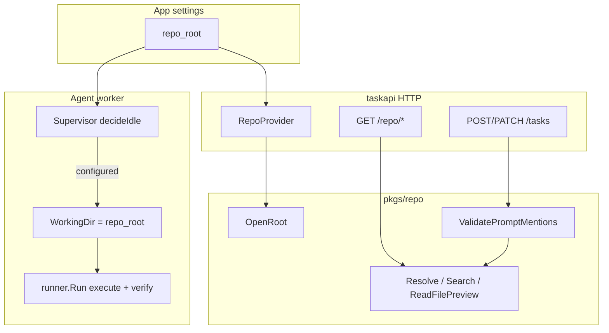

# Workspace repo and @-mentions

How `app_settings.repo_root` gates the agent worker and `/repo/*`, how `pkgs/repo` resolves paths and validates `@`-mentions in `initial_prompt`, and how the shared working directory anchors every agent run.

| | |
| --- | --- |
| **Applies to** | `pkgs/repo/`, `pkgs/tasks/handler` repo routes + mention validation, SPA Settings workspace picker, TipTap `@file` mentions |
| **Audience** | Contributors touching workspace path safety, task create/patch validation, or agent `WorkingDir` wiring |
| **Prerequisite** | [configuration.md](../configuration.md) (`repo_root`), [data-model.md](../data-model.md) (`initial_prompt`) |
| **Companion articles** | [execute-agent.md](./execute-agent.md) (execute `WorkingDir`), [task-scheduling.md](./task-scheduling.md) (ready pickup — worker idle until repo is configured), [agent-queue.md](./agent-queue.md) (dequeue after repo gate) |

## In this article

- [Overview](#overview)
- [Key concepts](#key-concepts)
- [How it works](#how-it-works)
- [Configuration gate](#configuration-gate)
- [RepoProvider and hot reload](#repoprovider-and-hot-reload)
- [HTTP `/repo/*` routes](#http-repo-routes)
- [@-mention syntax and validation](#-mention-syntax-and-validation)
- [Task create and patch validation](#task-create-and-patch-validation)
- [SPA @-mention workflow](#spa--mention-workflow)
- [Shared working directory for agent runs](#shared-working-directory-for-agent-runs)
- [Wire contracts](#wire-contracts)
- [Security boundaries](#security-boundaries)
- [Configuration](#configuration)
- [Best practices](#best-practices)
- [Limitations](#limitations)
- [See also](#see-also)

## Overview

T2A treats one filesystem directory as the **workspace repo**: the tree the operator edits in the SPA, the tree `@`-mentions in task prompts refer to, and the **working directory** for every execute and verify runner invocation. That path lives in `app_settings.repo_root` (configured from the SPA Settings page or `PATCH /settings`).

When `repo_root` is **empty**, the product deliberately degrades:

- The agent worker supervisor stays **idle** (`idle_reason=repo_root_not_configured`).
- Every `GET /repo/*` route returns **409** with `reason: repo_root_not_configured`.
- `@`-mention validation on task create/patch is **skipped** (prompts may reference paths that cannot be checked yet).

When `repo_root` is **set**, `pkgs/repo.OpenRoot` validates the path, handlers and the worker share the same resolved root, and prompt mentions are checked against real files before tasks are saved.

> **Important** — The workspace repo is **read-only over HTTP**. Mutations happen only when the execute agent (or the operator outside T2A) changes files on disk. T2A never exposes a write API for the workspace tree.

> **Note** — Per-cycle report files (`criteria-report.json`, `verify-report.json`, shell-check artifacts) live under `T2A_WORKER_REPORT_DIR`, **outside** `repo_root`, so customer working trees stay clean. See [execute-agent.md](./execute-agent.md) and [ADR-0004](../adr/ADR-0004-verdicts-on-the-db.md).

Schema for `initial_prompt`: [data-model.md](../data-model.md). HTTP routes and status codes: [api.md](../api.md) (Workspace repo section). Full `repo_root` field reference: [configuration.md](../configuration.md).

### In scope

- `app_settings.repo_root` lifecycle and gating semantics
- `pkgs/repo` path resolution, search, file preview, mention parse/validate
- `RepoProvider` and `/repo/*` handlers
- `initial_prompt` `@`-mention validation on `POST /tasks`, `PATCH /tasks/{id}`, and task evaluation
- Readiness probe `checks.workspace_repo`
- Agent worker `WorkingDir` and supervisor idle reasons

### Out of scope

- Execute/verify prompt composition — [execute-agent.md](./execute-agent.md), [verify-agent.md](./verify-agent.md)
- Runner adapter env policy and CLI invocation — [runner-adapters.md](./runner-adapters.md)
- Task scheduling and queue admission — [task-scheduling.md](./task-scheduling.md), [agent-queue.md](./agent-queue.md)
- Workspace search indexing or `.gitignore`-aware semantics beyond walk-time skips

## Key concepts

| Term | Definition |
| --- | --- |
| **Workspace repo** | Absolute directory path in `app_settings.repo_root`; canonical working tree for agents and `@`-mentions |
| **`repo.Root`** | Validated handle from `OpenRoot`: absolute path + symlink-resolved canonical root for containment checks |
| **Repo-relative path** | Slash-separated path under the root (e.g. `pkgs/tasks/handler/handler.go`); what APIs and mentions use |
| **`@`-mention** | Token in prompt text: `@path` or `@path(start-end)` with 1-based inclusive line numbers |
| **`RepoProvider`** | Handler indirection that resolves the active `*repo.Root` from settings at request time |
| **`WorkingDir`** | `runner.Request.WorkingDir` — always `repo_root` for execute and verify CLI runs |

### Actors and trust

| Actor | Role | Trust |
| --- | --- | --- |
| **Operator** | Sets `repo_root`, authors `initial_prompt` with `@`-mentions | Trusted to pick a path T2A may read and agents may modify |
| **SPA** | Settings picker, mention autocomplete, inline range validation | Trusted client; must not bypass server validation |
| **`pkgs/repo`** | Path containment, mention parse/validate, read-only preview | Trusted security boundary for filesystem access |
| **HTTP handlers** | `/repo/*` read APIs; validate mentions on task writes | Trusted to map repo errors → HTTP status |
| **Agent worker** | Runs harness with `WorkingDir = repo_root` | Trusted executor; **not** trusted to skip mention rules already enforced at task save |
| **Execute / verify agents** | Mutate files under `repo_root` via CLI tools | **Not trusted** for acceptance — see [execute-agent.md](./execute-agent.md) |

## How it works



At a high level:

1. Operator sets **Workspace repository** in Settings → `repo_root` persisted → supervisor **Reload** → worker starts if path is usable.
2. SPA uses **`GET /health/ready`** (preferred) or `/repo/search` to detect workspace availability.
3. Task editor uses **`/repo/search`**, **`/repo/file`**, **`/repo/validate-range`** to build `@`-mentions; server re-validates on save.
4. When a ready task is dequeued, the harness runs agents with **`WorkingDir`** pinned to the same directory.

## Configuration gate

`repo_root` is the single switch for workspace-aware behavior. Effects are consistent across HTTP, readiness, and the worker.

| `repo_root` state | Agent worker | `GET /repo/*` | `@`-mention validation | `GET /health/ready` |
| --- | --- | --- | --- | --- |
| Empty (`""`) | Idle — `repo_root_not_configured` | **409** `repo_root_not_configured` | Skipped | DB ok; **`workspace_repo` omitted** |
| Set, path missing / not a dir | Idle — `repo_root_invalid` | **500** `repo_root_open_failed` | Skipped if `OpenRoot` fails | **`workspace_repo: fail`** → 503 degraded |
| Set, usable directory | Runs (unless paused / probe failed) | **200** read responses | Enforced on task writes | **`workspace_repo: ok`** |

Supervisor logic lives in [`decideIdle`](../../cmd/taskapi/run_agentworker.go): after the operator pause check, empty `RepoRoot` or a failed `assertWorkingDirExists` keeps the worker idle. This is **config-only** — it does not inspect the ready-task queue; deferred pickup hints are separate ([agent-queue.md](./agent-queue.md)).

> **Warning** — `PATCH /settings` does **not** stat `repo_root` for existence. A typo saves successfully; the next reload logs `repo_root_open_failed` / `repo_root_invalid` and readiness flips to degraded until the path is fixed.

## RepoProvider and hot reload

Production wiring uses [`NewSettingsRepoProvider`](../../pkgs/tasks/handler/repo_provider.go) ([`internal/taskapi/http.go`](../../internal/taskapi/http.go)):

1. **`GetSettings`** on each `Repo(ctx)` call (or cache hit on unchanged path string).
2. Empty `RepoRoot` → `RepoReasonNotConfigured`, no `*repo.Root`.
3. Non-empty → **`repo.OpenRoot`**; failure → `RepoReasonOpenFailed` (not cached — fixing the directory works on the next request without restart).
4. Success → cache `(path, *repo.Root)` until `RepoRoot` string changes.

Tests pin a directory with **`NewStaticRepoProvider`**.

Handlers and mention validation always consult the **current** settings row, so a Settings save that sets or changes `repo_root` updates `/repo/*` and create/patch validation **in-process** without restarting `taskapi`.

## HTTP `/repo/*` routes

Authoritative contract: [api.md](../api.md). Implementation: [`repo_handlers.go`](../../pkgs/tasks/handler/repo_handlers.go).

All routes call **`requireRepo`**, which maps provider outcomes:

| Condition | HTTP | JSON |
| --- | --- | --- |
| `RepoRoot` empty | 409 | `{ error: "repo root is not configured", reason: "repo_root_not_configured" }` |
| `OpenRoot` failed | 500 | `{ error: "<open error>", reason: "repo_root_open_failed" }` |
| Store/settings read error | 500 | `{ error: "...", reason: "" }` |

### `GET /repo/search?q=`

- Delegates to [`Root.Search`](../../pkgs/repo/root.go).
- Empty `q`: up to **250** files (walk order) for browse/autocomplete.
- Non-empty `q`: case-insensitive substring match, cap **100** paths.
- Skips `.git`, `node_modules`, `vendor`, and common build/cache dirs (`dist`, `target`, `.next`, `__pycache__`, …).
- `q` length ≤ **512** bytes.

### `GET /repo/file?path=`

- **`Resolve`** → **`ReadFilePreview`**.
- Response: `{ path, content, binary, truncated, size_bytes, line_count, warning? }`.
- UTF-8 text for line-range UI; binary or invalid UTF-8 → `binary: true`, empty `content`.
- Files larger than **32 MiB**: truncated preview; line selection applies to visible prefix only.
- Missing file → **404**; bad path → **400** with laundered message (`repoErrUserMessage` strips internal `tasks: invalid input:` prefix).

### `GET /repo/validate-range?path=&start=&end=`

- Inline SPA validation while the operator drags a line range.
- Always **200** with `{ ok, line_count?, warning? }` when repo is configured — failures are soft (`ok: false`, `warning` explains why).
- Path ≤ **4096** bytes; line params ≤ **32** bytes each; must be positive integers.

Query limits mirror the web client guards in [`web/src/api/repo.ts`](../../web/src/api/repo.ts).

### `GET /repo/diff?sha=`

- Returns the unified diff for one commit in the configured `repo_root` worktree (`git show`).
- Response: `{ sha, patch, truncated, size_bytes, author?, author_email?, parent_sha?, files_changed?, insertions?, deletions? }`; patch capped at **512 KiB** (`truncated: true` when clipped). Author and shortstat come from `git show --format` / `--shortstat`.
- `sha` must be 7–40 hex characters (query ≤ **64** bytes). Unknown SHA → **404**; malformed → **400**.
- Used by the SPA commit diff page at `/tasks/{id}/commits/{sha}` ([`TaskCommitDiffPage`](../../web/src/tasks/pages/TaskCommitDiffPage.tsx)).

## @-mention syntax and validation

Parsing: [`ParseFileMentions`](../../pkgs/repo/mentions.go) + [`handleMentionOpenParen`](../../pkgs/repo/mentions_paren.go).

| Form | Example | Rules |
| --- | --- | --- |
| File only | `@pkgs/repo/root.go` | Path until whitespace or `@`; no spaces inside path |
| Line range | `@pkgs/repo/root.go(10-25)` | 1-based inclusive; `(start-end)` immediately after path; must be followed by delimiter or EOF |
| Invalid range syntax | `@file(abc)` | Treated as path `@file(abc` or partial token — may fail resolve |

Validation: [`Root.ValidatePromptMentions`](../../pkgs/repo/root.go) for each parsed mention:

1. **`Resolve(path)`** — repo-relative, no `..` segment, must stay inside root after `filepath.Clean` **and** symlink canonicalization.
2. **Must be a file** — directories rejected (`path is a directory, not a file`).
3. **Must exist** — `file does not exist`.
4. **Optional range** — `start/end >= 1`, `start <= end`, `end <= line_count`; files over **32 MiB** cannot be line-counted for validation.

Errors wrap **`domain.ErrInvalidInput`** with label `mention @<path>` or `mention @<path>(start-end)` so handlers map to **400** and the SPA can highlight the offending token ([api.md](../api.md)).

## Task create and patch validation

[`validatePromptMentionsIfRepo`](../../pkgs/tasks/handler/handler_task_crud.go) runs when a usable `*repo.Root` is available:

| Route | When validation runs |
| --- | --- |
| `POST /tasks` | Always on `body.initial_prompt` (may be empty — zero mentions) |
| `PATCH /tasks/{id}` | Only when `initial_prompt` is **present** in JSON (`*string` patch field) |

**Skipped** when:

- `repoProv` is nil (legacy test wiring),
- `RepoRoot` empty or `OpenRoot` failed (`root == nil`),
- `PATCH` omits `initial_prompt` entirely,
- `initial_prompt` is explicitly `""` (zero mentions after parse).

> **Note** — Skipping validation when the repo is unset allows drafting tasks before the workspace is configured. Once `repo_root` is set, the next create/patch that touches `initial_prompt` must satisfy mention rules.

Failure → **400** via `writeStoreError` / `storeErrorClientMessage` with the mention label embedded in the error string.

## SPA @-mention workflow

Web client: [`web/src/api/repo.ts`](../../web/src/api/repo.ts). Editor: TipTap **`repoFileMention`** extension under `web/src/tasks/extensions/`.

Typical operator flow:

1. **Probe** — `probeRepoWorkspace()` calls `GET /health/ready` (45s fetch timeout). States: `available` (`workspace_repo: ok`), `unavailable` (check absent), `broken` (degraded + `workspace_repo: fail`). Avoids a full tree walk on mount.
2. **Autocomplete** — `searchRepoFiles(q)` → `/repo/search`. Returns `null` on 409/503 (repo not configured).
3. **Line range UI** — `fetchRepoFile(path)` loads preview text; operator selects lines; `validateRepoRange` calls `/repo/validate-range` for inline warnings.
4. **Persist** — Task save sends HTML `initial_prompt`; server parses plain `@` tokens from stored prompt text and validates again.

Mention nodes serialize to `@path` or `@path(start-end)` in the prompt HTML the API stores ([data-model.md](../data-model.md)).

## Shared working directory for agent runs

Every agent CLI invocation shares one directory: **`app_settings.repo_root`**.

| Consumer | Field / call | Purpose |
| --- | --- | --- |
| Worker construction | `worker.Options.WorkingDir` | Passed from supervisor on spawn/reload ([`run_agentworker.go`](../../cmd/taskapi/run_agentworker.go)) |
| Harness execute | `runner.Request.WorkingDir` | Execute agent tools run here — [execute-agent.md](./execute-agent.md) |
| Harness verify | `runner.Request.WorkingDir` | Verify agent inspects uncommitted changes / diffs — [verify-agent.md](./verify-agent.md) |
| Criterion shell checks | `adapterkit.DefaultExec` cwd | Optional `verify_commands` run in repo root during verify |
| Git integrity snapshot | porcelain diff in verify | Expects tampering visible under `repo_root`; report dir is outside |

Properties:

- **Sequential** — single worker goroutine; one cycle at a time per process. No per-task working directory isolation in V1.
- **Hot reload** — changing `repo_root` in Settings triggers supervisor reload and a new worker instance with the updated `WorkingDir` ([configuration.md](../configuration.md) lifecycle diagram).
- **Not the report scratch dir** — `T2A_WORKER_REPORT_DIR` holds JSON side-channel files agents write by absolute path in the prompt, keeping `repo_root` clean for git integrity checks.
- **Commit hierarchy** — when `repo_root` is a git worktree, execute ingest records repo → worktree → branch → SHA rows in `task_cycle_commits` ([cycle-commits.md](./cycle-commits.md)).

Tasks cannot run until `repo_root` is configured and valid — see [task-scheduling.md](./task-scheduling.md) for how ready tasks wait behind the supervisor gate and [agent-queue.md](./agent-queue.md) for queue behavior once the worker is running.

## Wire contracts

### Readiness — `GET /health/ready`

When `repo_root` is set ([`handler_health.go`](../../pkgs/tasks/handler/handler_health.go)):

```json
{
  "status": "ok",
  "checks": {
    "database": "ok",
    "workspace_repo": "ok"
  },
  "version": "..."
}
```

When the directory disappears: `status: degraded`, `workspace_repo: fail`, HTTP **503**. When `repo_root` is empty, the `workspace_repo` key is **omitted** (not `"fail"`).

### Repo search response

```json
{ "paths": ["pkgs/repo/root.go", "docs/api.md"] }
```

### Repo file response

```json
{
  "path": "docs/api.md",
  "content": "# API\n...",
  "binary": false,
  "truncated": false,
  "size_bytes": 12345,
  "line_count": 200,
  "warning": "optional human hint"
}
```

### Validate range response

```json
{ "ok": true, "line_count": 200 }
```

or soft failure:

```json
{ "ok": false, "line_count": 200, "warning": "line range 1-999 is past end of file (200 lines)" }
```

### Mention validation error (task create/patch)

HTTP **400**, body includes mention label, e.g.:

```text
mention @missing.txt: file does not exist
```

```text
mention @pkg.go(1-999): line range 1-999 is past end of file (42 lines)
```

## Security boundaries

T2A exposes operator-chosen host paths to the API process and agent CLIs. Boundaries are **containment and read-only HTTP**, not sandboxing.

| Control | Implementation |
| --- | --- |
| **Root-only access** | All paths go through `Root.Resolve`; rejects `..` segments and paths that escape after `Clean` |
| **Symlink containment** | `EvalSymlinks` on root at open; target paths re-checked against canonical root ([`canonicalizePathForContainment`](../../pkgs/repo/root_path.go)) |
| **No HTTP writes** | `/repo/*` is GET-only; no upload, delete, or shell endpoints |
| **Read size caps** | 32 MiB max for line count and file preview |
| **Search abuse limits** | Query/path/line param byte caps; search result count caps |
| **Walk exclusions** | Skips `.git` and heavy vendor/cache trees to reduce accidental exposure surface and CPU |
| **Legitimate `..` in filenames** | Component-based `..` rejection — names like `foo..bar.go` are allowed; traversal like `../etc/passwd` is not |
| **Agent trust** | Execute/verify agents run with operator credentials on the host; T2A does not confine CLI file access beyond `WorkingDir` + runner env allowlist ([runner-adapters.md](./runner-adapters.md)) |

> **Important** — Setting `repo_root` to a sensitive directory (home folder, secrets vault) means agents and shell verify commands can read and modify anything the OS user can reach under that tree. Scope the workspace to the project checkout.

> **Warning** — Mention validation proves references exist **at save time**. Files deleted or renamed later do not retroactively fail the task row; agents may see stale paths until the operator edits the prompt.

## Configuration

| Knob | Source | Effect on workspace repo |
| --- | --- | --- |
| `repo_root` | `app_settings` | Workspace path; gates worker, `/repo/*`, mention validation |
| `agent_paused` | `app_settings` | Worker idle when true — independent of repo, but no runs without dequeue |
| `T2A_WORKER_REPORT_DIR` | env | Scratch for report JSON — **outside** `repo_root` |
| `T2A_USER_TASK_AGENT_QUEUE_CAP` | env | Queue depth once worker is running — [agent-queue.md](./agent-queue.md) |

Deprecated env replacements ([configuration.md](../configuration.md)):

| Old env | Replacement |
| --- | --- |
| `T2A_AGENT_WORKER_WORKING_DIR` | `app_settings.repo_root` |
| `REPO_ROOT` | `app_settings.repo_root` |

Validation on settings update: `repo_root` must not contain a NUL byte. Existence is checked at runtime, not on PATCH.

## Best practices

- Set **Workspace repository** to the git root of the project agents should edit — same path you would `cd` into locally.
- Prefer **`GET /health/ready`** over `/repo/search?q=` for SPA mount probes — cheaper and matches orchestrator readiness.
- Use **`@path(start-end)`** for large files so execute prompts stay focused; validate ranges in the editor before save.
- After moving or cloning a repo, update Settings — stale `repo_root` surfaces as `workspace_repo: fail` and idle worker.
- Keep report artifacts out of git: rely on `T2A_WORKER_REPORT_DIR` defaults rather than writing reports under `repo_root`.
- For local dev without agents, leave `repo_root` empty; task CRUD works without mention enforcement.

## Limitations

| Limitation | Detail |
| --- | --- |
| Single workspace | One `repo_root` per `taskapi` process — no per-task or per-project roots in V1 |
| Single-process worker | Shared `WorkingDir`; no replica-safe queue — [agent-queue.md](./agent-queue.md) |
| Walk-order browse | Empty search returns first N files in walk order, not relevance-ranked |
| No `.gitignore` API | Search skips fixed dir names only; ignored files may still appear if present on disk |
| Save-time mentions only | No continuous re-validation when files change on disk |
| 32 MiB line-count ceiling | Very large files cannot use line-range validation |
| HTML prompt storage | Mention parser scans stored string; TipTap must emit stable `@path` tokens |
| Windows paths | API uses forward-slash repo-relative paths; `OpenRoot` accepts OS-native absolute settings path |
| PATCH existence | Settings accepts missing directories; operator sees degraded health until fixed |

## See also

### Documentation

| Doc | Content |
| --- | --- |
| [configuration.md](../configuration.md) | `repo_root` field, PATCH lifecycle, deprecated env vars |
| [api.md](../api.md) | `/repo/*` routes, mention validation on tasks, `/health/ready` |
| [execute-agent.md](./execute-agent.md) | Execute phase `WorkingDir`, report dir outside repo |
| [verify-agent.md](./verify-agent.md) | Verify cwd, shell checks in `repo_root`, git integrity |
| [task-scheduling.md](./task-scheduling.md) | Ready tasks and pickup — worker requires configured repo |
| [agent-queue.md](./agent-queue.md) | Queue and supervisor idle interaction |
| [runner-adapters.md](./runner-adapters.md) | `runner.Request.working_dir`, env allowlist |
| [architecture.md](../architecture.md) | Optional workspace subgraph in system overview |
| [contributing.md](../contributing.md) | First-time workspace setup from SPA Settings |

### Code map

| Package / file | Responsibility |
| --- | --- |
| [`pkgs/repo/`](../../pkgs/repo/) | `OpenRoot`, `Resolve`, `Search`, `ReadFilePreview`, `ParseFileMentions`, `ValidatePromptMentions` |
| [`pkgs/tasks/handler/repo_handlers.go`](../../pkgs/tasks/handler/repo_handlers.go) | `/repo/search`, `/repo/file`, `/repo/validate-range` |
| [`pkgs/tasks/handler/repo_provider.go`](../../pkgs/tasks/handler/repo_provider.go) | Settings-backed `RepoProvider` |
| [`pkgs/tasks/handler/handler_task_crud.go`](../../pkgs/tasks/handler/handler_task_crud.go) | Mention validation on create/patch |
| [`pkgs/tasks/handler/handler_health.go`](../../pkgs/tasks/handler/handler_health.go) | `workspace_repo` readiness check |
| [`cmd/taskapi/run_agentworker.go`](../../cmd/taskapi/run_agentworker.go) | `decideIdle`, `WorkingDir` wiring |
| [`web/src/api/repo.ts`](../../web/src/api/repo.ts) | SPA repo client + probe |
