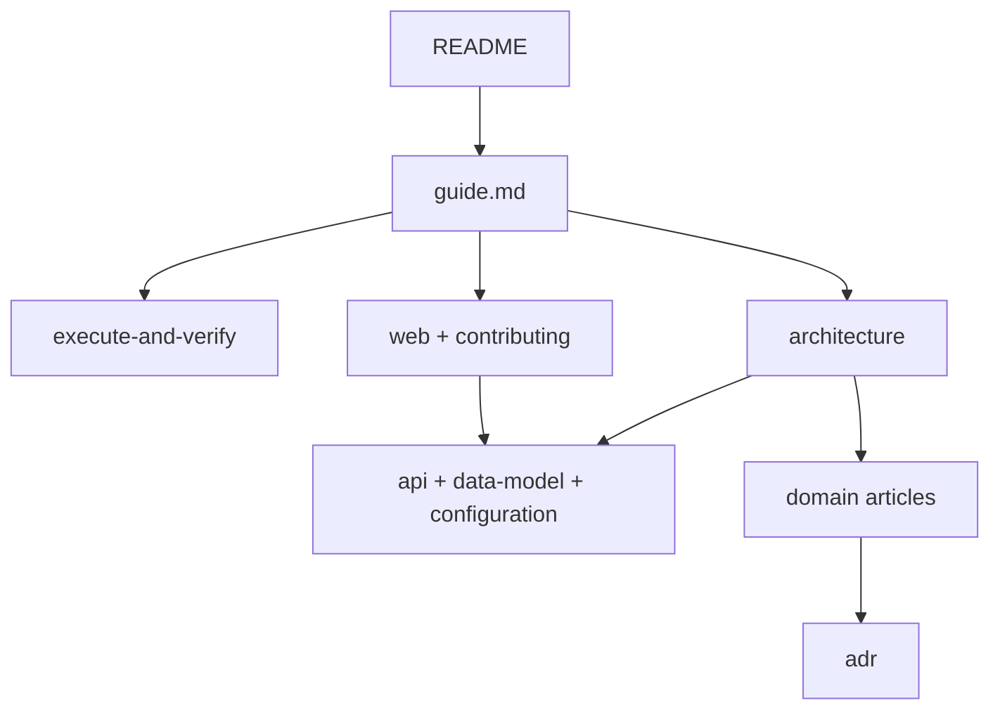

# Documentation guide

Pick a branch below. You do not need to read every doc in the repo.

Install and run: [README.md](../README.md). Edit code: [AGENTS.md](../AGENTS.md) and [CONTRIBUTING.md](../CONTRIBUTING.md).

## Doc layers

Docs are grouped by purpose — not by reading order.

| Layer | Docs | Use for |
| --- | --- | --- |
| Orientation | [README.md](../README.md), this guide | Install, navigation |
| Product | [execute-and-verify.md](./execute-and-verify.md) | Running tasks, checklist quality |
| Overview | [architecture.md](./architecture.md) | Components and data flow |
| Reference | [api.md](./api.md), [data-model.md](./data-model.md), [configuration.md](./configuration.md) | Lookup — schemas, routes, env |
| Implementation | [web.md](./web.md), [contributing.md](./contributing.md) | Building UI or adding features |
| Deep dive | [domain/](./domain/) | Why a subsystem behaves as it does |
| History | [adr/](./adr/) | Past design decisions |

## Goal branches

Follow one row. Each branch is a few links — expand only when your work requires it.

| If you want to… | Follow |
| --- | --- |
| **Use T2A** (create tasks, write criteria) | [execute-and-verify.md](./execute-and-verify.md) → [done-criteria.md](./domain/done-criteria.md) (optional) |
| **Understand the system** | [architecture.md](./architecture.md) → [data-model.md](./data-model.md) → [api.md](./api.md) (skim routes) |
| **Work on the API or store** | Understand branch → [contributing.md](./contributing.md) §Adding a feature → [persistence.md](./domain/persistence.md) as needed |
| **Work on the web UI** | [web.md](./web.md) → [architecture.md](./architecture.md) (SSE / live updates section only) |
| **Work on agents / harness** | [architecture.md](./architecture.md) → [harness.md](./domain/harness.md) → [execute-agent.md](./domain/execute-agent.md) / [verify-agent.md](./domain/verify-agent.md) |
| **Edit code (human or AI)** | [AGENTS.md](../AGENTS.md) → [agent-map.md](./agent-map.md) for code paths |

## When to go deeper

Open [domain/README.md](./domain/README.md) when a branch points at behavior you need to change — harness, scheduling, SSE, persistence, and similar topics live there. Open [adr/](./adr/) when you need the historical reason a design exists, not for day-to-day implementation.

## Reference indexes

- **All docs (read when):** [README.md](./README.md)
- **Domain articles:** [domain/README.md](./domain/README.md)
- **Code paths:** [agent-map.md](./agent-map.md)
