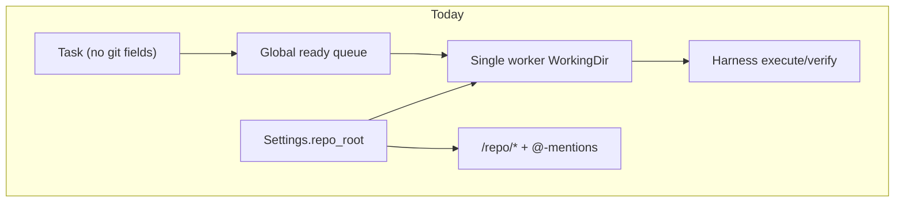
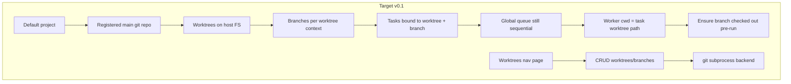
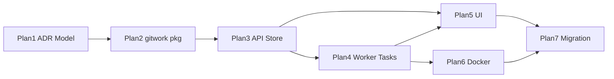

# Issue #39 — Git workflow multi-plan roadmap

**Tracking issue:** [Basic Git workflow (worktrees, branches) #39](https://github.com/AlexsanderHamir/Hamix/issues/39)

---

## Current state (baseline)

Hamix today is **single-workspace**:

- One global [`app_settings.repo_root`](pkgs/tasks/domain/app_settings.go) drives agent `WorkingDir`, `@`-mentions, and `/repo/*`.
- Tasks have **no** worktree/branch fields ([`domain.Task`](pkgs/tasks/domain/models.go)).
- Git context is **audit-only** on cycles (`task_cycle_commits.repo/worktree/branch`) — observed after execute, not configured at create.
- One sequential agent worker ([`internal/taskapi/agentworker/instance.go`](internal/taskapi/agentworker/instance.go)).
- Docker dev ([`compose.yml`](compose.yml)) bind-mounts repo + `/host-home` for the folder picker; Cursor CLI is **not** in the image ([`docs/docker.md`](docs/docker.md)).

---

## Target state (v0.1 scope)

**Requirements mapping**

| Req | Plan(s) |
|-----|---------|
| Tasks per worktree + branch; multiple queued per pair | Plan 3, 4 |
| UI create/delete worktrees & branches | Plan 5 |
| Delete blocked when tasks running | Plan 2, 3 |
| Nav page like Templates | Plan 5 |
| Per-project model, default project only in UI | Plan 1, 5 |
| Docker + host FS + host CLIs | Plan 6 |

**Explicit v0.1 non-goals** (defer to Plan 7+): auto-open PR, multi-worker parallelism, multi-project UI, Worktrunk merge workflows.

---

## Worktrunk assessment

Reference: [max-sixty/worktrunk](https://github.com/max-sixty/worktrunk) — Rust CLI for branch-addressed worktrees, hooks, merge/remove, agent launch (`wt switch -x claude -c feature`).

### Where Worktrunk helps

- **Operator ergonomics** — path templates, `wt list` with dirty/ahead/behind, safe remove/merge flows.
- **AI-agent focus** — built for the same parallel-worktree pattern Issue #39 targets.
- **Mature edge cases** — orphan worktrees, cleanup, cache copy between worktrees.
- **Windows** — ships as `git-wt` when `wt` conflicts with Windows Terminal.

### Where Worktrunk does not fit Hamix v0.1

| Concern | Detail |
|---------|--------|
| **Hamix needs DB authority** | Tasks, delete guards, queue, and UI require persisted `worktree_id` / `branch_id` — Worktrunk has no Hamix task model. |
| **CLI-only, not a library** | Hamix is Go; integration = subprocess + parse output. All business rules still live in Hamix. |
| **Dual-state drift** | DB records vs `git worktree list` / `wt list` must reconcile; Worktrunk adds a second config surface (`wt config`, templates). |
| **Docker path mapping** | Worktrunk path templates assume host layout; container sees `/host-home/...` — same pain as today’s `repo_root` Docker mismatch. |
| **UI-driven CRUD** | Issue #39 requires SPA create/delete; Worktrunk is terminal-first. |
| **Verify-in-place** | [ADR-0003](docs/adr/ADR-0003-verify-component-upgrade.md) requires verify in execute cwd — Hamix controls checkout timing, not Worktrunk hooks. |

### Recommendation

**Primary backend: native `git` via Go** (`git worktree`, `git branch`, `git checkout`) in a new `pkgs/gitwork/` (or extend [`pkgs/repo/`](pkgs/repo/)) package — mirrors existing harness git usage ([`pkgs/agents/harness/internal/git/`](pkgs/agents/harness/internal/git/)).

**Worktrunk: optional later enhancement**, not a v0.1 dependency:

- Optional `GitWorktreeBackend` interface with `NativeGit` + `WorktrunkCLI` implementations for enriched status (`wt list --full`) or operator docs pointing to Worktrunk for manual merge/cleanup.
- Avoid blocking Issue #39 on an external Rust binary in the production Docker image.

---

## Proposed data model (Plan 1 output)

Per **default project** (`DefaultProjectID` in [`project_defaults.go`](pkgs/tasks/domain/project_defaults.go)):

| Entity | Purpose | Key fields |
|--------|---------|------------|
| **`git_repositories`** | Main checkout the user registers once | `project_id`, `path` (container-visible), `host_path` (optional, for Docker display), `default_branch` |
| **`git_worktrees`** | Linked working directories | `repository_id`, `path`, `name`, `is_main` (the registered checkout) |
| **`git_branches`** | Logical branches Hamix tracks | `repository_id`, `name`, `head_sha` (cached), optional `active_worktree_id` (which worktree has it checked out) |
| **`tasks`** (extend) | Binding | `worktree_id`, `branch_id` (required on create once migrated) |

**Git rule encoded in product:** one branch checked out per worktree at a time; “multiple branches per worktree” = create many branch records under the same repo, assign tasks to branches, worker runs `git checkout <branch>` in that worktree before pickup (refuse parallel `running` on same worktree).

**Migration:** deprecate `app_settings.repo_root`; backfill one `git_repository` + main worktree from existing `repo_root` if set.

---

## Plan breakdown (7 plans)

Plans are ordered by dependency. Each plan should be implementable as its own PR series with tests + doc updates.

---

### Plan 1 — Architecture ADR and data model

**Goal:** Lock design before code spreads.

**Outputs**

- [`docs/adr/ADR-0033-git-worktrees-and-branches.md`](docs/adr/ADR-0033-git-worktrees-and-branches.md) — entities, invariants, Worktrunk decision, verify-in-place preserved, delete guards.
- Schema sketch in ADR + [`docs/data-model.md`](docs/data-model.md) update.
- [`docs/plans/issue-39-git-workflow-roadmap.md`](docs/plans/issue-39-git-workflow-roadmap.md) (this file).

**Key decisions to record**

- Task → `(worktree_id, branch_id)` required after migration period.
- Sequential worker retained; queue remains global (no concurrent runs on same worktree).
- `@`-mentions resolve against **task’s worktree path**, not global settings.
- Project scoping in schema; UI uses default project only.

**Depends on:** nothing  
**Blocks:** Plans 2–7

---

### Plan 2 — Git operations backend (`pkgs/gitwork/`)

**Goal:** Testable git worktree/branch operations without HTTP.

**Outputs**

- New package (suggested layout):
  - `gitwork/repository.go` — validate git root, resolve common dir
  - `gitwork/worktree.go` — add, remove, list, path validation
  - `gitwork/branch.go` — create, delete, list, checkout
  - `gitwork/exec.go` — shared `git` runner with timeouts/context
- Table-driven tests using temp repos (pattern from [`internal/tasktestdb/`](internal/tasktestdb/) / harness git tests).
- Reconciliation helper: sync DB rows with `git worktree list` / `git branch`.

**Depends on:** Plan 1  
**Blocks:** Plan 3

---

### Plan 3 — Persistence, API, and delete guards

**Goal:** REST surface for worktree management; enforce req 6–7 backend rules.

**Outputs**

- GORM models + migrate in [`pkgs/tasks/postgres/postgres.go`](pkgs/tasks/postgres/postgres.go).
- Store layer: `store_git_repositories.go`, `store_git_worktrees.go`, `store_git_branches.go`.
- Handlers (new group): `handler_git_worktrees.go`, `handler_git_branches.go`, `handler_git_*_json.go`.
- Routes documented in [`docs/api.md`](docs/api.md):
  - `GET/POST /projects/{id}/git/repositories` (register main repo)
  - `GET/POST/DELETE .../worktrees`
  - `GET/POST/DELETE .../branches`
  - `POST .../worktrees/{id}/checkout/{branchId}` (optional explicit checkout)
- Delete returns **409** when any task on that worktree/branch has `status=running` (extend store query).
- Migration script: `repo_root` → default project git repository row.

**Depends on:** Plans 1–2  
**Blocks:** Plans 4–5

---

### Plan 4 — Task binding, worker, and scheduling

**Goal:** Replace global `repo_root` gate with per-task working directory (req 1–2).

**Outputs**

- Extend [`domain.Task`](pkgs/tasks/domain/models.go): `WorktreeID`, `BranchID`.
- Task create/patch validation: worktree + branch belong to default project; branch exists.
- [`internal/taskapi/agentworker/`](internal/taskapi/agentworker/): remove `RepoRoot` idle gate; idle when no registered repos OR all worktrees invalid.
- Worker: set `WorkingDir` from task’s worktree path at dequeue; pre-run `git checkout` for task branch; conflict if worktree already has another task `running`.
- Update [`pkgs/repo/`](pkgs/repo/) `RepoProvider` → task-scoped or worktree-scoped root for `/repo/*` and mention validation.
- Harness: unchanged verify-in-place semantics; snapshot `repo/worktree/branch` from task context.
- Scheduling: [`pkgs/tasks/store/internal/ready/`](pkgs/tasks/store/) — optional fairness tweak (round-robin by worktree) — **nice-to-have**, not blocking.

**Depends on:** Plan 3  
**Blocks:** Plan 5

**Supersedes:** global `repo_root` in [`docs/domain/workspace-repo.md`](docs/domain/workspace-repo.md) (update in this plan).

---

### Plan 5 — Worktrees management UI

**Goal:** Nav page + task-create integration (req 3–5, 7).

**Outputs**

- New feature slice `web/src/worktrees/` (or under `web/src/git/`) mirroring Templates pattern:
  - Page: `WorktreesPage.tsx` (list worktrees, branches, running-task badges)
  - Modals: create worktree, create branch, delete confirm with guard messaging
  - API clients: `web/src/api/gitWorktrees.ts`, parsers
- Wire in [`web/src/app/App.tsx`](web/src/app/App.tsx): nav link + route `/worktrees` (same pattern as Templates ~lines 121–128, 258).
- Styles: `web/src/app/styles/app-worktrees.css`
- Task create modal: required worktree + branch selectors ([`TaskCreateModal`](web/src/tasks/components/task-create-modal/TaskCreateModal.tsx)); remove dependency on Settings workspace picker for task execution.
- Settings: deprecate or repurpose “Agent workspace” → “Register main repository” link to Worktrees page.
- Vitest + MSW handlers.

**Depends on:** Plan 3 (API); Plan 4 for task form fields  
**Blocks:** nothing critical

---

### Plan 6 — Docker production and host integration

**Goal:** Deployable image with host repo + CLI access (req 9).

**Outputs**

- Production [`docker/Dockerfile`](docker/) (multi-stage, non-dev) + [`compose.yml`](compose.yml) production profile or separate `compose.prod.yml`.
- Volume contract documented in [`docs/docker.md`](docs/docker.md):
  - `${HAMIX_HOST_HOME}` → `/host-home` (user git repos)
  - Optional `${HAMIX_HOST_PATH}` for explicit repo roots
  - Persist Hamix DB via `DATABASE_URL` (unchanged)
- CLI discovery:
  - Mount host Cursor/Claude binaries **or** document `PATH` + bind-mount `~/.local/bin`, `/usr/local/bin`
  - Settings fields `cursor_bin` / future runner bins resolve host paths via mount map
- `HAMIX_PATH_MAP` (or similar): JSON map host→container prefixes so API stores container paths but UI shows host paths.
- Git in image: ensure `git` ≥ 2.5 (worktree support); **do not** require Worktrunk in image for v0.1.
- Health/readiness: `checks.git_available`, `checks.registered_repositories`.

**Depends on:** Plans 2–4 (paths used by worker)  
**Blocks:** production deploy validation

---

### Plan 7 — Migration, cleanup, and post-completion hooks (foundation only)

**Goal:** Finish deprecation; lay groundwork for Issue #39 follow-ups (PR automation).

**Outputs**

- Remove `repo_root` from [`app_settings`](pkgs/tasks/domain/app_settings.go) after migration window (or keep read-only shim one release).
- Update operator docs: [`docs/execute-and-verify.md`](docs/execute-and-verify.md), [`AGENTS.md`](AGENTS.md), [`docs/configuration.md`](docs/configuration.md).
- Close/supersede HARNESS item 8 (per-cycle worktree) — replaced by persistent worktree model.
- Stub hooks: `on_task_done` event payload includes `worktree`, `branch`, `commits[]` for future `gh pr create` automation (no UI yet).

**Depends on:** Plans 4–6 stable  
**Blocks:** nothing

---

## Dependency graph

**Parallelization:** After Plan 3 merges, **Plan 4** (backend) and **Plan 5** (UI against API) can proceed in parallel with coordinated task-field contract.

---

## Risk register (cross-cutting)

| Risk | Mitigation |
|------|------------|
| Same worktree, two tasks `running` | Worker lock per `worktree_id`; checkout only when idle |
| Docker path confusion | `HAMIX_PATH_MAP` + store container-canonical paths |
| Delete worktree with queued tasks | 409 if `running`; optional “archive” or force-delete with task reassignment (decide in Plan 1 ADR) |
| `@`-mention paths after multi-worktree | Scope validation to task worktree root |
| Cursor session resume tied to workspace ([ADR-0031](docs/adr/ADR-0031-cursor-session-resume-default.md)) | Resume keyed by worktree path + branch |
| Git clean/reset on retry | [`retry-start-over`](docs/domain/retry-start-over.md) runs in task worktree, not global root |

---

## Suggested PR / milestone grouping

| Milestone | Plans | User-visible outcome |
|-----------|-------|------------------------|
| **M1 — Design** | 1 | ADR approved, roadmap doc |
| **M2 — Backend core** | 2 + 3 | API can create/list/delete worktrees & branches |
| **M3 — Tasks run in worktrees** | 4 | Tasks execute in chosen worktree/branch |
| **M4 — UI** | 5 | Worktrees nav page + task create selectors |
| **M5 — Deploy** | 6 | Docker deploy with host repos + CLIs |
| **M6 — Ship** | 7 | `repo_root` removed, docs updated |

---

## What to implement first

Start **Plan 1** (ADR + this roadmap file). Do not begin UI or worker changes until Plan 1 decisions are reviewed — especially delete semantics for worktrees with queued (non-running) tasks and whether one registered main repo per project is sufficient for v0.1.

---

## Issue progress comment (all plans)

Track partial delivery on [Issue #39](https://github.com/AlexsanderHamir/Hamix/issues/39) via a **single pinned comment**: [comment #4774176536](https://github.com/AlexsanderHamir/Hamix/issues/39#issuecomment-4774176536).

| When | Action |
|------|--------|
| After each plan's commits on `main` | PATCH the comment: append commit table rows, extend deliverables, refresh open items |
| Plan 7 complete | Final PATCH noting DoD green and **ready for operator close** — agents must **not** close the issue |

Plans 2–3 established the comment format (commit table + **What this delivers** + **Still open**). Plans 4–7 include the same checklist in their **Issue progress comment** section.
